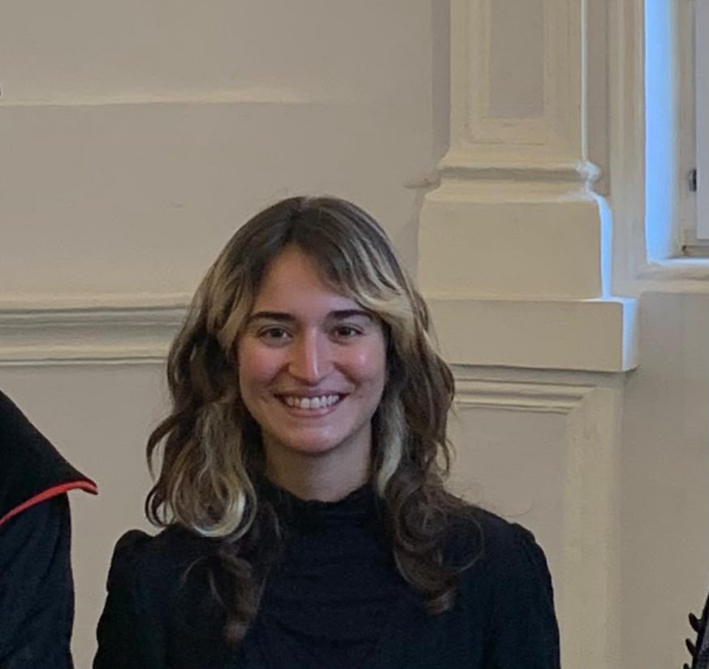
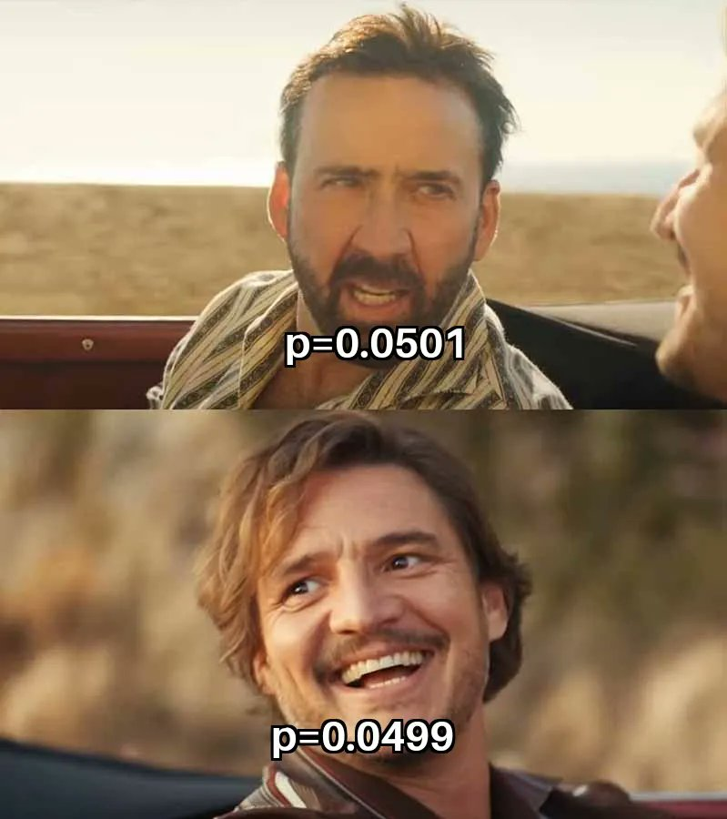

```{r course-style, include=FALSE}
# Encuentra `_shared/bikeshare.R` sin depender del working directory.
source(local({
  d <- normalizePath(getwd(), mustWork = FALSE)
  cands <- d
  while (!identical(dirname(d), d)) { d <- dirname(d); cands <- c(cands, d) }
  cands <- c(cands, Sys.glob(file.path(getwd(), c("*", "*/*", "*/*/*"))))
  hits <- file.path(cands, "_shared", "bikeshare.R")
  hits <- hits[file.exists(hits)]
  if (!length(hits)) stop("No se encontró _shared/bikeshare.R desde ", getwd())
  normalizePath(hits[[1]])
}))
course_palette <- use_course_style("barcelona")
```

## Antes · Hoy · Después {.class-rhythm}

::: {.full-width}

::: {.content-box}
**Antes**

fundamentos de teoría de probabilidad.
:::

::: {.content-box-primary}
**Hoy**

presentación, expectativas y forma de trabajo.
:::

::: {.content-box-secondary}
**Después**

variables aleatorias y distribuciones discretas.
:::

:::


# Presentación del curso {.inverse .center .middle}

## Sobre mi
  - Profesor Asistente, Sociología UC

. . .

  - Max Weber Postdoctoral Fellow, European University Institute, Firenze
  - PhD en Sociología, Cornell University, NY
    - PhD Minor en Estadística, Departamento de Estadística, Cornell University

. . .

  - Investigación: movilidad social intergeneracional,  desigualdades en el mercado laboral, creencias sobre las desigualdades, métodos cuantitativos
  - Métodos: modelación estadística, estrategias empíricas para inferencia causal, métodos experimentales y computacionales
    - Datos categóricos: desarrollos en "log-linear models"

. . .

[Información de contacto]{.bold}
 - mail: mebucca@uc.cl
 - webpage: https://mebucca.github.io/

## Ayudantía

<br><br>

::: {.pull-left}

[Elisa Tagle]{.bold}

- ⁠Estudiante de magíster en Sociología UC
- ⁠⁠Practicante en Banco Central de Chile
- ⁠Investigación: desigualdad, opinión pública, métodos cuantitativos
- ⁠⁠Métodos: Modelos multinivel, estadística bayesiana

:::

::: {.figure-right}




:::

# Filosofía de enseñanza {.inverse .center .middle}

---

### 1. Los "atajos" estadísticos dificultan el aprendizaje

. . .

::: {.center}

<br><br>



:::

---

### 2. La sola intuición no es suficiente

<br><br>

. . .

::: {.pull-left}

[Muchas cosas parecen más difíciles de lo que son]{.bold}
[$$\int xf(x)dx := \mu $$]{.huge}

:::

. . .

::: {.pull-right}

[Otras parecen más simples de lo que son]{.bold}
[ $$X   \text{ es una variable}$$]{.huge}

:::

. . .

<br>

- Vacíos de conocimiento, notación, poca exposición a las matemáticas.
- Este curso nivela estos vacíos activamente. No hay carta bajo la manga.

---

### 3. Menos es más

<br>

. . .

::: {.pull-left}

[Muchos métodos]{.bold}


:::

<br>

. . .

::: {.pull-right}

[Fundamentos sólidos]{.bold}


:::

# Logística del curso {.inverse .center .middle}

## Contenidos

<br><br>

::: {.pull-left}

**I. Probabilidad y fundamentos**

1. Variables aleatorias y distribuciones discretas
2. Momentos, estimación MLE y funciones de pérdida

. . .

<br>
**II. Modelos categóricos — uso explicativo**

3. Modelo Lineal (Estándar y de Probabilidad)
4. Modelos Lineales Generalizados (GLM)
5. Regresión Logística (binomial y multinomial)
6. Regresión Poisson

:::

. . .

::: {.pull-right}

**III. Bridge: causalidad y predicción**

7. Causalidad y asociación
8. Predicción: sesgo-varianza, overfitting, cross-validation

. . .

<br>
**IV. Modelos categóricos — uso predictivo**

9. Clasificadores logísticos (binomial y multinomial)
10. Regularización: Ridge & Lasso
11. Árboles, Random Forests, Gradient Boosting
12. Redes Neuronales y un "flavor" de LLMs

:::

## Evaluación

<br><br>

::: {.content-box-primary}


- 6 Tareas en horario de ayudantía (ponderación 10.083% cada una)

- Elaboración y presentación de poster científico (ponderación 35%, en grupos de 2 integrantes)

:::


## Calendario de evaluaciones

<br><br>


| Actividad | Tema | Fecha |
|---|---|---|
| Tarea 1 | Nivelación matemática — hasta Variables Aleatorias y Distribuciones Discretas | 27 agosto |
| Tarea 2 | LPM y teoría regresión logística | 10 septiembre |
| Tarea 3 | Aplicación regresión logística | 1 octubre |
| Tarea 4 | Regresión multinomial | 8 octubre |
| Tarea 5 | Regresión Poisson | 15 octubre |
| Tarea 6 | Aplicación clasificación — hasta Clasificador Logístico Multinomial | 5 noviembre |
| Sesión de pósters científicos | Presentación/trabajo final | 3 diciembre |

## Políticas

<br><br>

- [Asistencia:]{.bold} regular a clases es importante, esperada, pero no obligatoria
- [Uso de IA:]{.bold} permitido de forma ética y transparente, únicamente como herramienta de estudio o apoyo en la escritura de código. Debe declararse explícitamente qué herramientas fueron usadas y con qué propósito
- [Honestidad académica:]{.bold} el desconocimiento de la política de honestidad académica de la universidad — incluyendo el uso de IA — no es una explicación razonable para su incumplimiento

# Recursos {.inverse .center .middle}

## Repositorio Github
Todo el material del curso será almacenado y actualizado regularmente en repositorio `Github`:

::: {.center}


[https://github.com/mebucca/cda_soc3070]{.bold}

:::

## Ayudantías

::: {.center}


[Consulta:]{.bold} Lunes 14:30–15:30 (Mauricio Bucca, mebucca@uc.cl)
[Ayudantía:]{.bold} Martes 12:20–13:30 (Roberto Cantillan, ricantillan@uc.cl)

:::

## Gracias {.inverse .center .middle .closing}

**Hasta la próxima clase**

Mauricio Bucca
