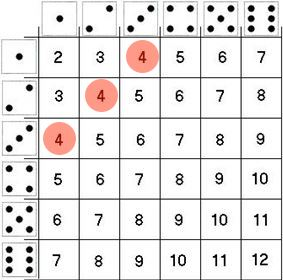

```{r course-style, include=FALSE}
source("../_shared/bikeshare.R")
course_palette <- use_course_style("real_madrid")
```

```{r dice-setup, include=FALSE}
library(pacman)
p_load("tidyverse", "knitr", "RColorBrewer")

dist_dice <- expand.grid(d1 = 1:6, d2 = 1:6) %>%
  mutate(X = d1 + d2) %>%
  count(X) %>%
  mutate(p = round(n / sum(n), 3)) %>%
  select(x = X, `P(X=x)` = p)
```

## Antes · Hoy · Después {.class-rhythm}

::: {.full-width}

::: {.content-box}
**Antes**

presentación del curso.
:::

::: {.content-box-primary}
**Hoy**

variables aleatorias y distribuciones discretas.
:::

::: {.content-box-secondary}
**Después**

momentos: valor esperado y varianza.
:::

:::


# Variables Aleatorias {.inverse .center .middle}

## Intuición

---

### Variables Aleatorias
Una [variable aleatoria]{.bold} es una variable cuyos valores son el resultado de un experimento aleatorio.

. . .

Si $\Omega$ es el espacio muestral de un experimento, una variable aleatoria es una función que _mapea_ el espacio muestral a los números reales: $\Omega \to \mathbb{R}$.

. . .

Ejemplo:

- Experimento: tirar 2 dados "justos" simultáneamente


. . .

- Espacio muestral $\Omega$: $\{(1;1),(1;2), \dots, (5;6),(6;6)\}$

. . .

$X$ es la variable aleatoria que resulta de sumar el resultado de ambos dados, 
$$X: \{2,3,4,5,6,7,8,9,10,11,12 \}$$

---

### Variables Aleatorias
Cada valor posible de una variable aleatoria tiene una probabilidad conocida de ocurrencia, denotada como $\mathbb{P}(X=x)$.

. . .

[Ejercicio rápido:]{.bold} Si $X$ es la variable que resulta de sumar los dos dados (justos) obtenidos ...

. . .

::: {.pull-left}



:::

::: {.pull-right}

¿Cuál es la probabilidad de que la variable $X$ tome valor 4?
$$\mathbb{P}(X=4) =  \frac{3}{36} = \frac{1}{12}$$

:::

---

### Distribución de una variable aleatoria
El conjunto de las probabilidades asociadas a cada posible resultado de una variable aleatoria se denomina la [distribución]{.bold} de la variable.

. . .

Continuando con nuestro ejemplo, podemos caracterizar la distribución de X con una función:

::: {.pull-left}

\begin{align}
  f(x) =
  \begin{cases}
    \frac{1}{36}  & \quad \text{si } x=2 \text{ o } x=12\\
    \frac{2}{36}  & \quad \text{si } x=3 \text{ o } x=11\\
    \frac{3}{36}  & \quad \text{si } x=4 \text{ o } x=10\\
    \frac{4}{36}  & \quad \text{si } x=5 \text{ o } x=9\\
    \frac{5}{36}  & \quad \text{si } x=6 \text{ o } x=8\\
    \frac{6}{36}  & \quad \text{si } x=7 \\
    0             & \quad \text{otherwise}
  \end{cases}
\end{align}

:::

. . .

::: {.pull-right}

```{r, echo=FALSE,message=FALSE, warning=FALSE}
dist_dice
```

:::

---

### Distribución de una variable aleatoria

::: {.pull-left}

Podemos caracterizar la distribución de X con una función:

\begin{align}
  f(x) =
  \begin{cases}
    \frac{1}{36}  & \quad \text{si } x=2 \text{ o } x=12\\
    \frac{2}{36}  & \quad \text{si } x=3 \text{ o } x=11\\
    \frac{3}{36}  & \quad \text{si } x=4 \text{ o } x=10\\
    \frac{4}{36}  & \quad \text{si } x=5 \text{ o } x=9\\
    \frac{5}{36}  & \quad \text{si } x=6 \text{ o } x=8\\
    \frac{6}{36}  & \quad \text{si } x=7 \\
    0             & \quad \text{otherwise}
  \end{cases}
\end{align}

:::

::: {.pull-right}

```{r, echo=FALSE,message=FALSE, warning=FALSE, fig.width=6, fig.height=5}
dist_dice %>%
  ggplot(aes(x = factor(x), y = `P(X=x)`)) +
  geom_bar(stat = "identity", width = 1, alpha = 0.8, color = "black", fill = course_palette[["primary"]]) +
  labs(x = "X", y = "P(X=x)") +
  theme_julia() +
  theme(legend.position = "none",
        panel.border = element_blank())

```

[Importante:]{.bold} $\sum_{i=2}^{12} \mathbb{P}(X=i) = 1$

:::

# Distribuciones de Probabilidad {.inverse .center .middle}

---

### Tipos de variables aleatorias

. . .

- [Variables discretas:]{.bold} variables que solo pueden tomar un número contable de valores distintos y separados, sin valores intermedios posibles entre ellos. Usualmente medidas con números enteros. 
Ejemplo: cara/sello, número de accidentes de tránsito, etc.

. . .

- [Variables continuas:]{.bold} variables que pueden tomar cualquier valor dentro de un rango especificado. Estas variables tienen un número infinito de posibles resultados y no están limitadas a valores aislados. 
Ejemplo: Los ingresos de una persona pueden tomar cualquier valor entre 0 y $\infty$+.

---

### Distribución de una variable aleatoria
El conjunto de las probabilidades asociadas a cada posible resultado de una variable aleatoria se denomina la [distribución]{.bold} de la variable.
<br> <br>

. . .

La distribución de una variable se puede caracterizar de manera [única]{.bold} de (al menos) dos maneras:

- [Función de masa/densidad de probabilidad]{.bold} (PMF/PDF): $f(x)$
   - En el caso de variables discretas $f(x) = \mathbb{P}(X=x)$. 
   - Ejemplo, evaluando $f(5)$ obtenemos la probabilidad de que $X$ tome valor 5.

. . .

- [Función de distribución acumulada]{.bold} (CDF): $F(x) = \mathbb{P}(X \leq x)$
  - Ejemplo, evaluando $F(5)$ obtenemos la probabilidad de que $X$ tome un valor igual o menor a 5.

## Distribuciones Discretas {.inverse .center .middle}

### Intuición

---

### Tiro de penal
Final de la Copa Mundial de la FIFA 1994. Roberto Baggio va a tirar su penal ...

::: {.pull-left}

[Número finito de resultados posibles]{.bold}:

- Gol
- Fallo

[Evento aleatorio]{.bold}:

- Existe una probabilidad asociada a cada resultado 

:::

. . .

::: {.pull-right}

::: {.center}


:::

:::

## Distribuciones Discretas {.inverse .center .middle}

### Distribución Bernoulli

---

### Distribución Bernoulli

::: {.pull-left}

- Experimento: tiramos una moneda al aire. 
- $X$ es una variable aleatoria tal que $X=1$ (Cara) o $X=0$ (Sello).
- La probabilidad de obtener Cara es $p=0.7$ y la de Sello es $1-p = 0.3$
```{r, echo=FALSE,message=FALSE, warning=FALSE, fig.width=6, fig.height=5}

# Cargar librerías necesarias
p_load(ggplot2)
p_load(RColorBrewer)

# Función para calcular la función de masa de probabilidad (PMF) de una Bernoulli
PMF_bernoulli <- function(x, p) {
  ifelse(x == 1, p, 1 - p)
}

# Definir el parámetro de la distribución Bernoulli
p <- 0.7      # Probabilidad de éxito

# Crear un data frame para graficar la PMF
x_values <- c(0, 1)  # Only two possible outcomes: 0 and 1
PMF_values <- PMF_bernoulli(x_values, p)
PMF_df <- data.frame(x = x_values, PMF = PMF_values)

# Crear el ggplot con paleta de colores "Set1" y transparencia

ggplot(data = PMF_df, aes(x = factor(x), y = PMF)) +
  geom_bar(stat = "identity", color = "black", fill = course_palette[["primary"]], width = 1, alpha=0.8) +
  labs(x = "Resultado",
       y = "P(X = x)") +
  scale_x_discrete(labels = c("Sello (0)", "Cara (1)")) +
  scale_color_manual(values = course_palette[["primary"]]) +
  scale_fill_manual(values = course_palette[["primary"]]) +
  theme_julia() +
  theme(panel.background = element_rect(color = "black", fill = NA, size = 1))  # This line adds the inner border

```

:::

. . .

::: {.pull-right}

[Función de masa probabilistica (PMF):]{.bold}

X es una variable aleatoria Bernoulli, es decir

\begin{align}
f(x) =
  \begin{cases}
    p  & \quad \text{si } x=1\\
    1 - p  & \quad \text{si } x=0 \\
    0 & \quad \text{otro}
  \end{cases}
\end{align}

En modo más sintético:
$$f(x) = p^{x}(1-p)^{1-x}  \quad \text{si } x=1 \text{ o } x=0$$

:::

---

### Distribución Bernoulli
[Ilustración via simulación en]{.bold} `R`
Tiremos una moneda con probabilidad de obtener "Cara" ( $1$ ) de 70% ( $p=0.7$ )
```{r}
#set.seed(12347)
moneda <- rbinom(n=1, size=1, p=0.7)
print(moneda)
```

. . .

Repitamos el proceso 1000 veces ...
```{r}
#set.seed(12347)
monedas <- rbinom(n=1000, size=1, p=0.7)
```
```{r, echo=FALSE}
#set.seed(12347)
monedas <- rbinom(n=1000, size=1, p=0.7)
print(head(monedas,20))
print(paste("P(Cara) = ",mean(monedas)))
```

## Distribuciones Discretas {.inverse .center .middle}

### Distribución Binomial

---

### Distribución Binomial
La distribución binomial es la distribución de la suma de variables Bernoulli *independientes y con distribución idéntica* ([iid]{.bold}). 

. . .

Ejemplo,

- Supongamos que $X$ es una variable de Bernoulli que toma el valor 1 cuando se obtiene "Cara" al lanzar una moneda
- $\mathbb{P}(X=1)=p$ 

. . .

- Ahora, supongamos que lanzamos la misma moneda 3 veces. Llamamos a estas variables $X_{1}, X_{2}, X_{3}$
- Definamos $Y = X_{1} + X_{2} + X_{3}$

. . .

- $Y$ sigue una distribución Binomial, o $Y \sim \text{Binomial}$

---

### Distribución Binomial
[Ejercicio rápido:]{.bold}

::: {.content-box-primary}

[Pregunta 1:]{.bolder}
¿Cuál es la probabilidad de obtener tres "Caras"? Es decir, ¿Cuál es la probabilidad de que $Y=3$?

:::

. . .

::: {.content-box-secondary}

- Dado que los 3 ensayos son independientes podemos expresar esta probabilidad como:
$$\mathbb{P}(Y=3) =  \mathbb{P}(X_{1}=1,X_{2}=1,X_{3}=1) = \mathbb{P}(X_{1}=1)\mathbb{P}(X_{2}=1)\mathbb{P}(X_{3}=1)$$

- Y dado que las tres variables distribuyen Bernoulli con la misma probabilidad $p$, obtenemos: 
$$\mathbb{P}(Y=3) = p \times p \times p =  p^{3}$$

:::

---

### Distribución Binomial

::: {.content-box-primary}

[Pregunta 2:]{.bolder}
¿Cuál es la probabilidad de obtener 2 "Caras" con 3 tiros? Es decir, ¿Cuál es la probabilidad de que $Y=2$?

:::

. . .

- Por simpleza, consideremos la siguiente secuencia: $\{X_{1}=1,X_{2}=1,X_{3}=0\}$, que satisface $Y=2$

. . .

- La probabilidad de obtener esta secuencia es:

\begin{align}
  \mathbb{P}(X_{1}=1,X_{2}=1,X_{3}=0)  &= \mathbb{P}(X_{1}=1) \times \mathbb{P}(X_{2}=1) \times \mathbb{P}(X_{3}=0)  \\
                              &= p \times p \times (1-p) =  p^{2}(1-p)
\end{align}

. . .

- Sin embargo, hay 3 secuencias que satisfacen $Y=2$.

. . .

 También $\{X_{1}=1,X_{2}=0,X_{3}=1\}$ y $\{X_{1}=0,X_{2}=1,X_{3}=1\}$, cada una con probabilidad de ocurrencia $p^{2}(1-p)^{1}$. Por tanto:

. . .

::: {.content-box-secondary}

[Respuesta:]{.bolder} la probabilidad de conseguir 2 "Caras" con 3 tiros es:
$$\mathbb{P}(Y=2) = 3 \times  p^{2}(1-p)^{1}$$

:::

---

### Distribución Binomial
[Generalización]{.bold}: lanzamos la misma moneda $n$ veces y la variable $Y$ cuantifica el número de "Caras" (1) obtenidas.
$$Y = \sum^{n}_{i=1} X_{i}$$

. . .

::: {.content-box-primary}

[Pregunta:]{.bolder}
¿Cuál es la probabilidad de conseguir $y$ "Caras" con $n$ tiros?

:::

. . .

* La probabilidad de obtener una secuencia particular con $y$ "Caras" a partir de $n$ lanzamientos es $p^{y}(1-p)^{n-y}$ 
* Existen ${n \choose y} = \frac{n!}{y! (n-y)!}$ secuencias de este tipo...

. . .

Por tanto,
$$\mathbb{P}(Y=y) = f(y) = \frac{n!}{y! (n-y)!} \times p^{y} (1-p)^{n-y}$$

. . .

En otras palabras, $Y$ distribuye binomial con [parámetros]{.bold} $n$ y $p$: $Y \sim \text{Binomial}(n,p)$

---

### Distribución Binomial
En práctica ...

. . .

 - **Contexto**: Tenemos una moneda que, cuando se lanza, tiene una probabilidad de $p = 0.6$ de caer en "Cara" y una probabilidad de $1-p = 0.4$ de caer en "Sello".

. . .

- **Problema**:¿Cuál es la probabilidad de obtener 3 "Caras" con 10 lanzamientos?

. . .

- **Solución**: $X \sim \text{Binomial}(n=10,p=0.6)$

. . .

$\quad \quad \quad \mathbb{P}(X=3) = \binom{10}{3} \times (0.6)^3 \times (0.4)^{10-3}$

. . .

$\quad \quad \quad \mathbb{P}(X=3) = \frac{10!}{3! \times 7!} \times (0.6)^3 \times (0.4)^7$

. . .

$\quad \quad \quad \mathbb{P}(X=3) = \frac{10 \times 9 \times \dots 1}{(3 \times 2 \times1) \times (7 \times 6 \times \dots 1 )} \times (0.6)^3 \times (0.4)^7$

. . .

$\quad \quad \quad \mathbb{P}(X=3) = 120 \times 0.216 \times 0.0028$

. . .

$\quad \quad \quad \mathbb{P}(X=3) \approx 0.0425$

---

### Distribución Binomial

::: {.pull-left}

- Ahora observamos la distribución completa
- La probabilidad de obtener $0, 1, \dots, 10$ caras es:
```{r, echo=FALSE,message=FALSE, warning=FALSE, fig.width=8, fig.height=6}

# Cargar librerías necesarias
p_load(ggplot2)
p_load(RColorBrewer)

# Parámetros de la distribución binomial
n <- 10       # Número de ensayos
p <- 0.6      # Probabilidad de éxito

# Crear un data frame para graficar la PMF
x_values <- 0:n  # Possible outcomes range from 0 to n
PMF_values <- dbinom(x_values, n, p)  # PMF for binomial distribution
PMF_df <- data.frame(x = x_values, PMF = PMF_values)

# Crear el ggplot con paleta de colores "Set1" y transparencia
ggplot(data = PMF_df, aes(x = factor(x), y = PMF)) +
  geom_bar(stat = "identity", color = "black", fill = course_palette[["primary"]], width = 1, alpha=0.8) +
  labs(x = "Number of Successes",
       y = "P(X = x)") +
  scale_x_discrete(labels = as.character(0:10)) +
  scale_color_manual(values = "black") +
  scale_fill_manual(values = course_palette[["primary"]]) +
  theme_julia() +
  theme(panel.background = element_rect(color = "black", fill = NA, size = 1))  # This line adds the inner border

```

:::

. . .

::: {.pull-right}

[Función de masa probabilistica (PMF):]{.bold}

X es una variable aleatoria Binomial, es decir

\begin{align}
\mathbb{P}(X=x) = f(x) = \frac{n!}{x! (n-x)!}  p^{x} (1-p)^{n-x}
\end{align}

En este caso,
$n=10$ y $p=0.6$

:::

---

### Distribución Binomial

::: {.pull-left}

- Ahora observamos la distribución completa
- ¿Cual es la probabilidad de obtener 5 monedas o menos?
```{r, echo=FALSE,message=FALSE, warning=FALSE, fig.width=8, fig.height=6}

# Reutiliza n, p y PMF_df calculados en el chunk anterior

# Filtrar el data frame para obtener barras de 0 a 5
overlay_df <- subset(PMF_df, x <= 5)

# Crear el ggplot con paleta de colores "Set1" y transparencia
ggplot(data = PMF_df, aes(x = factor(x), y = PMF)) +
  geom_bar(stat = "identity", color = "black", fill = course_palette[["primary"]], width = 1, alpha=0.8) +
  geom_bar(data = overlay_df, aes(x = factor(x), y = PMF), stat = "identity", color = "black", fill = course_palette[["secondary"]], width = 1, alpha=0.6) +
  labs(x = "Number of Successes",
       y = "P(X = x)") +
  scale_x_discrete(labels = as.character(0:10)) +
  scale_color_manual(values = "black") +
  scale_fill_manual(values = c(course_palette[["primary"]], course_palette[["secondary"]])) +
  theme_julia() +
  theme(panel.background = element_rect(color = "black", fill = NA, size = 1))  # This line adds the inner border

```

:::

::: {.pull-right}

[Función de distribución acumulada (CDF):]{.bold}

X es una variable aleatoria Binomial, es decir

\begin{align}
F(k; n, p) &= \mathbb{P}(X \leq k) \\ \\
           &= \sum_{i=0}^{k} \mathbb{P}(X=i) \\ \\
           &= \sum_{i=0}^{k} \frac{n!}{i! (n-i)!}  p^i (1-p)^{n-i}
\end{align}
En este caso,

\begin{align}
F(k=5; n=10, p=0.6) &=  \mathbb{P}(X=0) + \dots + \mathbb{P}(X=5) \\ \\
                    &\approx 0.366
\end{align}

:::

---

### Distribución Binomial

::: {.pull-left}

- Ahora observamos la distribución completa
- ¿Cual es la probabilidad de obtener 5 monedas o menos?
```{r, echo=FALSE,message=FALSE, warning=FALSE, fig.width=8, fig.height=6}

# Reutiliza n, p ya calculados; crea el data frame de la CDF
x_values <- 0:n  # Possible outcomes range from 0 to n
CDF_values <- pbinom(x_values, n, p)  # CDF for binomial distribution
CDF_df <- data.frame(x = x_values, CDF = CDF_values)

# Modificar el data frame para crear segmentos (representación escalonada)
CDF_df$start_x <- c(NA, head(CDF_df$x, -1))
CDF_df$start_CDF <- c(0, head(CDF_df$CDF, -1))

# Valor de F(5), destacado en el gráfico
F5 <- pbinom(5, n, p)

# Crear el ggplot
ggplot() +
  # Línea punteada marcando F(k=5)
  geom_hline(yintercept = F5, linetype = "dashed", size = 1) +
  geom_segment(data = CDF_df, aes(x = start_x, y = CDF, xend = x, yend = CDF), color = course_palette[["primary"]], size = 1.2) +
  # Vertical segments for CDF
  geom_segment(data = CDF_df, aes(x = x-1, y = start_CDF, xend = x-1, yend = CDF), color = course_palette[["primary"]], size = 1.2) +
  geom_point(aes(x = 5, y = F5), color = course_palette[["secondary"]], size = 4) +
  labs(x = "Number of Successes", y = "P(X ≤ x)") +
  scale_x_continuous(breaks = 0:n) +
  theme_julia() +
  theme(panel.background = element_rect(color = "black", fill = NA, size = 1))  # This line adds the inner border

```

:::

::: {.pull-right}

[Función de distribución acumulada (CDF):]{.bold}

X es una variable aleatoria Binomial, es decir

\begin{align}
F(k; n, p) &= \mathbb{P}(X \leq k) \\ \\
           &= \sum_{i=0}^{k} \mathbb{P}(X=i) \\ \\
           &= \sum_{i=0}^{k} \frac{n!}{i! (n-i)!}  p^i (1-p)^{n-i}
\end{align}
En este caso,

\begin{align}
F(k=5; n=10, p=0.6) &=  \mathbb{P}(X=0) + \dots + \mathbb{P}(X=5) \\ \\
                    &\approx 0.366
\end{align}

:::

## En resumen

- Una variable aleatoria mapea el espacio muestral a los números reales; su distribución asigna una probabilidad a cada valor posible.
- Variables discretas: PMF $f(x)=\mathbb{P}(X=x)$; CDF $F(x)=\mathbb{P}(X \leq x)$.
- Bernoulli: un ensayo, dos resultados, $\mathbb{P}(X=1)=p$.
- Binomial: suma de $n$ Bernoulli iid, $\mathbb{P}(Y=y) = {n \choose y} p^{y}(1-p)^{n-y}$.
- La próxima clase usa estas distribuciones para introducir sus "momentos": valor esperado y varianza.

## Gracias {.inverse .center .middle .closing}

**Hasta la próxima clase**

Mauricio Bucca
