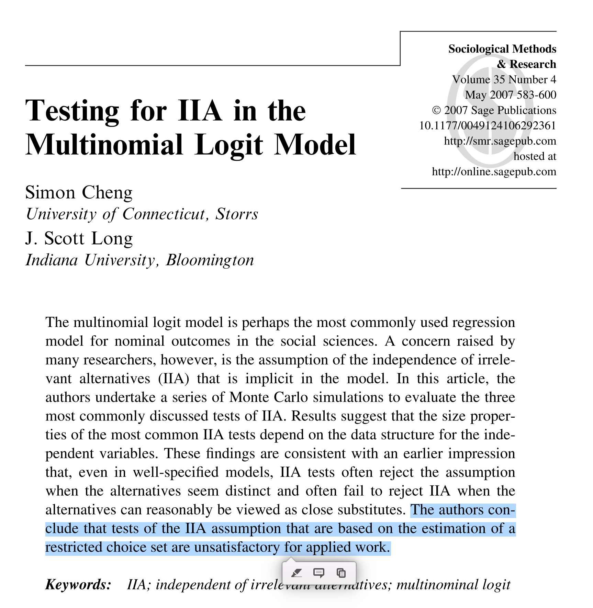

```{r course-style, include=FALSE}
# Encuentra `_shared/bikeshare.R` sin depender del working directory.
source(local({
  d <- normalizePath(getwd(), mustWork = FALSE)
  cands <- d
  while (!identical(dirname(d), d)) { d <- dirname(d); cands <- c(cands, d) }
  cands <- c(cands, Sys.glob(file.path(getwd(), c("*", "*/*", "*/*/*"))))
  hits <- file.path(cands, "_shared", "bikeshare.R")
  hits <- hits[file.exists(hits)]
  if (!length(hits)) stop("No se encontró _shared/bikeshare.R desde ", getwd())
  normalizePath(hits[[1]])
}))
course_palette <- use_course_style("ajax")
```

```{r setup, include=FALSE}
library(pacman)
p_load("carData", "viridis", "tidyverse", "modelr", "cowplot", "arm",
       "DescTools", "caret", "nnet", "marginaleffects")

theme_set(theme_julia())
data(Chile)
plebs_1988 <- Chile %>% as_tibble()

# Tamaños de texto para gráficos proyectados.
theme_slides <- theme(
  axis.text = element_text(size = 22),
  axis.title = element_text(size = 24),
  legend.text = element_text(size = 18),
  legend.title = element_text(size = 18),
  legend.position = "top"
)
```

## Antes · Hoy · Después {.class-rhythm}

::: {.full-width}

::: {.content-box}
**Antes**

estructura teórica de la regresión multinomial.
:::

::: {.content-box-primary}
**Hoy**

interpretación de efectos multinomiales: logits, odds ratios y efectos marginales.
:::

::: {.content-box-secondary}
**Después**

regresión de Poisson para recuentos.
:::

:::

## Objetivos de hoy

- Interpretar los coeficientes de la regresión multinomial como **logits** y como **odds ratios**.

. . .

- Entender por qué el **efecto marginal sobre la probabilidad** no es igual al coeficiente.

. . .

- Resumir la heterogeneidad de los efectos marginales (AME, MEM, MER).

. . .

- Discutir el supuesto de **IIA** (Independencia de Alternativas Irrelevantes).

## Regresión Logística Multinomial: interpretación de efectos {.inverse .center .middle}

## Un ejemplo empírico: plebiscito chileno de 1988

::: {.pull-left}

Datos de una encuesta nacional (FLACSO/Chile, abril-mayo 1988), disponibles en el paquete `carData`.

- **Variable dependiente** `vote`:
  - `A`: se abstendrá
  - `N`: votará no (contra Pinochet)
  - `U`: indeciso
  - `Y`: votará sí (a favor de Pinochet)
- **Categoría de referencia:** `A`
- **Predictores:** `statusquo` (apoyo al status quo, escala continua) y `sex`

:::

::: {.pull-right}

Ajustamos el modelo con `nnet::multinom()`:

```{r ajuste, echo=TRUE}
mlogit_vote_sq_sex <- multinom(vote ~ statusquo + sex,
                               trace = FALSE, data = plebs_1988)
round(coef(mlogit_vote_sq_sex), 3)
```

:::

```{r helpers-ejemplo, include=FALSE}
mlogit <- mlogit_vote_sq_sex
b <- coef(mlogit)  # filas: N, U, Y; columnas: (Intercept), statusquo, sexM

# Malla de statusquo por sexo; probabilidades predichas y transformaciones
grid <- plebs_1988 %>% data_grid(statusquo = seq_range(statusquo, 30), sex, .model = mlogit)
pred <- bind_cols(grid, as_tibble(predict(mlogit, newdata = grid, type = "probs"))) %>%
  rename(p_A = A, p_N = N, p_U = U, p_Y = Y) %>%
  mutate(
    across(c(p_N, p_U, p_Y), ~ log(.x / p_A), .names = "logit_{.col}"),
    across(c(p_N, p_U, p_Y), ~ .x / p_A, .names = "or_{.col}")
  )

# Efecto marginal de statusquo sobre p_j: p_j * (beta_j - sum_l p_l beta_l), con beta_A = 0
bsq <- c(0, b[, "statusquo"])  # orden A, N, U, Y
P <- as.matrix(pred[, c("p_A", "p_N", "p_U", "p_Y")])
avg_bsq <- drop(P %*% bsq)
ME <- P * (matrix(bsq, nrow(P), 4, byrow = TRUE) - avg_bsq)
pred_me <- bind_cols(
  pred %>% dplyr::select(statusquo, sex),
  as_tibble(ME) %>% set_names(c("me_p_A", "me_p_N", "me_p_U", "me_p_Y"))
)

# Gráfico de curvas: prefijo indica qué columnas graficar
plot_curvas <- function(df, prefijo, ylab, hline = FALSE) {
  p <- df %>%
    dplyr::select(statusquo, sex, starts_with(prefijo)) %>%
    pivot_longer(starts_with(prefijo), names_to = "vote",
                 names_prefix = prefijo, values_to = "valor") %>%
    ggplot(aes(x = statusquo, y = valor, colour = vote, group = interaction(vote, sex))) +
    geom_path(aes(linetype = sex), alpha = 0.5, linewidth = 1.5) +
    scale_color_course() + scale_fill_course() +
    theme_slides +
    labs(x = "Apoyo al status quo", y = ylab, colour = "Voto", linetype = "Sexo")
  if (hline) p <- p + geom_hline(yintercept = 0, linewidth = 1.5)
  p
}
```

## El modelo estimado

$$\ln \frac{p_{ij}}{p_{iA}} = \beta_{j0} + \beta_{j1}\,\text{statusquo}_{i} + \beta_{j2}\,\text{male}_{i}, \qquad j \in \{N, U, Y\}$$

donde $\text{male}_i$ corresponde a `sexM` y $p_{ij} = \mathbb{P}(\text{vote}_i = j)$.

::: {.pull-left}

```{r coefs, echo=FALSE}
round(summary(mlogit)$coefficients, 3)
```

:::

::: {.pull-right}

- $\beta_{j0}$: log-odds de $j$ vs $A$ cuando `statusquo` $=0$ y la persona es mujer.
- $\beta_{j1}$: cambio en el logit de $j$ vs $A$ por cada punto de `statusquo`.
- $\beta_{j2}$: diferencia en el logit de $j$ vs $A$ entre hombres y mujeres.

:::

## Efectos sobre el logit

Un modelo de regresión logística multinomial consiste de $J-1$ ecuaciones:

$$\text{logit}(p_{ij}) = \ln \frac{p_{ij}}{p_{iJ}} = \beta_{j0} + \beta_{j1} x_{i1} + \dots + \beta_{jk} x_{ik}$$

. . .

- El intercepto $\beta_{j0}$ es el log-odds de $j$ frente a la categoría de referencia cuando $x_{1} = \dots = x_{k} = 0$.

. . .

- El efecto marginal de $x_{k}$ sobre el logit es constante:

$$\frac{\partial\, \text{logit}(p_{ij})}{\partial x_{k}} = \beta_{jk}$$

. . .

::: {.content-box-yellow}

"Un aumento de una unidad en $x_{k}$ suma $\beta_{jk}$ unidades al logit de $j$ frente a $J$."

:::

. . .

[Importante:]{.bold} los coeficientes entregan información sobre probabilidades [relativas]{.bold} de cada $j$ con respecto a la categoría de referencia, no sobre probabilidades absolutas.

## Efectos sobre el logit en el ejemplo

::: {.pull-left}

Como el logit es lineal en `statusquo`, cada categoría tiene una **pendiente constante**:

- $\beta_{N1}$ = `r round(b["N","statusquo"], 2)`: a más apoyo al status quo, menor logit de votar no vs abstenerse.
- $\beta_{U1}$ = `r round(b["U","statusquo"], 2)`.
- $\beta_{Y1}$ = `r round(b["Y","statusquo"], 2)`: a más apoyo al status quo, mayor logit de votar sí vs abstenerse.

:::

::: {.pull-right}

```{r logit-plot, echo=FALSE, fig.width=6.5, fig.height=5.5, warning=FALSE, message=FALSE}
plot_curvas(pred, "logit_p_", "Logit(voto = j vs A)")
```

:::

## Cálculo del logit para un perfil

¿Cuál es el logit de votar N y Y para un **hombre** según su apoyo al status quo?

```{r logit-calc, echo=TRUE}
logit_j <- function(j, sq, male) {
  b[j, "(Intercept)"] + b[j, "statusquo"] * sq + b[j, "sexM"] * male
}

logit_j("N", sq = c(0, 1), male = 1)
logit_j("Y", sq = c(0, 1), male = 1)

# Cambio en el logit al pasar de statusquo = 0 a 1 (= beta_N1 y beta_Y1)
diff(logit_j("N", sq = c(0, 1), male = 1))
diff(logit_j("Y", sq = c(0, 1), male = 1))
```

. . .

El cambio en el logit no depende del sexo: $\beta_{j1}$ es el mismo para hombres y mujeres, porque el modelo no incluye interacciones.

## Efectos multiplicativos sobre las odds {.center .middle}

## De logits a odds

Dado el modelo:

$$\text{logit}(p_{ij}) = \ln \frac{p_{ij}}{p_{iJ}} = \beta_{j0} + \beta_{j1} x_{i1} + \dots + \beta_{jk} x_{ik}$$

. . .

exponenciando ambos lados:

$$\frac{p_{ij}}{p_{iJ}} = e^{\beta_{j0} + \beta_{j1} x_{i1} + \dots + \beta_{jk} x_{ik}}$$

. . .

es decir, las odds son **multiplicativas** en los predictores:

::: {.content-box-blue}

$$\frac{p_{ij}}{p_{iJ}} = e^{\beta_{j0}} \cdot e^{\beta_{j1} x_{i1}} \cdots e^{\beta_{jk} x_{ik}}$$

:::

## Odds ratios: derivación

Considera dos observaciones $i$ e $i'$ con $x_{k} = c$ y $x_{k} = c+1$, respectivamente. El resto de las covariables toman valores idénticos.

. . .

Las odds de $j$ frente a $J$ son:

- $\dfrac{p_{ij}}{p_{iJ}} = e^{\beta_{j0}} \cdots \left(e^{\beta_{jk}}\right)^{c}$
- $\dfrac{p_{i'j}}{p_{i'J}} = e^{\beta_{j0}} \cdots \left(e^{\beta_{jk}}\right)^{c+1}$

. . .

El cociente entre ambas odds es:

$$\frac{p_{i'j}/p_{i'J}}{p_{ij}/p_{iJ}} = \frac{\left(e^{\beta_{jk}}\right)^{c+1}}{\left(e^{\beta_{jk}}\right)^{c}} = e^{\beta_{jk}}$$

## Odds ratios: interpretación

::: {.content-box-yellow}

"Un cambio de $\Delta$ unidades en $x_{k}$ multiplica el cociente entre las probabilidades de $j$ y $J$ por $e^{\Delta \beta_{jk}}$"

:::

. . .

[Propiedades de $e^{\beta_{jk}}$:]{.bold}

- $e^{\beta_{jk}} \in (0, \infty)$: actúa como un factor multiplicativo, no aditivo.

. . .

- $\beta_{jk} < 0 \Rightarrow 0 < e^{\beta_{jk}} < 1$: un aumento en $x_{k}$ reduce el cociente de odds de $j$ vs $J$.

. . .

- $\beta_{jk} = 0 \Rightarrow e^{\beta_{jk}} = 1$: un cambio en $x_{k}$ no altera el cociente de odds.

. . .

- $\beta_{jk} > 0 \Rightarrow e^{\beta_{jk}} > 1$: un aumento en $x_{k}$ amplifica el cociente de odds.

## Odds ratios en el ejemplo

::: {.pull-left}

```{r or-tabla, echo=TRUE}
round(exp(coef(mlogit)), 3)
```

:::

::: {.pull-right}

- Un punto más de `statusquo` multiplica las odds de **N vs A** por `r round(exp(b["N","statusquo"]), 3)` (reducción de `r round((1 - exp(b["N","statusquo"])) * 100)`%).
- Las odds de **Y vs A** se multiplican por `r round(exp(b["Y","statusquo"]), 2)`.
- Los hombres tienen odds de **N vs A** `r round(exp(b["N","sexM"]), 2)` veces las de las mujeres.

:::

## Odds ratios en el ejemplo: curvas

::: {.pull-left}

Las curvas de odds son **exponenciales** en `statusquo`, porque el logit es lineal:

$$\frac{p_{ij}}{p_{iA}} = e^{\beta_{j0} + \beta_{j1}\,\text{statusquo}_{i} + \beta_{j2}\,\text{male}_{i}}$$

:::

::: {.pull-right}

```{r or-plot, echo=FALSE, fig.width=6.5, fig.height=5.5, warning=FALSE, message=FALSE}
plot_curvas(pred, "or_p_", "Odds(voto = j vs A)")
```

:::

## Efectos marginales sobre la probabilidad {.center .middle}

## El problema con las probabilidades

Queremos el efecto de $x_k$ sobre la **probabilidad** de cada categoría:

$$\frac{\partial p_{ij}}{\partial x_{k}}$$

. . .

Con el modelo multinomial, la probabilidad es:

$$p_{ij} = \frac{e^{\beta_{j0} + \beta_{j1}x_{1i} + \dots + \beta_{jk}x_{ki}}}{1 + \sum^{J-1}_{l=1} e^{\beta_{l0} + \beta_{l1}x_{1i} + \dots + \beta_{lk}x_{ki}}}$$

. . .

Como $p_{ij}$ es no lineal en $x$, su efecto marginal depende de **todas** las probabilidades y coeficientes.

## Efecto marginal sobre $p_{ij}$

Después de derivar:

::: {.content-box-yellow}

$$\frac{\partial p_{ij}}{\partial x_{k}} = p_{ij} \cdot \bigg(\beta_{jk} - \sum^{J-1}_{l=1} p_{il} \cdot \beta_{lk}\bigg)$$

:::

::: {.pull-left}

Llamemos $\overline{\beta}_{k} = \sum^{J-1}_{l=1} p_{il}\,\beta_{lk}$, el "efecto promedio" de $x_k$ para la observación $i$. No depende de $j$.

Entonces:

$$\frac{\partial p_{ij}}{\partial x_{k}} = p_{ij}\,(\beta_{jk} - \overline{\beta}_{k})$$

:::

::: {.pull-right}

- Si $\beta_{jk} > \overline{\beta}_{k}$: el efecto es **positivo**.
- Si $\beta_{jk} < \overline{\beta}_{k}$: el efecto es **negativo**.
- El signo **no necesariamente** coincide con el signo de $\beta_{jk}$.

:::

. . .

[Nota:]{.bold} el efecto varía con $x_k$, con $\beta_{jk}$ y con todas las demás covariables. Testear si un efecto marginal es cero en un punto particular aporta poco; lo relevante es su magnitud y cómo cambia.

## Efectos sobre la probabilidad en el ejemplo

::: {.pull-left}

Probabilidades predichas por categoría:

```{r prob-plot, echo=FALSE, fig.width=6.5, fig.height=5.5, warning=FALSE, message=FALSE}
plot_curvas(pred, "p_", "P(voto = j)")
```

:::

::: {.pull-right}

Efecto marginal de `statusquo` sobre cada probabilidad:

```{r me-plot, echo=FALSE, fig.width=6.5, fig.height=5.5, warning=FALSE, message=FALSE}
plot_curvas(pred_me, "me_p_", "Efecto marginal de status quo", hline = TRUE)
```

:::

## Efectos marginales: heterogeneidad

- Los efectos marginales son **esencialmente heterogéneos**: no hay un efecto, sino muchos.

. . .

- La heterogeneidad crece con la complejidad del modelo: número de predictores, interacciones, no linealidades.

. . .

- En modelos multinomiales, los efectos marginales **no son necesariamente monotónicos**: pueden cambiar de signo a lo largo de $x$.

. . .

- En la práctica queremos **un número** que resuma el efecto. Objetivo: resumir sin confundir un promedio con un efecto universal.

## Resúmenes del efecto marginal

::: {.pull-left}

- **AME** (Average Marginal Effects): promedio de los efectos individuales en la muestra.
- **MEM** (Marginal Effects at the Mean): efecto evaluado en los valores medios de las covariables.
- **MER** (Marginal Effects at Representative values): efecto evaluado en perfiles representativos (p. ej., hombre con `statusquo` $=0.5$).

:::

::: {.pull-right}

Los tres pueden dar números muy distintos cuando el efecto es heterogéneo. Reporta cuál usas y por qué.

:::

## AME y MEM con `marginaleffects`

```{r me-resumenes, echo=TRUE, warning=FALSE, message=FALSE}
# AME: promedio sobre las observaciones de la muestra
avg_slopes(mlogit, variables = "statusquo") %>%
  as_tibble() %>% dplyr::select(group, estimate, std.error)

# MEM: efecto en valores medios de las covariables
slopes(mlogit, variables = "statusquo", newdata = datagrid(model = mlogit)) %>%
  as_tibble() %>% dplyr::select(group, estimate, std.error)
```

## Independence of Irrelevant Alternatives (IIA) {.inverse .center .middle}

## IIA: definición

Cuando la regresión logística multinomial se usa para modelar **decisiones** (choice), descansa en el supuesto implícito de IIA:

::: {.content-box-blue}

Las odds (probabilidades relativas) de elegir entre dos alternativas no se ven afectadas por la existencia de otras alternativas.

:::

. . .

En términos de nuestro modelo: $\dfrac{p_{ij}}{p_{ik}}$ no depende de qué otras categorías existen.

## IIA: ejemplo de McFadden (1974)

- Una persona puede viajar al trabajo en: $\{\text{auto}, \text{bus rojo}\}$.
- $\mathbb{P}(\text{auto}) = \mathbb{P}(\text{bus rojo}) = 1/2$. Odds $= 1$.

. . .

- Se amplía el conjunto: $\{\text{auto}, \text{bus rojo}, \text{bus azul}\}$.

. . .

- Como los buses sólo difieren en color, esperaríamos $\mathbb{P}(\text{bus rojo}) = \mathbb{P}(\text{bus azul})$.
- Para conservar odds $=1$ entre auto y bus rojo, debe ser $\mathbb{P}(\text{auto}) = \mathbb{P}(\text{bus rojo}) = \mathbb{P}(\text{bus azul}) = 1/3$.

. . .

- Lo más realista: $\mathbb{P}(\text{auto}) = 1/2$ y $\mathbb{P}(\text{bus rojo}) = \mathbb{P}(\text{bus azul}) = 1/4$.
- Pero eso **viola IIA**: las odds entre auto y bus rojo pasan a ser $(1/2)/(1/4) = 2$.

## IIA: ¿es razonable en nuestro ejemplo?

::: {.content-box-blue}

**Pregunta para discusión**

Si la opción `U` (indeciso) no existiera, ¿los indecisos se repartirían entre `N` e `Y` en la misma proporción que los demás votantes? ¿Y los abstencionistas?

:::

. . .

Probablemente no: los indecisos y los abstencionistas tienen perfiles distintos de apoyo al status quo. Eso sugiere que IIA es un supuesto fuerte aquí.

## IIA: tests y alternativas

Existe una variedad de tests para IIA (p. ej., Hausman-McFadden, Small-Hsiao), pero ninguno ha mostrado ser concluyente:

::: {.center}

{width=60%}

:::

. . .

Si IIA no es plausible, alternativas: el probit multinomial o el logit anidado (*nested logit*).

## En resumen

- El coeficiente $\beta_{jk}$ es el efecto marginal de $x_k$ sobre $\text{logit}(p_{ij})$, constante. $e^{\beta_{jk}}$ es la odds ratio de $j$ vs $J$ por cada unidad de $x_k$.

. . .

- El efecto marginal sobre la **probabilidad** no es $\beta_{jk}$: $\partial p_{ij}/\partial x_{k} = p_{ij}(\beta_{jk} - \overline{\beta}_{k})$. Puede variar entre observaciones y cambiar de signo.

. . .

- Para resumir la heterogeneidad usamos AME, MEM o MER (p. ej., `avg_slopes()` de `marginaleffects`).

. . .

- El modelo logit multinomial supone IIA; no existe un test concluyente para verificarlo.

. . .

- La próxima clase aborda la regresión de Poisson, para variables de conteo.

## Gracias {.inverse .center .middle .closing}

**Hasta la próxima clase**

Mauricio Bucca
