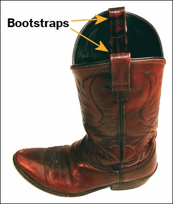

##Configuración

--

<br>

- Tenemos $y_{1}, \dots y_{n}$ son $n$ variables independientes con distribución $\text{Bernoulli}(p_{i})$


--

- $\mathbb{E}(y_{i} \mid x_{i1}, \dots,x_{ik}) = \mathbb{P}(y_{i}=1 \mid x_{i1}, \dots,x_{ik}) = p_{i}$ 

<br>
--

donde, 


$$\ln \frac{p_{i}}{1 - p_{i}} = \beta_{0} + \beta_{1} x_{i1} + \dots + \beta_{k} x_{ik}$$

---
##Configuración

<br>

- Tenemos $y_{1}, \dots y_{n}$ son $n$ variables independientes con distribución $\text{Bernoulli}(p_{i})$


- $\mathbb{E}(y_{i} \mid x_{i1}, \dots,x_{ik}) = \mathbb{P}(y_{i}=1 \mid x_{i1}, \dots,x_{ik}) = p_{i}$ 

<br>

donde, 

.content-box-blue[
$$\underbrace{\ln \frac{p_{i}}{1 - p_{i}}}_{\text{Link logit}(p_{i})} = \overbrace{\beta_{0} + \beta_{1} x_{i1} + \dots + \beta_{k} x_{ik}}^{\text{Predictor lineal  } \eta_{i}}$$
]

--

- .bold[Inferencia]: ¿que podemos decir sobre $\hat{\beta}_{0},\hat{\beta}_{1}, \dots, \hat{\beta}_{k}$  (o cualquier producto de éstos) más allá de nuestra muestra?

---
class: inverse, center, middle

## Inferencia estadística para regresión logística (y GLMs)


---
## Inferencia acerca de parámetros del modelo

- Los coeficientes de un GLM son estimados via MLE.
--
 Un ML "estimate" $\hat{\theta}$ tiene las siguientes propiedades:

--

.img-right[]


.pull-left[
- Es .bold[consistente]: $\hat{\theta} \xrightarrow{p} \theta$. Es decir, en la medida que $n \to \infty$, el  estimador $\hat{\theta}$ tiende en probabilidad a $\theta$, el valor verdadero del parámetro. 
]
.pull-right[
]

--

.pull-left[
- Es .bold[insesgado]: $\mathbb{E}(\hat{\theta}) = \theta$.
]
.pull-right[
]

--

.pull-left[
- Distribuye .bold[asintónticamente normal]: $\hat{\theta} \xrightarrow{d} \mathcal{N}(\theta, \frac{\sigma_{\theta}}{\sqrt{n}})$. Es decir, no solo converge al valor verdadero, sino que converge rápidamente ( $1/\sqrt{n}$ ).
]
.pull-right[
]

--

Notar que $\frac{\sigma_{\theta}}{\sqrt{n}}$ es el "standard error" (SE) de $\theta$.

```{css, echo=FALSE}
.pull-right ~ * { clear: unset; }
.pull-right + * { clear: both; }
```

---
## Inferencia acerca de parámetros del modelo: intervalos de confianza

Dado que $\hat{\theta} \sim \mathcal{N}(\theta, \frac{\sigma_{\theta}}{\sqrt{n}})$ ...

<br>
--

podemos construir un intervalo de confianza de la siguiente manera:

$$(1 - \alpha) \text{ CI}_{\hat{\theta}} = \hat{\theta} \pm \Phi^{-1}(\alpha/2) \cdot SE_{\hat{\theta}}$$
<br>
--

Ejemplo, un intervalo al 95% de confianza está dado por:

$$95\% \text{ CI}_{\hat{\theta}} = \hat{\theta} \pm 2 \cdot  \frac{\sigma_{\theta}}{\sqrt{n}}$$


---
## Inferencia acerca de parámetros del modelo:  intervalos de confianza

```{r,  include=TRUE, echo=FALSE, warning=FALSE, message=FALSE}
# load data on extra-marital affairs from package "Ecdat"
library("Ecdat")
library("viridis")
library("tidyverse")
library("modelr")
library("cowplot")
library("margins")
library("rsample")
library("arm")
library("stargazer")


theme_set(theme_cowplot())

data(Fair)
affairsdata <- Fair %>% as_tibble()

# create a binary variable indicating wether persons has ever had an affair
affairsdata <- affairsdata %>% 
  mutate(everaffair = case_when(nbaffairs == 0 ~ "Never", nbaffairs > 0 ~ "At least once") ) %>%
  # map into 0/1 code
  mutate(everaffair_d = case_when(nbaffairs == 0 ~ 0, nbaffairs > 0 ~ 1))
```

Retomando nuestro modelo de clases anteriores: $\ln \frac{p_{i}}{ 1 - p_{i}}    = \beta_{0} + \beta_{1}\text{male}_{i} + \beta_{2}\text{ym}_{i}$

--

```{r,echo=FALSE}
logit_affairs_sex_ym <- 
  glm(everaffair_d ~ factor(sex) + ym, 
      family=binomial(link="logit"), 
      data=affairsdata)
logit_affairs_sex_ym$formula
summary(logit_affairs_sex_ym)$coefficients
```

--

.content-box-blue[
.bold[Calculemos un IC al 95% para efecto el de "years of marriage" sobre el logit de ser infiel:] $\beta_{2}$
]

--

```{r}
beta2 <- summary(logit_affairs_sex_ym)$coefficients["ym","Estimate"]
se_beta2 <- summary(logit_affairs_sex_ym)$coefficients["ym","Std. Error"]
ci_beta2 <- beta2 + c(-2,2)*se_beta2; ci_beta2
```

--

```{r}
confint(logit_affairs_sex_ym)
```

---
## Inferencia acerca de parámetros del modelo: tests

```{r,echo=FALSE}
summary(logit_affairs_sex_ym)$coefficients
```

--

.bold[¿Que significan los p-values en este contexto?] 

--

.img-right[

]

```{r,echo=FALSE}
stargazer(logit_affairs_sex_ym, type = "text", single.row=TRUE)
```

---
## Inferencia acerca de parámetros del modelo: tests

```{r,echo=FALSE}
summary(logit_affairs_sex_ym)$coefficients
```

--

.bold[Test de hipótesis]

--

1) $H_{0}:$ Los años de matrimonio no afectan la probabilidad de ser infiel ( $\beta_{2}=0$ )

--

2) ¿Cuál es la distribución de $\beta_{2}$ si la hipótesis nula es verdadera?

--

.content-box-blue[
$$\beta_{2} \mid H_{0} \sim \text{Normal}\Big(\mu_{\beta_{2}} = 0, \sigma_{\beta_{2}} = \text{SE}_{\beta_{2}}\Big)$$
]

--

3) Calcular .bold[p-value] (2 colas)


.content-box-blue[
$$\mathbb{P}( \beta_{2} > | \hat{\beta}_{2} |  \mid H_{0}) :=   \mathbb{P}\big(\text{Normal}(\mu_{\beta_{2}} = 0, \sigma_{\beta_{2}} = \text{SE}_{\beta_{2}})  > |\hat{\beta}_{2}| \big)$$
]

```{css, echo=FALSE}
.pull-right ~ * { clear: unset; }
.pull-right + * { clear: both; }
```

---
## Inferencia acerca de parámetros del modelo: tests

```{r,echo=FALSE}
summary(logit_affairs_sex_ym)$coefficients
```

```{r, echo=FALSE, fig.width=7, fig.height=6, message=FALSE, warning=FALSE}
# Extract coefficient estimate and standard error
beta2_hat <- (summary(logit_affairs_sex_ym)$coefficients)[3,1]
beta2_se  <- (summary(logit_affairs_sex_ym)$coefficients)[3,2]

# Create a sequence of values around the estimate
x_vals <- seq(-4*beta2_se, 4*beta2_se, length.out = 500)

# Compute normal density
dens_vals <- dnorm(x_vals, mean = 0, sd = beta2_se)

# Plot
tibble(x = x_vals, y = dens_vals) %>%
  ggplot(aes(x = x, y = y)) +
    geom_line(size = 1.2, colour = "blue") +
    geom_vline(aes(xintercept = beta2_hat), size = 1.2, colour = "red") +
    labs(x = expression(hat(beta)[2]), y = "Density") +
    theme_minimal() +
    theme(
      axis.text = element_text(size = 14),
      axis.title = element_text(size = 16)
    )
```
---
## Inferencia acerca de parámetros del modelo: ejemplo empírico

--

.content-box-blue[
.bold[Calculemos ahora un IC al 95% para efecto multiplicativo de "years of marriage" sobre las odds de ser infiel:] $e^{\beta_{2}}$= `r expbeta2=exp(logit_affairs_sex_ym$coefficients[3]); expbeta2`
]

--


--

¿Cuál es la sampling distribution de una función de nuestro estimate?


---
class: inverse, center, middle

## Bootstrap Method 


---

.pull-left[


]

--

.pull-right[

]

---
## Bootstrap Method 

.bold[Intuición:]

--

- Estimamos un modelo y tenemos una cierta "cantidad de interés" (estimate)

--


- No conocemos la distribución nuestro estimate a través de infinitas muestras porque sólo tenemos una muestra. 

--

- Tampoco tenemos conocimiento teórico sobre la distribución de nuestro estimate.

--

- Podemos tomar muestras de nuestra muestra, preservando cualquier distribución desconocida subyacente.

--

- Podemos observar y estudiar el comportamiento de nuestro estimate en estas muestras de nuestras muestras.

---
## Bootstrap Method 

.bold[Muestrando desde la muestra:]

¿Cuántas muestras podemos tomar (con reemplazo) a partir de nuestra muestra?
--
 .bold[Respuesta]: $n^n$

<br>
--

$$\text{muestra} : \left[\begin{array}{@{}c@{}}
    1 \\
    2 \\
    3 
    \end{array} \right]$$

<br>
--

$$\text{posibles muestras de la muesta:} \left[\begin{array}{@{}c@{}} 
    1 \\
    1 \\
    1 
    \end{array} \right] 
    \text{ o}  \left[\begin{array}{@{}c@{}} 
    1 \\
    1 \\
    2 
    \end{array} \right] 
    \text{ o}  \left[\begin{array}{@{}c@{}} 
    1 \\
    3 \\
    2 
    \end{array} \right] 
    \text{ o}  \left[\begin{array}{@{}c@{}} 
    3 \\
    1 \\
    2 
    \end{array} \right] 
    \text{ o}  \left[\begin{array}{@{}c@{}} 
    3 \\
    3 \\
    3 
    \end{array} \right]  ...$$

---
## Bootstrap Method

.bold[Esquema del algoritmo] (Bootstrap no paramétrico):

--

1. Asume que la distribución empírica del los datos refleja la distribución de probabilidad de las variables de interés.

--

2. A partir de la muestra obtenén una muestra aleatoria del mismo tamaño que la muestra original (N), con reemplazo:  $(y_{b},X_{b})$

--

3. Regresiona $y_{b}$ y $X_{b}$ para obtener el estimate $\hat{\theta}_{b}$ 

--

4. Repite los pasos 2 y 3 un gran número de veces B.

--

5. El conjunto de B resultados obtenidos corresponde a la "Bootstrap distribution" del estimate.

--

6. Evalúa la distribución del estimate (SE,CI, etc) o de cualquier cantidad derivada de éste.

---
## Bootstrap Method: ejemplo empírico 

Siguiendo con $\ln \frac{p_{i}}{ 1 - p_{i}}    = \beta_{0} + \beta_{1}\text{male}_{i} + \beta_{2}\text{ym}_{i}$, 
--

.content-box-blue[
.bold[Calculemos un IC al 95% para efecto el de "years of marriage" sobre el logit de ser infiel:] $\beta_{2}$
]

--

```{r}
# Escribir una función que ejecute re-sampling y la estimación
bs_beta2  <- function(x) {
  data_b  <- sample_n(affairsdata,size=nrow(affairsdata),replace=TRUE)
  logit_b <- glm(everaffair_d ~ factor(sex) + ym, family=binomial(link="logit"), data=data_b)
  beta2_b <- logit_b$coefficients[3]
  return(beta2_b)
}

# Iterar función y almacenar resultados 
nreps =1200
betas2_bs <- replicate(nreps,bs_beta2()); head(betas2_bs)

```

---
## Bootstrap Method: ejemplo empírico 

.pull-left[
```{r}
se_beta2_bs <- sd(betas2_bs)
se_beta2_bs

ci_beta2_bs <- 
  quantile(betas2_bs, p=c(0.025,0.975))
  ci_beta2_bs
```
]

--

.pull-right[
```{r, echo=FALSE, fig.width=7, fig.height=6, message=FALSE, warning=FALSE}
ci95 = round(ci_beta2_bs,2)

betas2_bs %>% as_tibble() %>% ggplot(aes(x=value)) + 
      geom_density(colour="black", fill="blue", alpha=0.1, size=1.5) +
      scale_color_viridis_d() + 
      geom_vline(aes(xintercept = beta2, colour=paste0("beta2=",round(beta2,2)) ), size=1.5) +
      geom_vline(aes(xintercept = ci_beta2_bs[1],
                     colour=paste0("95% CI: (",ci95[1],",",ci95[2],")")), linetype="dashed", size=1.5) +
      geom_vline(aes(xintercept = ci_beta2_bs[2], 
                     colour=paste0("95% CI: (",ci95[1],",",ci95[2],")")), linetype="dashed", size=1.5) +
      guides(fill=FALSE) + labs(colour="", x="beta2") +
      theme(axis.text.y = element_text(size = 22), axis.text.x = element_text(size = 22),
      axis.title.y = element_text(size = 24), axis.title.x = element_text(size = 24), 
      legend.text = element_text(size = 18), legend.position="bottom") +
      guides(color=guide_legend(nrow=3,byrow=TRUE))
```
]

---
## Bootstrap Method: ejemplo empírico 

.content-box-blue[
¿Un IC al 95% para efecto el de "years of marriage" como .bold["odds ratio"]: $e^{\beta_{2}}$? 
]

--

Bootstrapeando ...


.img-bottom-right[

]


---
## Bootstrap Method: ejemplo empírico 

.content-box-blue[
¿Un IC al 95% para efecto el de "years of marriage" como .bold["odds ratio"]: $e^{\beta_{2}}$? 
]


Bootstrapeando ...


```{r}
# Escribir una función que ejecute re-sampling y la estimación
bs_expbeta2  <- function(x) {
  data_b  <- sample_n(affairsdata,size=nrow(affairsdata),replace=TRUE)
  logit_b <- glm(everaffair_d ~ factor(sex) + ym, family=binomial(link="logit"), data=data_b)
  expbeta2_b <- exp(logit_b$coefficients[3])
  return(expbeta2_b)
}

# Iterar función y almacenar resultados 
nreps = 2000 
expbetas2_bs <- replicate(nreps,bs_expbeta2()); head(expbetas2_bs)

```

---
## Bootstrap Method: ejemplo empírico 

.pull-left[
```{r}
se_expbeta2_bs <- sd(expbetas2_bs)
se_expbeta2_bs

ci_expbeta2_bs <- 
  quantile(expbetas2_bs, p=c(0.025,0.975))
  ci_expbeta2_bs
```
]

--

.pull-right[
```{r, echo=FALSE, fig.width=7, fig.height=6, message=FALSE, warning=FALSE}
ci95 = round(ci_expbeta2_bs,2)

expbetas2_bs %>% as_tibble() %>% ggplot(aes(x=value)) + 
      geom_density(colour="black", fill="blue", alpha=0.1, size=1.5) +
      scale_color_viridis_d() + 
      geom_vline(aes(xintercept = expbeta2, colour=paste0("exp(beta2)=",round(expbeta2,2)) ), size=1.5) +
      geom_vline(aes(xintercept = ci_expbeta2_bs[1],
                     colour=paste0("95% CI: (",ci95[1],",",ci95[2],")")), linetype="dashed", size=1.5) +
      geom_vline(aes(xintercept = ci_expbeta2_bs[2], 
                     colour=paste0("95% CI: (",ci95[1],",",ci95[2],")")), linetype="dashed", size=1.5) +
      guides(fill=FALSE) + labs(colour="", x="exp(beta2)") +
      theme(axis.text.y = element_text(size = 22), axis.text.x = element_text(size = 22),
      axis.title.y = element_text(size = 24), axis.title.x = element_text(size = 24), 
      legend.text = element_text(size = 18), legend.position="bottom") +
      guides(color=guide_legend(nrow=3,byrow=TRUE))
```
]

---
## Bootstrap Method: ejemplo empírico

.content-box-blue[
.bold[Calculemos ahora IC al 95% para el Average Marginal Effect de"years of marriage" sobre la probabilidad de ser infiel]
]

--

Bootstrapeando ...

.img-bottom-right[

]


---
## Bootstrap Method: ejemplo empírico

.content-box-blue[
.bold[Calculemos ahora IC al 95% para el Average Marginal Effect de"years of marriage" sobre la probabilidad de ser infiel]
]


Bootstrapeando ...

```{r}
# Escribir una función que ejecute re-sampling y la estimación
bs_ame_ym  <- function(x) {
  data_b   <- sample_n(affairsdata,size=nrow(affairsdata),replace=TRUE)
  logit_b  <- glm(everaffair_d ~ factor(sex) + ym, family=binomial(link="logit"), data=data_b)
  beta2_b  <- logit_b$coefficients[3]
  p_hat_b  <- predict(logit_b, type = "response")
  me_ym_b   <- beta2_b*p_hat_b*(1-p_hat_b)
  return(ame_ym_b = mean(me_ym_b))
}

# Iterar función y almacenar resultados 
nreps =1200 
ame_ym_bs <- replicate(nreps,bs_ame_ym()); head(ame_ym_bs)

```


---
## Bootstrap Method: ejemplo empírico

.pull-left[
```{r}

p_hat   <- predict(logit_affairs_sex_ym, type = "response")
me_ym   <- beta2*p_hat*(1-p_hat)
ame_ym  <- mean(me_ym); ame_ym

se_ame_ym_bs <- sd(ame_ym_bs)
se_ame_ym_bs

ci_ame_ym_bs <- 
  quantile(ame_ym_bs, p=c(0.025,0.975))
  ci_ame_ym_bs
```
]

--

.pull-right[
```{r, echo=FALSE, fig.width=7, fig.height=6, message=FALSE, warning=FALSE}
ci95 = round(ci_ame_ym_bs,3)

ame_ym_bs %>% as_tibble() %>% ggplot(aes(x=value)) + 
      geom_density(colour="black", fill="blue", alpha=0.1, size=1.5) +
      scale_color_viridis_d() + 
      geom_vline(aes(xintercept = ame_ym, colour=paste0("AME(ym)=",round(ame_ym,2)) ), size=1.5) +
      geom_vline(aes(xintercept = ci_ame_ym_bs[1],
                     colour=paste0("95% CI: (",ci95[1],",",ci95[2],")")), linetype="dashed", size=1.5) +
      geom_vline(aes(xintercept = ci_ame_ym_bs[2], 
                     colour=paste0("95% CI: (",ci95[1],",",ci95[2],")")), linetype="dashed", size=1.5) +
      guides(fill=FALSE) + labs(colour="", x="AME(ym) BS") +
      theme(axis.text.y = element_text(size = 22), axis.text.x = element_text(size = 22),
      axis.title.y = element_text(size = 24), axis.title.x = element_text(size = 24), 
      legend.text = element_text(size = 18), legend.position="bottom") +
      guides(color=guide_legend(nrow=3,byrow=TRUE))
```
]

---
## Bootstrap Method: más ... 

```{r, echo=FALSE, fig.width=7, fig.height=6, message=FALSE, warning=FALSE}
# function to implement within each sample (regression model)
logit_fit <- function(split){
  model_bs = glm(everaffair_d ~ factor(sex) + ym, family=binomial(link="logit"), data=analysis(split))
}

boots <- affairsdata  %>% bootstraps(times = nreps) 
```

.pull-left[
```{r, echo=FALSE, fig.width=7, fig.height=6, warning=F}
grid <- affairsdata %>% data_grid(sex, ym = seq_range(ym,20),.model=logit_affairs_sex_ym)

predict_new <- function(fit){
  preds = predict(fit,newdata=grid, type = "response")
  preds = cbind(grid,preds)
  return(preds)
}

boots %>%
  mutate(fit = map(splits, logit_fit)) %>%
  mutate(newpred = map(fit,predict_new)) %>%
  dplyr::select(id,newpred) %>%
  mutate_if(is.list, map, as_tibble) %>%
  unnest() %>% 
  ggplot(aes(x=ym,y=preds, group=interaction(id,sex), colour=sex)) + geom_line(alpha=0.08) + 
  scale_color_viridis_d()  + 
  guides(fill=FALSE, color=FALSE) +
  theme(axis.text.y = element_text(size = 22), axis.text.x = element_text(size = 22),
  axis.title.y = element_text(size = 24), axis.title.x = element_text(size = 24), 
  legend.text = element_text(size = 18), legend.position="none") +
  labs(x="years of marriage", y="Predicted P(Affair)")

```
]

--

.pull-right[
```{r, echo=FALSE, fig.width=7, fig.height=6, message=FALSE, warning=FALSE}
grid <- affairsdata %>% data_grid(sex, ym = seq(0,75,1),.model=logit_affairs_sex_ym)

predict_new <- function(fit){
  preds = predict(fit,newdata=grid, type = "response")
  preds = cbind(grid,preds)
  return(preds)
}

boots %>%
  mutate(fit = map(splits, logit_fit)) %>%
  mutate(newpred = map(fit,predict_new)) %>%
  dplyr::select(id,newpred) %>%
  mutate_if(is.list, map, as_tibble) %>%
  unnest() %>% 
  ggplot(aes(x=ym,y=preds, group=interaction(id,sex), colour=sex)) + geom_line(alpha=0.08) + 
  scale_color_viridis_d()  + 
  guides(fill=FALSE, color=FALSE) +
  theme(axis.text.y = element_text(size = 22), axis.text.x = element_text(size = 22),
  axis.title.y = element_text(size = 24), axis.title.x = element_text(size = 24), 
  legend.text = element_text(size = 18), legend.position="none") +
  labs(x="years of marriage", y="Predicted P(Affair)")

```
]

---
class: inverse, center, middle


##Hasta la próxima clase. Gracias!

<br>
Mauricio Bucca <br>
https://mebucca.github.io/ <br>
github.com/mebucca


