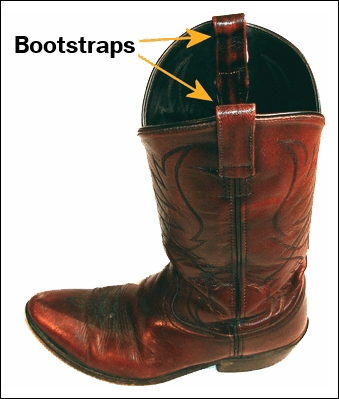

```{r course-style, include=FALSE}
source("../_shared/bikeshare.R")
course_palette <- use_course_style("inter")
```

## Antes · Hoy · Después {.class-rhythm}

::: {.full-width}

::: {.content-box}
**Antes**

interpretación de efectos y efectos marginales.
:::

::: {.content-box-primary}
**Hoy**

inferencia y bootstrap en regresión logística.
:::

::: {.content-box-secondary}
**Después**

regresión logística multinomial: estructura teórica.
:::

:::


# Regresión Logística {.inverse .center .middle}
## Inferencia

## Configuración

. . .

- Tenemos $y_{1}, \dots y_{n}$ son $n$ variables independientes con distribución $\text{Bernoulli}(p_{i})$

. . .

- $\mathbb{E}(y_{i} \mid x_{i1}, \dots,x_{ik}) = \mathbb{P}(y_{i}=1 \mid x_{i1}, \dots,x_{ik}) = p_{i}$ 

. . .

donde, 
$$\ln \frac{p_{i}}{1 - p_{i}} = \beta_{0} + \beta_{1} x_{i1} + \dots + \beta_{k} x_{ik}$$

## Configuración

- Tenemos $y_{1}, \dots y_{n}$ son $n$ variables independientes con distribución $\text{Bernoulli}(p_{i})$
- $\mathbb{E}(y_{i} \mid x_{i1}, \dots,x_{ik}) = \mathbb{P}(y_{i}=1 \mid x_{i1}, \dots,x_{ik}) = p_{i}$ 

donde, 

::: {.content-box-blue}

$$\underbrace{\ln \frac{p_{i}}{1 - p_{i}}}_{\text{Link logit}(p_{i})} = \overbrace{\beta_{0} + \beta_{1} x_{i1} + \dots + \beta_{k} x_{ik}}^{\text{Predictor lineal  } \eta_{i}}$$

:::

. . .

- [Inferencia]{.bold}: ¿que podemos decir sobre $\hat{\beta}_{0},\hat{\beta}_{1}, \dots, \hat{\beta}_{k}$  (o cualquier producto de éstos) más allá de nuestra muestra?

## Inferencia estadística para regresión logística (y GLMs) {.inverse .center .middle}

## Inferencia acerca de parámetros del modelo

- Los coeficientes de un GLM son estimados via MLE.

. . .

 Un ML "estimate" $\hat{\theta}$ tiene las siguientes propiedades:

. . .

::: {.img-right}


:::

::: {.pull-left}

- Es [consistente]{.bold}: $\hat{\theta} \xrightarrow{p} \theta$. Es decir, en la medida que $n \to \infty$, el  estimador $\hat{\theta}$ tiende en probabilidad a $\theta$, el valor verdadero del parámetro. 

:::

::: {.pull-right}

:::

. . .

::: {.pull-left}

- Es [insesgado]{.bold}: $\mathbb{E}(\hat{\theta}) = \theta$.

:::

::: {.pull-right}

:::

. . .

::: {.pull-left}

- Distribuye [asintónticamente normal]{.bold}: $\hat{\theta} \xrightarrow{d} \mathcal{N}(\theta, \frac{\sigma_{\theta}}{\sqrt{n}})$. Es decir, no solo converge al valor verdadero, sino que converge rápidamente ( $1/\sqrt{n}$ ).

:::

::: {.pull-right}

:::

. . .

Notar que $\frac{\sigma_{\theta}}{\sqrt{n}}$ es el "standard error" (SE) de $\theta$.
```{css, echo=FALSE}
.pull-right ~ * { clear: unset; }
.pull-right + * { clear: both; }
```

## Inferencia acerca de parámetros del modelo: intervalos de confianza
Dado que $\hat{\theta} \sim \mathcal{N}(\theta, \frac{\sigma_{\theta}}{\sqrt{n}})$ ...

. . .

podemos construir un intervalo de confianza de la siguiente manera:
$$(1 - \alpha) \text{ CI}_{\hat{\theta}} = \hat{\theta} \pm \Phi^{-1}(\alpha/2) \cdot SE_{\hat{\theta}}$$

. . .

Ejemplo, un intervalo al 95% de confianza está dado por:
$$95\% \text{ CI}_{\hat{\theta}} = \hat{\theta} \pm 2 \cdot  \frac{\sigma_{\theta}}{\sqrt{n}}$$

## Inferencia acerca de parámetros del modelo:  intervalos de confianza
```{r,  include=TRUE, echo=FALSE, warning=FALSE, message=FALSE}

# datos de Capital Bikeshare del paquete "ISLR2"
library(pacman)
p_load("ISLR2")
p_load("viridis")
p_load("tidyverse")
p_load("modelr")
p_load("cowplot")
p_load("margins")
p_load("rsample")
p_load("arm")
p_load("stargazer")

theme_set(theme_julia())

bikedata <- Bikeshare %>% as_tibble()

# variable binaria: alta demanda = top 25% de las horas (umbral P75 de bikers)
p75 <- quantile(bikedata$bikers, 0.75)
bikedata <- bikedata %>%
  mutate(demand = if_else(bikers > p75, "alta", "baja")) %>%
  # codificación 0/1
  mutate(high_demand = if_else(bikers > p75, 1, 0))
```
Retomando nuestro modelo de clases anteriores: $\ln \frac{p_{i}}{ 1 - p_{i}}    = \beta_{0} + \beta_{1}\text{hábil}_{i} + \beta_{2}\text{temp}_{i}$

. . .

```{r,echo=FALSE}
logit_demand_wday_temp <-
  glm(high_demand ~ factor(workingday) + temp,
      family=binomial(link="logit"),
      data=bikedata)
logit_demand_wday_temp$formula
summary(logit_demand_wday_temp)$coefficients
```

. . .

::: {.content-box-blue}

[Calculemos un IC al 95% para el efecto de la "temperatura" sobre el logit de alta demanda:]{.bold} $\beta_{2}$

:::

. . .

```{r}
beta2 <- summary(logit_demand_wday_temp)$coefficients["temp","Estimate"]
se_beta2 <- summary(logit_demand_wday_temp)$coefficients["temp","Std. Error"]
ci_beta2 <- beta2 + c(-2,2)*se_beta2; ci_beta2
```

. . .

```{r}
confint(logit_demand_wday_temp)
```

## Inferencia acerca de parámetros del modelo: tests
```{r,echo=FALSE}
summary(logit_demand_wday_temp)$coefficients
```

. . .

[¿Que significan los p-values en este contexto?]{.bold}

. . .

::: {.img-right}


:::

```{r,echo=FALSE}
stargazer(logit_demand_wday_temp, type = "text", single.row=TRUE)
```

## Inferencia acerca de parámetros del modelo: tests
```{r,echo=FALSE}
summary(logit_demand_wday_temp)$coefficients
```

. . .

[Test de hipótesis]{.bold}

. . .

1) $H_{0}:$ La temperatura no afecta la probabilidad de alta demanda ( $\beta_{2}=0$ )

. . .

2) ¿Cuál es la distribución de $\beta_{2}$ si la hipótesis nula es verdadera?

. . .

::: {.content-box-blue}

$$\beta_{2} \mid H_{0} \sim \text{Normal}\Big(\mu_{\beta_{2}} = 0, \sigma_{\beta_{2}} = \text{SE}_{\beta_{2}}\Big)$$

:::

. . .

3) Calcular [p-value]{.bold} (2 colas)

::: {.content-box-blue}

$$\mathbb{P}( \beta_{2} > | \hat{\beta}_{2} |  \mid H_{0}) :=   \mathbb{P}\big(\text{Normal}(\mu_{\beta_{2}} = 0, \sigma_{\beta_{2}} = \text{SE}_{\beta_{2}})  > |\hat{\beta}_{2}| \big)$$

:::

```{css, echo=FALSE}
.pull-right ~ * { clear: unset; }
.pull-right + * { clear: both; }
```

## Inferencia acerca de parámetros del modelo: tests
```{r,echo=FALSE}
summary(logit_demand_wday_temp)$coefficients
```
```{r, echo=FALSE, fig.width=7, fig.height=6, message=FALSE, warning=FALSE}

# Extract coefficient estimate and standard error
beta2_hat <- (summary(logit_demand_wday_temp)$coefficients)[3,1]
beta2_se  <- (summary(logit_demand_wday_temp)$coefficients)[3,2]

# Create a sequence of values around the estimate
x_vals <- seq(-4*beta2_se, 4*beta2_se, length.out = 500)

# Compute normal density
dens_vals <- dnorm(x_vals, mean = 0, sd = beta2_se)

# Plot
tibble(x = x_vals, y = dens_vals) %>%
  ggplot(aes(x = x, y = y)) +
    geom_line(size = 1.2, colour = course_palette[["primary"]]) +
    geom_vline(aes(xintercept = beta2_hat), size = 1.2, colour = course_palette[["secondary"]]) +
    labs(x = expression(hat(beta)[2]), y = "Density") +
    theme_julia() +
    theme(
      axis.text = element_text(size = 14),
      axis.title = element_text(size = 16)
    )
```

## Inferencia acerca de parámetros del modelo: ejemplo empírico

. . .

::: {.content-box-blue}

[Calculemos ahora un IC al 95% para el efecto multiplicativo de la "temperatura" sobre las odds de alta demanda:]{.bold} $e^{\beta_{2}}$= `r expbeta2=exp(logit_demand_wday_temp$coefficients[3]); expbeta2`

:::

. . .


. . .

¿Cuál es la sampling distribution de una función de nuestro estimate?

## El test que acabamos de construir tiene nombre

El procedimiento anterior —dividir el coeficiente por su error estándar y comparar con una Normal— es el **test de Wald**: usa la estimación y el error estándar de **un solo modelo ajustado**.

. . .

Existe una alternativa: el **test de razón de verosimilitudes (LR test)**. En vez de mirar un coeficiente aislado, compara la log-verosimilitud de dos modelos anidados —uno con la variable, otro sin ella:

::: {.content-box-secondary}

$$LR = -2\big[\ell(\text{modelo restringido}) - \ell(\text{modelo completo})\big] \sim \chi^{2}_{df}$$

:::

. . .

```{r}
logit_sin_temp <- glm(high_demand ~ factor(workingday),
                      family = binomial(link = "logit"), data = bikedata)
anova(logit_sin_temp, logit_demand_wday_temp, test = "LRT")
```

En regresión logística, el LR test suele ser más confiable que Wald —especialmente con muestras chicas o coeficientes grandes— porque no depende de la aproximación Normal para un único parámetro.

## Bootstrap Method {.inverse .center .middle}

---

::: {.pull-left}


:::

. . .

::: {.pull-right}



:::

## Bootstrap Method
[Intuición:]{.bold}

. . .

- Estimamos un modelo y tenemos una cierta "cantidad de interés" (estimate)

. . .

- No conocemos la distribución nuestro estimate a través de infinitas muestras porque sólo tenemos una muestra.

. . .

- Tampoco tenemos conocimiento teórico sobre la distribución de nuestro estimate.

. . .

- Podemos tomar muestras de nuestra muestra, preservando cualquier distribución desconocida subyacente.

. . .

- Podemos observar y estudiar el comportamiento de nuestro estimate en estas muestras de nuestras muestras.

## Bootstrap Method
[Muestrando desde la muestra:]{.bold}
¿Cuántas muestras podemos tomar (con reemplazo) a partir de nuestra muestra?

. . .

 [Respuesta]{.bold}: $n^n$

. . .

$$\text{muestra} : \left[\begin{array}{c}
    1 \\
    2 \\
    3 
    \end{array} \right]$$

. . .

$$\text{posibles muestras de la muesta:} \left[\begin{array}{c} 
    1 \\
    1 \\
    1 
    \end{array} \right] 
    \text{ o}  \left[\begin{array}{c} 
    1 \\
    1 \\
    2 
    \end{array} \right] 
    \text{ o}  \left[\begin{array}{c} 
    1 \\
    3 \\
    2 
    \end{array} \right] 
    \text{ o}  \left[\begin{array}{c} 
    3 \\
    1 \\
    2 
    \end{array} \right] 
    \text{ o}  \left[\begin{array}{c} 
    3 \\
    3 \\
    3 
    \end{array} \right]  ...$$

## Bootstrap Method
[Esquema del algoritmo]{.bold} (Bootstrap no paramétrico):

. . .

1. Asume que la distribución empírica del los datos refleja la distribución de probabilidad de las variables de interés.

. . .

2. A partir de la muestra obtenén una muestra aleatoria del mismo tamaño que la muestra original (N), con reemplazo:  $(y_{b},X_{b})$

. . .

3. Regresiona $y_{b}$ y $X_{b}$ para obtener el estimate $\hat{\theta}_{b}$

. . .

4. Repite los pasos 2 y 3 un gran número de veces B.

. . .

5. El conjunto de B resultados obtenidos corresponde a la "Bootstrap distribution" del estimate.

. . .

6. Evalúa la distribución del estimate (SE,CI, etc) o de cualquier cantidad derivada de éste.

## Bootstrap Method: ejemplo empírico
Siguiendo con $\ln \frac{p_{i}}{ 1 - p_{i}}    = \beta_{0} + \beta_{1}\text{hábil}_{i} + \beta_{2}\text{temp}_{i}$,

. . .

::: {.content-box-blue}

[Calculemos un IC al 95% para el efecto de la "temperatura" sobre el logit de alta demanda:]{.bold} $\beta_{2}$

:::

. . .

```{r}

# Escribir una función que ejecute re-sampling y la estimación
bs_beta2  <- function(x) {
  data_b  <- sample_n(bikedata,size=nrow(bikedata),replace=TRUE)
  logit_b <- glm(high_demand ~ factor(workingday) + temp, family=binomial(link="logit"), data=data_b)
  beta2_b <- logit_b$coefficients[3]
  return(beta2_b)
}

# Iterar función y almacenar resultados 
nreps =1200
betas2_bs <- replicate(nreps,bs_beta2()); head(betas2_bs)

```

## Bootstrap Method: ejemplo empírico

::: {.pull-left}

```{r}
se_beta2_bs <- sd(betas2_bs)
se_beta2_bs

ci_beta2_bs <- 
  quantile(betas2_bs, p=c(0.025,0.975))
  ci_beta2_bs
```

:::

. . .

::: {.pull-right}

```{r, echo=FALSE, fig.width=7, fig.height=6, message=FALSE, warning=FALSE}
ci95 = round(ci_beta2_bs, 3)

betas2_bs %>% as_tibble() %>% ggplot(aes(x=value)) + 
      geom_density(colour="black", fill=course_palette[["primary"]], alpha=0.1, size=1.5) +
      scale_color_course() + 
      geom_vline(aes(xintercept = beta2, colour=paste0("beta2=",course_number(beta2)) ), size=1.5) +
      geom_vline(aes(xintercept = ci_beta2_bs[1],
                     colour=paste0("95% CI: (",ci95[1],",",ci95[2],")")), linetype="dashed", size=1.5) +
      geom_vline(aes(xintercept = ci_beta2_bs[2], 
                     colour=paste0("95% CI: (",ci95[1],",",ci95[2],")")), linetype="dashed", size=1.5) +
      guides(fill=FALSE) + labs(colour="", x="beta2") +
      theme(axis.text.y = element_text(size = 22), axis.text.x = element_text(size = 22),
      axis.title.y = element_text(size = 24), axis.title.x = element_text(size = 24), 
      legend.text = element_text(size = 18), legend.position="bottom") +
      guides(color=guide_legend(nrow=3,byrow=TRUE))
```

:::

## Bootstrap Method: ejemplo empírico

::: {.content-box-blue}

¿Un IC al 95% para el efecto de la "temperatura" como ["odds ratio"]{.bold}: $e^{\beta_{2}}$?

:::

. . .

Bootstrapeando ...

::: {.img-bottom-right}


:::

## Bootstrap Method: ejemplo empírico

::: {.content-box-blue}

¿Un IC al 95% para el efecto de la "temperatura" como ["odds ratio"]{.bold}: $e^{\beta_{2}}$?

:::

Bootstrapeando ...
```{r}

# Escribir una función que ejecute re-sampling y la estimación
bs_expbeta2  <- function(x) {
  data_b  <- sample_n(bikedata,size=nrow(bikedata),replace=TRUE)
  logit_b <- glm(high_demand ~ factor(workingday) + temp, family=binomial(link="logit"), data=data_b)
  expbeta2_b <- exp(logit_b$coefficients[3])
  return(expbeta2_b)
}

# Iterar función y almacenar resultados 
nreps = 2000 
expbetas2_bs <- replicate(nreps,bs_expbeta2()); head(expbetas2_bs)

```

## Bootstrap Method: ejemplo empírico

::: {.pull-left}

```{r}
se_expbeta2_bs <- sd(expbetas2_bs)
se_expbeta2_bs

ci_expbeta2_bs <- 
  quantile(expbetas2_bs, p=c(0.025,0.975))
  ci_expbeta2_bs
```

:::

. . .

::: {.pull-right}

```{r, echo=FALSE, fig.width=7, fig.height=6, message=FALSE, warning=FALSE}
ci95 = round(ci_expbeta2_bs, 3)

expbetas2_bs %>% as_tibble() %>% ggplot(aes(x=value)) + 
      geom_density(colour="black", fill=course_palette[["primary"]], alpha=0.1, size=1.5) +
      scale_color_course() + 
      geom_vline(aes(xintercept = expbeta2, colour=paste0("exp(beta2)=",course_number(expbeta2)) ), size=1.5) +
      geom_vline(aes(xintercept = ci_expbeta2_bs[1],
                     colour=paste0("95% CI: (",ci95[1],",",ci95[2],")")), linetype="dashed", size=1.5) +
      geom_vline(aes(xintercept = ci_expbeta2_bs[2], 
                     colour=paste0("95% CI: (",ci95[1],",",ci95[2],")")), linetype="dashed", size=1.5) +
      guides(fill=FALSE) + labs(colour="", x="exp(beta2)") +
      theme(axis.text.y = element_text(size = 22), axis.text.x = element_text(size = 22),
      axis.title.y = element_text(size = 24), axis.title.x = element_text(size = 24), 
      legend.text = element_text(size = 18), legend.position="bottom") +
      guides(color=guide_legend(nrow=3,byrow=TRUE))
```

:::

## Bootstrap Method: ejemplo empírico

::: {.content-box-blue}

[Calculemos ahora IC al 95% para el Average Marginal Effect de la "temperatura" sobre la probabilidad de alta demanda]{.bold}

:::

. . .

Bootstrapeando ...

::: {.img-bottom-right}


:::

## Bootstrap Method: ejemplo empírico

::: {.content-box-blue}

[Calculemos ahora IC al 95% para el Average Marginal Effect de la "temperatura" sobre la probabilidad de alta demanda]{.bold}

:::

Bootstrapeando ...
```{r}

# Escribir una función que ejecute re-sampling y la estimación
bs_ame_temp  <- function(x) {
  data_b   <- sample_n(bikedata,size=nrow(bikedata),replace=TRUE)
  logit_b  <- glm(high_demand ~ factor(workingday) + temp, family=binomial(link="logit"), data=data_b)
  beta2_b  <- logit_b$coefficients[3]
  p_hat_b  <- predict(logit_b, type = "response")
  me_temp_b   <- beta2_b*p_hat_b*(1-p_hat_b)
  return(ame_temp_b = mean(me_temp_b))
}

# Iterar función y almacenar resultados
nreps =1200
ame_temp_bs <- replicate(nreps,bs_ame_temp()); head(ame_temp_bs)

```

## Bootstrap Method: ejemplo empírico

::: {.pull-left}

```{r}

p_hat   <- predict(logit_demand_wday_temp, type = "response")
me_temp   <- beta2*p_hat*(1-p_hat)
ame_temp  <- mean(me_temp); ame_temp

se_ame_temp_bs <- sd(ame_temp_bs)
se_ame_temp_bs

ci_ame_temp_bs <-
  quantile(ame_temp_bs, p=c(0.025,0.975))
  ci_ame_temp_bs
```

:::

. . .

::: {.pull-right}

```{r, echo=FALSE, fig.width=7, fig.height=6, message=FALSE, warning=FALSE}
ci95 = round(ci_ame_temp_bs,3)

ame_temp_bs %>% as_tibble() %>% ggplot(aes(x=value)) +
      geom_density(colour="black", fill=course_palette[["primary"]], alpha=0.1, size=1.5) +
      scale_color_course() +
      geom_vline(aes(xintercept = ame_temp, colour=paste0("AME(temp)=",course_number(ame_temp)) ), size=1.5) +
      geom_vline(aes(xintercept = ci_ame_temp_bs[1],
                     colour=paste0("95% CI: (",ci95[1],",",ci95[2],")")), linetype="dashed", size=1.5) +
      geom_vline(aes(xintercept = ci_ame_temp_bs[2],
                     colour=paste0("95% CI: (",ci95[1],",",ci95[2],")")), linetype="dashed", size=1.5) +
      guides(fill=FALSE) + labs(colour="", x="AME(temp) BS") +
      theme(axis.text.y = element_text(size = 22), axis.text.x = element_text(size = 22),
      axis.title.y = element_text(size = 24), axis.title.x = element_text(size = 24), 
      legend.text = element_text(size = 18), legend.position="bottom") +
      guides(color=guide_legend(nrow=3,byrow=TRUE))
```

:::

## Bootstrap Method: más ...
```{r, echo=FALSE, fig.width=7, fig.height=6, message=FALSE, warning=FALSE}

# function to implement within each sample (regression model)
logit_fit <- function(split){
  model_bs = glm(high_demand ~ factor(workingday) + temp, family=binomial(link="logit"), data=analysis(split))
}

boots <- bikedata  %>% bootstraps(times = nreps)
```

::: {.pull-left}

```{r, echo=FALSE, fig.width=7, fig.height=6, warning=F}
grid <- bikedata %>% data_grid(workingday, temp = seq_range(temp,20),.model=logit_demand_wday_temp)

predict_new <- function(fit){
  preds = predict(fit,newdata=grid, type = "response")
  preds = cbind(grid,preds)
  return(preds)
}

boots %>%
  mutate(fit = map(splits, logit_fit)) %>%
  mutate(newpred = map(fit,predict_new)) %>%
  dplyr::select(id,newpred) %>%
  mutate_if(is.list, map, as_tibble) %>%
  unnest() %>%
  ggplot(aes(x=temp,y=preds, group=interaction(id,workingday), colour=factor(workingday))) + geom_line(alpha=0.08) +
  scale_color_course()  +
  guides(color = guide_legend(override.aes = list(alpha = 1))) +
  theme(axis.text.y = element_text(size = 22), axis.text.x = element_text(size = 22),
  axis.title.y = element_text(size = 24), axis.title.x = element_text(size = 24),
  legend.text = element_text(size = 18), legend.position="bottom") +
  labs(x="temperatura", y="P(alta demanda) predicha", color="Día hábil")

```

:::

. . .

::: {.pull-right}

```{r, echo=FALSE, fig.width=7, fig.height=6, message=FALSE, warning=FALSE}
grid <- bikedata %>% data_grid(workingday, temp = seq_range(temp,75),.model=logit_demand_wday_temp)

predict_new <- function(fit){
  preds = predict(fit,newdata=grid, type = "response")
  preds = cbind(grid,preds)
  return(preds)
}

boots %>%
  mutate(fit = map(splits, logit_fit)) %>%
  mutate(newpred = map(fit,predict_new)) %>%
  dplyr::select(id,newpred) %>%
  mutate_if(is.list, map, as_tibble) %>%
  unnest() %>%
  ggplot(aes(x=temp,y=preds, group=interaction(id,workingday), colour=factor(workingday))) + geom_line(alpha=0.08) +
  scale_color_course()  +
  guides(color = guide_legend(override.aes = list(alpha = 1))) +
  theme(axis.text.y = element_text(size = 22), axis.text.x = element_text(size = 22),
  axis.title.y = element_text(size = 24), axis.title.x = element_text(size = 24),
  legend.text = element_text(size = 18), legend.position="bottom") +
  labs(x="temperatura", y="P(alta demanda) predicha", color="Día hábil")

```

:::

## Gracias {.inverse .center .middle .closing}

**Hasta la próxima clase**

Mauricio Bucca
