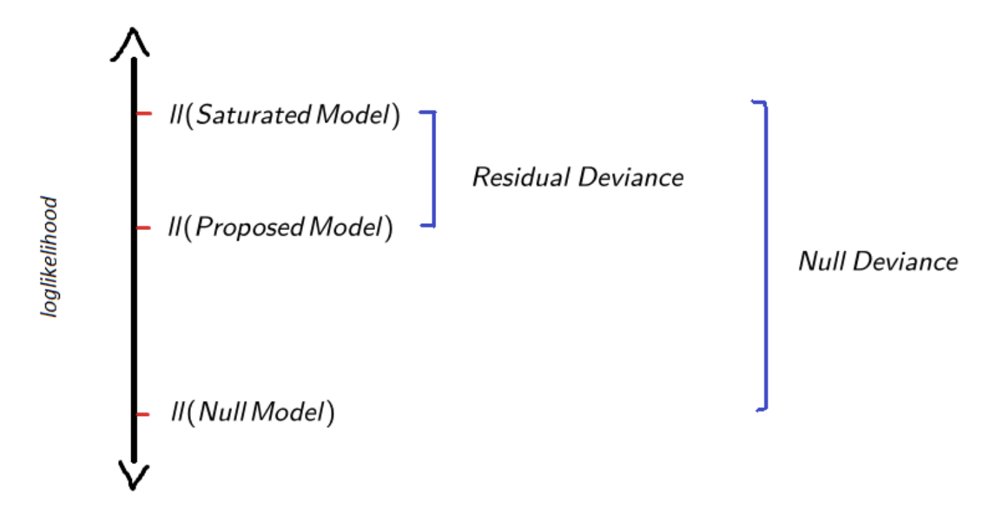

## (Estimación + Inferencia) vs Predicción

<br>
--

Mullainathan and Spiess (2017) llaman esta distinción:

<br>

.huge[
.center[
$\hat{\beta}-\text{problems} \quad$ vs $\quad \hat{y}-\text{problems}$
]
]


---
class: inverse, center, middle

## Bondad de ajuste en regresión logística (y GLM's)

---

## Ejemplo empírico

$$\newcommand{\vect}[1]{\boldsymbol{#1}}$$

```{r,  include=TRUE, echo=FALSE, warning=FALSE, message=FALSE}
# load data on extra-marital affairs from package "Ecdat"
library("Ecdat")
library("viridis")
library("tidyverse")
library("modelr")
library("cowplot")
library("margins")
library("rsample")
library("arm")
library("DescTools")
library("caret")

theme_set(theme_cowplot())

data(Fair)
affairsdata <- Fair %>% as_tibble()

# create a binary variable indicating wether persons has ever had an affair
affairsdata <- affairsdata %>% 
  mutate(everaffair = case_when(nbaffairs == 0 ~ "Never", nbaffairs > 0 ~ "At least once") ) %>%
  # map into 0/1 code
  mutate(everaffair_d = case_when(nbaffairs == 0 ~ 0, nbaffairs > 0 ~ 1))
```

Continuando con el ejemplo de clases anteriores, ajustamos el siguiente modelo:

$$\ln \frac{p_{i}}{1-p_{i}} = \beta_{0} + \beta_{1}\text{ym}_{i} + \beta_{2}\text{male}_{i} + \beta_{3}\text{rate}_{i} + \beta_{4}\text{rate}^{2}_{i}$$

Llamemos a este modelo, modelo $M_1$:

<br>

```{r,echo=FALSE}
logit_affairs <-  glm(everaffair_d ~ ym + factor(sex) + rate + I(rate^2) ,family=binomial(link="logit"), data=affairsdata)
summary(logit_affairs)$coefficients
print(paste0("log-likelihood: ",round(logLik(logit_affairs),3),
             " Deviance: ", round(summary(logit_affairs)$deviance,3) ))
print(paste0("AIC: ", round(summary(logit_affairs)$aic,3),
             " BIC: ", round(BIC(logit_affairs),3) ))
```

---
## Likelihood

Recordar que la likelihood es: $\mathcal{L}(\vect{\beta} \mid \text{ Datos}) = \mathbb{P}(\text{ Datos } \mid \vect{\beta})$.
--
 En el caso de un modelo de regresión logística los datos distribuyen Bernoulli.


- Por tanto, la probabilidad conjunta de las $n$ observaciones es:

$$\mathbb{P}(y_{1}, \dots, y_{1}) = \Pi_{i=1}^{n} p_{i}^{y_{i}}(1-p_{i})^{1-y_{i}}$$

<br>
--

- Por tanto, la .bold[likelihood function] de $p_{i}$ es:

$$\mathcal{L}(p_{i} \mid y_{1}, \dots, y_{1}) = \Pi_{i=1}^{n} p_{i}^{y_{i}}(1-p_{i})^{1-y_{i}}$$

<br>
--

- La .bold[log likelihood function] de $p_{i}$ es:


$$\ell\ell(p_{i} \mid y_{1}, \dots, y_{1}) = \sum_{i=1}^{n} \bigg( y_{i} \ln p_{i} + (1-y_{i}) \ln(1-p_{i}) \bigg)$$


donde: $p_{i} =\frac{1}{1 + e^{-(\beta_{0} + \beta_{1}x_{i} + \dots \beta_{k}x_{k}})}$


---
## Likelihood de nuestro modelo, $M_1$

```{r, include=TRUE, echo=TRUE, warning=FALSE, message=FALSE}

ll <- function(b0,b1,b2,b3,b4) {
  y = affairsdata$everaffair_d
  eta = b0  + b1*affairsdata$ym + b2*I(1*(affairsdata$sex=="male")) + b3*affairsdata$rate + b4*I((affairsdata$rate)^2)
  ell = sum( y*log(1/(1 + exp(-eta))) +  (1-y)*log(1 - (1/(1 + exp(-eta)))))
  return(ll = ell)
}
```

--
.pull-left[
```{r}
ll(b0=1.2,b1=0.7,b2=1, b3=0.3,b4=0.1)
```
]

.pull-right[
```{r}
ll(b0=0.15,b1=0.04,b2=0.25, b3=-0.41,b4=-0.01)
```
]

<br>
--

.bold[Maximum Likelihood Estimators]: los parámetros estimados son aquellos que maximizan la likelihood function. La likelihood maximizada en este caso es:

```{r}
ll_m <- logLik(logit_affairs); print(c(Likelihood=exp(ll_m[1]), log_likelihood=ll_m[1]))
```

---
## Modelo "saturado"

--

- .bold[Modelo saturado] ( $M_S$ ): es el modelo que asume que cada observación tiene sus propios parámetros, es decir, estima  $n$-parámetros.

--

  -  El modelo saturado describe perfectamente los datos: mejor "fit" posible, pero el menos "parsimonioso".

--

  - Si $\vect{\beta}_{S}$ son los estimadores MLE para este modelo, la likelihood maximizada del modelo es $\mathcal{L}_{S}: \mathcal{L}(\vect{\beta}_{S} | \vect{y})$.

--

  - $\mathcal{L}_{S}$ es mayor que la likelihood de cualquier otro modelo para los mismos datos, asumiendo misma distribución y misma función de enlace.
  
--

```{r, warning=FALSE}
# modelo saturado 
id = seq(1:length(affairsdata$everaffair_d))
logit_affairs_sex_sat <-  glm(everaffair_d ~ factor(id) , family=binomial(link="logit"), 
                              data=affairsdata)

ll_sat <- logLik(logit_affairs_sex_sat); print(c(Likelihood=exp(ll_sat[1]), log_likelihood=ll_sat[1]))
```

---
## Modelo "nulo"


- .bold[Modelo nulo] ( $M_N$ ): es el modelo en el que todas las observaciones son descritas por un único parámetro, correspondiente a la media/probabilidad incondicional. 

--

  -  El modelo nulo tiene el peor "fit" posible pero es el más "parsimonioso".

--

  - Si $\beta_{0}$ es el parámetro estimado via MLE para este modelo, la likelihood maximizada del modelo es $\mathcal{L}_{N}: \mathcal{L}(\beta_{0} | \vect{y})$.

--

  - $\mathcal{L}_{N}$ es menor que la likelihood de cualquier otro modelo para los mismos datos, asumiendo misma distribución y misma función de enlace.
  
<br>
--

```{r, warning=FALSE}
# modelo nulo 
logit_affairs_sex_null <- glm(everaffair_d ~ 1 , family=binomial(link="logit"), data=affairsdata)

ll_null <- logLik(logit_affairs_sex_null); print(c(Likelihood=exp(ll_null[1]), log_likelihood=ll_null[1]))
```

---
## Modelo nulo, modelo saturado y modelo de interés, $M_1$ 

.center[

]

---
## Test de Likelihood ratio 

--

El modelo nulo y el modelo saturado sirven como referencia para evaluar el fit de otros modelos.

--

- El .bold[likelihood ratio test] (LR) corresponde a la ratio entre la likelihood maximizada entre el modelo saturado -- $\mathcal{L}_{S}$ -- y la likelihood maximizada de un modelo dado, $\mathcal{L}_{M_1}$

<br>

$$\text{LR}: \frac{\mathcal{L}_{M_1}}{\mathcal{L}_{S}}$$

<br>
--

- A partir de $LR$ obtenemos los .bold[log-likelihood ratio] como sigue:

--
<br>

$$\log \text{LR} : \log \frac{\mathcal{L}_{M_1}}{\mathcal{L}_{S}} = \log\mathcal{L}_{M_1} - \log \mathcal{L}_{S} \leq 0$$

---
## Residual Deviance y Null Deviance

A su vez, para facilitar la inferencia, el log-likelihood ratio viene re-expresado como "Deviance".
--
 Hay dos tipos de deviance involucrados en la evaluación del fit de un modelo:

--

- .bold[Residual Deviance: ] $\quad D = -2 \cdot  \log \text{LR} = -2 \cdot (\log\mathcal{L}_{M_1} - \log \mathcal{L}_{S})$

 - Mide ajuste del modelo $M_1$

--

- .bold[Null Deviance: ] $\quad D_{N} = -2 \cdot  \log \text{LR} = 2 \cdot (\log\mathcal{L}_{0} - \log \mathcal{L}_{S})$

  - Mide cuanto es posible explicar (análogo a "varianza total"*)

<br>
--

.bold[Sampling distribution de la Residual Deviance:]

$$D \sim \chi^{2}(\hat{D},\text{df = }n-k), \quad \text{ k es el número de parámetros en modelo } M_1$$
<br>
--

- Un valor alto de $D$ (y p-value bajo) indica problemas de ajuste
 
- Un valor bajo de $D$ (y p-value alto) indica que los parámetros extra del $M_{S}$ son innecesarios.
 

---
## Residual Deviance y Null Deviance

.center[

]

---
## Residual Deviance: ejemplo empírico

```{r,echo=FALSE}
summary(logit_affairs)$coefficients
print(paste0("Null Deviance: ",round(logit_affairs$null.deviance,3),
             " Residual Deviance: ", round(summary(logit_affairs)$deviance,3) ))
```

<br>
--

.bold[Residual deviance]:
```{r}
D <- -2*(logLik(logit_affairs)[1] - logLik(logit_affairs_sex_sat)[1]); D

#pvalue
df <- length(logit_affairs$fitted.values) - logit_affairs$rank
pvalue = 1 - pchisq(D,df); pvalue
```


---
## Comparación entre modelos via Deviance

-  Supongamos que $M_1$ es un modelo dado y $M_0$ es un sub-modelo: $M_0 \subset M_1$

--

- Podemos usar la Deviance para testear si los parámetros extra en $M_1$ significativamente mejoran el fit del modelo, respecto al modelo más simple $M_0$.

<br>
--

\begin{align}
D_{01} &= \\ 
&= -2 \cdot (\log\mathcal{L}_{0} - \log \mathcal{L}_{1}) \\
&= -2 \cdot \{ (\log\mathcal{L}_{0} - \log \mathcal{L}_{S}) -   (\log\mathcal{L}_{1} - \log \mathcal{L}_{S}) \} \\
  &= D_{0} - D_{1}
\end{align}

<br>
--

.bold[Sampling distribution de la Deviance entre M0 y M1:]

$$D_{01} \sim \chi^{2}(\hat{D}_{01},\text{df = }k1-k0), \quad \text{ k1 y k0 es el número de parámetros en M1 y M0 respectivamente}$$

--

- Un valor alto de $D_{01}$ (y p-value bajo) indica que el modelo más simple tiene un ajuste significativamente más pobre que el más complejo.

---
## Comparación entre modelos via Deviance: ejemplo empírico

.pull-left[
.bold[M0]
```{r,echo=FALSE}
logit_affairs0 <-  glm(everaffair_d ~ ym + factor(sex) + rate ,family=binomial(link="logit"), data=affairsdata)
summary(logit_affairs0)$coefficients[,1:2]
print(paste0("log-likelihood: ",round(logLik(logit_affairs0),3)))
```
]
.pull-right[
.bold[M1]
```{r,echo=FALSE}
summary(logit_affairs)$coefficients[,1:2]
print(paste0("log-likelihood: ",round(logLik(logit_affairs),3)))
```
]

El modelo más complejo es "mejor" que el modelo más simple, pero ... ¿es .bold[significativamente] mejor?

--

```{r}
D01 <- logit_affairs0$deviance - logit_affairs$deviance

#pvalue
df <- logit_affairs$rank - logit_affairs0$rank
pvalue = 1 - pchisq(D01,df); pvalue
```

--

.bold[Respuesta:] el modelo más complejo no es significativamente mejor.
 
---
## Pseudo - $R^2$

<br>
--

- En modelos OLS es común medir ajuste usando el coeficiente $R^2$, es decir, % de varianza explicada por el modelo.

--

- En GLM's la varianza no es separable de la media, por tanto no se puede descomponer.

--

- Existe una variedad de alternativas al $R^2$, llamadas genéricamente pseudo - $R^2$. Uno de los más comunes es:

<br>
--

$$\text{McFadden’s } R^{2} = 1 - \frac{D}{D_{0}} = 1 - \frac{(\log\mathcal{L}_{S} - \log \mathcal{L}_{M})}{ (\log\mathcal{L}_{S} - \log \mathcal{L}_{N})}$$
<br>
--

.bold[Intuición:]  fracción del total del "explicable" del likelihood que es explicado por el modelo $M$.

  - $R^{2} \in [0,1]$, donde 0 indica el peor fit posible y 1 indica el mejor fit posible. 

---
## Pseudo - $R^2$: ejemplo empírico

```{r,echo=FALSE}
summary(logit_affairs)$coefficients
```

<br>
--

.bold[Residual deviance]:
```{r}
R2 <- 1 - logit_affairs$deviance/logit_affairs$null.deviance; R2

# versión automática
PseudoR2(logit_affairs, which="McFadden")
```

---
## Clasificación

Un modelo de regresión logística puede ser utilizado como una herramienta de *clasificación*:

--

- Nuestra variable de interés $y_{i}$ mide la ausencia o presencia de un determinado atributo. Alternativamente, se puede interpretar como la pertenencia a una determinada "clase" (0/1) 


--


- Nuestro modelo entrega una predicción sobre la probabilidad de dicha pertenencia: $p_{i} = \mathbb{P}(y_{i} = 1)$


--

- Podemos transformar nuestro modelo en un algoritmo de clasificación estableciendo un regla que asigne cada observación a una "clase" en función del valor estimado de $\hat{p}_i$.

<br>
--

Específicamente:

\begin{align}
  \hat{y}_{i} =
  \begin{cases}
    1  & \quad \text{si } \hat{p}_{i} > 1/2\\
    0  & \quad \text{si }\hat{p}_{i} < 1/2
  \end{cases}
\end{align}


---
## Clasificación y Confusion matrix

.pull-left[

]

--

.pull-right[
- .bold[Accuracy]: % Clasificación correcta, (TP+TN)/total 

- .bold[Misclassification Rate]: % Clasificación incorrecta, (FP+FN)/total

- .bold[True Positive Rate] o "Sensitivity": TP/(TP+FN) 

- .bold[False Positive Rate]: FP/(FP+TN) 

- .bold[True Negative Rate] o "Specificity": TN/(FP+TN)

- .bold[Precision]: TP/(TP+FP) 

- .bold[Prevalence]: (TP+FN)/total 
]

<br>
--

- Podemos evaluar la capacidad predictiva de un modelo usando estas métricas de clasificación

- Podemos usar estas métricas para comparar diferentes modelos

---
## Clasificación y Confusion matrix: ejemplo empírico

```{r}
p_hat <- predict(logit_affairs, type = "response")
y_hat <- if_else(p_hat>0.5,1,0)
#confussion matrix
conf_mat <- confusionMatrix(factor(y_hat),factor(logit_affairs$model$everaffair_d), dnn = c("Prediction", "True value"))
```

```{r,echo=F}
conf_mat$table
conf_mat$overall %>% round(3)
conf_mat$byClass %>% round(3)
```


---
class: inverse, center, middle

## Predicción y el problema de "overfitting" 


---
## Overfitting

.bold[Desafíos para el desarrollo de un modelo predictivo]

--

- El modelo debe predecir adecuadamente los datos (bajo sesgo)

--

- El modelo debe ser parsimonioso (pocos parámetros)

--

- Debe tener un desempeño consistente en diferentes muestras (baja varianza)

<br>
--
.bold[Problema: trade-off entre sesgo y varianza]

.center[

]


---
## Information Criteria

--


- Information Criteria fueron desarrollados con el fin de prevenir problemas de over-fitting.


--


- Information Criteria miden la capacidad predictiva de un modelo pero incluyen una .bold[penalty] por el número de parámetros.

--

- .bold[Intuición]: entre dos modelos con "similar" capacidad preferimos el más parsimonioso (menos parámetros).


--

- Ventaja sobre .bold[Deviance] y .bold[LRT]: Information Criteria pueden comparar modelos no-anidados. 

<br>
--

.pull-left[
.center[Forma general,]
]

.pull-righ[
$IC: \overbrace{-2 \log \mathcal{L}_{M_1}}^{\text{fit}} + \underbrace{k \cdot q}_{\text{parsimonia}}$

]

--

- $\mathcal{L}_{M_1}$ es la likelihood maximizada del modelo $M_1$
- $k$ es el número de parámetros del modelo $M_1$
- $q$ es una constante que "penaliza" la cantidad de parámetros

---
## Information Criteria: AIC y BIC


Dos Information Criteria son especialmente relevantes:

--


.bold[Akaike Information Criterion (AIC)]

.content-box-blue[
$$\text{AIC} =  -2\log \mathcal{L}_{M_1} + 2k$$
]

--


.bold[Bayesian Information Criterion (BIC)] 

.content-box-blue[
$$\text{BIC} =  -2\log \mathcal{L}_{M_1} +  \log(n)k$$
]

--

- Un número más bajo en AIC y BIC indica mejor ajuste

--

- Por lo general $2 < \log(n)$, por tanto BIC tiende a preferir modelos más simples comparado con AIC


---
## Information Criteria, AIC y BIC: ejemplo empírico

.pull-left[
.bold[M0]
```{r,echo=FALSE}
logit_affairs0 <-  glm(everaffair_d ~ ym + factor(child) + rate ,family=binomial(link="logit"), data=affairsdata)
summary(logit_affairs0)$coefficients[,1:2]
```
]
.pull-right[
.bold[M1]
```{r,echo=FALSE}
logit_affairs1 <-  glm(everaffair_d ~ ym*rate + I(ym^2)*rate, family=binomial(link="logit"), data=affairsdata)
summary(logit_affairs1)$coefficients[,1:2]
```
]

¿Más .bold[complejo] mejor?

--

```{r}
inf_crit <- function(m) { aic = -2*logLik(m)[1] + 2*m$rank
  bic = -2*logLik(m)[1] + log(length(m$fitted.values))*m$rank
  return(c(AIC=aic,BIC=bic))
}
```

--

.pull-left[
```{r,echo=FALSE}
inf_crit(logit_affairs0)
```
]
.pull-right[
```{r,echo=FALSE}
inf_crit(logit_affairs1)
```
]

.bold[Respuesta:] el modelo más simple es preferible. 
--
 *(nota: pueden usar funciones `AIC()` y `BIC()` en `R`)

```{css, echo=FALSE}
.pull-right ~ * { clear: unset; }
.pull-right + * { clear: both; }
``` 


---
## In-sample vs out-of-sample

<br>
--

- Information criteria penaliza la complejidad del modelo para prevenir "over-fitting".
--
 Todavía hay un problema ...

<br>
--

- Todos los estadísticos que hemos visto (incluyendo AIC y BIC) evalúan los modelos en la .bold[misma muestra] en que son estimados
  
  - No conocemos el desempeño del modelo .bold[fuera de la muestra]. Riesgo de "over-fitting".

<br>  
--

- Evaluación de un modelo fuera de muestra se conoce como .bold[cross-validación].

 - Herramienta estándar para evaluación de modelos predictivos.

---
## In-sample vs out-of-sample

<br>

.center[

]

---
## Cross-Validation

--

.img-right[]

- Principio básico de cross-validation: .bold["no double dipping!"]

--

  - estima el modelo en un dataset (training set)

--

  - evalúa el modelo en un dataset distinto (test set)

<br>

.pull-left[


]

---
## k-fold cross-Validation

.pull-left[


]

--

.pull-right[
.bold[Algoritmo:]


- (1) Divide los datos en $k$ grupos (folds) del mismo tamaño. 

  - (1.1) Reserva la $i$-fold como test set.

  - (1.2) Ajusta el modelo en las restantes $k-1$ folds (training set). 

]

<br>
--
- (2) Usa el modelo ajustado en el training set $i$ (1.2) para predecir el outcome de interés en el test set (1.1)
  
  - (2.1) Calcula una medida de error predictivo ("test error"), $E_{i}$

<br>
--
- (3) Repite (1) y (2) $k$-veces, produciendo $\{E_{1}, E_{2}, \dots , E_{k}\}$


--
- (4) Calcula el .bold[k-fold cross-validation error] promediando el error a través de las $k$-folds.:

$$\text{CV-error} =  \frac{1}{k} \sum_{i=1}^{k} E_{i}$$
---
## k-fold cross-Validation: ejemplo empírico

.pull-left[
.bold[M0]
```{r,echo=FALSE, message=FALSE, warning=FALSE}
logit_affairs0 <-  glm(everaffair_d ~ ym + factor(child) + rate ,family=binomial(link="logit"), data=affairsdata)
summary(logit_affairs0)$coefficients[,1:2]
```
]
.pull-right[
.bold[M1]
```{r,echo=FALSE, message=FALSE, warning=FALSE}
logit_affairs1 <-  glm(everaffair_d ~ ym*rate + I(ym^2)*rate, family=binomial(link="logit"), data=affairsdata)
summary(logit_affairs1)$coefficients[,1:2]
```
]

<br>

¿Más .bold[complejo] mejor?
--
 Usando funciones paquete `caret()` 
 
```{r, message=FALSE, warning=FALSE}
# especifica tipo de cross-validation
ctrl <- trainControl(method = "repeatedcv", number = 10, savePredictions = TRUE)

# cross-valida M0
cv_logit_affairs0 <- train(factor(everaffair_d) ~ ym + factor(child) + rate,  data=affairsdata, method="glm", family="binomial", trControl = ctrl)

# cross-valida M1
cv_logit_affairs1 <- train(factor(everaffair_d) ~ factor(child)*ym*rate +  factor(child)*I(ym^2)*rate,  data=affairsdata, method="glm", family="binomial", trControl = ctrl)
```

---
## k-fold cross-Validation: ejemplo empírico

.pull-left[
.bold[M0]
```{r, message=FALSE, warning=FALSE}
confusionMatrix(cv_logit_affairs0)
```
]

.pull-right[
.bold[M1]
```{r, message=FALSE, warning=FALSE}
confusionMatrix(cv_logit_affairs1)
```
]

```{css, echo=FALSE}
.pull-right ~ * { clear: unset; }
.pull-right + * { clear: both; }
``` 


---
class: inverse, center, middle


##Hasta la próxima clase. Gracias!

<br>
Mauricio Bucca <br>
https://mebucca.github.io/ <br>
github.com/mebucca


