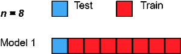

class: middle

## en capítulo anterior ...


.center[

]


---
## Overfitting

.bold[Desafíos para el desarrollo de un modelo predictivo]

--

- El modelo debe predecir adecuadamente los datos (bajo sesgo)

--

- El modelo debe ser parsimonioso (pocos parámetros)

--

- Debe tener un desempeño consistente en diferentes muestras (baja varianza)

<br>
--
.bold[Problema: trade-off entre sesgo y varianza]

.center[

]


---
## Trade-off entre sesgo y varianza

<br>
.center[

]

<br>

- Modelos muy complejos ajustan incluso el ruido idiosincrático de los datos con que fueron entrenados, lo que deteriora su desempeño en nuevos datos.

- Modelos demasiado simples ignoran patrones reales, generando errores sistemáticos tanto dentro como fuera de la muestra.

---
## Information Criteria

--


- Information Criteria fueron desarrollados con el fin de prevenir problemas de over-fitting y maximizar desempeño fuera de la muestra.


--


- Information Criteria miden la capacidad predictiva de un modelo pero incluyen una .bold[penalty] por el número de parámetros.

--

- .bold[Intuición]: entre dos modelos con "similar" capacidad preferimos el más parsimonioso (menos parámetros).


--

- Ventaja sobre .bold[Deviance] y .bold[LRT]: Information Criteria pueden comparar modelos no-anidados. 

<br>
--

.pull-left[
.center[Forma general,]
]

.pull-righ[
$IC: \overbrace{-2 \log \mathcal{L}_{M}}^{\text{fit}} + \underbrace{k \cdot q}_{\text{parsimonia}}$

]

--

- $\mathcal{L}_{M}$ es la likelihood maximizada del modelo $M$
- $k$ es el número de parámetros del modelo $M$
- $q$ es una constante que "penaliza" la cantidad de parámetros

---
## Information Criteria: AIC y BIC


Dos Information Criteria son especialmente relevantes:

--


.bold[Akaike Information Criterion (AIC)]

.content-box-blue[
$$\text{AIC} =  -2\log \mathcal{L}_{M} + 2k$$
]

--


.bold[Bayesian Information Criterion (BIC)] 

.content-box-blue[
$$\text{BIC} =  -2\log \mathcal{L}_{M} +  \log(n)k$$
]

--

- Un número más bajo en AIC y BIC indica mejor ajuste

--

- Por lo general $2 < \log(n)$, por tanto BIC tiende a preferir modelos más simples comparado con AIC


---
## Information Criteria, AIC y BIC: ejemplo empírico

.pull-left[
.bold[M0]
```{r,echo=FALSE}
logit_affairs0 <-  glm(everaffair_d ~ ym + factor(child) + rate ,family=binomial(link="logit"), data=affairsdata)
summary(logit_affairs0)$coefficients[,1:2]
```
]
.pull-right[
.bold[M1]
```{r,echo=FALSE}
logit_affairs1 <-  glm(everaffair_d ~ ym*rate + I(ym^2)*rate, family=binomial(link="logit"), data=affairsdata)
summary(logit_affairs1)$coefficients[,1:2]
```
]

¿Más .bold[complejo] mejor?

--

```{r}
inf_crit <- function(m) { aic = -2*logLik(m)[1] + 2*m$rank
  bic = -2*logLik(m)[1] + log(length(m$fitted.values))*m$rank
  return(c(AIC=aic,BIC=bic))
}
```

--

.pull-left[
```{r,echo=FALSE}
inf_crit(logit_affairs0)
```
]
.pull-right[
```{r,echo=FALSE}
inf_crit(logit_affairs1)
```
]

.bold[Respuesta:] el modelo más simple es preferible. 
--
 *(nota: pueden usar funciones `AIC()` y `BIC()` en `R`)

```{css, echo=FALSE}
.pull-right ~ * { clear: unset; }
.pull-right + * { clear: both; }
``` 


---
## In-sample vs out-of-sample

<br>
--

- Information criteria penaliza la complejidad del modelo para prevenir "over-fitting".
--
 Todavía hay un problema ...

<br>
--

- Todos los estadísticos que hemos visto (incluyendo AIC y BIC) evalúan los modelos en la .bold[misma muestra] en que son estimados
  
  - No conocemos el desempeño del modelo .bold[fuera de la muestra]. Riesgo de "over-fitting".

<br>  
--

- Evaluación de un modelo fuera de muestra se conoce como .bold[cross-validación].

 - Herramienta estándar para evaluación de modelos predictivos.

---
## In-sample vs out-of-sample

<br>

.center[

]

---
## Cross-Validation

--

.img-right[]

- Principio básico de cross-validation: .bold["no double dipping!"]

--

  - estima el modelo en un dataset (training set)

--

  - evalúa el modelo en un dataset distinto (test set)

<br>

.pull-left[


]

---
## Limitaciones del split único


<br>

- Separar los datos en un solo .bold[training set] y .bold[test set] es útil, pero tiene problemas prácticos:

--

  - Los resultados dependen del azar: distintos splits pueden producir .bold[errores muy distintos].  
  
  - En muestras pequeñas, usar parte de los datos solo para test reduce la .bold[precisión de la estimación].  
  
  - No aprovechamos toda la información disponible.

<br>
--

.bold[Idea:]  Usar *todos* los datos, pero nunca al mismo tiempo para estimar y evaluar.

- Así nace la .bold[k-fold cross-validation]: una forma más estable y eficiente de medir el error predictivo.

---
## k-fold cross-Validation

.pull-left[


]

--

.pull-right[
.bold[Algoritmo:]


- (1) Divide los datos en $k$ grupos (folds) del mismo tamaño. 

  - (1.1) Reserva la $i$-fold como test set.

  - (1.2) Ajusta el modelo en las restantes $k-1$ folds (training set). 

]

<br>
--
- (2) Usa el modelo ajustado en el training set $i$ (1.2) para predecir el outcome de interés en el test set (1.1)
  
  - (2.1) Calcula una medida de error predictivo ("test error"), $E_{i}$

<br>
--
- (3) Repite (1) y (2) $k$-veces, produciendo $\{E_{1}, E_{2}, \dots , E_{k}\}$


--
- (4) Calcula el .bold[k-fold cross-validation error] promediando el error a través de las $k$-folds.:

$$\text{CV-error} =  \frac{1}{k} \sum_{i=1}^{k} E_{i}$$

---

## k-fold Cross-Validation: ejemplo empírico

--

 - .bold[Contexto:] Queremos evaluar la capacidad predictiva donde modelos, uno más simple y otro más complejo. 
 - Usamos datos sobre infidelidad (variable binaria `everaffair_d`), con predictores `ym` (años de matrimonio), `rate` (satisfacción), y `child` (presencia de hijos).

--

.pull-left[
.bold[Modelo simple (M0)]

```{r,echo=FALSE, message=FALSE, warning=FALSE}
logit_affairs0 <- glm(everaffair_d ~ ym + factor(child) + rate, 
                      family = binomial(link="logit"), 
                      data = affairsdata)
summary(logit_affairs0)$coefficients[,1:2]
```

]

.pull-right[
.bold[Modelo complejo (M1)]

```{r,echo=FALSE, message=FALSE, warning=FALSE}
logit_affairs1 <- glm(everaffair_d ~ ym*rate + I(ym^2)*rate, 
                      family = binomial(link="logit"), 
                      data = affairsdata)
summary(logit_affairs1)$coefficients[,1:2]
```

]

<br>

¿Más .bold[complejo] = mejor predicción?


---

## k-fold Cross-Validation: ejemplo empírico

.bold[Evaluemos usando k-fold Cross-Validation]

<br>

```{r, message=FALSE, warning=FALSE}
library(caret)

# definimos control de validación cruzada (10 folds, repetida)
ctrl <- trainControl(method = "repeatedcv", number = 10, savePredictions = TRUE)

# cross-valida M0
cv_logit_affairs0 <- train(factor(everaffair_d) ~ ym + factor(child) + rate,
                           data = affairsdata, method = "glm", family = "binomial", trControl = ctrl)

# cross-valida M1
cv_logit_affairs1 <- train(factor(everaffair_d) ~ factor(child)*ym*rate +  factor(child)*I(ym^2)*rate,  
                           data = affairsdata, method = "glm", family = "binomial", trControl = ctrl)
```

---

## k-fold Cross-Validation: ejemplo empírico

<br>

--
.pull-left[
```{r, message=FALSE, warning=FALSE}
cv_logit_affairs0$resample %>% head()
```
]

.pull-right[
```{r, message=FALSE, warning=FALSE}
cv_logit_affairs1$resample %>% head()
```
]

---
## k-fold Cross-Validation: ejemplo empírico


<br>
.bold[Error promedio de cross-validation]


```{r, message=FALSE, warning=FALSE}
cv_logit_affairs1
```

---
## Desempeño promedio en términos de clasificación


```{r, message=FALSE, warning=FALSE}

affairsdata <- affairsdata %>%
  mutate(
    everaffair_d = factor(
      everaffair_d,
      levels = c(0, 1),        # or whatever your original coding is
      labels = c("no", "yes")  # valid names for caret
    )
  )

ctrl <- trainControl(method = "repeatedcv", number = 10,
                     savePredictions = TRUE,
                     classProbs = TRUE,
                     summaryFunction = twoClassSummary)

# cross-valida M0
cv_logit_affairs0 <- train(everaffair_d ~ ym + factor(child) + rate,
                           data = affairsdata, method = "glm", family = "binomial", trControl = ctrl)

# cross-valida M1
cv_logit_affairs1 <- train(everaffair_d ~ factor(child)*ym*rate +  factor(child)*I(ym^2)*rate,  
                           data = affairsdata, method = "glm", family = "binomial", trControl = ctrl)

```

---
## Desempeño promedio en términos de clasificación

.bold[Modelo M0]

```{r, message=FALSE, warning=FALSE}
confusionMatrix(cv_logit_affairs0)
cv_logit_affairs0$results
```


---
## Desempeño promedio en términos de clasificación


.bold[Modelo M1]

```{r, message=FALSE, warning=FALSE}
confusionMatrix(cv_logit_affairs1)
cv_logit_affairs1$results
```

---
class: center, middle


---
class: inverse, center, middle


##Hasta la próxima clase. Gracias!

<br>
Mauricio Bucca <br>
https://mebucca.github.io/ <br>
github.com/mebucca


