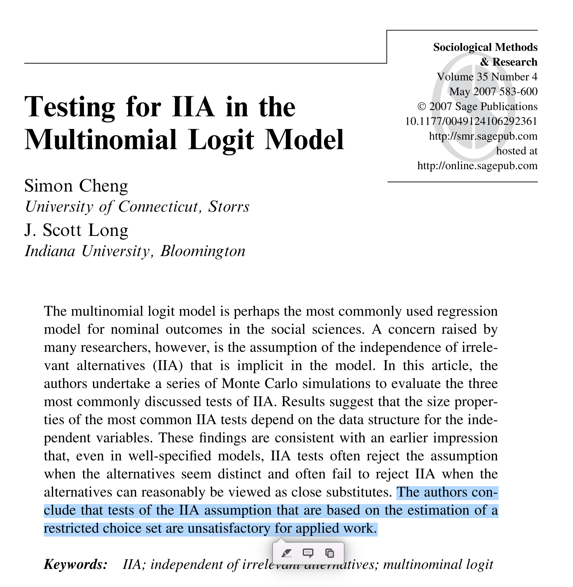

class:center, middle

## Efectos marginales sobre el logit 


---
## Un ejemplo empírico

```{r,  include=TRUE, echo=FALSE, warning=FALSE, message=FALSE}
# load data on extra-marital affairs from package "Ecdat"
library("Ecdat")
library("viridis")
library("tidyverse")
library("modelr")
library("cowplot")
library("rsample")
library("arm")
library("DescTools")
library("caret")
library("carData")
library("nnet")
library("marginaleffects")


theme_set(theme_cowplot())

data(Chile)
plebs_1988 <- Chile %>% as_tibble()

# display the data as a tibble
plebs_1988 %>% arrange(statusquo)
```

.pull-left[
Continuando con los datos del plebiscito de 1988, ajustaremos el siguiente modelo:

$$\ln \frac{p_{ij}}{p_{iJ}} = \beta_{j0} + \beta_{j1}\text{statusquo}_{i} + \beta_{j2}\text{male}_{i}$$

donde:

- $p_{iJ} =\mathbb{P}(\text{vote}_{i}=\text{A})$

- $p_{ij} =\mathbb{P}(\text{vote}_{i}=j), \quad j \in \{\text{N},\text{U},\text{Y}\}$

- $\text{logit}(p_{ij})$ es el .bold[log odds] de votar N/U/Y vs A.

- $p_{ij}$'s  son una función de apoyo al status-quo (statusquo) y género (sex)

]

--
.pull-right[
```{r}
mlogit_vote_sq_sex <- multinom(vote ~ statusquo + sex, trace=F, data=plebs_1988); 
summary(mlogit_vote_sq_sex)
```
]

---
## Efectos marginales sobre el logit

Un modelo de regresión logística multinomial consiste de $J-1$ ecuaciones:

$$\text{logit}(p_{ij}) = \ln \frac{p_{ij}}{p_{iJ}} = \beta_{j0} + \beta_{j1} x_{i1} + \dots + \beta_{jk} x_{ik}$$
--

- El intercepto $\beta_{j0}$ corresponde al log del ratio entre la probabilidad de obtener $j$ en vez de $J$ -- $\text{logit}(p_{j})$ --, cuando $x_{1} = \dots = x_{k} = 0$

--

- El efecto marginal de $x_{k}$ sobre el $\text{logit}(p_{j})$ por:


.pull-left[
.content-box-blue[
$$\frac{\partial\text{logit}(p_{ij})}{\partial x_{k}} = \beta_{jk}$$
]
]
.pull-right[
.content-box-yellow[
"Un cambio infinitesimal en $x_{k}$  ( $\partial x_{k}$ ) se traduce en un cambio en $\partial x_{k} \beta_{jk}$ unidades en el $\text{logit}(p_{j})$"
] 
]

--

.bold[Importante:] los coeficientes y sus transformaciones entregan información sobre las probabilidades .bold[relativas] de los diferentes $j$'s (con respecto a categoría de referencia).

---
## Efectos marginales sobre el logit 

En nuestro ejemplo: $\ln \frac{p_{ij}}{p_{iJ}} = \beta_{j0} + \beta_{j1}\text{statusquo}_{i} + \beta_{j2}\text{male}_{i}$

<br>

.pull-left[
```{r, echo=FALSE}
summary(mlogit_vote_sq_sex)$coefficients
```
]
.pull-right[
```{r, echo=FALSE, fig.width=6, fig.height=5, warning=FALSE, message=FALSE}
# plot the result
grid <- plebs_1988  %>% data_grid(statusquo=seq_range(statusquo,30),sex,.model=mlogit_vote_sq_sex)

predictions <- cbind(grid,predict(mlogit_vote_sq_sex, newdata=grid, type="prob")) %>%
              pivot_longer(-c(statusquo,sex), names_to="outcome",values_to="p" ) %>%
              mutate(p_outcome = paste0("p_",outcome)) %>% dplyr::select(-outcome) %>%
              pivot_wider(names_from = p_outcome, values_from=p) %>%
              mutate(across(p_N:p_Y, ~  log(.x/p_A), .names = "logit_{.col}" )) %>%
              pivot_longer(-c(statusquo,sex), names_to="quant", values_to="est")

predictions %>% filter(str_detect(quant, "^l")) %>% separate(quant,sep=8, into=c("quant","vote")) %>%
  ggplot(aes(x=statusquo, y=est, colour=vote, group=interaction(vote,sex))) +
  geom_path(aes(linetype=sex), alpha=0.5, size=1.5) +
  scale_color_viridis_d() +  scale_fill_viridis_d() +
  theme(axis.text.y = element_text(size = 22), axis.text.x = element_text(size = 22),
  axis.title.y = element_text(size = 24), axis.title.x = element_text(size = 24), 
  legend.text = element_text(size = 18), legend.position="top") +
  labs(x="Support status-quo", y="Logit(Vote=j)") 
  
```
]
s
---
## Efectos marginales sobre el logit 

.pull-left[
```{r, echo=FALSE}
summary(mlogit_vote_sq_sex)$coefficients
```

<br>
Por tanto, $\beta_{N1}$ y $\beta_{Y1}$ son=


```{r}
c(
betaN1 = (0.11 -1.76*1 + 0.7*1)-(0.11 -1.76*0 + 0.7*1),
betaY1 = (0.78 + 1.9*1 -0.11*1)-(0.78 + 1.9*0 -0.11*1)
)
```

]

.pull-right[
Si `male=1` y `statusquo=0`, entonces `logit(p_N)` y `logit(p_Y)` son=
```{r}
c(N=0.11 -1.76*0 + 0.7*1,
  Y=0.78  + 1.9*0 + -0.11*1)
```

Si `male=1` y `statusquo=1`, entonces `logit(p_N)` y `logit(p_Y)` son=
```{r}
c(N=0.11 -1.76*1 + 0.7*1,
  Y=0.78  + 1.9*1 + -0.11*1)
```
]

---
class:center, middle

## Efectos multiplicativos sobre las odds 


---
## Efectos multiplicativos sobre las odds 

Dado el siguiente modelo de regresión logística multinomial: 


$$\text{logit}(p_{ij}) = \ln \frac{p_{ij}}{p_{iJ}} = \beta_{j0} + \beta_{j1} x_{i1} + \dots + \beta_{jk} x_{ik}$$

<br>
--

exponenciando a ambos lados obtenemos 

$$\frac{p_{ij}}{p_{iJ}} = e^{\beta_{j0} + \beta_{j1} x_{i1} + \dots + \beta_{jk} x_{ik}}$$

--

equivalentemente

.content-box-blue[
$$\frac{p_{ij}}{p_{iJ}} =  e^{\beta_{j0}} \cdot e^{\beta_{j1} x_{i1}}  \dots e^{\beta_{jk} x_{ik}}$$
]

---
## Efectos multiplicativos sobre las odds: odds ratios

Considera la situación en que $i$ y $i^{´}$ son dos observaciones con $x_{k}=c$ y $x_{k}=c+1$, respectivamente. El resto de las covariables toman valores idénticos. 
--
 Las odds de observar $j$ en vez de $J$ son:


- $p_{ij}/(p_{iJ}) = e^{\beta_{j0}} \cdot e^{\beta_{j1} x_{i1}}  \dots (e^{\beta_{jk}})^{c}$

- $p_{i^{´}j}/(p_{i^{´}J}) = e^{\beta_{j0}} \cdot e^{\beta_{j1} x_{i^{´}1}}  \dots (e^{\beta_{jk}})^{c+1}$


<br>
--

El ratio de las odd de éxito entre $i^{´}$ e $i$ está dado por:

\begin{align}
\frac{p_{i^{´}j}/p_{i^{´}J}}{p_{ij}/p_{iJ}} &= \frac{e^{\beta_{j0}} \cdot e^{\beta_{j1} x_{i^{´}1}}  \dots (e^{\beta_{jk}})^{c+1}}{e^{\beta_{j0}} \cdot e^{\beta_{j1} x_{i1}}  \dots (e^{\beta_{jk}})^{c}} = e^{\beta_{jk}}
\end{align}

<br>
En otras palabras, manteniendo otros factores constantes, $e^{\beta_{jk}}$ representa la odds ratio de $j$ vs $J$ entre el caso con $x_{k}$ aumentado en una unidad, y el caso con $x_{k}$ en un nivel basal dado. 

---
## Efectos multiplicativos sobre las odds 


.content-box-yellow[
"Un cambio en $\Delta$ unidades de $x_{k}$ multiplica el ratio entre las probabilidad de obtener $j$ vs $J$ por $e^{\Delta \beta_{jk}}$"
] 

<br>
.bold[Propiedades]:

--

- $e^{\beta_{jk}}$ está restringido al rango $[0,\infty+)$. Es una constante que "comprime" o amplifica el ratio entre las probabilidades de $j$ vs $J$

--

- Si $\beta_{jk} < 0  \to  (0 < e^{\beta_{jk}} < 1)$. Es decir, un aumento en $x_{k}$ está asociado con una reducción (multiplicativa) del ratio entre las probabilidades de  $j$ vs $J$

--

- Si $\beta_{jk} = 0  \to  (e^{\beta_{jk}} =1)$. Es decir, un cambio en $x_{k}$ está asociado a un cambio nulo en el ratio entre las probabilidades de  $j$ vs $J$

--

- Si $\beta_{jk} > 0  \to  (e^{\beta_{jk}} > 1)$. Es decir, un aumento en $x_{k}$ está asociado a aumento (multiplicativo) en el ratio entre las probabilidades de  $j$ vs $J$


---
## Efectos multiplicativos sobre las odds 

En nuestro ejemplo: $\ln \frac{p_{ij}}{p_{iJ}} = \beta_{j0} + \beta_{j1}\text{statusquo}_{i} + \beta_{j2}\text{male}_{i}$, por tanto:
  
  
.pull-left[
  $\frac{p_{ij}}{p_{iJ}} = e^{\beta_{j0}} \cdot  e^{\beta_{j1}\text{statusquo}_{i}} \cdot e^{ \beta_{j2}\text{male}_{i} }$
      
```{r}
# coeffs
summary(mlogit_vote_sq_sex)$coefficients
    
# exp(coeffs)
exp(summary(mlogit_vote_sq_sex)$coefficients)
```
    
]

--
  
.pull-right[
  ```{r, echo=FALSE, fig.height=6}
  
grid <- plebs_1988  %>% data_grid(statusquo=seq_range(statusquo,30),sex,.model=mlogit_vote_sq_sex)

predictions <- cbind(grid,predict(mlogit_vote_sq_sex, newdata=grid, type="prob")) %>%
              pivot_longer(-c(statusquo,sex), names_to="outcome",values_to="p" ) %>%
              mutate(p_outcome = paste0("p_",outcome)) %>% dplyr::select(-outcome) %>%
              pivot_wider(names_from = p_outcome, values_from=p) %>%
              mutate(across(p_N:p_Y, ~  log(.x/p_A), .names = "logit_{.col}" )) %>%
              mutate(across(logit_p_N:logit_p_Y, ~  exp(.x), .names = "or_{.col}" )) %>%
              pivot_longer(-c(statusquo,sex), names_to="quant", values_to="est")

predictions %>% filter(str_detect(quant, "^or")) %>% separate(quant,sep=11, into=c("quant","vote")) %>%
  ggplot(aes(x=statusquo, y=est, colour=vote, group=interaction(vote,sex))) +
  geom_path(aes(linetype=sex), alpha=0.5, size=1.5) +
  scale_color_viridis_d() +  scale_fill_viridis_d() +
  theme(axis.text.y = element_text(size = 22), axis.text.x = element_text(size = 22),
  axis.title.y = element_text(size = 24), axis.title.x = element_text(size = 24), 
  legend.text = element_text(size = 18), legend.position="top") +
  labs(x="Support status-quo", y="Odds vote=j vs vote=A") 
    
  ```
]

---
## Efectos multiplicativos sobre las odds

.pull-left[
```{r, echo=FALSE}
cbind(beta1=summary(mlogit_vote_sq_sex)$coefficients[,"statusquo"],exp.beta1=exp(summary(mlogit_vote_sq_sex)$coefficients[,"statusquo"]))
```
]

.pull-right[
Si `male=1` y `statusquo=0`, entonces las odds de N e Y son=
```{r}
c(N=exp(0.11 -1.76*0 + 0.7*1),
  Y=exp(0.78  + 1.9*0 + -0.11*1) )
```

Si `male=1` y `statusquo=1`,  entonces las odds de N e Y son=
```{r}
c(N=exp(0.11 -1.76*1 + 0.7*1),
  Y=exp(0.78  + 1.9*1 + -0.11*1))
```
]


---
## Efectos multiplicativos sobre las odds

.pull-left[
```{r, echo=FALSE}
cbind(beta1=summary(mlogit_vote_sq_sex)$coefficients[,"statusquo"],exp.beta1=exp(summary(mlogit_vote_sq_sex)$coefficients[,"statusquo"]))
```


<br>
Por tanto, $e^{\beta_{N1}}$ y $e^{\beta_{Y1}}$ son=


```{r}
c(
betaN1 = exp(0.11 -1.76*1 + 0.7*1)/exp(0.11 -1.76*0 + 0.7*1),
betaY1 = exp(0.78 + 1.9*1 -0.11*1)/exp(0.78 + 1.9*0 -0.11*1)
)
```
]

.pull-right[
Si `male=1` y `statusquo=0`, entonces las odds de N e Y son=
```{r}
c(N=exp(0.11 -1.76*0 + 0.7*1),
  Y=exp(0.78  + 1.9*0 + -0.11*1) )
```

Si `male=1` y `statusquo=1`,  entonces las odds de N e Y son=
```{r}
c(N=exp(0.11 -1.76*1 + 0.7*1),
  Y=exp(0.78  + 1.9*1 + -0.11*1))
```
]


---
class:center, middle

## Efectos marginales sobre la probabilidad de la categoría $j$


---
## Efectos marginales sobre la probabilidad de la categoría $j$

--

Dado el siguiente modelo de regresión logística multinomial: 


$$\text{logit}(p_{ij}) = \ln \frac{p_{ij}}{p_{iJ}} = \beta_{j0} + \beta_{j1} x_{i1} + \dots + \beta_{jk} x_{ik}$$
<br>
--
Queremos saber el .bold[efecto marginal] de los predictores sobre la .bold[probabilidad] de observar cada categoría $j: \{1, \dots, J\}$. Formalmente

<br>
--

$$\frac{\partial p_{ij}}{\partial x_{k}}$$
--

$$\vdots$$

---
## Efectos marginales sobre la probabilidad de la categoría $j$

Después de varios pasos, obtenemos:

<br>
.content-box-yellow[
$$\frac{\partial p_{ij}}{\partial x_{k}} = p_{ij} \cdot \bigg(\beta_{jk} - \sum^{J-1}_{j=1}p_{ij} \cdot \beta_{jk}\bigg)$$
]

<br>
donde

$$p_{ij} =\frac{e^{\beta_{j0} + \beta_{j1}x_{1i} + \dots + \beta_{jk}x_{ki}}}{1 + \sum^{J-1}_{j=1}  e^{\beta_{j0} + \beta_{j1}x_{1i} + \dots + \beta_{jk}x_{ki}}}$$
---
## Efectos marginales sobre la probabilidad de la categoría $j$


.pull-left[
Analizando $$\frac{\partial p_{ij}}{\partial x_{k}} = p_{ij} \cdot \bigg(\beta_{jk} - \sum^{J-1}_{j=1}p_{ij} \cdot \beta_{jk}\bigg)$$
]

--

.pull-right[
podemos notar que  $\sum^{J-1}_{j=1}p_{ij} \cdot \beta_{jk} \equiv \overline{\beta_{jk}}, \quad$ el "efecto promedio de" $x_k$. Se desprende que:
]

<br>
--

- El signo del efecto marginal de los predictores .bold[no necesariamente] corresponde al signo del parámetro estimado en la regresión. 
--

  - $\frac{\partial p_{ij}}{\partial x_{k}} > 0 \quad$  si  $\quad \beta_{jk} > \sum^{J-1}_{j=1}p_{j} \cdot \beta_{jk}$
  
  - $\frac{\partial p_{ij}}{\partial x_{k}} = 0 \quad$  si  $\quad \beta_{jk} = \sum^{J-1}_{j=1}p_{j} \cdot \beta_{jk}$

  - $\frac{\partial p_{ij}}{\partial x_{k}} < 0 \quad$  si  $\quad \beta_{jk} < \sum^{J-1}_{j=1}p_{j} \cdot \beta_{jk}$

<br>
--
.bold[Nota]: No tiene mucho sentido testear si efectos marginales son distintos de cero.


---
## Efectos marginales sobre la probabilidad de la categoría $j$

.pull-left[
si $$\frac{\partial p_{ij}}{\partial x_{k}} = p_{j} \cdot \bigg(\beta_{jk} - \sum^{J-1}_{j=1}p_{j} \cdot \beta_{jk}\bigg)$$
]

--

.pull-right[
y $$p_{ij} =\frac{e^{\beta_{j0} + \beta_{j1}x_{1i} + \dots + \beta_{jk}x_{ki}}}{1 + \sum^{J-1}_{j=1}  e^{\beta_{j0} + \beta_{j1}x_{1i} + \dots + \beta_{jk}x_{ki}}}$$ 
]


<br>
--

- Es claro que el efecto marginal de $x_{k}$ varía dependiendo del valor de $x_{k}$, de su coeficiente $\beta_{jk}$, y de todas las otras covariables con sus respectivos coeficientes.

---
## Efectos marginales sobre la probabilidad de la categoría $j$

En nuestro ejemplo: $\ln \frac{p_{ij}}{p_{iJ}} = \beta_{j0} + \beta_{j1}\text{statusquo}_{i} + \beta_{j2}\text{male}_{i}$, por tanto:
  
  
.pull-left[
  $$p_{ij} =\frac{e^{\beta_{j0} + \beta_{j1}\text{statusquo}_{i} + \beta_{j2}\text{male}_{i}}}{1 + \sum^{J-1}_{j=1} e^{\beta_{j0} + \beta_{j1}\text{statusquo}_{i} + \beta_{j2}\text{male}_{i}}}$$
      
<br>      
```{r}
summary(mlogit_vote_sq_sex)$coefficients
```
    
]


--
  
.pull-right[
```{r, echo=FALSE, fig.height=6}
grid <- plebs_1988  %>% data_grid(statusquo=seq_range(statusquo,30),sex,.model=mlogit_vote_sq_sex)


predictions <- cbind(grid,predict(mlogit_vote_sq_sex, newdata=grid, type="prob")) %>%
              pivot_longer(-c(statusquo,sex), names_to="outcome",values_to="p" ) %>%
              mutate(p_outcome = paste0("p_",outcome)) %>% dplyr::select(-outcome) %>%
              pivot_wider(names_from = p_outcome, values_from=p) %>%
              mutate(across(p_N:p_Y, ~  log(.x/p_A), .names = "logit_{.col}" )) %>%
              mutate(across(logit_p_N:logit_p_Y, ~  exp(.x), .names = "or_{.col}" )) %>%
              pivot_longer(-c(statusquo,sex), names_to="quant", values_to="est")

predictions %>% filter(str_detect(quant, "^p")) %>% separate(quant,sep="_", into=c("quant","vote")) %>%
  ggplot(aes(x=statusquo, y=est, colour=vote, group=interaction(vote,sex))) +
  geom_path(aes(linetype=sex), alpha=0.5, size=1.5) +
  scale_color_viridis_d() +  scale_fill_viridis_d() +
  theme(axis.text.y = element_text(size = 22), axis.text.x = element_text(size = 22),
  axis.title.y = element_text(size = 24), axis.title.x = element_text(size = 24), 
  legend.text = element_text(size = 18), legend.position="top") +
  labs(x="Support status-quo", y="P(vote=j)") 
```
]

---
## Efectos marginales sobre la probabilidad de la categoría $j$


.pull-left[
$$p_{ij} =\frac{e^{\beta_{j0} + \beta_{j1}\text{statusquo}_{i} + \beta_{j2}\text{male}_{i}}}{1 + \sum^{J-1}_{j=1} e^{\beta_{j0} + \beta_{j1}\text{statusquo}_{i} + \beta_{j2}\text{male}_{i}}}$$

```{r, echo=FALSE, fig.width=6, fig.height=5}
predictions %>% filter(str_detect(quant, "^p")) %>% separate(quant,sep="_", into=c("quant","vote")) %>%
  ggplot(aes(x=statusquo, y=est, colour=vote, group=interaction(vote,sex))) +
  geom_path(aes(linetype=sex), alpha=0.5, size=1.5) +
  scale_color_viridis_d() +  scale_fill_viridis_d() +
  theme(axis.text.y = element_text(size = 22), axis.text.x = element_text(size = 22),
  axis.title.y = element_text(size = 24), axis.title.x = element_text(size = 24), 
  legend.text = element_text(size = 18), legend.position="top") +
  labs(x="Support status-quo", y="P(vote=j)") 
```
]

.pull-right[
$$\frac{\partial p_{ij}}{\partial x_{k}} = p_{j} \cdot \bigg(\beta_{jk} - \sum^{J-1}_{j=1}p_{j} \cdot \beta_{jk}\bigg)$$

```{r, echo=FALSE, fig.width=6, fig.height=5, warning=F}

predictions <- predictions %>% filter(str_detect(quant, "^p")) %>% separate(quant,sep="_", into=c("quant","vote")) 
 
coefs <- summary(mlogit_vote_sq_sex)$coefficients %>% as_tibble() %>% mutate(vote = c("N","U","Y")) %>%
  rename(beta_0 = `(Intercept)`, beta_sq = statusquo, beta_sex = sexM)

 predictions %>% left_join(coefs, by="vote") %>% 
  replace_na(list(beta_0 = 0, beta_sq = 0, beta_sex = 0)) %>%
  mutate(beta_sq_prob = beta_sq*est) %>% group_by(statusquo,sex) %>%
  mutate(average_beta_sq = sum(beta_sq_prob, na.rm = T)) %>%
  ungroup() %>% mutate(me_sq = est*(beta_sq -average_beta_sq)) %>%
  ggplot(aes(x=statusquo, y=me_sq, colour=vote, group=interaction(vote,sex))) +
  geom_path(aes(linetype=sex), alpha=0.5, size=1.5) +
  scale_color_viridis_d() +  scale_fill_viridis_d() +
  theme(axis.text.y = element_text(size = 22), axis.text.x = element_text(size = 22),
  axis.title.y = element_text(size = 24), axis.title.x = element_text(size = 24), 
  legend.text = element_text(size = 18), legend.position="top") +
  labs(x="Support status-quo", y="Efecto marginal de status quo") +
  geom_hline(yintercept = 0, size=1.5)
```
]

---
## Efectos marginales sobre la probabilidad de la categoría $j$

- Efectos marginales son _esencialmente_ heterogéneos. No hay un efecto sino muchos. 

--

- Heterogeneidad crece con la complejidad del modelo: número de predictores, interacciones, etc. 

--

- Más aún, en el caso de modelos de regresión logística multinomial, los efectos marginales no son necesariamente monotónicos (pueden cambiar de signo).

--

- En la práctica, muchas veces queremos UN número que resuma el efecto marginal. 

<br>
--
.pull-left[

]

--

Cantidades de interes:
.pull-right[

* Average Marginal Effects (AME)

* Marginal Effects at the Mean (MEM)

* Marginal Effects at Representative Values (MER)

]

---
## Efectos marginales sobre la probabilidad de la categoría $j$: MEM

--

Usando el paquete `marginaleffects`:


```{r}
grid <- plebs_1988 %>% data_grid(sex, .model=mlogit_vote_sq_sex)
avg_slopes(mlogit_vote_sq_sex, variables="statusquo", newdata=grid)

```


---
class: inverse, center, middle

## Independence of Irrelevant Alternatives (IIA)


---
## Independence of Irrelevant Alternatives (IIA)

--

- Cuando regresión logística Multinomial es utilizada para modelar decisiones (choice), el modelo descansa en el supuesto implícito de IIA

--

- IIA: las odds (probabilidades relativas) de seleccionar cualquiera de las $J$ alternativas no son afectadas por la existencia de alternativas irrelavantes.

<br>
--
.bold[Ejemplo] (McFadden’s 1974):

-  Una persona puede viajar al trabajo en: $\{\text{auto}, \text{ bus rojo}\}$
-  $\mathbb{P}(\text{auto}) =  \mathbb{P}(\text{ bus rojo}) = 1/2$. Odds=1.

--

- Supongamos se amplía el conjunto de alternativas: $\{\text{auto}, \text{ bus rojo},  \text{ bus azul}\}$

--

- Dado que los buses sólo difieren en color, esperaríamos que $\mathbb{P}(\text{ bus rojo}) = \mathbb{P}(\text{bus azul})$

- Único modo de retener Odds entre auto y bus rojo es si: $\mathbb{P}(\text{auto}) =  \mathbb{P}(\text{ bus rojo}) = \mathbb{P}(\text{bus azul}) = 1/3$

--

- Sería más realista esperar que $\mathbb{P}(\text{auto}) = 1/2)$ y $\quad \mathbb{P}(\text{ bus rojo}) = \mathbb{P}(\text{bus azul}) = 1/4$

 - Sin embargo, violaría IIA porque las odds entre auto y bus rojo serían (1/2)/(1/4)=2.

---
## Independence of Irrelevante Alternatives (IIA)

Existe una variedad de tests para el supuesto de IIA, pero ninguno ha mostrado ser concluyente:

.center[

]


---
class: inverse, center, middle


##Hasta la próxima clase. Gracias!


<br>
Mauricio Bucca <br>
https://mebucca.github.io/ <br>
github.com/mebucca


