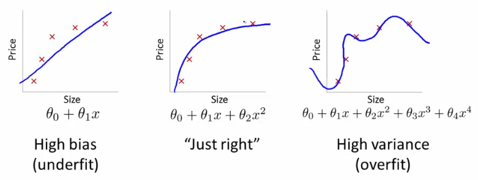
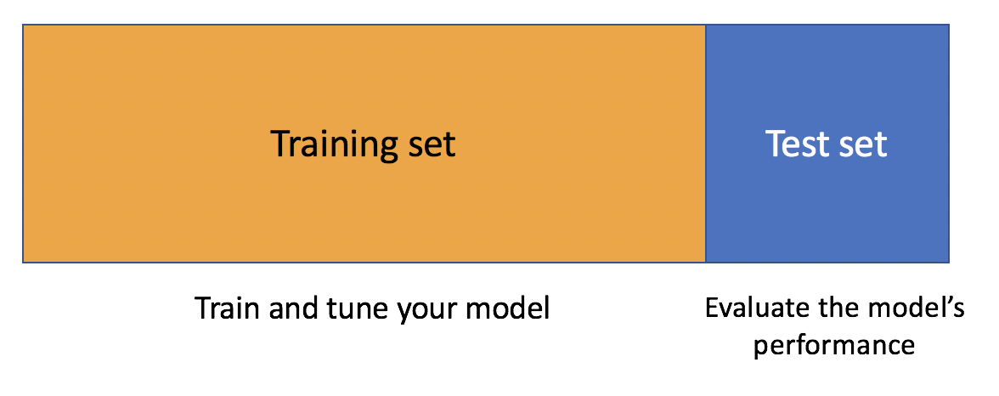

```{r course-style, include=FALSE}
library(pacman)
p_load(tidyverse, rsample)

# Encuentra `_shared/bikeshare.R` sin depender del working directory.
source(local({
  d <- normalizePath(getwd(), mustWork = FALSE)
  cands <- d
  while (!identical(dirname(d), d)) { d <- dirname(d); cands <- c(cands, d) }
  cands <- c(cands, Sys.glob(file.path(getwd(), c("*", "*/*", "*/*/*"))))
  hits <- file.path(cands, "_shared", "bikeshare.R")
  hits <- hits[file.exists(hits)]
  if (!length(hits)) stop("No se encontró _shared/bikeshare.R desde ", getwd())
  normalizePath(hits[[1]])
}))
course <- use_course_data("celtic")
course_palette <- course$palette
bikedata <- course$data

rmse <- function(truth, estimate) {
  sqrt(mean((truth - estimate)^2))
}
```

## Antes · Hoy · Después {.class-rhythm}

::: {.full-width}

::: {.content-box}
**Antes**

asociación y causalidad.
:::

::: {.content-box-primary}
**Hoy**

generalización, overfitting y validación cruzada.
:::

::: {.content-box-secondary}
**Después**

clasificador logístico: métricas y umbrales.
:::

:::

# Predecir es generalizar {.inverse .center .middle}

## Dos preguntas, dos criterios de éxito

::: {.pull-left}

**Problemas de $\hat{\beta}$**

- ¿Cómo se relaciona $X$ con $Y$?
- ¿Qué parámetro resume esa relación?
- ¿Qué incertidumbre tiene la estimación?
- ¿Es defendible una interpretación causal?

El foco está en **explicación e inferencia**.

:::

::: {.pull-right}

**Problemas de $\hat{y}$**

- ¿Qué valor tendrá $Y$ para un caso nuevo?
- ¿Cuánto nos equivocaremos?
- ¿Qué especificación predice mejor?
- ¿El desempeño se mantiene en otros datos?

El foco está en **generalización**.

:::

::: {.footnote}
Distinción inspirada en Mullainathan y Spiess (2017).
:::

## El examen ocurre en datos nuevos

Un modelo recibe predictores $X$ y construye una regla:

$$
\widehat{f}:X\longrightarrow \widehat{Y}.
$$

El objetivo predictivo no es reproducir los datos que ya vimos, sino minimizar el error esperado en una nueva observación:

$$
\mathbb{E}\left[L\{Y_{\text{nuevo}},\widehat f(X_{\text{nuevo}})\}\right].
$$

. . .

La función de pérdida $L$ depende de la tarea: error cuadrático, error absoluto, log-loss, error de clasificación, etc.

## Nuestro problema de hoy

Usaremos `bikers` como outcome:

> ¿Cuántos arriendos habrá en una hora que el modelo no usó para aprender?

Los predictores disponibles describen clima, calendario y hora del día.

. . .

No necesitamos comprometernos con una familia de modelos: la lógica de evaluación es la misma para una regresión, un árbol, una red neuronal o cualquier otra regla de predicción.

## Ajustar y evaluar son operaciones distintas

::: {.pull-left}

**Ajustar**

Usar datos para aprender:

$$
\text{datos de entrenamiento}
\longrightarrow \widehat f
$$

:::

::: {.pull-right}

**Evaluar**

Aplicar la regla sin reestimarla:

$$
\widehat f(X_{\text{nuevo}})
\longrightarrow \text{pérdida}
$$

:::

. . .

Si ajustamos y evaluamos con los mismos casos, el modelo ya conoce las respuestas del examen.

# Overfitting {.inverse .center .middle}

## Buen ajuste no implica buena predicción

Un modelo flexible puede capturar:

- patrones estables que volverán a aparecer;
- ruido idiosincrático de la muestra de entrenamiento.

. . .

El segundo componente reduce el error de entrenamiento, pero deteriora la predicción en casos nuevos. Eso es **overfitting** o sobreajuste.

## Tres regímenes de complejidad

::: {.center}

{width="78%"}

:::

- **Subajuste:** la regla es demasiado rígida y omite señal.
- **Buen balance:** captura patrones reproducibles.
- **Sobreajuste:** persigue fluctuaciones que no se repiten.

## Sesgo y varianza describen errores distintos

::: {.pull-left}

**Sesgo alto**

El modelo aprende una regla sistemáticamente equivocada.

- poca flexibilidad;
- errores parecidos en distintas muestras;
- riesgo de subajuste.

:::

::: {.pull-right}

**Varianza alta**

Pequeños cambios en la muestra producen reglas muy diferentes.

- mucha flexibilidad;
- predicciones inestables;
- riesgo de sobreajuste.

:::

. . .

Reducir uno suele aumentar el otro: ese es el **trade-off sesgo–varianza**.

## La descomposición del error

En predicción con pérdida cuadrática:

$$
\underbrace{\mathbb{E}\left[(Y-\widehat f(X))^2\right]}_{\text{error esperado}}
=
\underbrace{\text{Sesgo}^2}_{\text{rigidez}}
+
\underbrace{\text{Varianza}}_{\text{inestabilidad}}
+
\underbrace{\sigma^2}_{\text{ruido irreducible}}.
$$

. . .

La complejidad óptima no elimina todo error. Busca el punto donde agregar flexibilidad deja de recuperar señal y empieza a perseguir ruido.

## El error de entrenamiento siempre sonríe

```{r complexity-demo, echo=FALSE, fig.height=4.5}
set.seed(3070)
demo_id <- sample(seq_len(nrow(bikedata)), 600)
demo_train <- bikedata[demo_id[1:300], ]
demo_test <- bikedata[demo_id[301:600], ]

complexity_results <- map_dfr(1:16, function(degree) {
  model <- lm(bikers ~ poly(temp, degree, raw = TRUE), data = demo_train)
  tibble(
    complejidad = degree,
    Entrenamiento = rmse(
      demo_train$bikers,
      predict(model, newdata = demo_train)
    ),
    Evaluación = rmse(
      demo_test$bikers,
      predict(model, newdata = demo_test)
    )
  )
}) %>%
  pivot_longer(
    c(Entrenamiento, Evaluación),
    names_to = "muestra",
    values_to = "RMSE"
  )

ggplot(complexity_results, aes(complejidad, RMSE, color = muestra)) +
  geom_line(linewidth = 1.2) +
  geom_point(size = 2.5) +
  scale_color_course(name = NULL) +
  labs(x = "Flexibilidad de la regla", y = "RMSE")
```

En esta demostración con `bikers`, el error de entrenamiento cae al aumentar flexibilidad; el error en datos separados puede subir.

## El error relevante es fuera de muestra

- **Error de entrenamiento:** mide qué tan bien la regla reproduce los casos usados para ajustarla.
- **Error de generalización:** mide qué tan bien predice casos generados por el mismo proceso, pero no usados para aprender.

. . .

El overfitting es la brecha:

$$
\text{error fuera de muestra}
-
\text{error de entrenamiento}.
$$

No podemos diagnosticarla mirando solo el ajuste in-sample.

# Separar para aprender {.inverse .center .middle}

## La regla básica: no usar dos veces la respuesta

::: {.center}

{width="72%"}

:::

1. Ajustamos el modelo en el **training set**.
2. Congelamos la regla aprendida.
3. Predecimos el **test set**.
4. Comparamos predicción y resultado con una pérdida.

## Un único split es frágil

Separar una vez training y test evita el doble uso, pero:

- el resultado depende de qué casos quedaron en cada lado;
- una partición difícil puede hacer parecer malo a un buen modelo;
- una partición fácil puede producir optimismo;
- en muestras pequeñas reservamos demasiada información solo para evaluar.

. . .

Queremos repetir el examen con distintas particiones sin evaluar sobre casos usados para entrenar.

# Validación cruzada {.inverse .center .middle}

## Cada observación rinde examen una vez

::: {.center}

{width="70%"}

:::

En $k$-fold cross-validation, dividimos los datos en $k$ grupos. Cada fold actúa una vez como evaluación y $k-1$ veces como parte del entrenamiento.

## El algoritmo es una envoltura genérica

Para $j=1,\ldots,k$:

1. reserve el fold $j$;
2. ajuste la regla con los otros $k-1$ folds;
3. prediga los casos del fold reservado;
4. calcule la pérdida $E_j$.

. . .

Luego promediamos:

$$
\widehat E_{\text{CV}}=\frac{1}{k}\sum_{j=1}^{k}E_j.
$$

El interior de “ajuste la regla” puede ser cualquier algoritmo predictivo.

## El resultado es una distribución, no solo un promedio

Los $k$ errores $\{E_1,\ldots,E_k\}$ permiten estudiar:

- desempeño promedio;
- dispersión entre folds;
- folds especialmente difíciles;
- sensibilidad de la conclusión a la partición.

. . .

Dos modelos con el mismo error promedio pueden diferir mucho en estabilidad.

## ¿Cuántos folds?

::: {.pull-left}

**$k$ pequeño**

- entrenamientos más pequeños;
- menor costo computacional;
- estimación más sesgada del desempeño final.

:::

::: {.pull-right}

**$k$ grande**

- entrenamientos parecidos al dataset completo;
- mayor costo;
- errores entre folds más correlacionados.

:::

. . .

$k=5$ o $k=10$ suele ofrecer un balance razonable.

## LOOCV es el caso extremo

Si $k=n$, cada fold contiene una sola observación:

$$
\text{LOOCV}=\text{Leave-One-Out Cross-Validation}.
$$

- Entrena $n$ veces con $n-1$ casos.
- Usa casi todos los datos en cada ajuste.
- Puede ser costoso y producir una estimación de error con alta varianza.

. . .

Usar más folds no garantiza una mejor decisión.

# Cross-validation con `bikers` {.inverse .center .middle}

## La partición debe parecerse al uso futuro

Los datos contienen 24 horas dentro de cada día. Si repartimos horas al azar, el training set puede contener otras horas del mismo día que estamos evaluando.

. . .

Para predecir demanda en **días nuevos**, dejamos días completos fuera:

```{r make-folds, echo=TRUE}
set.seed(3070)
folds <- group_vfold_cv(
  bikedata,
  group = day,
  v = 10
)

folds %>%
  select(id) %>%
  slice_head(n = 3)
```

Mostramos tres de los diez folds. La unidad de partición es parte del estimando predictivo.

## Dos reglas candidatas

Para hacer visible el procedimiento, usamos dos reglas reproducibles:

```{r candidate-formulas, echo=TRUE}
simple_formula <- bikers ~
  temp + hum + workingday + factor(hr)

flexible_formula <- bikers ~
  poly(temp, 5, raw = TRUE) +
  poly(hum, 5, raw = TRUE) +
  factor(mnth) +
  factor(hr) * workingday +
  factor(weekday) +
  windspeed
```

El objetivo no es enseñar estas especificaciones. Son dos objetos `fit/predict` que la misma validación cruzada puede comparar.

## Una función evalúa cualquier fórmula

```{r cv-function, echo=TRUE}
evaluate_fold <- function(split, formula) {
  train_data <- analysis(split)
  test_data <- assessment(split)
  fit <- lm(formula, data = train_data)

  tibble(
    RMSE_train = rmse(
      train_data$bikers, predict(fit, train_data)
    ),
    RMSE_test = rmse(
      test_data$bikers, predict(fit, test_data)
    )
  )
}
```

Cada ajuste conoce solo el training set de su fold.

## Repetimos el examen diez veces

```{r run-cv, echo=TRUE, results='hide'}
candidate_models <- list(
  Simple = simple_formula,
  Flexible = flexible_formula
)

cv_results <- imap_dfr(
  candidate_models,
  function(formula, model_name) {
    map_dfr(folds$splits, evaluate_fold, formula) %>%
      mutate(modelo = model_name, .before = 1)
  }
)
```

El resultado contiene veinte evaluaciones: diez por regla. `RMSE_test` se calcula siempre fuera de muestra.

## El promedio importa; la variación también

```{r cv-plot, echo=FALSE, fig.height=4.5}
ggplot(cv_results, aes(modelo, RMSE_test, color = modelo)) +
  geom_boxplot(width = 0.45, outlier.shape = NA, alpha = 0.15) +
  geom_jitter(width = 0.08, size = 3) +
  stat_summary(
    fun = mean, geom = "point", shape = 21, size = 4.5,
    fill = "white", color = "black"
  ) +
  scale_color_course(guide = "none") +
  labs(x = NULL, y = "RMSE en días reservados")
```

Cada punto es un fold; el punto blanco es el promedio.

## Resumimos desempeño y estabilidad

```{r cv-summary, echo=FALSE}
cv_summary <- cv_results %>%
  group_by(modelo) %>%
  summarise(
    RMSE_promedio = mean(RMSE_test),
    SD_entre_folds = sd(RMSE_test),
    brecha_generalización = mean(RMSE_test - RMSE_train),
    .groups = "drop"
  )

cv_summary
```

En este ejercicio, la regla flexible predice mejor días nuevos. La brecha y la dispersión recuerdan que un único número no resume toda la incertidumbre predictiva.

## Cross-validation no está casada con RMSE

Podemos conservar los mismos folds y cambiar la pérdida:

| Tipo de outcome | Pérdidas posibles |
|---|---|
| continuo (`bikers`) | RMSE, MAE |
| binario (`high_demand`) | log-loss, error de clasificación |
| multinomial (`demand_level`) | cross-entropy, accuracy |
| conteo | deviance, MAE, RMSE |

. . .

La métrica debe reflejar el uso sustantivo de la predicción y el costo de equivocarse.

## Cross-validation también sirve para elegir

La usamos para comparar:

- algoritmos;
- predictores;
- transformaciones;
- niveles de regularización;
- hiperparámetros;
- reglas de decisión.

. . .

Pero toda elección guiada por CV convierte esos folds en parte del entrenamiento del procedimiento completo.

## El test final se toca una sola vez

Un flujo limpio separa tres funciones:

1. **Training folds:** ajustar parámetros.
2. **Validation folds:** comparar alternativas y elegir.
3. **Test final:** estimar desempeño del procedimiento elegido.

. . .

Si miramos repetidamente el test para modificar el modelo, terminamos sobreajustando el test.

## Fugas de información

Hay *data leakage* cuando información del fold reservado influye en el ajuste:

- estandarizar con media y desviación de todo el dataset;
- imputar usando también los casos de evaluación;
- seleccionar predictores antes de crear folds;
- ajustar umbrales con las respuestas del test;
- repartir observaciones relacionadas entre training y test.

. . .

Toda operación que “aprende” de los datos debe ocurrir dentro de cada fold.

## Series de tiempo requieren otra partición

Si el objetivo fuera predecir el futuro, folds aleatorios podrían dejar observaciones futuras en training y pasadas en evaluación.

. . .

En ese caso usaríamos validación temporal:

$$
\text{pasado}\longrightarrow\text{futuro},
$$

con ventanas móviles o acumulativas. La validación debe imitar las restricciones reales de despliegue.

## Ejercicio

Con los mismos folds por `day`:

1. proponga una tercera regla de predicción;
2. evalúela con MAE y RMSE;
3. compare promedio y dispersión entre folds;
4. identifique una posible fuga de información;
5. explique cómo cambiaría los folds si el objetivo fuera predecir el mes siguiente.

## En resumen

- Predecir significa generalizar a casos nuevos.
- El error de entrenamiento es optimista por construcción.
- El overfitting surge cuando la flexibilidad captura ruido.
- Validación cruzada repite evaluaciones fuera de muestra.
- Folds y pérdidas deben imitar la tarea predictiva real.
- El test final se reserva para una sola evaluación.

## Gracias {.inverse .center .middle .closing}

**Hasta la próxima clase**

Mauricio Bucca
