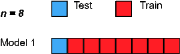

```{r course-style, include=FALSE}
source("../_shared/bikeshare.R")
course_palette <- use_course_style("celtic")
```

## Antes · Hoy · Después {.class-rhythm}

::: {.full-width}

::: {.content-box}
**Antes**

causalidad.
:::

::: {.content-box-primary}
**Hoy**

validación cruzada y sobreajuste.
:::

::: {.content-box-secondary}
**Después**

clasificador logístico (binomial y multinomial).
:::

:::


```{r,  include=TRUE, echo=FALSE, warning=FALSE, message=FALSE}

# load data on Capital Bikeshare from package "ISLR2"
library(pacman)
p_load("ISLR2")
p_load("viridis")
p_load("tidyverse")
p_load("modelr")
p_load("cowplot")
p_load("margins")
p_load("rsample")
p_load("arm")
p_load("DescTools")
p_load("caret")

theme_set(theme_julia())

bikedata <- Bikeshare %>% as_tibble()

# outcome binario: alta demanda = top 25% de las horas (percentil 75 de bikers)
p75 <- quantile(bikedata$bikers, 0.75)
bikedata <- bikedata %>%
  mutate(demand = if_else(bikers > p75, "alta", "baja")) %>%
  # map into 0/1 code
  mutate(high_demand = if_else(bikers > p75, 1, 0))
```

# Predicción y "overfitting" 

## En el capítulo anterior: matriz de confusión

| | Real: demanda baja | Real: demanda alta |
|---|---:|---:|
| **Predicción: baja** | verdadero negativo | falso negativo |
| **Predicción: alta** | falso positivo | verdadero positivo |

La matriz separa dos preguntas: ¿cuánto acierta el clasificador y **qué tipo de error** comete?

## Overfitting
[Desafíos para el desarrollo de un modelo predictivo]{.bold}

. . .

- El modelo debe predecir adecuadamente los datos (bajo sesgo)

. . .

- El modelo debe ser parsimonioso (pocos parámetros)

. . .

- Debe tener un desempeño consistente en diferentes muestras (baja varianza)

. . .

[Problema: trade-off entre sesgo y varianza]{.bold}

::: {.center}


:::

## Trade-off entre sesgo y varianza

::: {.center}


:::

- Modelos muy complejos ajustan incluso el ruido idiosincrático de los datos con que fueron entrenados, lo que deteriora su desempeño en nuevos datos.
- Modelos demasiado simples ignoran patrones reales, generando errores sistemáticos tanto dentro como fuera de la muestra.

## Information Criteria

. . .

- Information Criteria fueron desarrollados con el fin de prevenir problemas de over-fitting y maximizar desempeño fuera de la muestra.

. . .

- Information Criteria miden la capacidad predictiva de un modelo pero incluyen una [penalty]{.bold} por el número de parámetros.

. . .

- [Intuición]{.bold}: entre dos modelos con "similar" capacidad preferimos el más parsimonioso (menos parámetros).

. . .

- Ventaja sobre [Deviance]{.bold} y [LRT]{.bold}: Information Criteria pueden comparar modelos no-anidados. 

. . .

::: {.pull-left}

::: {.center}

Forma general,

:::

:::

::: {.pull-right}

$IC: \overbrace{-2 \log \mathcal{L}_{M}}^{\text{fit}} + \underbrace{k \cdot q}_{\text{parsimonia}}$

:::

. . .

- $\mathcal{L}_{M}$ es la likelihood maximizada del modelo $M$
- $k$ es el número de parámetros del modelo $M$
- $q$ es una constante que "penaliza" la cantidad de parámetros

## Information Criteria: AIC y BIC
Dos Information Criteria son especialmente relevantes:

. . .

[Akaike Information Criterion (AIC)]{.bold}

::: {.content-box-blue}

$$\text{AIC} =  -2\log \mathcal{L}_{M} + 2k$$

:::

. . .

[Bayesian Information Criterion (BIC)]{.bold} 

::: {.content-box-blue}

$$\text{BIC} =  -2\log \mathcal{L}_{M} +  \log(n)k$$

:::

. . .

- Un número más bajo en AIC y BIC indica mejor ajuste

. . .

- Por lo general $2 < \log(n)$, por tanto BIC tiende a preferir modelos más simples comparado con AIC

## Information Criteria, AIC y BIC: ejemplo empírico

::: {.pull-left}

[M0]{.bold}
```{r,echo=FALSE}
logit_demand0 <-  glm(high_demand ~ temp + factor(holiday) + hum ,family=binomial(link="logit"), data=bikedata)
summary(logit_demand0)$coefficients[,1:2]
```

:::

::: {.pull-right}

[M1]{.bold}
```{r,echo=FALSE}
logit_demand1 <-  glm(high_demand ~ temp*hum + I(temp^2)*hum, family=binomial(link="logit"), data=bikedata)
summary(logit_demand1)$coefficients[,1:2]
```

:::

¿Más [complejo]{.bold} mejor?

. . .

```{r}
inf_crit <- function(m) { aic = -2*logLik(m)[1] + 2*m$rank
  bic = -2*logLik(m)[1] + log(length(m$fitted.values))*m$rank
  return(c(AIC=aic,BIC=bic))
}
```

. . .

::: {.pull-left}

```{r,echo=FALSE}
inf_crit(logit_demand0)
```

:::

::: {.pull-right}

```{r,echo=FALSE}
inf_crit(logit_demand1)
```

:::

[Respuesta:]{.bold} preferimos el modelo con menor AIC/BIC (según los valores de arriba).

. . .

 *(nota: pueden usar funciones `AIC()` y `BIC()` en `R`)
```{css, echo=FALSE}
.pull-right ~ * { clear: unset; }
.pull-right + * { clear: both; }
``` 

## In-sample vs out-of-sample

. . .

- Information criteria penaliza la complejidad del modelo para prevenir "over-fitting".

. . .

 Todavía hay un problema ...

. . .

- Todos los estadísticos que hemos visto (incluyendo AIC y BIC) evalúan los modelos en la [misma muestra]{.bold} en que son estimados
  - No conocemos el desempeño del modelo [fuera de la muestra]{.bold}. Riesgo de "over-fitting".

. . .

- Evaluación de un modelo fuera de muestra se conoce como [cross-validación]{.bold}.
 - Herramienta estándar para evaluación de modelos predictivos.

## In-sample vs out-of-sample

::: {.center}



:::

## Cross-Validation

. . .

::: {.img-right}


:::

- Principio básico de cross-validation: ["no double dipping!"]{.bold}

. . .

  - estima el modelo en un dataset (training set)

. . .

  - evalúa el modelo en un dataset distinto (test set)

::: {.pull-left}


:::

## Limitaciones del split único

- Separar los datos en un solo [training set]{.bold} y [test set]{.bold} es útil, pero tiene problemas prácticos:

. . .

  - Los resultados dependen del azar: distintos splits pueden producir [errores muy distintos]{.bold}.  
  - En muestras pequeñas, usar parte de los datos solo para test reduce la [precisión de la estimación]{.bold}.  
  - No aprovechamos toda la información disponible.

. . .

[Idea:]{.bold}  Usar *todos* los datos, pero nunca al mismo tiempo para estimar y evaluar.

- Así nace la [k-fold cross-validation]{.bold}: una forma más estable y eficiente de medir el error predictivo.

## k-fold cross-Validation

::: {.pull-left}


:::

. . .

::: {.pull-right}

[Algoritmo:]{.bold}

- (1) Divide los datos en $k$ grupos (folds) del mismo tamaño. 
  - (1.1) Reserva la $i$-fold como test set.
  - (1.2) Ajusta el modelo en las restantes $k-1$ folds (training set). 

:::

. . .

- (2) Usa el modelo ajustado en el training set $i$ (1.2) para predecir el outcome de interés en el test set (1.1)
  - (2.1) Calcula una medida de error predictivo ("test error"), $E_{i}$

. . .

- (3) Repite (1) y (2) $k$-veces, produciendo $\{E_{1}, E_{2}, \dots , E_{k}\}$

. . .

- (4) Calcula el [k-fold cross-validation error]{.bold} promediando el error a través de las $k$-folds.:
$$\text{CV-error} =  \frac{1}{k} \sum_{i=1}^{k} E_{i}$$

## Un caso límite: LOOCV

¿Qué pasa si $k=n$ (tantos folds como observaciones)? Cada fold deja **una sola observación** afuera para testear, y entrena con las $n-1$ restantes.

. . .

- Se llama **Leave-One-Out Cross-Validation (LOOCV)**.
- Ventaja: usa casi todos los datos para entrenar → estimación de error casi insesgada.
- Desventaja: hay que ajustar el modelo $n$ veces → costoso; además, los $n$ training sets se superponen casi por completo, por lo que los $E_i$ quedan muy correlacionados entre sí (mayor varianza del promedio).
- En la práctica, $k=5$ o $k=10$ suele ser un mejor balance costo/varianza que $k=n$.

## k-fold Cross-Validation: ejemplo empírico

. . .

 - [Contexto:]{.bold} Queremos evaluar la capacidad predictiva donde modelos, uno más simple y otro más complejo. 
 - Usamos datos de _Capital Bikeshare_ (variable binaria `high_demand`), con predictores `temp` (temperatura), `hum` (humedad), y `holiday` (feriado sí/no).

. . .

::: {.pull-left}

[Modelo simple (M0)]{.bold}
```{r,echo=FALSE, message=FALSE, warning=FALSE}
logit_demand0 <- glm(high_demand ~ temp + factor(holiday) + hum,
                      family = binomial(link="logit"),
                      data = bikedata)
summary(logit_demand0)$coefficients[,1:2]
```

:::

::: {.pull-right}

[Modelo complejo (M1)]{.bold}
```{r,echo=FALSE, message=FALSE, warning=FALSE}
logit_demand1 <- glm(high_demand ~ temp*hum + I(temp^2)*hum,
                      family = binomial(link="logit"),
                      data = bikedata)
summary(logit_demand1)$coefficients[,1:2]
```

:::

¿Más [complejo]{.bold} = mejor predicción?

## k-fold Cross-Validation: ejemplo empírico
[Evaluemos usando k-fold Cross-Validation]{.bold}

```{r, message=FALSE, warning=FALSE}
p_load(caret)

# definimos control de validación cruzada (10 folds, repetida)
ctrl <- trainControl(method = "repeatedcv", number = 10, savePredictions = TRUE)

# cross-valida M0
cv_logit_demand0 <- train(factor(high_demand) ~ temp + factor(holiday) + hum,
                           data = bikedata, method = "glm", family = "binomial", trControl = ctrl)

# cross-valida M1
cv_logit_demand1 <- train(factor(high_demand) ~ temp*hum + I(temp^2)*hum,
                           data = bikedata, method = "glm", family = "binomial", trControl = ctrl)
```

## k-fold Cross-Validation: ejemplo empírico

. . .

::: {.pull-left}

```{r, message=FALSE, warning=FALSE}
cv_logit_demand0$resample %>% head()
```

:::

::: {.pull-right}

```{r, message=FALSE, warning=FALSE}
cv_logit_demand1$resample %>% head()
```

:::

## k-fold Cross-Validation: ejemplo empírico

[Error promedio de cross-validation]{.bold}
```{r, message=FALSE, warning=FALSE}
cv_logit_demand1
```

## Desempeño promedio en términos de clasificación
```{r, message=FALSE, warning=FALSE}

bikedata <- bikedata %>%
  mutate(
    high_demand = factor(
      high_demand,
      levels = c(0, 1),        # or whatever your original coding is
      labels = c("no", "yes")  # valid names for caret
    )
  )

ctrl <- trainControl(method = "repeatedcv", number = 10,
                     savePredictions = TRUE,
                     classProbs = TRUE,
                     summaryFunction = twoClassSummary)

# cross-valida M0
cv_logit_demand0 <- train(high_demand ~ temp + factor(holiday) + hum,
                           data = bikedata, method = "glm", family = "binomial", trControl = ctrl)

# cross-valida M1
cv_logit_demand1 <- train(high_demand ~ temp*hum + I(temp^2)*hum,
                           data = bikedata, method = "glm", family = "binomial", trControl = ctrl)

```

## Desempeño promedio en términos de clasificación
[Modelo M0]{.bold}
```{r, message=FALSE, warning=FALSE}
confusionMatrix(cv_logit_demand0)
cv_logit_demand0$results
```

## Desempeño promedio en términos de clasificación
[Modelo M1]{.bold}
```{r, message=FALSE, warning=FALSE}
confusionMatrix(cv_logit_demand1)
cv_logit_demand1$results
```

## Decisión de modelado

- El error de entrenamiento siempre favorece modelos más flexibles.
- La validación cruzada estima desempeño fuera de muestra.
- La métrica debe representar el costo sustantivo de falsos positivos y falsos negativos.
- El conjunto de test se consulta una sola vez, al final.

## Gracias {.inverse .center .middle .closing}

**Hasta la próxima clase**

Mauricio Bucca
