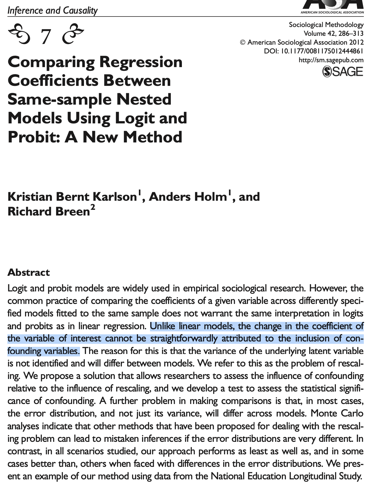

class: inverse, center, middle

```{r xaringan-themer, include=FALSE, warning=FALSE}
library(tidyverse)
library(xaringanthemer)
style_duo_accent(primary_color ="#712661", secondary_color = "#A2CFFE" ,
                 background_color = "#f8f7f3",
                 header_font_google = google_font("Archivo"),
                 text_font_google   = google_font("Inconsolata"), 
                 link_color= "#F3a1F4"

)
```

# Análisis de datos categóricos 
## visión panorámica 


---
## Tipos de datos categóricos

Distintas miradas a los datos de infidelidad:

.center[
```{r,  include=TRUE, echo=FALSE, warning=FALSE, message=FALSE}
library("tidyverse")
library("Ecdat")
library("viridis")
library("modelr")
library("MASS")
library("cowplot")
library("margins")
library("sjPlot")
library("sjmisc")
library("sjlabelled")
library("nnet")
library("lmtest")

theme_set(theme_cowplot())


data(Fair)
affairsdata <- Fair %>% as_tibble()

# create a binary variable indicating whether persons has ever had an affair
affairsdata <- affairsdata %>% 
  mutate(affairs_order = case_when(nbaffairs == 0 ~ "fiel",
                             nbaffairs > 0  & nbaffairs <=3 ~ "ocasional",
                             nbaffairs >= 7  ~ "compulsivo"))  %>%
  mutate(affairs_count = nbaffairs) %>%
  mutate(affairs_binary = case_when(nbaffairs > 0 ~ 1,
                             nbaffairs == 0 ~ 0)
)

affairsdata$affairs_order <- ordered(affairsdata$affairs_order, c("fiel","ocasional","compulsivo"))
```

```{r, echo=F,  include=TRUE, warning=FALSE, message=FALSE, fig.width=13, fig.height=7}
pcount <- affairsdata %>% ggplot(aes(x=affairs_count, fill="")) + geom_bar() +
  scale_color_viridis_d() +  scale_fill_viridis_d() +
  theme(axis.text.y = element_text(size = 22), axis.text.x = element_text(size = 22),
  axis.title.y = element_text(size = 24), axis.title.x = element_text(size = 24), 
  legend.text = element_text(size = 18), legend.position="none") + 
  labs(x="Número de affairs (recuento)")

porder <- affairsdata %>% ggplot(aes(x=affairs_order, fill="")) + geom_bar() +
  scale_color_viridis_d() +  scale_fill_viridis_d() +
  theme(axis.text.y = element_text(size = 22), axis.text.x = element_text(size = 22),
  axis.title.y = element_text(size = 24), axis.title.x = element_text(size = 24), 
  legend.text = element_text(size = 18), legend.position="none") + 
  labs(x="Categoría de affairs (ordenado)")

pbinary <- affairsdata %>% ggplot(aes(x=factor(affairs_binary), fill="")) + geom_bar() +
  scale_color_viridis_d() +  scale_fill_viridis_d() +
  theme(axis.text.y = element_text(size = 22), axis.text.x = element_text(size = 22),
  axis.title.y = element_text(size = 24), axis.title.x = element_text(size = 24), 
  legend.text = element_text(size = 18), legend.position="none") + 
  labs(x="Indicador de affairs (binario)")

cowplot::plot_grid(
  pbinary, porder, pcount,
  labels = c("A","B","C"), ncol = 2
)

```
]

---
class: inverse, center, middle

## Datos dicotómicos
### Linear Probability Model y Regresión Logística

---
## Linear Probability Model

```{r}
lpm_1 <- lm(affairs_binary ~ ym,  data=affairsdata)
lpm_2 <- lm(affairs_binary ~ ym + rate,  data=affairsdata)
```

<br>
--
.pull-left[
```{r, echo=F}
tab_model(lpm_1,lpm_2, p.style = "stars",   show.ci = FALSE,show.p = FALSE)
```
]

--

.pull-right[
- En un modelo lineal estándar al agregar una variable:

 - cambio en coeficientes reflejan correlación entre predictores (ej. "confounding")
 
 - reducción de varianza residual
 
]

---
## Regresión Logística

```{r}
logistic_1 <- glm(affairs_binary ~ ym,  family="binomial", data=affairsdata)
logistic_2 <- glm(affairs_binary ~ ym + rate, family="binomial",  data=affairsdata)
```


<br>
--
.pull-left[
```{r, echo=F}
tab_model(logistic_1,logistic_2, p.style = "stars", 
          show.ci = FALSE, show.p = FALSE, transform = NULL)
```
]

--

.pull-right[

En un modelo de regresión logística .bold[NO ES POSIBLE] sacar conclusiones sustantivas de cambios en coeficientes en modelos anidados!
 
]

<br>
--

¿Por que?

---
## Regresión Logística: varianza no identificables

<br>

Existe una formulación alternariva de la regresión logística en términos de variable latente, donde la variable dependiente $y$  es una .bold[manifestación dicotómica] de una .bold[variable latente] (inobservada) continua, $y^{*}$.

.pull-left[

$$\begin{align}
y_{i} = \begin{cases}
1 \quad \text{si} \quad y^{*}_{i} > 0 \\
0 \quad \text{si} \quad y^{*}_{i} < 0
\end{cases}
\end{align}$$

]

.pull-right[
$y^{*}_{i} = \beta_{0} + \beta_{1}x_{1i} + \dots + \beta_{k}x_{ki} + \epsilon_{i}$
]

<br>

- donde $e_{i}$ sigue una distribución logística.

--

- En este modelo no es posible estimar los coeficientes y la varianza conjuntamente. Es necesario fijar uno para estima el otro. 

--

- Para estimar los coeficientes del modelo es necesario fijar el valor de la varianza.

--

-  Usualmente: $\epsilon_{i} \sim \text{logistic}(\mu=0,\sigma=\pi/\sqrt{3})$


---
## Regresión Logística: efectos no comparables entre modelos anidados

En consequencia ....

<br>
--


|                     |   Varianza variable dependiente   |             Varianza residual             |
|---------------------|:---------------------------------:|:-----------------------------------------:|
| Regresión lineal    |     $\sigma^{2}_{y}$ es observado     | $\sigma^{2}_{\epsilon}$ dependende del modelo |
| Regresión logística |  $\sigma^{2}_{y*}$ depende del modelo |        $\sigma^{2}_{\epsilon}$ es fijo        |


<br>
--

.bold[Efecto de agregar un predictor adicional:]

|                     |   Varianza variable dependiente   |             Varianza residual             |
|---------------------|:---------------------------------:|:-----------------------------------------:|
| Regresión lineal    |     $\sigma^{2}_{y}$ no cambia    | $\sigma^{2}_{\epsilon}$ disminuye |
| Regresión logística |  $\sigma^{2}_{y*}$ aumenta |        $\sigma^{2}_{\epsilon}$ no cambia        |


<br>
--

Esencialmente, $y^{*}$ es .bold[re-escalado], y por tanto también los coeficientes son re-escalados.


---
## Regresión Logística: efectos no comparables entre modelos anidados


.pull-left[
```{r, echo=F}
tab_model(logistic_1,logistic_2, p.style = "stars", 
          show.ci = FALSE, show.p = FALSE, transform = NULL)
```
]

.pull-right[
En un modelo de regresión logística cambios en los coeficientes al agregar una variable pueden deberse a:

 - correlación entre predictores (ej. "confounding")
 
 - re-escalamiento de la variable dependiente
 
 - .bold[ambos!]
 
]

<br>
--

- Este problema es usualmente desconocido o ignorado. 

--

- Cientos de artículos científicos extren interpretaciones erróneas de cambio en coeficientes a través de modelos.

--

- Seriedad del problema varía caso a caso

---
## Regresión Logística: efectos no comparables entre modelos anidados

--

Una posible solución: .bold[KHB method]

--

.pull-left[

- Paquete disponible en `Stata` y `R`


]
.pull-right[


]


---
class: inverse, center, middle

## Datos politómicos
###  Regresión Logística Multinomial y Ordenada


---
## Regresión Logística Multinomial

```{r}
mlogistic_1 <- multinom(affairs_order ~ ym,  trace=F, data=affairsdata)
mlogistic_2 <- multinom(affairs_order ~ ym + rate, trace=F,  data=affairsdata)
```

.pull-left[
```{r, echo=F}
sjPlot::tab_model(mlogistic_1, p.style = "stars",   show.ci = FALSE, show.p = FALSE, transform = NULL)
```
]

.pull-right[
```{r, echo=F}
sjPlot::tab_model(mlogistic_2, p.style = "stars",   show.ci = FALSE, show.p = FALSE, transform = NULL)
```
]

---
## Regresión Logística Ordenada

```{r, warning=F, message=F}
ologistic_1 <- polr(affairs_order ~ ym, data=affairsdata)
ologistic_2 <- polr(affairs_order ~ ym + rate, data=affairsdata)
```

<br>

.pull-left[
```{r, echo=F, warning=F, message=F}
tab_model(ologistic_1, ologistic_2, p.style = "stars",   show.ci = FALSE, show.p = FALSE, transform = NULL)
```
]

--

.pull-right[

- Menos parámetros pero más supuestos.

- "Parallel regression assumption" (o proportional odds): predictores tienen los mismos efectos para cualquier "transición" entre una categoría y otra. 


]

---
## Regresión Logística Ordenada

Podemos testear este supuesto usando el "Brant test". 

```{r, warning=F, message=F}
library("brant")
```

.pull-left[
```{r}
brant(ologistic_1)
```
]

.pull-right[
```{r}
brant(ologistic_2)
```
]

--

- Evalua si los coeficientes son iguales al estimarlos en regresiones separadas.

- p-values grandes indican que la "parallel regression assumption" se cumple.


---
class: inverse, center, middle

## Datos de recuento
###  Regresión Poisson y Quasi-Poisson

---
## Regresión Poisson

```{r, warning=F, message=F}
poisson_1 <- glm(affairs_count ~ ym, family=poisson(link="log"), data=affairsdata)
poisson_2 <- glm(affairs_count ~ ym + rate, family=poisson(link="log"), data=affairsdata)
```

<br>

```{r, echo=F, warning=F, message=F}
tab_model(poisson_1,poisson_2, p.style = "stars",   show.ci = FALSE, show.p = FALSE, transform = NULL)
```


---
## Regressión Quasi-Poisson 

La regressión quasi-Poisson incorpora explícitamente el factor de dispersión y corrige la inferencia del modelo.

--

$$y_{i} \sim \text{quasi-Poisson}(\mu_{i} = e^{X_{i}\beta}, \sigma= \sqrt{\omega \cdot  e^{X_{i}\beta}})$$

<br>
donde $\omega$ es el factor de dispersion.

--

  - Regressión Poisson es un caso especial de quasi-Poisson ( $\omega=1$ ).
  
<br>
--

Implementación en `R`:

```{r, warning=F, message=F}
qpoisson_2 <- glm(affairs_count ~ ym + rate, family=quasipoisson(link="log"), data=affairsdata)
```

```{r,echo=F}
summary(qpoisson_2)$coefficients
cat("dispersion = ", summary(qpoisson_2)$dispersion)
```

---
## Quasi-Poisson

```{r, warning=F, message=F}
qpoisson_2 <- glm(affairs_count ~ ym + rate, family=quasipoisson(link="log"), data=affairsdata)
```

<br>

```{r, echo=F}
tab_model(poisson_2,qpoisson_2, p.style = "stars",   show.ci = FALSE, show.p = FALSE, transform = NULL)
```

---
class: inverse, center, middle

## Inferencia

---
## Inferencia para los coeficientes

- Los coeficientes de los modelos cubiertos son estimados via MLE.

--

- $\hat{\beta} \sim \mathcal{N}(\beta, \frac{\sigma_{\beta}}{\sqrt{n}})$, donde $\frac{\sigma_{\beta}}{\sqrt{n}}$ es el "standard error" (SE) de $\beta$.


--


- Es posible construir un intervalo de confianza para los coeficientes. Por ejemplo, un IC para $\beta$ al 95% de confianza está dado por:

$$95\% \text{ CI}_{\hat{\beta}} = \hat{\beta} \pm 1.96 \cdot  \text{SE}$$
--

Por ejemplo, en el modelo Poisson más complejo:

.pull-left[
```{r, echo=F}
summary(poisson_2)$coefficients[,c(1,2)]
```
]

.pull-right[
```{r, }
ic = -0.42 + c(-1.96,1.96)*0.028
cat("95% IC rate: (",ic[1],",",ic[2],")")
```
]


---
## Inferencia para funciones de los coeficientes de un modelo

En muchas situaciones nos interesa realizar inferencia para cantidad de interés derivadas de un modelo. 

--

.bold[Ejemplo]: predicciones sobre "probabilidad de ser infiel" arrojadas por diferentes modelos

.pull-left[
```{r, warning=F, message=F}
grid <- affairsdata %>% data_grid(ym=median(ym),rate)
grid <- grid %>% mutate(lpm = predict(lpm_2, newdata=grid),
                logistic = predict(logistic_2, newdata=grid, type="response"),
                mlogistic = 1- predict(mlogistic_2,newdata=grid, type="probs")[,1],
                ologistic = 1- predict(ologistic_2,newdata=grid, type="probs")[,1]
                )
```
]


```{r plot1, warning=F, message=F, eval=F, echo=F}
grid %>% pivot_longer(cols = -c(ym,rate), names_to="model", values_to="infiel_hat") %>%
  ggplot(aes(x=rate,y=infiel_hat, group=model,colour=model)) +
  geom_line() +
  scale_color_viridis_d() +  scale_fill_viridis_d() +
  theme(axis.text.y = element_text(size = 22), axis.text.x = element_text(size = 22),
  axis.title.y = element_text(size = 24), axis.title.x = element_text(size = 24), 
  legend.text = element_text(size = 18), legend.position = "none") +
  labs(x="rate", y=expression("P(Infiel)"))
```


.pull-right[
```{r plot1-out, ref.label="plot1", warning=F, message=F, echo=F, fig.height=6, fig.width=7}
```
]

---
## Inferencia para funciones de los coeficientes de un modelo: Bootstrap

Cuando cantidades de interés son funciones complejas de los coeficientes los métodos de simulación y re-sampling pueden ser de gran utilidad.

--

```{r, warning=F, message=F}
bs  <- function(x) {
  grid <- affairsdata %>% data_grid(ym=median(ym),rate)
  
  #data_b   <- sample_n(affairsdata,size=nrow(affairsdata),replace=TRUE)

  lpm_2_b <- lm(affairs_binary ~ ym + rate,  data=x)
  logistic_2_b <- glm(affairs_binary ~ ym + rate, family="binomial",  data=x)
  mlogistic_2_b <- multinom(affairs_order ~ ym + rate, trace=F,  data=x)
  ologistic_2_b <- polr(affairs_order ~ ym + rate, data=x)

  
  grid <- grid %>% mutate(lpm = predict(lpm_2_b, newdata=grid),
                logistic = predict(logistic_2_b, newdata=grid, type="response"),
                mlogistic = 1- predict(mlogistic_2_b,newdata=grid, type="probs")[,1],
                ologistic = 1- predict(ologistic_2_b,newdata=grid, type="probs")[,1]
                )
}

```

---
## Inferencia para funciones de los coeficientes de un modelo: Bootstrap


```{r, warning=F, message=F}
# aplica función bootstrap
grid <- affairsdata %>% bootstrap(500) %>% mutate(pred = map(strap, ~ bs(.x))) %>% 
  dplyr::select(.id,pred) %>% unnest()
```


```{r, echo=F, warning=F, message=F, fig.height=5, fig.width=15}
library("ggsci")
# plot resultados
grid %>% pivot_longer(cols = -c(.id, ym,rate), names_to="model", values_to="infiel_hat") %>%
  ggplot(aes(x=rate,y=infiel_hat, group=interaction(.id), colour=model)) +
  geom_line(alpha=.05) +
  scale_color_lancet() +  scale_fill_lancet() +
  theme(axis.text.y = element_text(size = 22), axis.text.x = element_text(size = 22),
  axis.title.y = element_text(size = 24), axis.title.x = element_text(size = 24), 
  legend.text = element_text(size = 18), legend.position = "none") +
  labs(x="rate", y=expression("P(Infiel)")) +
  facet_grid( . ~ model)
```

---
class: inverse, center, middle

## Comparación entre modelos
###  Bondad de ajuste y predicción


---
## Bondad de ajuste

Medidas de bondad de ajusto para modelos no anidados y con penalización por cantidad de parámetros:

.pull-left[
```{r, warning=F, message=F}
AIC(lpm_1, lpm_2, 
    logistic_1,logistic_2, 
    mlogistic_1,mlogistic_2,
    ologistic_1,ologistic_2, 
    poisson_1, poisson_2)
```
]

.pull-right[
```{r, warning=F, message=F}
BIC(lpm_1, lpm_2, 
    logistic_1,logistic_2, 
    mlogistic_1,mlogistic_2,
    ologistic_1,ologistic_2, 
    poisson_1, poisson_2)
```
]

---
## Capacidad predictiva "out-of-sample"

--

- Principio básico: estimar el modelo en un dataset (training set) y  evalúarlo en un dataset distinto (test set)

--

- .bold[K-fold Cross-validation:]

.img-right-top[


]

<br>
<br>
<br>

--

```{r, warning=F,message=FALSE}
library("caret")
# especifica tipo de cross-validation
ctrl <- trainControl(method = "repeatedcv", number = 10, savePredictions = TRUE)

cv_mlogistic2 <- train(affairs_order ~ ym + rate,  data=affairsdata, 
      method=c("multinom"),
      trControl = ctrl)

cv_ologistic2 <- train(affairs_order ~ ym + rate,  data=affairsdata, 
      method=c("polr"),
      trControl = ctrl)

```

---
## Capacidad predictiva "out-of-sample"


.pull-left[
```{r, warning=F,message=FALSE}
confusionMatrix(cv_mlogistic2)
```
]

--

.pull-right[
```{r, warning=F,message=FALSE}
confusionMatrix(cv_ologistic2)
```
]

---
## En el tintero ..

.pull-left[

]

--

.pull-right[

- Probit

- Choice models: e.g., conditional logit

- Zero-inflated Poisson 

- Log-linear models para tablas de contingencia

-  etc
]


---
class: inverse, center, middle

.huge[
**FIN. Gracias!**
]

<br>
Mauricio Bucca <br>
https://mebucca.github.io/ <br>
github.com/mebucca


