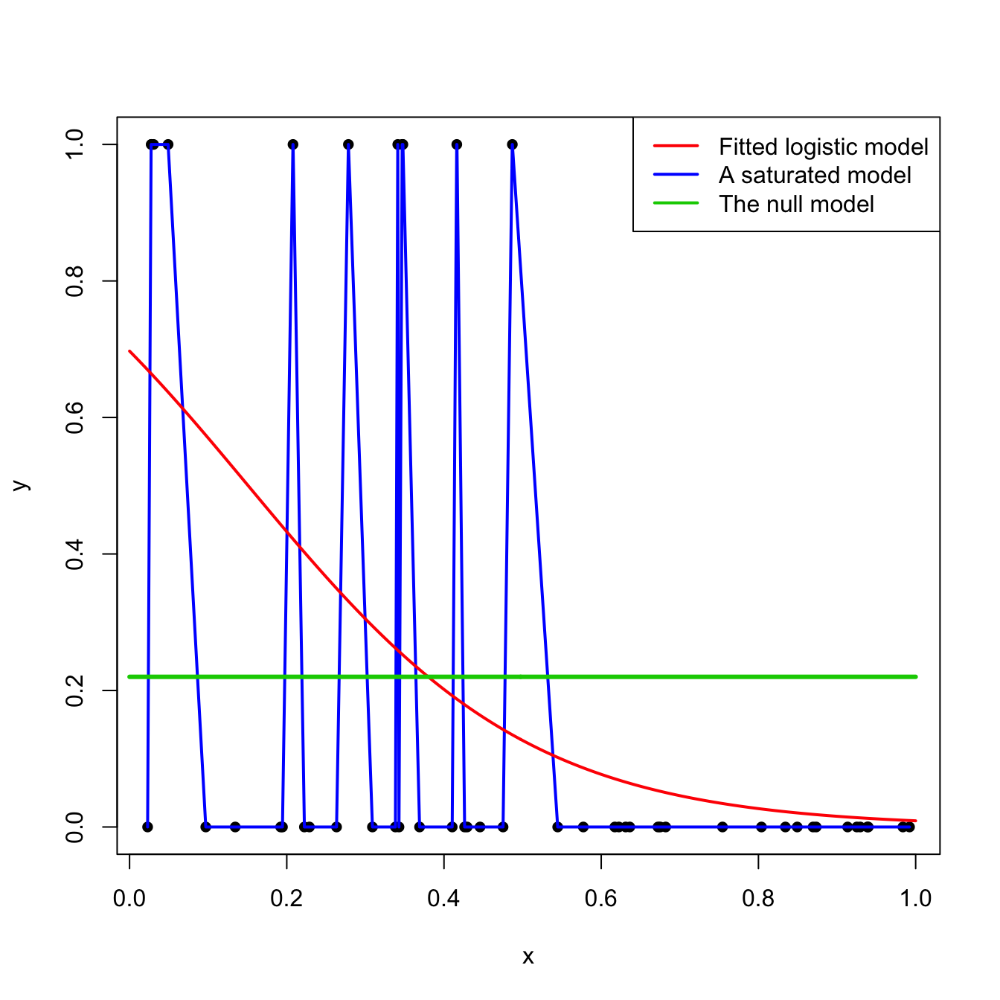
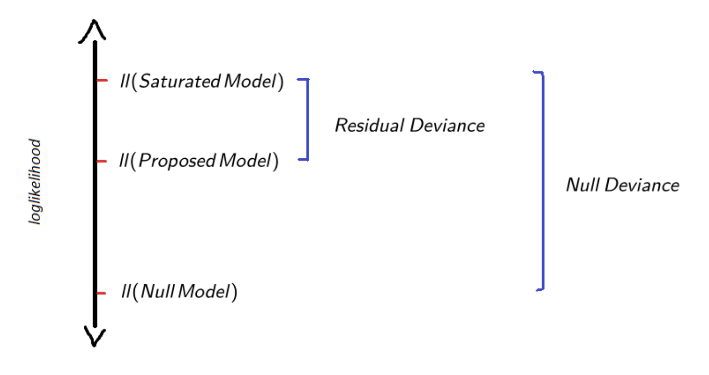
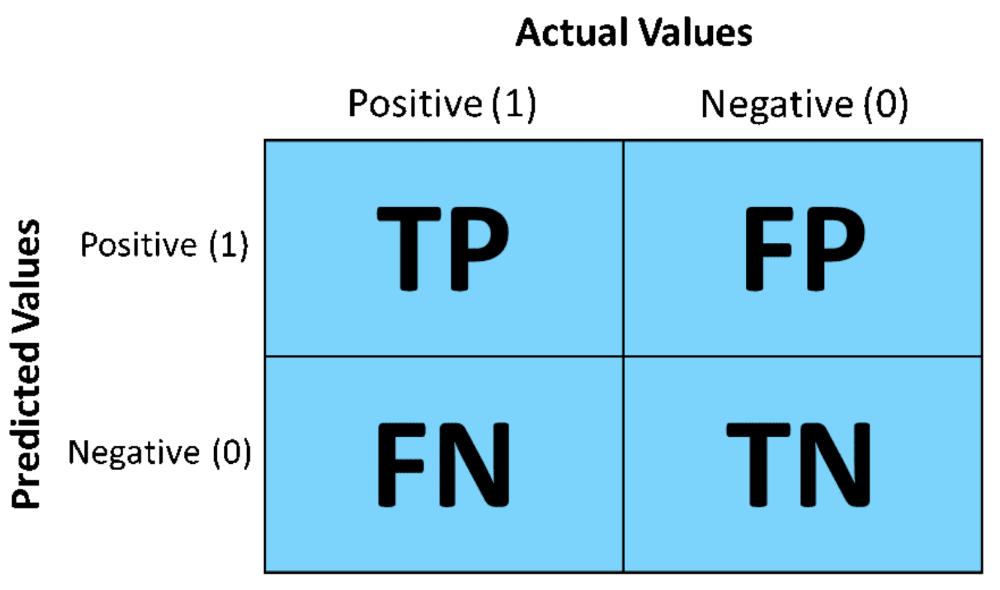

```{r course-style, include=FALSE}
source("../_shared/bikeshare.R")
course_palette <- use_course_style("milan")
```

## Antes · Hoy · Después {.class-rhythm}

::: {.full-width}

::: {.content-box}
**Antes**

predicción, overfitting y validación cruzada.
:::

::: {.content-box-primary}
**Hoy**

clasificador logístico: métricas, umbrales y el caso multinomial.
:::

::: {.content-box-secondary}
**Después**

regularización: Ridge y LASSO.
:::

:::


# Evaluación de Modelos Predictivos {.inverse .center .middle}

## $\hat{\beta}$-problems vs. $\hat{y}$-problems
(Mullainathan & Spiess, 2017)

. . .

::: {.pull-left}

**$\hat{\beta}$-problems**

- Foco en **parámetros** y su interpretación.  
- Preguntas:  
  - ¿Cuál es el efecto de $X$ sobre $Y$?  
  - ¿Es significativo / causal?  

- Objetivo: **explicación e inferencia**.  
- Modelos suelen ser **transparentes** (fácil interpretar).  

:::

::: {.pull-right}

**$\hat{y}$-problems**

- Foco en **predicciones** para nuevos casos.  
- Preguntas:  
  - ¿Qué tan bien predice el modelo en datos futuros?  
  - ¿Qué modelo predice mejor?  

- Objetivo: **desempeño y utilidad práctica**.  
- Modelos pueden ser tratados como **black-box** (no importa cómo, mientras prediga bien).  

:::

## Regresión Logística como Machine Learning {.inverse .center .middle}

## Regresión Logística como Machine Learning
<br><br>

::: {.middle}

::: {.center}

| Énfasis inferencial | Énfasis predictivo |
|---|---|
| parámetros e incertidumbre | desempeño fuera de muestra |
| interpretación del mecanismo | generalización a casos nuevos |
| supuestos explícitos | validación y calibración |

:::

:::

# Regresión Logística: el **“hello world”** de ML

- **Qué resuelve:**  
  - Estima la probabilidad de un evento binario ($Y=0/1$).  
  - Ejemplos: ¿un mail es spam? ¿una hora tendrá alta demanda de bicicletas?

- **Cómo funciona:**  
  - Ajusta una combinación lineal de predictores $X\beta$.  
  - Pasa ese valor por la **curva sigmoide** → convierte log-odds en probabilidades (0–1).  
  - Aprende de los datos para **generalizar** a casos no observados (nuevos datos, futuro, etc.).  

- **Por qué es importante:**  
  - Interpretable: cada predictor tiene un rol claro en la probabilidad.  
  - Eficiente: funciona bien incluso con muestras pequeñas.  
  - Fundacional: es la base sobre la cual se construyen modelos más complejos en ML.  

## Ejemplo empírico
```{r,  include=TRUE, echo=FALSE, warning=FALSE, message=FALSE}

# load data on Capital Bikeshare from package "ISLR2"
library(pacman)
p_load("ISLR2")
p_load("viridis")
p_load("tidyverse")
p_load("modelr")
p_load("cowplot")
p_load("margins")
p_load("rsample")
p_load("arm")
p_load("DescTools")
p_load("caret")

theme_set(theme_julia())

bikedata <- Bikeshare %>% as_tibble()

# outcome binario: alta demanda = top 25% de las horas (percentil 75 de bikers)
p75 <- quantile(bikedata$bikers, 0.75)
bikedata <- bikedata %>%
  mutate(demand = if_else(bikers > p75, "alta", "baja")) %>%
  # map into 0/1 code
  mutate(high_demand = if_else(bikers > p75, 1, 0))
```
Continuando con el ejemplo de clases anteriores, ajustamos el siguiente modelo:
$$\ln \frac{p_{i}}{1-p_{i}} = \beta_{0} + \beta_{1}\text{temp}_{i} + \beta_{2}\text{workingday}_{i} + \beta_{3}\text{hum}_{i} + \beta_{4}\text{hum}^{2}_{i}$$
Llamemos a este modelo, modelo $M$:

```{r,echo=TRUE}
logit_demand <-  glm(high_demand ~ temp + factor(workingday) + hum + I(hum^2) ,family=binomial(link="logit"), data=bikedata)
summary(logit_demand)$coefficients
print(paste0("log-likelihood: ",round(logLik(logit_demand),3),
             " Deviance: ", round(summary(logit_demand)$deviance,3) ))
print(paste0("AIC: ", round(summary(logit_demand)$aic,3),
             " BIC: ", round(BIC(logit_demand),3) ))
```

## Likelihood como función de pérdida

- En ML, entrenar un modelo = encontrar parámetros que **maximicen la verosimilitud**  
  (o equivalentemente **minimicen la pérdida**).

. . .

- En regresión logística, cada $y_i$ es Bernoulli con probabilidad $p_i$:  

$$
P(y_i \mid p_i) = p_i^{y_i}(1-p_i)^{1-y_i}
$$

. . .

- La probabilidad conjunta de todos los datos:  

$$
\mathcal{L}(\beta) = \prod_{i=1}^{n} p_i^{y_i}(1-p_i)^{1-y_i}
$$

. . .

- Tomando logaritmos:  

$$
\ell(\beta) = \sum_{i=1}^{n} \big[ y_i \ln p_i + (1-y_i) \ln(1-p_i) \big]
$$

. . .

- En ML a esto le llamamos **log-loss** o **cross-entropy loss**:  

$$
\text{LogLoss} = -\ell(\beta)
$$

## Likelihood como función de pérdida

- Si las predicciones del modelo son correctas ($y=1$ y $p$ cercano a 1) → log-loss bajo.
- Si se equivocan ($y=1$ pero $p$ cercano a 0) → log-loss alto.
- Entrenar = **ajustar $\beta$ para minimizar log-loss** (= maximizar likelihood).
Likelihood maximizada en nuestro ejemplo:
```{r}
ll_m <- logLik(logit_demand); print(c(Likelihood = exp(ll_m[1]), log_likelihood = ll_m[1]))
```

. . .

[Versión ML: Log-loss promedio ]{.bold}
En machine learning se suele trabajar con la **log-loss promedio** para obtener una pérdida por observación (comparable entre datasets de distinto tamaño).

$$
\text{LogLoss} = -\frac{1}{n}\,\ell(\beta)
$$
```{r}
n <- length(bikedata$high_demand); log_loss <- -1/n * as.numeric(ll_m[1]); log_loss
```

## Modelos de referencia (baselines)
En ML y estadística es común usar **modelos de referencia** para poner en contexto el desempeño de un modelo más complejo.  Dos extremos:

. . .

<br><br>

- **Modelo nulo ($M_N$)**  
  - El más simple posible: siempre predice la probabilidad promedio global.  
  - Ventaja: parsimonioso y fácil de interpretar.  
  - Desventaja: genera las peores predicciones posibleså, ignora covariables.  
```{r,echo=TRUE, warning=FALSE,message=FALSE}

# modelo nulo
logit_demand_null <- glm(high_demand ~ 1,family=binomial(link="logit"), data=bikedata)
```

. . .

- **Modelo saturado ($M_S$)**  
  - El más complejo posible: ajusta un parámetro distinto para cada observación.  
  - Ventaja: fit perfecto (cero perdida).  
  - Desventaja: no generaliza → memoriza los datos.  
```{r,echo=TRUE, warning=FALSE,message=FALSE}

# En Bernoulli, el modelo saturado reproduce cada observación y su log-likelihood es 0.
# Evitamos ajustar miles de indicadores, que sería computacionalmente innecesario.
ll_saturated <- 0
```

## Baselines vs Modelo de Interés

::: {.center}



:::

## Residual Deviance y Null Deviance
En modelos logísticos, el **log-likelihood ratio** puede re-expresarse como **Deviance**, que es esencialmente una medida de **pérdida (loss)**. Dos tipos de deviance:

- **Residual Deviance:**  $D = -2 \cdot (\log\mathcal{L}_{M} - \log \mathcal{L}_{S})$  
  - Evalúa el ajuste de $M$ respecto al modelo saturado (fit perfecto).  

- **Null Deviance:** $D_N = -2 \cdot (\log\mathcal{L}_{0} - \log \mathcal{L}_{S})$  
  - Equivale al "total explicable", similar a la varianza total en OLS.  

. . .

- **Distribución muestral:** $D \sim \chi^{2}(df = n-k), \quad  \text{donde k es el número de parámetros en M}$  

Interpretación:

- $D$ alto (p-value bajo) → "mal ajuste" (alto error, modelo se queda corto).  
- $D$ bajo (p-value alto) → "buen ajuste" (más parámetros no agregan valor.  

## Residual Deviance y Null Deviance

::: {.center}



:::

## Residual Deviance y Log-loss promedio

```{r,echo=FALSE}

# Coeficientes del modelo
summary(logit_demand)$coefficients

# Null vs Residual Deviance reportados por R
print(paste0("Null Deviance: ", round(logit_demand$null.deviance,3),
             " | Residual Deviance: ", round(summary(logit_demand)$deviance,3) ))
```
```{r,echo=TRUE}

# Cálculo manual de la Residual Deviance
D <- -2 * (logLik(logit_demand)[1] - ll_saturated)

# Relación con log-loss promedio
log_likelihood <- as.numeric(logLik(logit_demand))
log_loss <- -1/length(bikedata$high_demand) * log_likelihood
print(paste0("Log-loss promedio: ", round(log_loss, 3)))
```

## Pseudo - $R^2$

. . .

- En modelos OLS es común medir ajuste usando el coeficiente $R^2$, es decir, % de varianza explicada por el modelo.

. . .

- En GLM's la varianza no es separable de la media, por tanto no se puede descomponer.

. . .

- Existe una variedad de alternativas al $R^2$, llamadas genéricamente pseudo - $R^2$. Uno de los más comunes es:

. . .

$$\text{McFadden’s } R^{2} = 1 - \frac{D}{D_{0}} = 1 - \frac{(\log\mathcal{L}_{S} - \log \mathcal{L}_{M})}{ (\log\mathcal{L}_{S} - \log \mathcal{L}_{N})}$$

. . .

[Intuición:]{.bold}  fracción del total del "explicable" del likelihood que es explicado por el modelo $M$.
  - $R^{2} \in [0,1]$, donde 0 indica el peor fit posible y 1 indica el mejor fit posible. 

## Pseudo - $R^2$
```{r,echo=FALSE}
summary(logit_demand)$coefficients
```

. . .

[Residual deviance]{.bold}:
```{r}
R2 <- 1 - logit_demand$deviance/logit_demand$null.deviance; R2

# versión automática
PseudoR2(logit_demand, which="McFadden")
```

# Regresión Logística como clasificador {.inverse .center .middle}

## De Probabilidades a clases

- La regresión logística entrega **scores probabilísticos**:   $\hat{p}_i = \Pr(Y_i=1\mid X_i,\hat\beta)$

. . .

- Para convertir un score en decisión usamos un **umbral de corte** $\tau$:

$$
\hat{y}_i =
\begin{cases}
1 & \text{si } \hat{p}_i > \tau \\
0 & \text{si } \hat{p}_i \leq \tau
\end{cases}
$$

. . .

- Por defecto: $\tau=0.5$  
- En ML, el umbral se ajusta al problema:  
  - Spam: es peor que se cuele spam → corte bajo.  
  - Subsidio: es peor dejar fuera a quien lo necesita → corte bajo.  
  - Examen de enfermedad peligrosa:
    - Detección temprana: es peor no encontrar la enfermedad → corte bajo.  
    - Confirmación: es peor asustar a alguien sano → corte alto.
[👉 Un clasificador es un modelo + una regla de decisión.]{.bold}

## Matriz de Confusión

::: {.center}

{fig-align="center" width="55%"}

:::

::: {.footnote}
Fuente: [Understanding Confusion Matrix — Towards Data Science](https://towardsdatascience.com/understanding-confusion-matrix-a9ad42dcfd62)
:::

## Matriz de Confusión

::: {.pull-left}



:::

::: {.pull-right}

- **Accuracy**: $(TP+TN)/N$  
  % de clasificaciones correctas  

- **Misclassification Rate**: $(FP+FN)/N$  
  % de clasificaciones incorrectas  

- **True Positive Rate (Recall / Sensitivity)**:  
  $TP/(TP+FN)$  

- **True Negative Rate (Specificity)**:  
  $TN/(TN+FP)$  

- **Precision (PPV)**:  
  $TP/(TP+FP)$  

- **Prevalence**:  
  $(TP+FN)/N$  

:::

. . .

📌 Estas métricas capturan distintos aspectos del desempeño de un clasificador.  
En ML es clave elegir métricas alineadas con el problema (ej: medicina ≠ marketing).  

## Ejemplo empírico: demanda de bicicletas
Clasificamos como “baja demanda” a todas las horas cuya probabilidad predicha sea menor o igual a 0.5, y como “alta demanda” a aquellas cuya probabilidad predicha supere dicho umbral.

$$
\hat{y}_i =
\begin{cases}
1 & \text{si } \hat{p}_i > 0.5 \quad (\text{Alta demanda}) \\\\
0 & \text{si } \hat{p}_i \leq 0.5 \quad (\text{Baja demanda})
\end{cases}
$$
```{r}
p_hat <- predict(logit_demand, type = "response")
y_hat <- if_else(p_hat>0.5,1,0)

conf_mat <- confusionMatrix(
  factor(y_hat), factor(logit_demand$model$high_demand),
  positive = "1", dnn = c("Predicho","Real")
)

conf_mat$table
```

## Ejemplo empírico: demanda de bicicletas

::: {.pull-left}

```{r, echo=FALSE}
df_pred <- tibble(
  p_hat = p_hat,
  y_true = logit_demand$model$high_demand,
  y_hat = y_hat
)

ggplot(df_pred, aes(x=p_hat, fill=factor(y_true))) +
  geom_histogram(position="identity", alpha=0.6, bins=20) +
  geom_vline(xintercept=0.5, linetype="dashed", color=course_palette[["secondary"]]) +
  scale_fill_manual(values = course_palette[c("secondary", "primary")],
                    name="Valor real", labels=c("0 = Baja","1 = Alta")) +
  labs(title="Distribución de probabilidades predichas",
       x="Probabilidad estimada de alta demanda",
       y="Frecuencia") +
  theme_julia()
```

:::

::: {.pull-right}

**Métricas principales del clasificador logístico**

```{r, echo=FALSE}

# Seleccionar métricas clave
metrics <- conf_mat$byClass[c("Sensitivity","Specificity","Precision","F1","Balanced Accuracy")]

# Mostrar tabla ordenada
data.frame(Métrica = names(metrics), Valor = as.numeric(metrics),
           check.names = FALSE)
```

:::

## Umbral y predicción

- Cada umbral $\tau$ genera un nivel de Especificidad y Sensibilidad: $:\{\text{Specificity}(\tau), \text{Sensitivity}(\tau)\}$ para $\tau \in [0,1]$.
```{r setup, echo=FALSE, message=FALSE, warning=FALSE}
p_load(ISLR2)
p_load(tidyverse)
p_load(pROC)
p_load(ggrepel)

# Tema consistente
theme_set(theme_julia())
custom_theme <- theme(
  plot.title = element_text(face = "bold", size = 16),
  plot.subtitle = element_text(size = 12, color = "grey40"),
  legend.position = "top",
  panel.grid.minor = element_blank()
)

# Paleta de colores consistente
COLORS <- list(
  primary = course_palette[["primary"]],
  secondary = course_palette[["secondary"]],
  tertiary = course_palette[["accent"]],
  positive = course_palette[["primary"]],
  negative = course_palette[["secondary"]],
  neutral = course_palette[["series-6"]]
)

# Preparar datos
df <- as_tibble(Bikeshare) %>%
  mutate(y = if_else(bikers > quantile(bikers, 0.75), 1L, 0L))

# Modelo logístico
m_logit <- glm(y ~ temp + factor(workingday) + hum + I(hum^2),
               data = df, family = binomial)
p_hat <- predict(m_logit, type = "response")

# ROC
roc_obj <- roc(response = df$y, predictor = p_hat, quiet = TRUE)
roc_df <- coords(roc_obj, x = "all",
                 ret = c("specificity", "sensitivity", "threshold"),
                 transpose = FALSE) %>%
  as_tibble() %>%
  mutate(FPR = 1 - specificity, TPR = sensitivity) %>%
  arrange(FPR)

# Umbrales de ejemplo
calc_rates <- function(tau) {
  yhat <- as.integer(p_hat > tau)
  TP <- sum(yhat == 1 & df$y == 1)
  TN <- sum(yhat == 0 & df$y == 0)
  FP <- sum(yhat == 1 & df$y == 0)
  FN <- sum(yhat == 0 & df$y == 1)
  tibble(tau = tau, TPR = TP/(TP+FN), FPR = FP/(FP+TN))
}

taus <- c(0.2, 0.5, 0.8)
pts <- map_dfr(taus, calc_rates)
```

::: {.pull-left}

```{r plot_scores, echo=FALSE, message=FALSE, warning=FALSE, fig.width=6, fig.height=5}

# Panel A: Distribución de scores
ggplot(df, aes(x = p_hat, fill = factor(y))) +
  geom_histogram(aes(y = after_stat(count)), 
                 alpha = 0.7, bins = 30, position = "identity") +
  geom_vline(data = tibble(tau = taus, 
                          col = c(COLORS$tertiary, COLORS$primary, COLORS$secondary)),
             aes(xintercept = tau, color = col), 
             linetype = "dashed", linewidth = 1, show.legend = FALSE) +
  geom_label(data = tibble(x = taus, y = c(35, 30, 25),
                          txt = paste0("τ = ", taus)),
             aes(x = x, y = y, label = txt), 
             inherit.aes = FALSE, size = 4, fill = "white", 
             label.padding = unit(0.3, "lines")) +
  scale_fill_manual(values = c(COLORS$negative, COLORS$positive),
                    name = "Clase real:",
                    labels = c("Negativo (0)", "Positivo (1)")) +
  scale_color_identity() +
  scale_x_continuous(limits = c(0, 1), breaks = seq(0, 1, 0.2)) +
  labs(title = "Distribución de scores por umbral",
       subtitle = "Cada τ define cómo clasificar las observaciones",
       x = "Score (probabilidad estimada)",
       y = "Frecuencia") +
  custom_theme +
  theme(legend.position = c(0.75, 0.88),
        legend.background = element_rect(fill = "white", color = NA))
```

:::

::: {.pull-right}

- Umbrales bajos → más predicciones positivas
- Umbrales altos → más predicciones negativas

:::

## Curva ROC

- La **curva ROC** conecta todos los puntos $:\{1 - \text{Specificity}(\tau), \quad \text{Sensitivity}(\tau)\}$ para $\tau \in [0,1]$.
- La diagonal corresponde a un clasificador aleatorio.
- Mejor desempeño = curva más arriba a la izquierda.

::: {.pull-left}

```{r plot_scores2, echo=FALSE, message=FALSE, warning=FALSE, fig.width=6, fig.height=5, ref.label='plot_scores'}
```

:::

::: {.pull-right}

```{r plot_roc, echo=FALSE, message=FALSE, warning=FALSE, fig.width=6, fig.height=5}

# Panel B: Curva ROC
auc_val <- as.numeric(auc(roc_obj))

ggplot(roc_df, aes(x = FPR, y = TPR)) +
  geom_abline(slope = 1, intercept = 0, 
              linetype = "dashed", color = COLORS$neutral, linewidth = 0.8) +
  geom_path(linewidth = 1.5, color = COLORS$primary) +
  geom_point(data = pts, aes(x = FPR, y = TPR), 
             color = COLORS$secondary, size = 4, shape = 16) +
  geom_label_repel(data = pts,
                   aes(x = FPR, y = TPR, label = paste0("τ=", tau)),
                   size = 4, seed = 42, box.padding = 0.5,
                   min.segment.length = 0, segment.color = COLORS$secondary) +
  coord_fixed(xlim = c(0, 1), ylim = c(0, 1), expand = FALSE) +
  scale_x_continuous(breaks = seq(0, 1, 0.2)) +
  scale_y_continuous(breaks = seq(0, 1, 0.2)) +
  labs(subtitle = "Trade-off entre TPR y FPR según el umbral",
       x = "FPR (1 - Especificidad)",
       y = "TPR (Sensibilidad)") +
  custom_theme +
  theme(panel.grid.major = element_line(color = "grey90"))
```

:::

## AUC: Área bajo la curva

- El **AUC** resume el desempeño en un solo número: $AUC = \int_{0}^{1}\text{Sensibilidad}(\tau)\, d(1-\text{Especificidad}(\tau))$
- **Interpretación**: probabilidad de que el modelo asigne mayor score a un positivo que a un negativo (elegidos al azar).

::: {.pull-left}

```{r plot_auc, echo=FALSE, fig.width=6, fig.height=5}

# Modelo aleatorio para comparación
set.seed(123)
random_scores <- runif(nrow(df))
roc_random <- roc(df$y, random_scores, quiet = TRUE)

# Crear data frames para plotting
roc_model_df <- coords(roc_obj, x = "all", transpose = FALSE) %>%
  mutate(FPR = 1 - specificity, TPR = sensitivity, Model = "Logit")

roc_random_df <- coords(roc_random, x = "all", transpose = FALSE) %>%
  mutate(FPR = 1 - specificity, TPR = sensitivity, Model = "Aleatorio")

combined_df <- bind_rows(roc_model_df, roc_random_df)

ggplot(combined_df, aes(x = FPR, y = TPR, color = Model)) +
  geom_abline(slope = 1, intercept = 0, 
              linetype = "dashed", color = COLORS$neutral, linewidth = 0.8) +
  geom_path(linewidth = 1.5) +
  scale_color_manual(values = c("Logit" = COLORS$primary, 
                                "Aleatorio" = COLORS$neutral),
                    name = NULL) +
  coord_fixed(xlim = c(0, 1), ylim = c(0, 1), expand = FALSE) +
  scale_x_continuous(breaks = seq(0, 1, 0.2)) +
  scale_y_continuous(breaks = seq(0, 1, 0.2)) +
  labs(title = "Comparación de modelos",
       subtitle = paste0("AUC Logit = ", course_number(auc(roc_obj)), 
                        " | AUC Aleatorio ≈ 0.5"),
       x = "FPR (1 - Especificidad)",
       y = "TPR (Sensibilidad)") +
  custom_theme +
  theme(legend.position = c(0.8, 0.2),
        legend.background = element_rect(fill = "white", color = "grey80"),
        panel.grid.major = element_line(color = "grey90"))
```

:::

::: {.pull-right}

**Interpretación del AUC:**

- **AUC ≈ 0.5**: Sin poder discriminatorio (como azar)
- **AUC ≈ 0.7-0.8**: Discriminación aceptable
- **AUC > 0.9**: Discriminación excelente
- **AUC = 1**: Clasificador perfecto
👉 Nuestro modelo tiene AUC = `r round(auc(roc_obj), 3)`; ubíquelo en la escala anterior para juzgar su poder discriminatorio.

:::

## Selección del umbral óptimo

- No existe un único "mejor" umbral: depende del contexto y los costos de errar.
- Criterios comunes: **Youden**, **punto más cercano a (0,1)**, etc.
Cómo extraer umbrales en R:
```{r}

# Índice de Youden (maximiza TPR - FPR)
coords(roc_obj, x = "best", 
       best.method = "youden")

# Punto más cercano a (0,1)
coords(roc_obj, x = "best", 
       best.method = "closest.topleft")
```

## Selección del umbral óptimo

- No existe un único "mejor" umbral: depende del contexto y los costos de errar.
- Criterios comunes: **Youden**, **punto más cercano a (0,1)**, etc.
Cómo extraer umbrales en R:
```{r}

# Ver todas las coordenadas
coords(roc_obj, x = "all") %>% head(n=13)
```

# Clasificador multinomial {.inverse .center .middle}

## Más de dos clases

Todo lo anterior asumió un outcome binario. Muchas veces el clasificador debe elegir entre **más de dos categorías** — por ejemplo, demanda "baja", "media" o "alta", en vez de solo "alta/baja".

. . .

El modelo detrás ya lo conocemos: la regresión logística **multinomial** de la clase 12, ahora evaluada como clasificador en vez de interpretada como modelo explicativo.

## Un outcome de tres categorías

```{r multiclase-setup, echo=TRUE}
p_load(nnet)

terciles <- quantile(bikedata$bikers, probs = c(1/3, 2/3))
bikedata <- bikedata %>%
  mutate(demand_level = cut(
    bikers, breaks = c(-Inf, terciles, Inf),
    labels = c("baja", "media", "alta")
  ))

logit_multi <- multinom(demand_level ~ temp + factor(workingday) + hum + I(hum^2),
                        data = bikedata, trace = FALSE)
```

## La matriz de confusión se generaliza

```{r multiclase-confusion, echo=TRUE}
pred_clase <- predict(logit_multi, type = "class")

conf_mat_multi <- confusionMatrix(pred_clase, bikedata$demand_level)
conf_mat_multi$table
```

La matriz sigue siendo "predicho × real", pero ahora es $3\times 3$ (en general, $J\times J$): la diagonal son aciertos, todo lo demás son errores de clasificación entre pares de categorías.

## Métricas: promediar sobre las clases

```{r multiclase-metricas, echo=TRUE}
conf_mat_multi$overall["Accuracy"]
conf_mat_multi$byClass[, c("Sensitivity", "Specificity", "Precision")]
```

- **Accuracy** sigue siendo "% de aciertos totales" — una sola cifra, igual que en el caso binario.
- Sensibilidad, especificidad y precisión ahora se calculan **una vez por clase** (cada clase "vs. el resto") y típicamente se resumen promediándolas — el enfoque **one-vs-rest**.

## ¿Y la curva ROC?

La curva ROC y el AUC, tal como los definimos, son conceptos binarios. La generalización estándar es **one-vs-rest**: tratar cada clase, por turno, como "positivo" contra las demás como "negativo", y calcular una curva ROC por clase.

- Ninguna curva única resume el desempeño multinomial completo — se reportan $J$ curvas, o un promedio (macro-AUC).
- Log-loss (clase 6), en cambio, se generaliza de forma inmediata al caso multinomial — es la misma cross-entropy que usamos para ajustar `logit_multi`, y sigue siendo una sola cifra comparable entre modelos.

## en el próximo episodio ... {.middle}

::: {.center}


:::

## Gracias {.inverse .center .middle .closing}

**Hasta la próxima clase**

Mauricio Bucca
