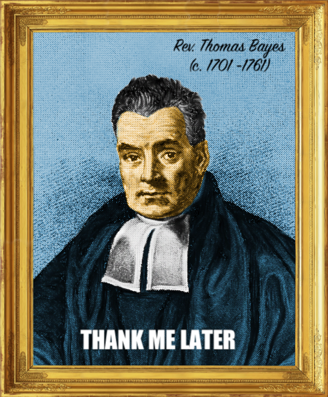

```{r course-style, include=FALSE}
source("../_shared/bikeshare.R")
course_palette <- use_course_style("dortmund")
```

## Antes · Hoy · Después {.class-rhythm}


::: {.full-width}


::: {.content-box}
**Antes**

funciones, límites y derivadas.
:::


::: {.content-box-primary}
**Hoy**

espacio muestral, eventos y probabilidad.
:::


::: {.content-box-secondary}
**Después**

presentación del curso.
:::

:::


# Fundamentos de Probabilidades {.inverse .center .middle}

## Experimentos aleatorios
 Un  [experimento aleatorio]{.bold} es un experimento - real o hipotético - en el que todos los posibles resultados son conocidos *a priori*.
<br>

. . .

Ejemplo:
- Experimento: Tirar un dado
- Posibles resultados: números enteros entre 1 y 6
<br>

. . .

El conjunto de todos los posibles resultados de un experimento se llama "espacio muestral",  $\Omega$. 
En este caso: 
$$\Omega: \{1,2,3,4,5,6 \}$$
<br>

. . .

En palabras, $\Omega: \{1,2,3,4,5,6 \}$ significa que nuestro experimento, consistente en tirar un dado, puede resultar en: "1 o 2 o 3... o 6"

## Eventos
Un [evento]{.bold} es un subconjunto bien definido de los posibles resultados de un experimento. 
<br>

. . .

Ejemplo:
- Experimento: Tirar un dado
- "A" es el evento de "obtener un 1 o un 5"  
<br>

. . .

Formalmente,
$$A :  \text{dado=1 o dado=5}$$

## Probabilidad
Para cualquier [*evento*]{.bold} es posible asociar un número que cuantifique la [probabilidad]{.bold} de ocurrencia de tal evento. 
<br>

. . .

Continuando con nuestro ejemplo,
- Experimento: Tirar un dado
- Espacio muestral, $\Omega: \{1,2,3,4,5,6\}$
- A es el evento de "obtener un 1 o un 5"
¿Cuál es la probabilidad de que ocurra A? 
<br>

. . .

Formalmente,  
$$\mathbb{P}(A) = \mathbb{P}(\text{dado=1 o dado=5})$$
<br>
donde $\mathbb{P}(.)$ refiere a la probabilidad de ocurrencia del evento y $\mathbb{P}(.) \in [0,1]$

## Probabilidad
[Ejercicio rápido]{.bold}:
* Supuesto: el dado es "justo", es decir, todos los valores tienen la misma probabilidad de ocurrencia

. . .


::: {.full-width}


::: {.content-box-primary}
[Preguntas]{.bolder}:
1) ¿Cuál es la probabilidad de ocurrencia de cada valor en el espacio muestral?
2) ¿Cuál es la probabilidad de ocurrencia del evento A (obtener un 1 o un 5)?
:::
:::

. . .

[Respuestas:]{.bold}
1) $\frac{1}{6}$ 
2) $\frac{2}{6}$

. . .

Detrás de estas respuestas hay una comprensión intuitiva de algunas propiedades importantes de la probabilidad.

---

### Reglas básicas de probabilidad
1) Las probabilidades están limitadas entre cero y uno. Si A es un evento, entonces:
$$0 \leq \mathbb{P}(A) \leq 1$$
<br>

. . .

2) La probabilidad de que dos eventos mutuamente excluyentes ocurran al mismo tiempo es cero. Si A y B son eventos mutuamente excluyentes, entonces:
$$\mathbb{P}(A \text{ y }B) = 0$$
Por ejemplo, 
  - si $A:\text{dado=1 o dado=5}$ 
  - y $B:\text{dado=6}$
<br>

. . .

entonces $\mathbb{P}(A \text{ y } B) = 0$

---

### Reglas básicas de probabilidad
3) Si A y B son dos eventos la probabilidad de que *al menos* uno de los dos ocurra es llamada la "unión" de ambos eventos y viene dada por:
$$\mathbb{P}(A \text{ o } B) = \mathbb{P}(A) + \mathbb{P}(B) - \mathbb{P}(A \text{ y } B)$$
<br>

. . .

Por ejemplo,    
  - si $A: \text{dado=1 o dado=5}$ 
  - y $B:\text{dado=5 o dado=6}$
entonces, 
$$\mathbb{P}(A \text{ o } B) = \mathbb{P}(\text{dado=1 o dado=5}) + \mathbb{P}(\text{dado=5 o dado=6}) - \mathbb{P}(\text{dado=5})$$

---

### Reglas básicas de probabilidad
[Ejercicio rápido]{.bold}:
- Experimento: tirar un dado
- Supuesto: el dado es "justo", es decir, todos los valores tienen la misma probabilidad de ocurrencia
<br>

. . .


::: {.full-width}


::: {.content-box-primary}
[Pregunta]{.bolder}:
¿Cuál es la probabilidad de obtener un 3 o un 4?
:::
:::

. . .


::: {.full-width}


::: {.content-box-secondary}
[Respuesta]{.bolder}:
\begin{align}
\mathbb{P}(\text{dado=3 o dado=4}) &= \mathbb{P}(\text{dado=3}) +  \mathbb{P}(\text{dado=4}) - \mathbb{P}(\text{dado=3 y dado=4}) \\
&= \frac{1}{6} +  \frac{1}{6} - 0 = \frac{2}{6}
\end{align}
:::
:::

---

### Reglas básicas de probabilidad
4) De los puntos 2 y 3 se deduce que la probabilidad de la unión de dos eventos desunidos, A y B, viene dada por:
$$\mathbb{P}(A \text{ or } B) = \mathbb{P}(A) + \mathbb{P}(B)$$

---

### Reglas básicas de probabilidad
5) La probabilidad del espacio muestral es uno. 
<br>

. . .

Formalmente, si denotamos cada posible resultado de un experimento como $A_{i}$, entonces:
$$\mathbb{P}(\Omega) = \mathbb{P}(A_{1} \text{ o } A_{2} \dots \text{ o } A_{n})  = \sum_{i} \mathbb{P}(A_{i}) = 1$$
<br>

. . .

Por ejemplo
  - Experimento: tirar un dado justo
Entonces, 
\begin{align}
\mathbb{P}(\Omega) &= \mathbb{P}(\text{dado=1  o ... o dado=6})  \\ \\
 &= \mathbb{P}(\text{dado=1}) + \dots + \mathbb{P}(\text{dado=6}) \\ \\
 &= \frac{1}{6} + \dots + \frac{1}{6} = 1
\end{align}

---

### Reglas básicas de probabilidad
6) Se sigue de (5) que si dos eventos A y B dividen el espacio muestral en dos particiones mutuamente excluyentes entonces sus probabilidades son complementarias. 
<br>

. . .

Formalmente,
$$\mathbb{P}(A) = 1 - \mathbb{P}(B)$$
<br>

. . .

Por ejemplo
  - Experimento: tirar un dado justo
  - $A: \text{dado < 3}$ 
  - $B:\text{dado} \geq 3$
Entonces, 
\begin{align}
\mathbb{P}(A) &= 1 - \mathbb{P}(B) \\
&= 1 - \frac{4}{6} \\
&= \frac{2}{6}
\end{align}

## Probabilidades condicional {.inverse .center .middle}

---

### Probabilidad condicional
[Probabilidad condicional]{.bold} es un concepto crucial en teoría de la probabilidad y subyace al propósito principal del análisis de asociación estadística.

. . .

La probabilidad de un evento A después de que nos enteramos de que se ha producido el evento B se denomina probabilidad condicional de A dado B. Formalmente:
$$\mathbb{P}(A \mid B)$$

. . .

Ejemplo:
- Experimento: tirar un dado "justo"
- Espacio muestral, $\Omega: \{1,2,3,4,5,6\}$
- A es el evento de obtener un cuatro o más,  $A: \{4,5,6\}$
- B es el evento de obtener un número par, $B: \{2,4,6\}$
Supongamos que tiramos el dado pero no miramos el resultado todavía. Una tercera persona nos dice que obtuvimos un número par.

. . .


::: {.full-width}


::: {.content-box-primary}
[Pregunta]{.bolder}:
¿Cuál es la probabilidad de obtener un cuatro o más una vez que sabemos que el resultado es un número par?
:::
:::

---

### Probabilidad condicional
Formalmente, nuestra pregunta se expresa del siguiente modo: $\mathbb{P}(A \mid B )$.
<br>
$$\mathbb{P}(A \mid B ) = \frac{\mathbb{P}(A,B)}{\mathbb{P}(B)}$$
Donde,
- $\mathbb{P}(B)$ es la probabilidad de que B ocurra. Es decir obtener un número [par]{.bold}
- $\mathbb{P}(A,B)$ es la probabilidad de que A y B ocurran conjuntamente. Es decir, obtener un número [par, igual o mayor que 4]{.bold}

. . .

<br>
Intuitivamente, queremos saber en qué proporción de los casos en que B ocurre, A también ocurre. 

---

### Probabilidad condicional
En nuestro caso,
<br>

. . .

\begin{align}
\mathbb{P}(A | B ) &= \frac{\mathbb{P}(A,B)}{\mathbb{P}(B)} \\ \\
&= \frac{\mathbb{P}(\text{dado=4 o dado=6}) }{\mathbb{P}(\text{dado=2 o dado=4 o dado=6})} \\ \\
&=  \frac{2/6}{3/6} = \frac{1}{3} \times 2 \approx 0.66
\end{align}

---

### Probabilidad condicional
[Ejercicio rápido]{.bold}:
Supongamos que:
- Un 5% de la población son mujeres (M) con estudios universitarios completos (U)
- Las mujeres representan un 55% de la población
- Un 20% de la población tiene estudios universitarios completos

. . .


::: {.full-width}


::: {.content-box-primary}
[Pregunta]{.bolder}:
1) ¿Cuál es la probabilidad de tener estudios universitarios completos si se es mujer?
:::
:::

. . .


::: {.full-width}


::: {.content-box-secondary}
[Respuesta]{.bolder}:
1) 
\begin{align}
\mathbb{P}(U \mid M) = \frac{\mathbb{P}(U,M)}{\mathbb{P}(M)} = \frac{0.05}{0.55} \approx  0.09
\end{align}
:::
:::

---

### Probabilidad condicional
[Ejercicio rápido]{.bold}:
Supongamos que:
- Un 5% de población son mujeres (M) con un estudios universitarios completos (U)
- Las mujeres representan 55% de la población
- Un 20% de la población tiene estudios universitarios completos


::: {.full-width}


::: {.content-box-primary}
[Pregunta]{.bolder}:
2) ¿Cuál es la probabilidad de que una persona con estudios universitarios completos sea mujer?
:::
:::

. . .


::: {.full-width}


::: {.content-box-secondary}
[Respuesta]{.bolder}:
2) 
\begin{align}
\mathbb{P}(M \mid U) = \frac{\mathbb{P}(U,M)}{\mathbb{P}(U)} = \frac{0.05}{0.2} = 0.25
\end{align}
:::
:::

---

### Probabilidad condicional
[Ejercicio rápido]{.bold}:
Supongamos que:
- Un 5% de población son mujeres (M) con un estudios universitarios completos (U)
- Las mujeres representan 55% de la población
- Un 20% de la población tiene estudios universitarios completos


::: {.full-width}


::: {.content-box-primary}
[Pregunta]{.bolder}:
3) ¿Cuál es la probabilidad de que una persona con estudios universitarios completos sea hombre (H)?
:::
:::

. . .


::: {.full-width}


::: {.content-box-secondary}
[Respuesta]{.bolder}:
3) 
\begin{align}
\mathbb{P}(H \mid U) = \frac{\mathbb{P}(U,H)}{\mathbb{P}(U)} = 1- \mathbb{P}(M | U) = 1 - 0.25 = 0.75 
\end{align}
:::
:::

---

### Probabilidad condicional


::: {.full-width}


::: {.content-box-primary}
[Bonus]{.bolder}:
4) ¿Cuál es la probabilidad de tener estudios universitarios completos si se es hombre?
:::
:::
[Pista]{.bolder}: En general,
$$ \mathbb{P}(A | B) \neq \mathbb{P}(B | A)  $$

. . .

<br>
pero el [Teorema de Bayes]{.bold} nos dice cómo transformar uno en el otro.

## Teorema de Bayes {.inverse .center .middle}

---

### Thomas Bayes


::: {.middle}


::: {.center}

:::
:::

---

### Teorema de Bayes
La probabilidad de A dado B está definida como:
$$\mathbb{P}(A \mid B) = \frac{\mathbb{P}(A,B)}{\mathbb{P}(B)} \quad \quad \quad \quad \quad (1)$$
<br>

. . .

Por tanto, la probabilidad de B dado A está definida como:
$$\mathbb{P}(B \mid A) = \frac{\mathbb{P}(A,B)}{\mathbb{P}(A)} \quad \quad \quad \quad \quad (2)$$
<br>

. . .

Por tanto: 
$$\mathbb{P}(A,B) = \mathbb{P}(B \mid A)\mathbb{P}(A) \quad \quad \quad \quad  (3)$$
<br>

. . .

Reemplazando (3) en (1) obtenemos:
$$\mathbb{P}(A \mid B) = \frac{\mathbb{P}(B \mid A)\mathbb{P}(A)}{\mathbb{P}(B)} \quad \quad \quad \quad \quad $$

---

### Teorema de Bayes
Entonces, si
$$\mathbb{P}(A \mid B) = \frac{\mathbb{P}(B \mid A)\mathbb{P}(A)}{\mathbb{P}(B)} \quad \quad \quad \quad \quad $$
<br>
re-ordenando la expresión encontramos ...
<br>

. . .


::: {.full-width}


::: {.content-box-secondary}
[Teorema de Bayes]{.bolder}:
$$\mathbb{P}(B \mid A) = \frac{\mathbb{P}(A \mid B)\mathbb{P}(B)}{\mathbb{P}(A)} \quad \quad \quad \quad \quad $$
:::
:::

## {background-image="bayes.jpg" .fullscreen .left .top .text-white}

---

### Teorema de Bayes en práctica
[Ejercicio rápido]{.bolder}:
- Un 5% de la población son mujeres (M) con estudios universitarios completos (U)
- Las mujeres representan un 55% de la población
- Un 20% de la población tiene estudios universitarios completos


::: {.full-width}


::: {.content-box-primary}
[Bonus]{.bolder}:
4) ¿Cuál es la probabilidad de tener estudios universitarios completos si se es hombre?
:::
:::


::: {.full-width}


::: {.content-box-secondary}
[Respuesta]{.bolder}:
4) 
\begin{align}
\mathbb{P}(U \mid H) = \frac{\mathbb{P}(H \mid U)\mathbb{P}(U)}{\mathbb{P}(H)} =   \frac{0.75 \times 0.2}{0.45} = 0.333
\end{align}
:::
:::

## Ley de "probabilidad total" {.inverse .center .middle}

---

### Ley de "probabilidad total"
Si $\{B_{1}, B_{2}., \dots, B_{n}\}$ es un conjunto de particiones "desunidas" y mutuamente excluyentes del espacio muestral, entonces:
\begin{align}
\mathbb{P}(A) = \sum_{i=1}^{n}\mathbb{P}(A,B_{i})
\end{align}
<br>

. . .

dado que, como vimos, $\mathbb{P}(A,B) = \mathbb{P}(A \mid B)\mathbb{P}(B)$, entonces ...
<br>

. . .

\begin{align}
\mathbb{P}(A) = \sum_{i=1}^{n}\mathbb{P}(A \mid B_{i})\mathbb{P}(B_{i})
\end{align}

---

### Ley de "probabilidad total"
[Ejercicio rápido]{.bold}:
- Las mujeres (M) representan un 55% de la población
- El 20% de los hombres (H) tiene estudios universitarios completos (U)
- El 25% de las mujeres tiene estudios universitarios completos

. . .


::: {.content-box-primary}
[Pregunta]{.bolder}:
¿Cuál es la probabilidad de que una persona seleccionada al azar tenga estudios universitarios completos?
:::

. . .


::: {.content-box-secondary}
[Respuesta]{.bolder}:
\begin{align}
\mathbb{P}(U) &= \mathbb{P}(U \mid H)\mathbb{P}(H) + \mathbb{P}(U \mid M)\mathbb{P}(M) \\ \\
              &= 0.2 \times 0.45 + 0.25 \times 0.55 \\ \\
              &= 0.2275
\end{align}
:::

## Independencia estadística {.inverse .center .middle}

---

### Independencia
Dos eventos A y B son [independientes]{.bold} cuando la ocurrencia de A no afecta la ocurrencia de B y viceversa.

. . .

Independencia es un caso especial de probabilidad condicional: $A \bot B$ si el conocimiento sobre B no cambia nuestro conocimiento sobre A. Formalmente:
$$\mathbb{P}(A | B) = \mathbb{P}(A) \quad \iff \quad \mathbb{P}(B | A) = \mathbb{P}(B)$$ 
<br>

. . .

A partir de esta definición podemos derivar un test matemático de independencia:
<br>
\begin{align}
  &\mathbb{P}(A | B) = \mathbb{P}(A) \\ \\
  &\frac{\mathbb{P}(A,B)}{\mathbb{P}(B)} = \mathbb{P}(A) \\  \\
  &\mathbb{P}(A,B) = \mathbb{P}(A)\mathbb{P}(B) 
\end{align}
<br>

. . .

Si dos eventos A y B son independientes entonces debe ser cierto que $\mathbb{P}(A,B)=\mathbb{P}(A)\mathbb{P}(B)$

---

### Independencia
Ejemplo:
- Experimento: lanzar dos monedas justas consecutivamente 
- A es el evento de obtener Cara con la primera moneda
- B es el evento de obtener Sello con la segunda moneda


::: {.full-width}


::: {.content-box-primary}
[Pregunta]{.bolder}:
¿Son A y B dos eventos independientes?
:::
:::

. . .


::: {.pull-left}


::: {.full-width}


::: {.content-box-secondary}
[Sabemos que...]{.bolder}
- $\mathbb{P}(A) = \mathbb{P}(B) = 1/2$
- $\Omega: \{CC,CS,SC,SS\}$
- $(A,B) = \{CS\}$
- $\mathbb{P}(A,B) = 1/4$
:::
:::
:::

. . .


::: {.pull-right}


::: {.full-width}


::: {.content-box-secondary}
[Test de independencia]{.bolder}
Si A y B son eventos independientes entonces deberíamos esperar que $\mathbb{P}(A)\mathbb{P}(B) = 1/4$
\begin{align}
\mathbb{P}(A)\mathbb{P}(B) = \frac{1}{2} \times \frac{1}{2} = \frac{1}{4}
\end{align}
:::
:::
:::

## Simulación Monte Carlo {.inverse .center .middle}

---

### Independencia
[Experimento]{.bold}: Tiramos dos monedas simultáneamente, una justa y una moneda cargada (90% prob. Cara)

. . .

Si ambos lanzamientos son efectivamente independientes la probabilidad de obtener dos Caras debiera ser: $\mathbb{P}(C_{1}C_{2}) = \mathbb{P}(C_{1})\mathbb{P}(C_{2}) = 0.5 \times 0.9 = 0.45$

. . .


::: {.pull-left}
```{r, echo=FALSE, message=FALSE}
library(pacman)
p_load("tidyverse")
```
```{r}

# lanzamos ambas monedas 100000 veces
coin1 <- rbinom(1000,1, prob = 0.5)
coin2 <- rbinom(1000,1, prob = 0.9)
data_coins <- tibble(coin1=coin1,coin2=coin2)

print(data_coins, n=7)

```
:::

. . .


::: {.pull-right}
```{r}

# definimos evento exitoso: dos Caras
data_coins <- data_coins %>%
    mutate(cc = if_else(
      coin1==1 & coin2==1,
      "CC","Otro"))

#  probabilidad de obtener 2 Caras

prop.table(table(data_coins$cc))

```
:::

## Gracias {.inverse .center .middle}

**Hasta la próxima clase**

Mauricio Bucca
