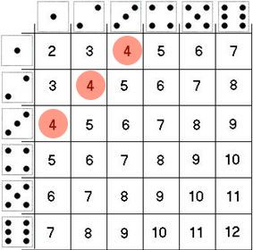

### Variables Aleatorias

Una .bold[variable aleatoria] es una variable cuyos valores son el resultado de un experimento aleatorio.

--

Si $\Omega$ es el espacio muestral de un experimento, una variable aleatoria es una función que _mapea_ el espacio muestral a los números reales: $\Omega \to \mathbb{R}$.


--

Ejemplo:

- Experimento: tirar 2 dados "justos" simultáneamente


--

- Espacio muestral $\Omega$: $\{(1;1),(1;2), \dots, (5;6),(6;6)\}$


<br>
--

$X$ es la variable aleatoria que resulta de sumar el resultado de ambos dados, 

$$X: \{2,3,4,5,6,7,8,9,10,11,12 \}$$


---

### Variables Aleatorias

Cada valor posible de una variable aleatoria tiene una probabilidad conocida de ocurrencia, denotada como $\mathbb{P}(X=x)$.

--

.bold[Ejercicio rápido:] Si $X$ es la variable que resulta de sumar los dos dados (justos) obtenidos ...

<br>
--

.pull-left[

]

.pull-right[
¿Cuál es la probabilidad de que la variable $X$ tome valor 4?

$$\mathbb{P}(X=4) =  \frac{3}{36} = \frac{1}{12}$$
]


---
### Distribución de una variable aleatoria

El conjunto de las probabilidades asociadas a cada posible resultado de una variable aleatoria se denomina la .bold[distribución] de la variable.

--

Continuando con nuestro ejemplo, podemos caracterizar la distribución de X con una función:

.pull-left[
\begin{align}
  f(x) =
  \begin{cases}
    \frac{1}{36}  & \quad \text{si } x=2 \text{ o } x=12\\
    \frac{2}{36}  & \quad \text{si } x=3 \text{ o } x=11\\
    \frac{3}{36}  & \quad \text{si } x=4 \text{ o } x=10\\
    \frac{4}{36}  & \quad \text{si } x=5 \text{ o } x=9\\
    \frac{5}{36}  & \quad \text{si } x=6 \text{ o } x=8\\
    \frac{6}{36}  & \quad \text{si } x=7 \\
    0             & \quad \text{otherwise}
  \end{cases}
\end{align}
]

--

.pull-right[
```{r, echo=FALSE,message=FALSE, warning=FALSE}
library("tidyverse", "knitr")

d1 = 1:6
d2 = 1:6

X = NULL
for (i in d1) {
  for (j in d2) {
    sum_ij = i + j
    X <- c(X,sum_ij)
  }
}

ditrib_X <- table(X) %>% as_tibble() %>% mutate(p=round(n/sum(n),2)) %>% select(-n)
names(ditrib_X) <- c("y","P(X=x)") 
knitr::kable(ditrib_X, format = "markdown", align = 'lc')
```
]


---
### Distribución de una variable aleatoria

.pull-left[

Podemos caracterizar la distribución de X con una función:

<br>

\begin{align}
  f(x) =
  \begin{cases}
    \frac{1}{36}  & \quad \text{si } x=2 \text{ o } x=12\\
    \frac{2}{36}  & \quad \text{si } x=3 \text{ o } x=11\\
    \frac{3}{36}  & \quad \text{si } x=4 \text{ o } x=10\\
    \frac{4}{36}  & \quad \text{si } x=5 \text{ o } x=9\\
    \frac{5}{36}  & \quad \text{si } x=6 \text{ o } x=8\\
    \frac{6}{36}  & \quad \text{si } x=7 \\
    0             & \quad \text{otherwise}
  \end{cases}
\end{align}

]

.pull-right[

<br>

```{r, echo=FALSE,message=FALSE, warning=FALSE, fig.width=6, fig.height=5}
library(tidyverse,knitr)
library(RColorBrewer)

d1 = 1:6
d2 = 1:6

X = NULL
for (i in d1) {
  for (j in d2) {
    sum_ij = i + j
    X <- c(X,sum_ij)
  }
}


table(X) %>% 
  as_tibble() %>% 
  mutate(p=round(n/sum(n),2)) %>% 
  select(-n) %>%
  ggplot(aes(x=factor(as.numeric(X)), y=p, fill="hola", color="black")) +
  geom_bar(stat= "identity", width=1, alpha=0.8) +
  labs(x="X", y="P(X=x)") +
  scale_color_manual(values = "black") +
  scale_fill_manual(values = "#79A51F") +
  theme_minimal() +
  theme(legend.position="none",
        panel.border = element_rect(color = "black", fill = NA, size = 1)) # This line adds the inner box

```

<br>

.bold[Importante:] $\sum_{i=2}^{12} \mathbb{P}(X=i) = 1$

]


---
class: inverse, center, middle

#Distribuciones de Probabilidad


---
### Tipos de variables aleatorias


<br>
--

- .bold[Variables discretas:] variables que solo pueden tomar un número contable de valores distintos y separados, sin valores intermedios posibles entre ellos. Usualmente medidas con números enteros. 

Ejemplo: cara/sello, número de accidentes de tránsito, etc.

<br>
--

- .bold[Variables continuas:] variables que pueden tomar cualquier valor dentro de un rango especificado. Estas variables tienen un número infinito de posibles resultados y no están limitadas a valores aislados. 

Ejemplo: Los ingresos de una persona pueden tomar cualquier valor entre 0 y $\infty$+.


---
### Distribución de una variable aleatoria

El conjunto de las probabilidades asociadas a cada posible resultado de una variable aleatoria se denomina la .bold[distribución] de la variable.

<br> <br>
--

La distribución de una variable se puede caracterizar de manera .bold[única] de (al menos) dos maneras:

- .bold[Función de masa/densidad de probabilidad] (PMF/PDF): $f(x)$

   - En el caso de variables discretas $f(x) = \mathbb{P}(X=x)$. 
   
   - Ejemplo, evaluando $f(5)$ obtenemos la probabilidad de que $X$ tome valor 5.

<br>
--

- .bold[Función de distribución acumulada] (CDF): $F(x) = \mathbb{P}(X \leq x)$

  - Ejemplo, evaluando $F(5)$ obtenemos la probabilidad de que $X$ tome un valor igual o menor a 5.


---
class: inverse, center, middle

##Distribuciones Discretas
### Intuición

---
### Tiro de penal

Final de la Copa Mundial de la FIFA 1994. Roberto Baggio va a tirar su penal ...


.pull-left[

<br>
<br>

.bold[Número finito de resultados posibles]:

- Gol
- Fallo

<br>
.bold[Evento aleatorio]:

- Existe una probabilidad asociada a cada resultado 

]

--

.pull-right[
<br>
<br>
<br>
.center[]
]


---
class: inverse, center, middle

## Distribuciones Discretas
### Distribución Bernoulli


---

### Distribución Bernoulli


.pull-left[
- Experimento: tiramos una moneda al aire. 

- $X$ es una variable aleatoria tal que $X=1$ (Cara) o $X=0$ (Sello).

- La probabilidad de obtener Cara es $p=0.7$ y la de Sello es $1-p = 0.3$

```{r, echo=FALSE,message=FALSE, warning=FALSE, fig.width=6, fig.height=5}

# Load necessary libraries
library(ggplot2)
library(RColorBrewer)

# Function to calculate the probability mass function (PMF) of a Bernoulli distribution
PMF_bernoulli <- function(x, p) {
  ifelse(x == 1, p, 1 - p)
}

# Define the parameter for the Bernoulli distribution
p <- 0.7      # Probability of success

# Create a data frame for plotting the PMF
x_values <- c(0, 1)  # Only two possible outcomes: 0 and 1
PMF_values <- PMF_bernoulli(x_values, p)
PMF_df <- data.frame(x = x_values, PMF = PMF_values)

# Create the ggplot with "Set1" color palette and transparency

ggplot(data = PMF_df, aes(x = factor(x), y = PMF)) +
  geom_bar(stat = "identity", color = "black", fill = "#79A51F", width = 1, alpha=0.8) +
  labs(x = "Outcome",
       y = "P(X = x)") +
  scale_x_discrete(labels = c("Sello (0)", "Cara (1)")) +
  scale_color_manual(values = "#79A51F") +
  scale_fill_manual(values = "#79A51F") +
  theme_minimal() +
  theme(panel.background = element_rect(color = "black", fill = NA, size = 1))  # This line adds the inner border


```

]

--

.pull-right[

.bold[Función de masa probabilistica (PMF):]

<br>

X es una variable aleatoria Bernoulli, es decir

\begin{align}
f(x) =
  \begin{cases}
    p  & \quad \text{si } x=1\\
    1 - p  & \quad \text{si } x=0 \\
    0 & \quad \text{otro}
  \end{cases}
\end{align}

<br>
<br>

En modo más sintético:

$$f(x) = p^{x}(1-p)^{1-x}  \quad \text{si } x=1 \text{ o } x=0$$

]


---

### Distribución Bernoulli

.bold[Ilustración via simulación en] `R`


Tiremos una moneda con probabilidad de obtener "Cara" ( $1$ ) de 70% ( $p=0.7$ )

```{r}
#set.seed(12347)
moneda <- rbinom(n=1, size=1, p=0.7)
print(moneda)
```

<br>
--

Repitamos el proceso 1000 veces ...

```{r}
#set.seed(12347)
monedas <- rbinom(n=1000, size=1, p=0.7)
```

```{r, echo=FALSE}
#set.seed(12347)
monedas <- rbinom(n=1000, size=1, p=0.7)
print(head(monedas,20))
print(paste("P(Cara) = ",mean(monedas)))
```


---
class: inverse, center, middle

## Distribuciones Discretas
### Distribución Binomial


---

### Distribución Binomial 

La distribución binomial es la distribución de la suma de variables Bernoulli *independientes y con distribución idéntica* (.bold[iid]). 

<br>
--

Ejemplo,

- Supongamos que $X$ es una variable de Bernoulli que toma el valor 1 cuando se obtiene "Cara" al lanzar una moneda

- $\mathbb{P}(X=1)=p$ 

<br>
--

- Ahora, supongamos que lanzamos la misma moneda 3 veces. Llamamos a estas variables $X_{1}, X_{2}, X_{3}$

- Definamos $Y = X_{1} + X_{2} + X_{3}$ 

--

- $Y$ sigue una distribución Binomial, o $Y \sim \text{Binomial}$

---
### Distribución Binomial 


.bold[Ejercicio rápido:]

<br>

.content-box-primary[
.bolder[Pregunta 1:]
¿Cuál es la probabilidad de obtener tres "Caras"? Es decir, ¿Cuál es la probabilidad de que $Y=3$?]

--

.content-box-secondary[
- Dado que los 3 ensayos son independientes podemos expresar esta probabilidad como:

$$\mathbb{P}(Y=3) =  \mathbb{P}(X_{1}=1,X_{2}=1,X_{3}=1) = \mathbb{P}(X_{1}=1)\mathbb{P}(X_{2}=1)\mathbb{P}(X_{3}=1)$$
<br>

- Y dado que las tres variables distribuyen Bernoulli con la misma probabilidad $p$, obtenemos: 

$$\mathbb{P}(Y=3) = p \times p \times p =  p^{3}$$
]
---
### Distribución Binomial 


.content-box-primary[
.bolder[Pregunta 2:]
¿Cuál es la probabilidad de obtener 2 "Caras" con 3 tiros? Es decir, ¿Cuál es la probabilidad de que $Y=2$?
]

--

- Por simpleza, consideremos la siguiente secuencia: $\{X_{1}=1,X_{2}=1,X_{3}=0\}$, que satisface $Y=2$

--

- La probabilidad de obtener esta secuencia es:

\begin{align}
  \mathbb{P}(X_{1}=1,X_{2}=1,X_{3}=0)  &= \mathbb{P}(X_{1}=1) \times \mathbb{P}(X_{2}=1) \times \mathbb{P}(X_{3}=0)  \\
                              &= p \times p \times (1-p) =  p^{2}(1-p)
\end{align}

--

- Sin embargo, hay 3 secuencias que satisfacen $Y=2$.
--
 También $\{X_{1}=1,X_{2}=0,X_{3}=1\}$ y $\{X_{1}=0,X_{2}=1,X_{3}=1\}$, cada una con probabilidad de ocurrencia $p^{2}(1-p)^{1}$. Por tanto:

--

.content-box-secondary[
.bolder[Respuesta:] la probabilidad de conseguir 2 "Caras" con 3 tiros es:
$$\mathbb{P}(Y=2) = 3 \times  p^{2}(1-p)^{1}$$
]

---

### Distribución Binomial 

.bold[Generalización]: lanzamos la misma moneda $n$ veces y la variable $Y$ cuantifica el número de "Caras" (1) obtenidas.

$$Y = \sum^{n}_{i=1} X_{i}$$
--

.content-box-primary[
.bolder[Pregunta:]
¿Cuál es la probabilidad de conseguir $y$ "Caras" con $n$ tiros?
]

--

* La probabilidad de obtener una secuencia particular con $y$ "Caras" a partir de $n$ lanzamientos es $p^{y}(1-p)^{n-y}$ 

* Existen ${n \choose y} = \frac{n!}{y! (n-y)!}$ secuencias de este tipo...

--
Por tanto,

$$\mathbb{P}(Y=y) = f(y) = \frac{n!}{y! (n-y)!} \times p^{y} (1-p)^{n-y}$$
--
En otras palabras, $Y$ distribuye binomial con .bold[parámetros] $n$ y $p$: $Y \sim \text{Binomial}(n,p)$


---
### Distribución Binomial 

En práctica ...
<br>

--

 - **Contexto**: Tenemos una moneda que, cuando se lanza, tiene una probabilidad de $p = 0.6$ de caer en "Cara" y una probabilidad de $1-p = 0.4$ de caer en "Sello".

--

- **Problema**:¿Cuál es la probabilidad de obtener 3 "Caras" con 10 lanzamientos?

--

- **Solución**: $X \sim \text{Binomial}(n=10,p=0.6)$

<br>
--

$\quad \quad \quad \mathbb{P}(X=3) = \binom{10}{3} \times (0.6)^3 \times (0.4)^{10-3}$

<br>
--

$\quad \quad \quad \mathbb{P}(X=3) = \frac{10!}{3! \times 7!} \times (0.6)^3 \times (0.4)^7$

<br>
--

$\quad \quad \quad \mathbb{P}(X=3) = \frac{10 \times 9 \times \dots 1}{(3 \times 2 \times1) \times (7 \times 6 \times \dots 1 )} \times (0.6)^3 \times (0.4)^7$

<br>
--

$\quad \quad \quad \mathbb{P}(X=3) = 120 \times 0.216 \times 0.0028$

<br>
--

$\quad \quad \quad \mathbb{P}(X=3) \approx 0.0425$

---

### Distribución Binomial


.pull-left[
- Ahora observamos la distribución completa

- La probabilidad de obtener $0, 1, \dots, 10$ caras es:

```{r, echo=FALSE,message=FALSE, warning=FALSE, fig.width=8, fig.height=6}

# Load necessary libraries
library(ggplot2)
library(RColorBrewer)

# Parameters for the binomial distribution
n <- 10       # Number of trials
p <- 0.6      # Probability of success

# Create a data frame for plotting the PMF
x_values <- 0:n  # Possible outcomes range from 0 to n
PMF_values <- dbinom(x_values, n, p)  # PMF for binomial distribution
PMF_df <- data.frame(x = x_values, PMF = PMF_values)

# Create the ggplot with "Set1" color palette and transparency
ggplot(data = PMF_df, aes(x = factor(x), y = PMF)) +
  geom_bar(stat = "identity", color = "black", fill = "#79A51F", width = 1, alpha=0.8) +
  labs(x = "Number of Successes",
       y = "P(X = x)") +
  scale_x_discrete(labels = as.character(0:10)) +
  scale_color_manual(values = "black") +
  scale_fill_manual(values = "#79A51F") +
  theme_minimal() +
  theme(panel.background = element_rect(color = "black", fill = NA, size = 1))  # This line adds the inner border

```

]

--

.pull-right[

.bold[Función de masa probabilistica (PMF):]

<br>

X es una variable aleatoria Binomial, es decir

\begin{align}
\mathbb{P}(X=x) = f(x) = \frac{n!}{x! (n-x)!}  p^{x} (1-p)^{n-x}
\end{align}

<br>

En este caso,

$n=10$ y $p=0.6$

]

---
### Distribución Binomial

.pull-left[
- Ahora observamos la distribución completa

- ¿Cual es la probabilidad de obtener 5 monedas o menos?

```{r, echo=FALSE,message=FALSE, warning=FALSE, fig.width=8, fig.height=6}

# Parameters for the binomial distribution
n <- 10       # Number of trials
p <- 0.6      # Probability of success

# Create a data frame for plotting the PMF
x_values <- 0:n  # Possible outcomes range from 0 to n
PMF_values <- dbinom(x_values, n, p)  # PMF for binomial distribution
PMF_df <- data.frame(x = x_values, PMF = PMF_values)

# Filter the dataframe to get bars from 0 to 5
overlay_df <- subset(PMF_df, x <= 5)

# Create the ggplot with "Set1" color palette and transparency
ggplot(data = PMF_df, aes(x = factor(x), y = PMF)) +
  geom_bar(stat = "identity", color = "black", fill = "#79A51F", width = 1, alpha=0.8) +
  geom_bar(data = overlay_df, aes(x = factor(x), y = PMF), stat = "identity", color = "black", fill = "#B210C1", width = 1, alpha=0.6) +
  labs(x = "Number of Successes",
       y = "P(X = x)") +
  scale_x_discrete(labels = as.character(0:10)) +
  scale_color_manual(values = "black") +
  scale_fill_manual(values = c("#79A51F", "#B210C1")) +
  theme_minimal() +
  theme(panel.background = element_rect(color = "black", fill = NA, size = 1))  # This line adds the inner border


```

]

.pull-right[

.bold[Función de distribución acumulada (CDF):]

<br>

X es una variable aleatoria Binomial, es decir

\begin{align}
F(k; n, p) &= \mathbb{P}(X \leq k) \\ \\
           &= \sum_{i=0}^{k} \mathbb{P}(X=i) \\ \\
           &= \frac{n!}{i! (n-i)!}  p^i (1-p)^{n-i} 
\end{align}


En este caso,

\begin{align}
F(k=5; n=10, p=0.6) &=  \mathbb{P}(X=0) + \dots + \mathbb{P}(X=5) \\ \\
                    &\approx 0.366
\end{align}

]

---
### Distribución Binomial


.pull-left[
- Ahora observamos la distribución completa

- ¿Cual es la probabilidad de obtener 5 monedas o menos?

```{r, echo=FALSE,message=FALSE, warning=FALSE, fig.width=8, fig.height=6}

# Parameters for the binomial distribution
n <- 10       # Number of trials
p <- 0.6      # Probability of success

# Create a data frame for plotting the CDF
x_values <- 0:n  # Possible outcomes range from 0 to n
CDF_values <- pbinom(x_values, n, p)  # CDF for binomial distribution
CDF_df <- data.frame(x = x_values, CDF = CDF_values)

# Modify the dataframe to create segments for stepwise representation
CDF_df$start_x <- c(NA, head(CDF_df$x, -1))
CDF_df$start_CDF <- c(0, head(CDF_df$CDF, -1))

# Filter the dataframe to get values from 0 to 5 for the overlay
overlay_df <- subset(CDF_df, x <= 5)

# Create the ggplot
ggplot() +
  # Horizontal segments for CDF
  geom_hline(yintercept=0.1501822, linetype = "dashed",  size = 1) + 
  geom_segment(data = CDF_df, aes(x = start_x, y = CDF, xend = x, yend = CDF), color = "#79A51F", size = 1.2) +
  # Vertical segments for CDF
  geom_segment(data = CDF_df, aes(x = x-1, y = start_CDF, xend = x-1, yend = CDF), color = "#79A51F", size = 1.2) +
  labs(x = "Number of Successes", y = "P(X ≤ x)") +
  scale_x_continuous(breaks = 0:n) +
  theme_minimal() +
  theme(panel.background = element_rect(color = "black", fill = NA, size = 1))  # This line adds the inner border

```

]

.pull-right[

.bold[Función de distribución acumulada (CDF):]

<br>

X es una variable aleatoria Binomial, es decir

\begin{align}
F(k; n, p) &= \mathbb{P}(X \leq k) \\ \\
           &= \sum_{i=0}^{k} \mathbb{P}(X=i) \\ \\
           &= \frac{n!}{i! (n-i)!}  p^i (1-p)^{n-i} 
\end{align}


En este caso,

\begin{align}
F(k=5; n=10, p=0.6) &=  \mathbb{P}(X=0) + \dots + \mathbb{P}(X=5) \\ \\
                    &\approx 0.366
\end{align}

]


---
class: inverse, center, middle


##Hasta la próxima clase. Gracias!

<br>
Mauricio Bucca <br>
https://mebucca.github.io/ <br>
github.com/mebucca

