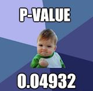
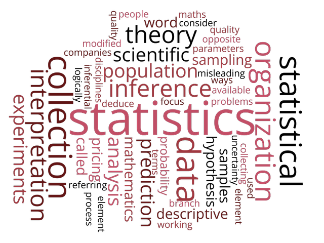

```{r course-style, include=FALSE}
source("../_shared/bikeshare.R")
course_palette <- use_course_style("barcelona")
```

## Antes · Hoy · Después {.class-rhythm}

::: {.full-width}

::: {.content-box}
**Antes**

fundamentos de teoría de probabilidad.
:::

::: {.content-box-primary}
**Hoy**

presentación, expectativas y forma de trabajo.
:::

::: {.content-box-secondary}
**Después**

variables aleatorias y distribuciones discretas.
:::

:::


# Presentación del curso {.inverse .center .middle}

## Sobre mi
  - Profesor Asistente, Sociología UC

. . .

  - Max Weber Postdoctoral Fellow, European University Institute, Firenze
  - PhD en Sociología, Cornell University, NY
    - PhD Minor en Estadística, Departamento de Estadística, Cornell University

. . .

  - Investigación: movilidad social intergeneracional,  desigualdades en el mercado laboral, creencias sobre las desigualdades, métodos cuantitativos
  - Métodos: modelación estadística, estrategias empíricas para inferencia causal, métodos experimentales y computacionales
    - Datos categóricos: desarrollos en "log-linear models"

. . .

[Información de contacto]{.bold}
 - mail: mebucca@uc.cl
 - webpage: https://mebucca.github.io/

## Ayudantía

::: {.pull-left}

[Roberto Cantillán]{.bold}

- Estudiante doctorado en Sociología PUC
- Investigador Núcleo Milenio para el Estudio de Desajustes del Mercado Laboral (LM²C²)
- Investigación: Desigualdades, sociología analítica, consolidación y homofilia, mercados laborales. 
- Métodos: Análisis de redes sociales, modelos multinivel, inferencia causal. 

:::

::: {.figure-right}


:::

# Filosofía de enseñanza {.inverse .center .middle}

---

### 1. Los "atajos" estadísticos dificultan el aprendizaje

. . .

::: {.center}



:::

---

### 2. La sola intuición no es suficiente

. . .

::: {.pull-left}

[Muchas cosas parecen más difíciles de lo que son]{.bold}
[$$\int xf(x)dx := \mu $$]{.huge}

:::

. . .

::: {.pull-right}

[Otras parecen más simples de lo que son]{.bold}
[ $$X   \text{ es una variable}$$]{.huge}

:::

. . .

- Vacíos de conocimiento, notación, poca exposición a las matemáticas.
- Este curso nivela estos vacíos activamente. No hay carta bajo la manga.

---

### 3. Menos es más

. . .

::: {.pull-left}

[Muchos métodos]{.bold}


:::

. . .

::: {.pull-right}

[Fundamentos sólidos]{.bold}


:::

# Recursos {.inverse .center .middle}

## Repositorio Github
Todo el material del curso será almacenado y actualizado regularmente en repositorio `Github`:

::: {.center}


[https://github.com/mebucca/ad2-sol114]{.bold}

:::

## Horario de consulta y ayudantías

::: {.center}


:::

## Gracias {.inverse .center .middle .closing}

**Hasta la próxima clase**

Mauricio Bucca
