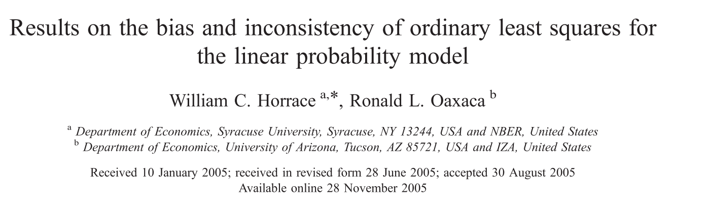
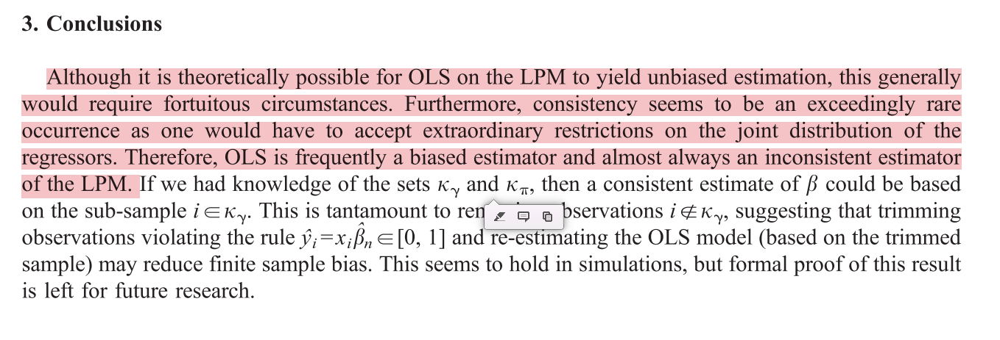
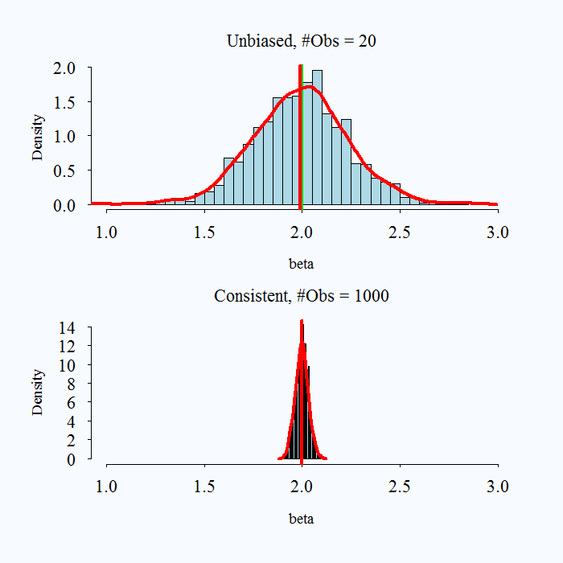
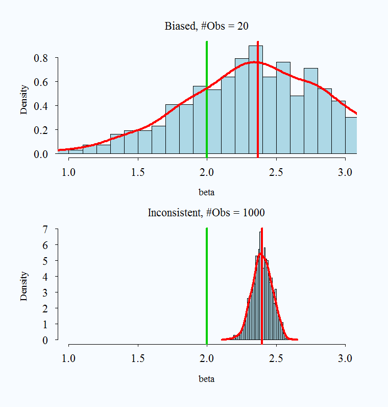
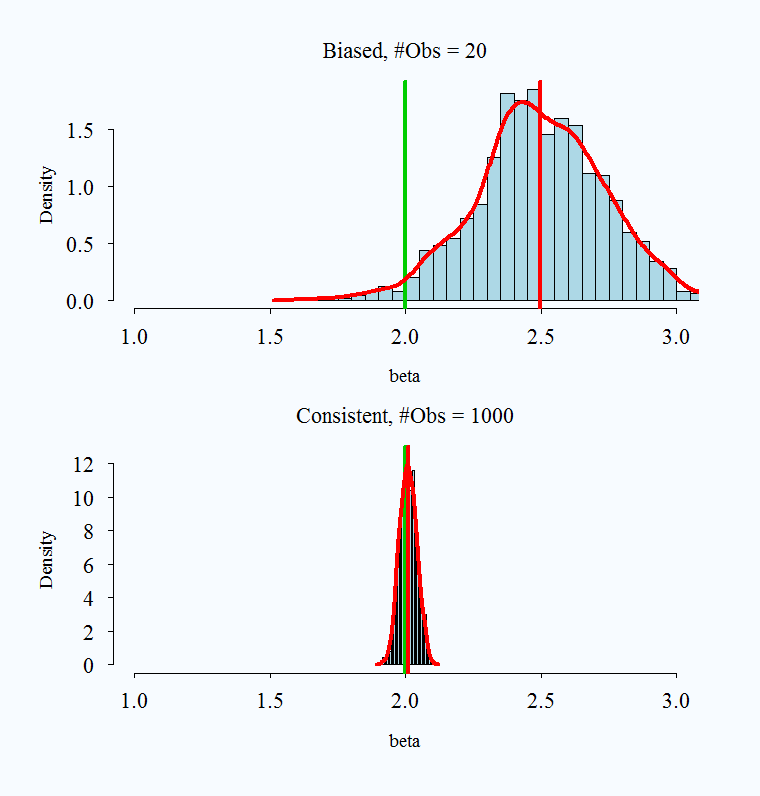
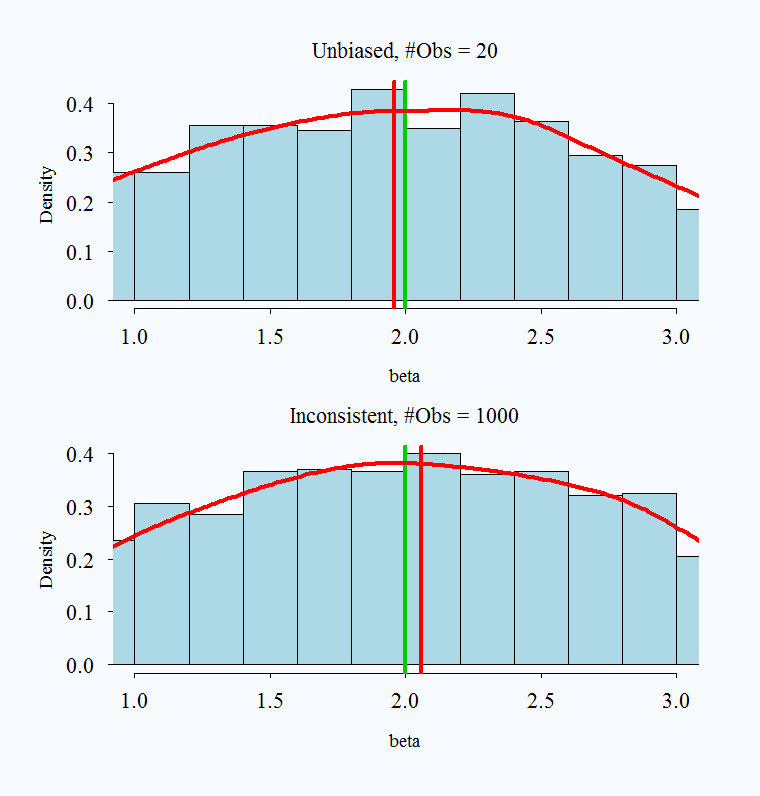
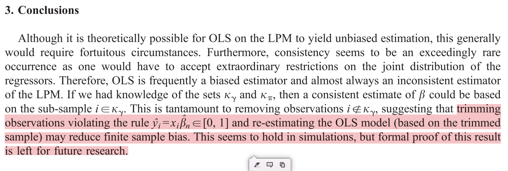
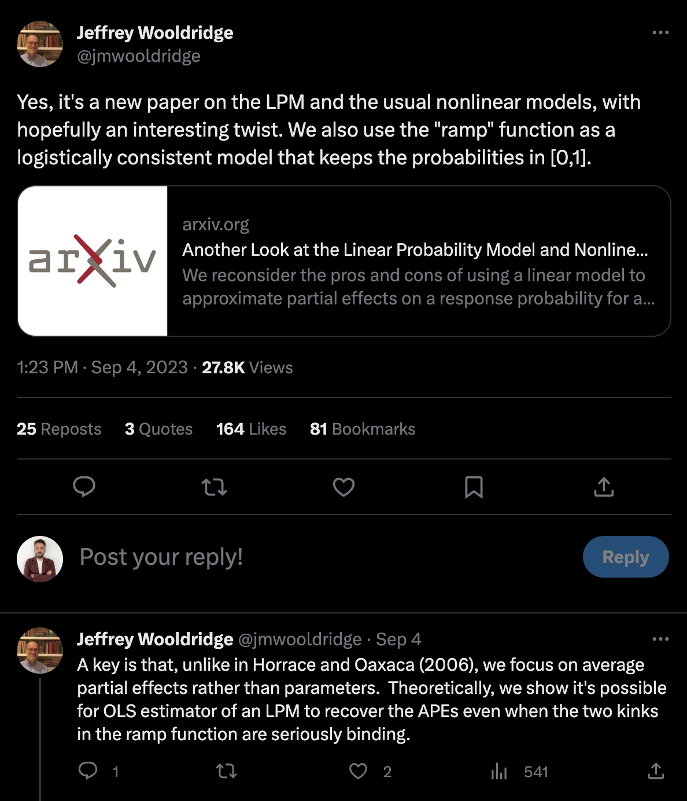
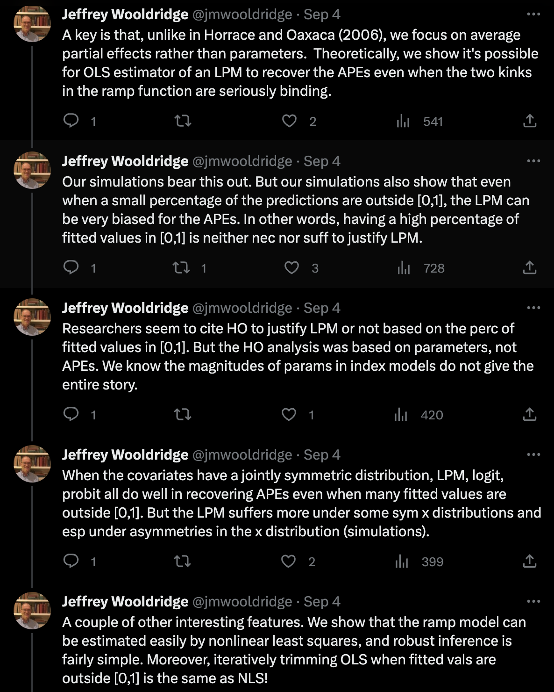

```{r course-style, include=FALSE}
source("../_shared/bikeshare.R")
course_palette <- use_course_style("boca")
```

## Antes · Hoy · Después {.class-rhythm}


::: {.full-width}


::: {.content-box}
**Antes**

estimación, MLE y funciones de pérdida.
:::


::: {.content-box-primary}
**Hoy**

modelo lineal de probabilidad y sus límites.
:::


::: {.content-box-secondary}
**Después**

modelos lineales generalizados.
:::

:::


## Un mismo conjunto de modelos, dos usos distintos

Las próximas clases (7 a 15) presentan un conjunto de modelos —LPM, GLM, logit, logit multinomial, Poisson— con un uso **explicativo/inferencial**: nos interesa el efecto de cada predictor, su significancia, su interpretación sustantiva.

. . .

Más adelante en el curso (clases 17 a 22) **no vamos a introducir modelos distintos**: vamos a retomar exactamente estos mismos modelos, pero usados con un fin **predictivo/clasificatorio** — qué tan bien anticipan casos nuevos, no solo qué tan bien explican los datos que ya tenemos.

. . .

Misma matemática, dos preguntas distintas. Vale la pena tenerlo en mente desde ahora.

# Modelo Lineal de Probabilidad {.inverse .center .middle}
## Modelos de regresión para variable dependiente categórica

## Repaso: regresión lineal


::: {.pull-left}


:::


::: {.pull-right}


::: {.huge}


::: {.bold}

Todo lo que siempre quisiste saber sobre regresión lineal (ˆ)

:::

:::

(ˆ) [_Pero nunca te atreviste a preguntar_ ]{.bold}

:::

## Estructura de un modelo de regresión lineal
Un modelo de regresión lineal estándar tiene la siguiente estructura:

$$y_{i} = \overbrace{\beta_{0} + \beta_{1}x_{1i} + \dots \beta_{k}x_{ki}}^{\hat{y}} + e_{i}$$
donde:

. . .

- $y$ es la variable dependiente
- $x_{1} \dots x_{k}$ son predictores o variables independientes 
- $\beta_{1} \dots \beta_{k}$ son los respectivos "efectos" de los predictores sobre $y$
- $e$ es un término de error aleatorio ("white noise")
- $\hat{y} \perp e$

## Estructura de un modelo de regresión lineal
Podemos repensar el LM de la siguiente forma:

. . .

[Setup]{.bold}

- Tenemos $n$ observaciones (individuos) independientes: $i = 1, \dots, n$

. . .

- Para cada individuo observamos un valor en la variable dependiente $y_{i}$, tal que  $y_{i} \in \mathbb{R}$

. . .

- Estos resultados son realizaciones de variables aleatorias $\text{Normal}(\mu_{i}, \sigma_{i})$ con media y varianza desconocida: misma distribución pero parámetros (potencialmente) distintos
  - Notar que es imposible identificar estos parámetros individualmente ( $n$ observaciones y $2n$ parámetros)

## Estructura de un modelo de regresión lineal
El modelo de regresión lineal estándar "resuelve" este problema de la siguiente manera
$$y_{i} \sim \text{Normal}(\mu_{i}, \sigma_{i}) \quad \quad \text{ donde}$$

. . .

-  $\mu_{i} = \beta_{0} + \beta_{1}x_{1i} + \dots \beta_{k}x_{ki}$

. . .

$\quad =\mathbb{E}(y_{i} \mid x_{1}, \dots, x_{k})$

. . .

- $\sigma^{2}_{i} =  \sigma^{2}$

. . .

$\quad =\operatorname{Var}(y_{i} \mid x_{1}, \dots, x_{k})$

. . .

- $x_{1}, \dots, x_{k}$ son valores fijos, no variables aleatorias

. . .

- Todo lo anterior implica que, si $(e_{i} = y_{i} - \mu_{i})$, entonces

. . .

$\quad e_{i} = \text{Normal}(\mu_{i}, \sigma) - \mu_{i} \sim  \text{Normal}(0, \sigma)$

. . .

En resumen,


::: {.content-box-primary}

$$\color{white}{ y_{i} \sim \text{Normal}(\mu_{i}, \sigma) \quad  \text{ o, equivalentemente: } \quad  y_{i} = \mu_{i} + \text{Normal}(0, \sigma)}$$

:::

. . .

Notar que  LM describe los datos con $k + 2$ parámetros: $\beta_{0}, \beta_{1}, \dots, \beta_{k}, \sigma$

## Estructura de un modelo de regresión lineal
Es común encontrar el modelo lineal escrito en forma matricial:


::: {.pull-left}

$$\boldsymbol{y} \sim \text{Normal}_{n}(\boldsymbol{X}\boldsymbol{\beta},\boldsymbol{\Sigma}) \quad \text{ donde ...}$$

:::


::: {.pull-right}

- $\boldsymbol{y}$ es un vector que contiene las diferentes $y_{i}, \dots, y_{n}$
- $\boldsymbol{\mu} = \boldsymbol{X}\boldsymbol{\beta} = \beta_{0} + \beta_{1}\boldsymbol{x}_{1} + \dots + \beta_{k}\boldsymbol{x}_{k}$
- $\boldsymbol{\Sigma}$ es la matriz de varianza-covarianza entre las observaciones

:::

. . .

visualmente:
$$\begin{bmatrix}
y_{1} \\  \vdots \\ y_{n}
\end{bmatrix}_{(n,1)} \sim \text{Normal}_{n}\Bigg(  \boldsymbol{\mu} = \begin{bmatrix}
\beta_{0} + \beta_{1}x_{11} + \dots \beta_{k}x_{k1} \\
 \vdots \\ \beta_{0} + \beta_{1}x_{1n} + \dots \beta_{k}x_{kn}
\end{bmatrix}_{(n,1)} , \boldsymbol{\Sigma} = \begin{bmatrix}
    \sigma^{2}    & 0      & \ldots         & 0      \\
    0      & \sigma^{2}     & \ldots         & 0      \\
    \vdots & \vdots & \sigma^{2}   & \vdots \\
    0      & 0      & \ldots         & \sigma^{2} 
\end{bmatrix}_{(n,n)}\Bigg)$$

## Modelo de regresión lineal
"Ensamblemos" el modelo via Monte Carlo Simulation. "Data Generating Process" ([DGP]{.bold}):

. . .

```{r,  include=TRUE, echo=FALSE, warning=FALSE, message=FALSE}
library(pacman)
p_load("tidyverse")
p_load("ISLR2")
p_load("cowplot")
p_load("ggridges")
p_load("modelr")

# La tipografía la provee el theme compartido de Quarto del curso.
primary_color <- course_palette[["primary"]]
secondary_color <- course_palette[["secondary"]]
paris_colors <- course_colors(course_palette, 6)

```
```{r}
set.seed(87742) # seed
n <- 5000 # observaciones
x <- sample(1:100,n,replace=TRUE) # 1 predictor o var independiente
```
```{r, echo=FALSE}
glimpse(x)
```
```{r}

# parámetros
sigma <- 7 # sd
b_0 <- 10 # intercepto
b_1 <- 1.1 # coeficiente de x
mu <- b_0 + b_1*x # valor predicho
```
```{r, echo=FALSE}
glimpse(mu)
```
```{r}

# variable dependiente
y <- rnorm(n,mu,sigma) # variable dependiente. Equivalente: y <- mu + rnorm(n,0,sigma)
```
```{r, echo=FALSE}
glimpse(y)
```

## Estimación modelo de regresión lineal:


::: {.pull-left}


::: {.content-box-primary}

[OLS]{.bold}
$$\color{white}{\hat{\boldsymbol{\beta}}_{OLS} = \underset{\beta}{\arg\min\ } \sum_{i=1}^{n} (y_{i} - \boldsymbol{X}_{i}'\boldsymbol{\beta})^{2} \quad \text{ donde}}$$

:::

:::


::: {.pull-right}

- $\boldsymbol{y}$ es el vector $y_{i}, \dots, y_{n}$
- $\boldsymbol{X}_{i}'\boldsymbol{\beta} = \beta_{0} + \beta_{1}x_{1i} + \dots + \beta_{k}x_{ki}$

:::

. . .


::: {.pull-left}


::: {.content-box-primary}

[MLE]{.bold}
$$\color{white}{\hat{\boldsymbol{\beta}}_{MLE} = \underset{\beta}{\arg\max\ } \prod_{i=1}^{n} \frac{1}{\sqrt{2\pi\sigma^{2}}} e^{- \frac{(y_{i} - \boldsymbol{X}_{i}'\boldsymbol{\beta})^{2}}{2\sigma^{2}}} \quad \text{ donde}}$$

:::

:::


::: {.pull-right}

* $\frac{1}{\sqrt{2\pi\sigma^{2}}} e^{- \frac{(x - \mu)^{2}}{2\sigma^{2}}}$ es la densidad de probabilidad de una variable aleatoria $X \sim \mathcal{N}(\mu,\sigma^2)$

:::

```{css, echo=FALSE}
.pull-right ~ * { clear: unset; }
.pull-right + * { clear: both; }
```

. . .

Ambos métodos producen mismos resultados en el caso de LM.

## Modelo de regresión lineal
Ahora estimemos los parámetros de nuestro modelo via OLS 
```{r, message=FALSE}
our_data <- tibble(y=y, x=x)
our_lm_ols <- lm(y ~ x, data=our_data) # "fit" el modelo usando función lm()
print(summary(our_lm_ols)) # analicemos nuestros resultados
```

## Modelo de regresión lineal
Ahora estimemos los parámetros via MLE
```{r}
our_lm_mle <- glm(y ~ x, family="gaussian", data=our_data) # "fit" modelo usando función glm()
print(summary(our_lm_mle)) # analicemos nuestros resultados
```

## Modelo de regresión lineal


::: {.pull-left}

```{r, echo=FALSE, message=FALSE,warning=FALSE}

p_load(ggplot2)
p_load(viridis)
p_load(dplyr)
p_load(tibble)

# Se asume que ya existen our_lm_ols, x e y

new_x = c(50,60)
new_y = predict(our_lm_ols, newdata = tibble(x=new_x))

positions_v <- data.frame(x1 = new_x, x2 = new_x, y1 = c(0,0), y2 = new_y)
positions_h <- data.frame(x1 = c(0,0), x2 = new_x, y1 = new_y, y2 = new_y)

# Generar el gráfico
plot <- tibble(x=x,y=y) %>%
  ggplot(aes(x=x, y=y)) +
  geom_point(color = primary_color, size=2.5, alpha=0.05) +
  geom_smooth(method='lm', formula= y ~ x, size=1.5, color=course_palette[["secondary"]], se=FALSE) + # se=FALSE para quitar la región sombreada
  geom_segment(aes(x = x1, y = y1, xend = x2, yend = y2), data = positions_v, color=primary_color, size=1.5) +
  geom_segment(aes(x = x1, y = y1, xend = x2, yend = y2), data = positions_h, color=primary_color, size=1.5) +
  annotate(geom="text", x=69, y=60, label='bold("(x=50,y=64.9)")', color="black", parse=TRUE, size=8) +
  annotate(geom="text", x=80, y=81, label='bold("(x=60,y=75.9)")', color="black", parse=TRUE, size=8) +
  theme_julia() +
  theme(
    legend.position="none",
    axis.text.y = element_text(size = 22, color = "black"),
    axis.text.x = element_text(size = 22, color = "black"),
    axis.title.y = element_text(size = 24, color = "black"),
    axis.title.x = element_text(size = 24, color = "black"),
    panel.border = element_blank()
  )

plot

```

:::

. . .


::: {.pull-right}

Observamos que:

-  $\mathbb{E}(y_{i} \mid x = 50) = 64.9$
-  $\mathbb{E}(y_{i} \mid x = 60) = 75.9$
- Estas "medias condicionales" no son determinísticas sino [_probabilísticas_]{.bold}.
- Específicamente, sabemos que:
  - $y_{i} \mid x = 50  \sim \text{Normal}(\mu= 64.9, \sigma=7)$ 
  - $y_{i} \mid x = 60  \sim \text{Normal}(\mu= 75.9, \sigma=7)$

:::

## Modelo de regresión lineal


::: {.pull-left}

Así se ve:

-  $\mathbb{E}(y_{i} \mid x = 50) = 64.9$
-  $\mathbb{E}(y_{i} \mid x = 60) = 75.9$

donde:
  - $y_{i} \mid x = 50  \sim \text{Normal}(\mu= 64.9, \sigma=7)$ 
  - $y_{i} \mid x = 60  \sim \text{Normal}(\mu= 75.9, \sigma=7)$

:::


::: {.pull-right}

```{r pred, echo=FALSE}
b_0_hat <- our_lm_ols$coefficients[1]
b_1_hat <- our_lm_ols$coefficients[2]
y_hat <- b_0_hat + b_1_hat*c(50,60)
sigma_hat <- summary(our_lm_ols)$sigma

y_seq <- seq(min(y_hat) - 3*sigma_hat, max(y_hat) + 3*sigma_hat, length.out = 1000)
density_y_x50 <- dnorm(y_seq, mean = y_hat[1], sd = sigma_hat)
density_y_x60 <- dnorm(y_seq, mean = y_hat[2], sd = sigma_hat)

```
```{r, echo=FALSE, message=FALSE, warning=FALSE, fig.height=5}

bind_rows(
  tibble(y=y_seq, density=density_y_x50, x=rep(50, length(y_seq))),
  tibble(y=y_seq, density=density_y_x60, x=rep(60, length(y_seq)))
) %>%
ggplot(aes(x=y, y=density, fill=factor(x))) + 
  geom_area(alpha=0.2, position = "identity", color = "black", size = 0.1) +  # adding border
  scale_fill_manual(values=c("50"=course_palette[["secondary"]], "60"=primary_color)) +
  geom_vline(aes(xintercept = y_hat[1]), linetype="dashed", size=0.7) +  # vertical line for x=50
  geom_vline(aes(xintercept = y_hat[2]), linetype="dashed", size=0.7) +  # vertical line for x=60
  annotate("text", x = y_hat[1] + 1, y = 0.06, label = paste("E(y | x =", 50, ")"), hjust = 0) +  # annotation for x=50
  annotate("text", x = y_hat[2] + 1, y = 0.06, label = paste("E(y | x =", 60, ")"), hjust = 0) +  # annotation for x=60
  labs(title="Distribución de y | x", y="densidad", x="y", fill="x") +
   theme_julia() +
   theme(
    axis.text.y = element_text(size = 22, color = "black"),
    axis.text.x = element_text(size = 22, color = "black"),
    axis.title.y = element_text(size = 24, color = "black"),
    axis.title.x = element_text(size = 24, color = "black"),
    panel.border = element_blank(),
    legend.text = element_text(size = 18)
  )

```

:::

## Interpretación coeficientes en LM

$$\text{Si } \quad \quad y_{i} = \overbrace{\beta_{0} + \beta_{1}x_{1i} + \dots \beta_{k}x_{ki}}^{\mathbb{E}(y_{i} \mid x_{1}, \dots, x_{k})} + \underbrace{e_i}_{\sim \text{Normal}(0,\sigma)}$$

## Interpretación coeficientes en LM

$$\text{Si } \quad \quad y_{i} = \overbrace{\beta_{0} + \beta_{1}x_{1i} + \dots \beta_{k}x_{ki}}^{\mathbb{E}(y_{i} \mid x_{1}, \dots, x_{k})} + \underbrace{e_{i}}_{\sim \text{Normal}(0,\sigma)}$$

Entonces decimos que el efecto de $x_{k}$ sobre $y$ es $\beta_{k}$. ¿Qué significa?


::: {.pull-left}

$$\frac{\partial \mathbb{E}(y_{i} \mid x_{1}, \dots, x_{k})}{\partial x_{k}} = \beta_{k}$$

:::


::: {.pull-right}

"Un cambio en $\Delta$ unidades de $x_{k}$ se traduce en un cambio en $\Delta$ $\beta_{k}$ unidades en el valor esperado de $y_{i}$"

:::

## Interpretación coeficientes en LM
En nuestro ejemplo:


::: {.pull-left}

```{r}
print(our_lm_ols)
```

:::


::: {.pull-right}

Si `x=50`, entonces `y`=
```{r}
10.2 + 1.1*50
```
Si `x=51`, entonces `y`=
```{r}
10.2 + 1.1*51
```
Por tanto, $\beta$=
```{r}
((10.2 + 1.1*51)-(10.2 + 1.1*50))/(51 - 50)
```

:::

## Interpretación coeficientes en LM
Un ejemplo más complejo: podemos incluir interacciones y efectos no lineales
```{r}
set.seed("87742") # seed
n <- 10000 # observaciones
x <- sample(1:100,n,replace=TRUE) # variable independiente continua
d <- sample(0:1,n,replace = TRUE) # dicotómica
```
```{r}

# parámetros
sigma <- 50 # sd
b_0 <- 10  # intercepto
b_1 <- 0.1  # coeficiente de variable x^2
b_2 <- 2  # coeficiente de variable dummy d
b_3 <- 0.05 # coeficiente interacción x^2*d 

mu <- b_0 + b_1*I(x^2) + b_2*d + b_3*I(x^2)*d   # valor predicho
```
```{r}

# variable dependiente
y <- mu + rnorm(n,0,sigma)
```
```{r, echo=FALSE}
glimpse(y)
```

## Interpretación coeficientes en LM
Estimamos los parámetros  via OLS 
```{r}
our_data2 <- tibble(y=y, x=x, d=d) 
our_lm_ols2 <- lm(y ~ I(x^2)*factor(d), data=our_data2) # "fit" el modelo usando función lm()
print(summary(our_lm_ols2)) # analicemos nuestros resultados
```

## Interpretación coeficientes en LM


::: {.pull-left}

```{r, echo=FALSE, warning=F}

# Calcular valores esperados para x=60 y x=90
mu_x60_d0 = b_0 + b_1*(60^2)
mu_x60_d1 = b_0 + b_1*(60^2) + b_2 + b_3*(60^2)
mu_x90_d0 = b_0 + b_1*(90^2)
mu_x90_d1 = b_0 + b_1*(90^2) + b_2 + b_3*(90^2)

# Actualizar data frames para los segmentos
positions_v <- data.frame(x = c(60, 60, 90, 90), y = c(0, 0, 0, 0), yend = c(mu_x60_d0, mu_x60_d1, mu_x90_d0, mu_x90_d1), d = c(0, 1, 0, 1))
positions_h <- data.frame(x = c(0, 0, 0, 0), xend = c(60, 60, 90, 90), y = c(mu_x60_d0, mu_x60_d1, mu_x90_d0, mu_x90_d1), d = c(0, 1, 0, 1))

# Continuar con el gráfico igual que antes
plot <- ggplot(our_data2, aes(x=x, y=y, group=factor(d), colour=factor(d))) +
  geom_point(size=2.5, alpha=0.05) +
  scale_color_manual(values=c(course_palette[["secondary"]], course_palette[["primary"]])) +
  geom_smooth(method='lm', formula= y ~ I(x^2), size=1.5, aes(group=factor(d)))

# Para los segmentos, fijar el color según el valor de d
plot + 
  geom_segment(data=subset(positions_v, d == 0), aes(x=x, y=y, xend=x, yend=yend), color=course_palette[["primary"]], size=1.5) +
  geom_segment(data=subset(positions_v, d == 1), aes(x=x, y=y, xend=x, yend=yend), color=course_palette[["secondary"]], size=1.5) +
  geom_segment(data=subset(positions_h, d == 0), aes(x=x, y=y, xend=xend, yend=y), color=course_palette[["primary"]], size=1.5) +
  geom_segment(data=subset(positions_h, d == 1), aes(x=x, y=y, xend=xend, yend=y), color=course_palette[["secondary"]], size=1.5) +
annotate("text", x=50, y=mu_x60_d0 + 50, label=sprintf("(%d, %.0f)", 60, mu_x60_d0), size=6, fontface="bold") + 
annotate("text", x=50, y=mu_x60_d1 + 50, label=sprintf("(%d, %.0f)", 60, mu_x60_d1), size=6, fontface="bold") + 
annotate("text", x=80, y=mu_x90_d0 + 50, label=sprintf("(%d, %.0f)", 90, mu_x90_d0), size=6, fontface="bold") +
annotate("text", x=80, y=mu_x90_d1 + 50, label=sprintf("(%d, %.0f)", 90, mu_x90_d1), size=6, fontface="bold") +
  labs(color="d", group="d") +
  theme_julia() +
  theme(
    axis.text.y = element_text(size = 22, color = "black"),
    axis.text.x = element_text(size = 22, color = "black"),
    axis.title.y = element_text(size = 24, color = "black"),
    axis.title.x = element_text(size = 24, color = "black"),
    panel.border = element_blank(),
    legend.text = element_text(size = 18)
  )

```

:::

. . .


::: {.pull-right}

$$y_{i} = \beta_{0} + \beta_{1} x^{2}_{i} +  \beta_{2}d_{i} + \beta_{3} x^{2}_{i} \cdot d_{i} + e_{i}$$

Por tanto:

\begin{align}
\mathbb{E}(y_{i} \mid x, d) =
  \begin{cases} 
    \beta_{0} + \beta_{1} x^{2}_{i}   &\quad \text{ si } d_{i}=0 \\ \\
    (\beta_{0} + \beta_{2}) + (\beta_{1} + \beta_{3}) x^{2}_{i} &\quad  \text{ si } d_{i}=1
  \end{cases}
\end{align}

Específicamente:

\begin{align}
\frac{\partial \mathbb{E}(y_{i} \mid x, d) }{\partial x} = 
  \begin{cases} 
    2 \beta_{1}x & \quad \text{ si } d_{i}=0 \\ \\
    2(\beta_{1} + \beta_{3})x & \quad \text{ si } d_{i}=1
  \end{cases}
\end{align}

:::

## El Modelo Lineal de Probabilidad (LPM) {.inverse .center .middle}

## El Modelo Lineal de Probabilidad (LPM)
[LMP]{.bold} es simplemente un modelo de regresión lineal aplicado a una variable dicotómica. Un LMP estándar tiene la siguiente forma:

. . .

$$y_{i} = \overbrace{\beta_{0} + \beta_{1}x_{1i} + \dots + \beta_{k}x_{ki}}^{\mathbb{E}(y_{i} \mid x_{1}, \dots, x_{k})} +  e_{i} \quad \quad \text{ donde } y_{i} \in \{0,1\}$$
Dado que  $y_{i} \in \{0,1\}$,

* $\mathbb{E}(y_{i} \mid x_{1}, \dots, x_{k}) \equiv \mathbb{P}(y_{i} =1 \mid x_{1}, \dots, x_{k})$
* Equivalentemente, $\mu_{i} \equiv p_{i}$
<br> <br>

. . .

Por tanto, en un LPM


::: {.content-box-primary}

$$\color{white}{y_{i} \sim \text{Normal}(p_{i}, \sigma) \quad  \text{ o, equivalentemente: } \quad  y_{i} = p_{i} + \text{Normal}(0, \sigma)}$$

:::

## LMP en la práctica
Para ejemplificar el uso del LPM trabajaremos con los datos de demanda de bicicletas de _Capital Bikeshare_.
```{r,  include=TRUE, echo=FALSE, warning=FALSE, message=FALSE}

# datos de Capital Bikeshare (arriendos horarios de bicicletas), paquete "ISLR2"
p_load("ISLR2")
p_load("viridis")

bikedata <- Bikeshare %>% as_tibble()

# umbral de "alta demanda": top 25% de las horas (percentil 75 de bikers)
p75 <- quantile(bikedata$bikers, 0.75)

bikedata <- bikedata %>%
  mutate(demand = if_else(bikers > p75, "alta", "baja")) %>%
  # map into 0/1 code
  mutate(high_demand = if_else(bikers > p75, 1, 0))

# display the data as a tibble
bikedata %>% select(bikers, high_demand, demand, temp, hum, weathersit) %>% tail(15)
```

## LMP en la práctica
Ajustaremos el siguiente modelo: $\text{alta demanda}_{i} = \beta_{0} + \beta_{1}*\text{temp}_{i}$, que modela la probabilidad de que una hora sea de alta demanda como función de la temperatura (normalizada).
```{r}
lpm_demand_temp <- lm(high_demand ~ temp, data=bikedata); summary(lpm_demand_temp)
```

## LMP en la práctica


::: {.pull-left}

```{r, echo=FALSE, warning=FALSE}

p_mu <- bikedata %>% with(mean(high_demand,na.rm=TRUE))
b0 <- lpm_demand_temp$coefficients[1]
b1 <- lpm_demand_temp$coefficients[2]

# plot the result

grid <- bikedata  %>% data_grid(temp,.model=lpm_demand_temp)
predictions <- cbind(grid,p_hat = predict(lpm_demand_temp, newdata = grid))

p <- bikedata %>% ggplot(aes(x=temp, y=high_demand, group=1)) +
  stat_function(fun = function(.x) b0 + b1*.x, aes(color="Prediction"), alpha = 0.5, size=1.5) +
  geom_hline(yintercept = b0 + b1*0, linetype="dotted", color = course_palette[["secondary"]], alpha=0.5, size=1.5) +
  geom_hline(yintercept = b0 + b1*1, linetype="dotted", color = course_palette[["secondary"]], alpha=0.5, size=1.5) +
  geom_jitter(alpha=0.05, width = 0.02, height = 0.05, size=2.5, aes(color="Data")) +
  geom_point(size=2.5, aes(color="Data")) +
  geom_line(data=predictions, aes(x=temp, y=p_hat, color="Model"), size=2, alpha = 1) +
  xlim(0,1) + ylim(-0.1,1.1) +
  scale_color_manual(values=c("Data"=primary_color, "Prediction"=course_palette[["secondary"]], "Model"=course_palette[["accent"]])) +
  labs(x="Temperatura (normalizada)", y="P(Alta demanda)", color=NULL) +
annotate('text', x = 0.5, y = 0.9,
         label = paste0("beta[1] == ", course_number(b1)),
         parse = TRUE, color=course_palette[["secondary"]], size=5) +
  theme_julia() +
  theme(
    axis.text.y = element_text(size = 22, color = "black"),
    axis.text.x = element_text(size = 22, color = "black"),
    axis.title.y = element_text(size = 24, color = "black"),
    axis.title.x = element_text(size = 24, color = "black"),
    panel.border = element_blank(),
    legend.text = element_text(size = 18)
  )

print(p)

```

:::

. . .


::: {.pull-right}

[Modelo]{.bold}
$\text{alta demanda}_{i} = \beta_{0} + \beta_{1}*\text{temp}_{i}$
Específicamente:
$\frac{\partial \mathbb{P}(\text{alta demanda}_{i}=1 \mid \text{ temp}) }{\partial \text{ temp}} = \beta_{1} = `r round(b1,3)`$
[Interpretación]{.bold}:
"Un cambio en $\Delta$ unidades en la temperatura se traduce en un cambio en $\Delta$ $\beta_{1}$ unidades la probabilidad de que la hora sea de alta demanda"
[Ejemplo]{.bold}:
Diferencia en probabilidad de alta demanda entre una hora de temperatura máxima (1) y una de temperatura mínima (0):
$(\beta_{0} + \beta_{1} \cdot 1) - (\beta_{0} + \beta_{1} \cdot 0) = \beta_{1} = `r round(b1,3)`$

:::

## LMP en la práctica


::: {.content-box-primary}

$$\color{white}{\text{LPM asume que: } \quad y_{i} \sim \text{Normal}(p_{i}, \sigma) \quad  \text{ o, equivalentemente: } \quad  y_{i} = p_{i} + \text{Normal}(0, \sigma)}$$

:::

En este caso:
$$\text{alta demanda}_{i} \sim \text{Normal}(\hat{p}_{i}= `r round(b0, 3)` + `r round(b1, 3)`*\text{temp}_{i}, \hat{\sigma}=`r round(summary(lpm_demand_temp)$sigma, 3)`)$$
donde $\hat{p}_{i} \in (`r round(b0, 3)`, `r round(b0+b1, 3)`)$

. . .

Hasta aquí todo bien, pero ...

## Limitaciones del LMP


::: {.content-box-primary}

$$\color{white}{\text{LPM asume que: } \quad  y_{i} \sim \text{Normal}(p_{i}, \sigma) \quad  \text{ o, equivalentemente: } \quad  y_{i} = p_{i} + \text{Normal}(0, \sigma)}$$

:::

[1) Distribución y rango]{.bold}

- LPM asume que las observaciones $y_{i}, \dots, y_{n}$ siguen una distribución normal, pero sabemos que no es así. $y_{i} \in \{0,1\}$.

. . .

Derivado de lo anterior,

- A pesar de que $y_{i} \in \{0,1\}$, las predicciones de un LPM no están restringidas a este rango. Teóricamente, $p_{i} \in \{-\infty,\infty+\}$. En la práctica  $\hat{p}_{i}$ puede salir de rango $\{0,1\}$, especialmente cuando la probabilidad marginal $\mathbb{P}(y=1)$ es cercana a $0$ o $1$.

## Limitaciones del LMP
[1) Distribución y rango]{.bold}
  - El problema no es sólo que obtener probabilidades predichas menores que 0 o mayores que 1 no tiene sentido.
  - Cuando esto ocurre, los coeficientes estimados por el LMP son [sesgados]{.bold} e [inconsistentes]{.bold}
    - Más aún, en muestras grandes el problema es peor: converge hacia valores erróneos
    - Problema especialmente serio cuando el modelo produce una proporción alta de predicciones fuera de rango


::: {.pull-left}



:::


::: {.pull-left}



:::

## Paréntesis: sesgo y consistencia
[Paréntesis: Sesgo (Bias) y Consistencia (Consistency) de un estimador]{.bold}

. . .


::: {.pull-left}



:::

. . .


::: {.pull-right}



:::

## Paréntesis: sesgo y consistencia
[Paréntesis: Sesgo (Bias) y Consistencia (Consistency) de un estimador]{.bold}

. . .


::: {.pull-left}



:::

. . .


::: {.pull-right}



:::

## Limitaciones del LMP


::: {.content-box-primary}

$$\color{white}{\text{LPM asume que: } \quad  y_{i} \sim \text{Normal}(p_{i}, \sigma) \quad  \text{ o, equivalentemente: } \quad  y_{i} = p_{i} + \text{Normal}(0, \sigma)}$$

:::

[2) Observaciones con varianza heterogénea (o, errores heterocedásticos)]{.bold}

\begin{align}
  \operatorname{Var}(y_{i}) &=  \sum_{\text{valores } y_{i}} (y_{i} - \mathbb{E}(y_{i}) )^{2} \cdot \mathbb{P}(y_{i}) \\ 
             &= \sum_{\text{valores } y_{i}} (y_{i} - p_{i})^{2} \cdot \mathbb{P}(y_{i}) 
\end{align}

## Limitaciones del LMP


::: {.content-box-primary}

$$\text{LPM asume que: } \quad  y_{i} \sim \text{Normal}(p_{i}, \sigma) \quad  \text{ o, equivalentemente: } \quad  y_{i} = p_{i} + \text{Normal}(0, \sigma)$$

:::

[2) Observaciones con varianza heterogenea (o, errores heterocedásticos)]{.bold}

\begin{align}
  \operatorname{Var}(y_{i}) &=  \sum_{\text{valores } y_{i}} (y_{i} - \mathbb{E}(y_{i}) )^{2} \cdot \mathbb{P}(y_{i}) \\ 
             &= \sum_{\text{valores } y_{i}} (y_{i} - p_{i})^{2} \cdot \mathbb{P}(y_{i}) \\  \\
             &=   (1 - p_{i})^{2} \cdot \mathbb{P}(y_{i}=1) + (0 - p_{i})^{2} \cdot \mathbb{P}(y_{i}=0) \\ 
             &=   (1 - p_{i})^{2}p_{i} + (0 - p_{i})^{2} (1-p_{i}) \\ 
             &= p_{i}(1-p_{i}) 
\end{align}

## Limitaciones del LMP
[2) Observaciones con varianza heterogénea (o, errores heterocedásticos)]{.bold}

\begin{align}
  \operatorname{Var}(y_{i}) &=  p_{i}(1-p_{i}) \\
                      &= (\beta_{0} + \beta_{1}x_{1i} + \dots + \beta_{k}x_{ki})\Big(1 - (\beta_{0} + \beta_{1}x_{1i} + \dots + \beta_{k}x_{ki})\Big)
\end{align}

. . .

Por tanto,


::: {.content-box-primary}

$$\color{white}{\text{LPM asume que: } \quad  y_{i} \sim \text{Normal}(p_{i}, \sigma) \quad  \text{ o, equivalentemente: } \quad  y_{i} = p_{i} + \text{Normal}(0, \sigma)}$$

:::

. . .

pero en realidad,


::: {.content-box-secondary}

$$\color{white}{y_{i} \sim \text{Normal}(p_{i}, \sigma_{i} = p_{i}(1-p_{i})) \quad  \text{ o, equivalentemente: } \quad  y_{i} = p_{i} + \text{Normal}(0, \sigma_{i} = p_{i}(1-p_{i}))}$$

:::

## Limitaciones del LMP en la práctica
Para ejemplificar estas limitaciones del LPM estimemos un modelo ligeramente más complejo:
$\text{alta demanda}_{i} = \beta_{0} + \beta_{1}*\text{temp}_{i} + \beta_{2}*\text{temp}^{2}_{i} + \sum_{j}\boldsymbol{1} \{\text{clima}=j\}\Big( \beta_{0j} + \beta_{1j} \cdot \text{temp}_{i} + \beta_{2j} \cdot \text{temp}^{2}_{i}\Big)$
```{r lmp2, eval=FALSE}
lpm_demand_tempweather <-
  lm(high_demand ~ temp*factor(weathersit) + I(temp^2)*factor(weathersit),
     data=bikedata)
summary(lpm_demand_tempweather)$coefficients
```

## Limitaciones del LMP en la práctica
$\text{alta demanda}_{i} = \beta_{0} + \beta_{1}*\text{temp}_{i} + \beta_{2}*\text{temp}^{2}_{i} + \sum_{j}\boldsymbol{1} \{\text{clima}=j\}\Big( \beta_{0j} + \beta_{1j} \cdot \text{temp}_{i} + \beta_{2j} \cdot \text{temp}^{2}_{i}\Big)$

```{r lmp2-out, ref.label="lmp2", echo=FALSE}
```

## Limitaciones del LMP en la práctica
[Predicciones fuera de rango, sesgo e inconsistencia]{.bold}


::: {.pull-left}

```{r, echo=FALSE, fig.height=6, fig.width=7, message=FALSE, warning=FALSE}

bikedata <- bikedata %>% mutate(fitted = lpm_demand_tempweather$fitted.values, res=lpm_demand_tempweather$residuals)

p_histogram <- bikedata %>% ggplot(aes(x=fitted, fill=primary_color)) +
  geom_histogram(color=primary_color, fill=course_palette[["primary"]], alpha=0.8) +
  geom_vline(xintercept = 0, linetype="dotted", color = course_palette[["secondary"]], alpha=0.5, size=1.5) +
  geom_vline(xintercept = 1, linetype="dotted", color = course_palette[["secondary"]], alpha=0.5, size=1.5) +
  guides(fill=FALSE, color=FALSE) +
  theme_julia() +
  theme(
    axis.text.y = element_text(size = 22, color = "black"),
    axis.text.x = element_text(size = 22, color = "black"),
    axis.title.y = element_text(size = 24, color = "black"),
    axis.title.x = element_text(size = 24, color = "black"),
    panel.border = element_blank(),
    legend.text = element_text(size = 18),
    legend.position="none"
  ) +
  labs(x=expression(hat(p)), y="Frecuencia")

print(p_histogram)

```

:::

. . .


::: {.pull-right}

```{r, echo=FALSE, fig.height=6, fig.width=7, warning=FALSE}

# Reutiliza paris_colors (paleta del curso) calculado en el chunk inicial del DGP

grid <- bikedata  %>% data_grid(temp=seq_range(c(0,1), by=0.02), weathersit, .model=lpm_demand_tempweather)
predictions <- cbind(grid, p_hat = predict(lpm_demand_tempweather, newdata = grid))

p_weather <- bikedata %>% ggplot(aes(x=temp, y=high_demand, group=factor(weathersit), colour=factor(weathersit))) +
  geom_jitter(alpha=0.2, width = 0.02, height = 0.05, size=2.5) +
  geom_line(data=predictions, aes(x=temp, y=p_hat, group=factor(weathersit)), size=2, alpha = 1) +
  geom_hline(yintercept = 0, linetype="dotted", color = paris_colors[1], alpha=0.5, size=1.5) +
  geom_hline(yintercept = 1, linetype="dotted", color = paris_colors[2], alpha=0.5, size=1.5) +
  xlim(0,1) +
  scale_color_manual(values=paris_colors) +
  theme_julia() +
  theme(
    axis.text.y = element_text(size = 22, color = "black"),
    axis.text.x = element_text(size = 22, color = "black"),
    axis.title.y = element_text(size = 24, color = "black"),
    axis.title.x = element_text(size = 24, color = "black"),
    panel.border = element_blank(),
    legend.text = element_text(size = 18)
  ) +
  labs(x="Temperatura (normalizada)", y="P(Alta demanda)", color="Clima")

print(p_weather)

```

:::

## Limitaciones del LMP en la práctica
[Errores heterocedásticos]{.bold}


::: {.pull-left}

```{r, echo=FALSE, fig.height=6, fig.width=7, warning=FALSE}

# Transformar los datos
bikedata <- bikedata %>% mutate(var = fitted*(1-fitted))

# Gráfico
p_var_vs_fitted <- bikedata  %>% ggplot(aes(x=fitted, y=var, group=factor(weathersit), colour=factor(weathersit))) +
  geom_jitter(alpha=0.2, width = 0.05,  height = 0.01, size=2) +
  geom_line(size=2, alpha = 1) +
  geom_hline(yintercept = 0.25, linetype="dotted", color = paris_colors[1], alpha=0.5, size=1.5) +
  geom_hline(yintercept = 0, linetype="dotted", color = paris_colors[2], alpha=0.5, size=1.5) +
  scale_color_manual(values=paris_colors) +
  theme_julia() +
  theme(
    axis.text.y = element_text(size = 22, color = "black"),
    axis.text.x = element_text(size = 22, color = "black"),
    axis.title.y = element_text(size = 24, color = "black"),
    axis.title.x = element_text(size = 24, color = "black"),
    panel.border = element_blank(),
    legend.text = element_text(size = 18)
  ) +
  labs(x=expression(hat(p)), y=expression(hat(p) * (1-hat(p))), color="Clima")

print(p_var_vs_fitted)

```

:::

. . .


::: {.pull-right}

```{r, echo=FALSE, fig.height=6, fig.width=7, warning=FALSE}

# Gráfico
p_residuals_vs_fitted <- bikedata %>% ggplot(aes(x=fitted, y=res, group=factor(weathersit), colour=factor(weathersit))) +
  geom_jitter(alpha=0.2, width = 0.05, height = 0.05, size=2.5) +
  scale_color_manual(values=paris_colors) +
  theme_julia() +
  theme(
    axis.text.y = element_text(size = 22, color = "black"),
    axis.text.x = element_text(size = 22, color = "black"),
    axis.title.y = element_text(size = 24, color = "black"),
    axis.title.x = element_text(size = 24, color = "black"),
    panel.border = element_blank(),
    legend.text = element_text(size = 18)
  ) +
  labs(x=expression(hat(p)), y=expression(p - hat(p)), color="Clima")

print(p_residuals_vs_fitted)

```

:::

## Ventajas del LMP

. . .

- Fácil de estimar: OLS

. . .

- Fácil de interpretar: los coeficientes tienen una interpretación directa en términos de efectos parciales (marginales) sobre la _probabilidad_ de éxito en la variable dependiente. 
  - Especialmente importante cuando trabajamos con modelos complejos: interacciones, efectos no-lineales, etc.

. . .

  - Permite una serie de extensiones propias de cualquier LM ([mediación]{.bold}, variables instrumentales, efectos fijos) que con otros modelos para datos categóricos (ej, logit) no son posibles o son muy complejas.

. . .


::: {.pull-left}

Por lo mismo, hay [mucho]{.bold} interés en "rescatar" el LPM

:::


::: {.pull-right}


:::

## Al rescate de LPM
[Problema: Observaciones con varianza heterogénea (heterocedasticidad)]{.bold} 
$\quad \quad \Box$ [Solución: Errores Estándar "Robustos"]{.bold}
```{r robse, eval=FALSE, warning=FALSE}

# Paquetes necesarios
p_load(lmtest)
p_load(sandwich)

# Estimación del modelo
lpm_demand_tempweather <-
  lm(high_demand ~ temp*factor(weathersit) + I(temp^2)*factor(weathersit),
     data=bikedata)

# Inferencia usando matrix de varianza-covarianza robusta (White method)
coeftest(lpm_demand_tempweather, vcov = vcovHC(lpm_demand_tempweather, type="HC1"))

## type="HC3" es default R pero type="HC1" produce mismo resultados de Stata
```

## Al rescate de LPM
[Problema: Observaciones con varianza heterogenea (heterocedásticidad)]{.bold} 
$\quad \quad \Box$ [Solución: Errores Estándar "Robustos"]{.bold}
```{r robse-out, ref.label="robse", echo=FALSE, message=FALSE, warning=FALSE}

# Paquetes necesarios
p_load(lmtest)
p_load(sandwich)

# Estimación del modelo
lpm_demand_tempweather <-
  lm(high_demand ~ temp*factor(weathersit) + I(temp^2)*factor(weathersit),
     data=bikedata)

# Inferencia usando matrix de varianza-covarianza robusta (White method)
coeftest(lpm_demand_tempweather, vcov = vcovHC(lpm_demand_tempweather, type="HC1"))

## type="HC3" es default R pero type="HC1" produce mismo resultados de Stata
```

## Al rescate de LPM
[Problema: Predicciones fuera de rango, sesgo e inconsistencia]{.bold} 
$\quad \quad \Box$ [Solución: No hay]{.bold}

. . .

$\quad \quad \Box$ [Paleativo: "trimming"]{.bold}


::: {.pull-left}


:::


::: {.pull-left}



:::

## Al rescate de LPM
[Problema: Predicciones fuera de rango, sesgo e inconsistencia]{.bold} 
$\quad \quad \Box$ [Paleativo: "trimming"]{.bold}
```{r trimming, eval=FALSE, warning=FALSE}

# Estimación del modelo
lpm_demand_tempweather <-
  lm(high_demand ~ temp*factor(weathersit) + I(temp^2)*factor(weathersit),
     data=bikedata)

# Muestra recortada
trimmed_sample <- bikedata %>% mutate(fitted= lpm_demand_tempweather$fitted.values) %>%
                  filter(between(fitted,0,1))

# Re-estimación del modelo en muestra trimmed
lpm_demand_tempweather_trimmed  <-
  lm(high_demand ~ temp*factor(weathersit) + I(temp^2)*factor(weathersit),
     data=trimmed_sample)

summary(lpm_demand_tempweather_trimmed)
```

## Al rescate de LPM
[Problema: Predicciones fuera de rango, sesgo e inconsistencia]{.bold} 
$\quad \quad \Box$ [Paleativo: "trimming"]{.bold}
```{r trimming-out,  ref.label="trimming", echo=FALSE}
```

## Al rescate de LPM
[Problema: Predicciones fuera de rango, sesgo e inconsistencia]{.bold} 
$\quad \quad \Box$ [Paleativo: "trimming"]{.bold}


::: {.pull-left}

```{r, echo=FALSE, fig.height=6, fig.width=7, warning=FALSE, message=FALSE}

# Reutiliza paris_colors (paleta del curso) calculado en el chunk inicial del DGP

# Gráfico
p_fitted_histogram <- bikedata %>% ggplot(aes(x=fitted)) +
  geom_histogram(aes(fill=""), color=paris_colors[1], fill=paris_colors[3]) +
  geom_vline(xintercept = 0, linetype="dotted", color = paris_colors[2], alpha=0.5, size=1.5) +
  geom_vline(xintercept = 1, linetype="dotted", color = paris_colors[2], alpha=0.5, size=1.5) +
  guides(fill=FALSE, color=FALSE) +
  theme_julia() +
  theme(
    axis.text.y = element_text(size = 22, color = "black"),
    axis.text.x = element_text(size = 22, color = "black"),
    axis.title.y = element_text(size = 24, color = "black"),
    axis.title.x = element_text(size = 24, color = "black"),
    panel.border = element_blank(),
    legend.text = element_text(size = 18),
    legend.position="none"
  ) +
  labs(x=expression(hat(p)), y="Frecuencia")

print(p_fitted_histogram)

```

:::


::: {.pull-right}

```{r, echo=FALSE, fig.height=6, fig.width=7, warning=FALSE}

# Reutiliza paris_colors (paleta del curso) calculado en el chunk inicial del DGP

# Predicciones del modelo re-estimado en la muestra "trimmed" (no las del modelo original).
# Se usan los valores ajustados directamente sobre trimmed_sample, ya que "heavy rain/snow"
# no tiene observaciones tras el trimming (data_grid generaría un nivel inexistente en el modelo).
predictions_trimmed <- trimmed_sample %>%
  mutate(p_hat = lpm_demand_tempweather_trimmed$fitted.values) %>%
  arrange(weathersit, temp)

# Gráfico
p_temp_demand <- trimmed_sample %>% ggplot(aes(x=temp, y=high_demand, group=factor(weathersit), colour=factor(weathersit))) +
  geom_jitter(alpha=0.2, width = 0.02, height = 0.05, size=2.5) +
  geom_line(data=predictions_trimmed, aes(x=temp, y=p_hat, group=factor(weathersit), colour=factor(weathersit)), size=2, alpha = 1) +
  geom_hline(yintercept = 0, linetype="dotted", color = course_palette[["primary"]], alpha=0.5, size=1.5) +
  geom_hline(yintercept = 1, linetype="dotted", color = course_palette[["primary"]], alpha=0.5, size=1.5) +
  xlim(0,1) +
  scale_color_manual(values = paris_colors) +
  scale_fill_manual(values = paris_colors) +
  theme_julia() +
  theme(
    axis.text.y = element_text(size = 22, color = "black"),
    axis.text.x = element_text(size = 22, color = "black"),
    axis.title.y = element_text(size = 24, color = "black"),
    axis.title.x = element_text(size = 24, color = "black"),
    panel.border = element_blank(),
    legend.text = element_text(size = 18)
  ) +
  labs(x="Temperatura (normalizada)", y="P(Alta demanda)", color="Clima", fill="Clima")

print(p_temp_demand)

```

:::

## Esto no para ...[Wooldridge et al: "iterative trimming"]


::: {.pull-left}



:::


::: {.pull-right}



:::

## En resumen

. . .

- LMP tiene muchas ventajas y muchos adeptos (economistas) debido a su parsimonia
- LMP tiene también muchos problemas

. . .

¿Son esas ventajas suficientes para contrapesar las desventajas?

. . .

 Depende del contexto, pero:

**Precaución:** usar el LPM exige justificar el rango de predicción y corregir la inferencia por heterocedasticidad.

## Gracias {.inverse .center .middle .closing}

**Hasta la próxima clase**

Mauricio Bucca
