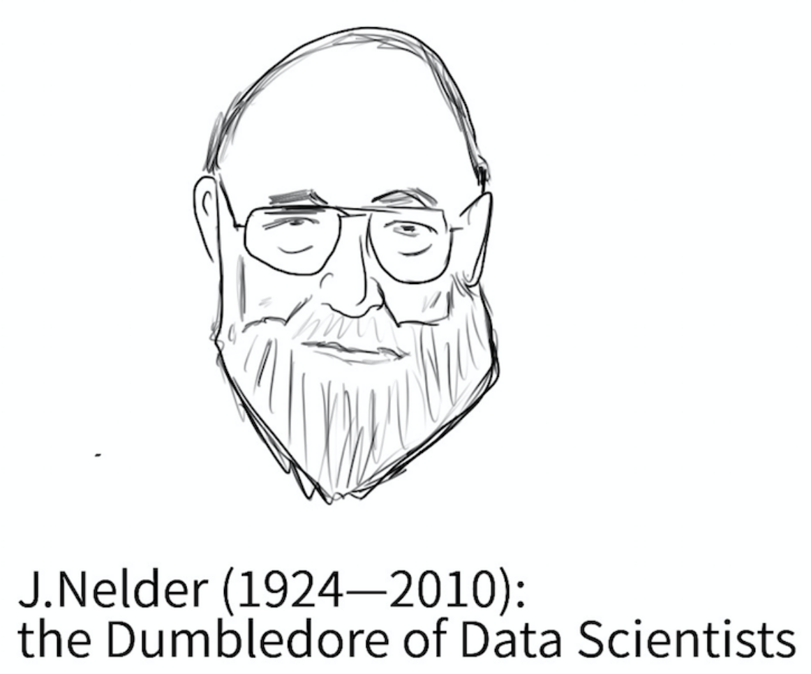
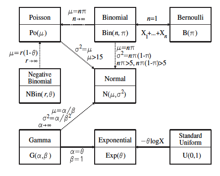
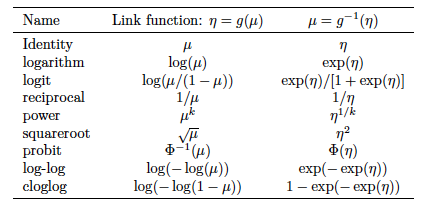

```{r course-style, include=FALSE}
# Encuentra `_shared/bikeshare.R` sin depender del working directory.
source(local({
  d <- normalizePath(getwd(), mustWork = FALSE)
  cands <- d
  while (!identical(dirname(d), d)) { d <- dirname(d); cands <- c(cands, d) }
  cands <- c(cands, Sys.glob(file.path(getwd(), c("*", "*/*", "*/*/*"))))
  hits <- file.path(cands, "_shared", "bikeshare.R")
  hits <- hits[file.exists(hits)]
  if (!length(hits)) stop("No se encontró _shared/bikeshare.R desde ", getwd())
  normalizePath(hits[[1]])
}))
course_palette <- use_course_style("river")
```

## Antes · Hoy · Después {.class-rhythm}

::: {.full-width}

::: {.content-box}
**Antes**

modelo lineal de probabilidad y sus límites.
:::

::: {.content-box-primary}
**Hoy**

componentes de un GLM y funciones de enlace.
:::

::: {.content-box-secondary}
**Después**

regresión logística: estructura teórica y estimación.
:::

:::


# Modelos Lineales Generalizados (GLM) {.inverse .center .middle}

## Más allá del modelo de regresión lineal (LM)
LM es un marco muy útil y productivo, pero hay situaciones en las que no proporciona una descripción adecuada de los datos. En particular:

. . .

- Cuando $y_i$'s no distribuyen normal

. . .

- Cuando el rango de $y_i$'s está restringido (por ejemplo, binario, recuento)

. . .

- Cuando la varianza de los $y_i$'s no es independiente de su valor esperado.

. . .

[GLM]{.bold} ofrece un marco mucho más general y flexible que incorpora y amplía el LM para abordar estas cuestiones.

## Estructura de los modelos lineales generalizados
Un modelo lineal generalizado tiene cuatro componentes:

::: {.pull-left}

- Un _componente aleatorio_
- Un _componente sistemático_ 
- Una _función de enlace_ (link).
- Una _función de varianza_

:::

::: {.pull-right}



:::

# Componente Aleatorio {.inverse .center .middle}

## Componente Aleatorio
El componente aleatorio de un GLM identifica la distribución de probabilidad de la variable dependiente

- Al igual que con LM, los datos que queremos modelar son una colección de observaciones $y_{1}, \dots, y_{n}$, donde cada observación es la manifestación de una variable aleatoria.

. . .

-  Estas variables aleatorias  $y_{1}, \dots, y_{n}$ son independientes  entre si y provienen de la misma _familia_ de distribución: [iid]{.bold}
  - La distribución de los datos nos da una pista sobre la distribución de probabilidad subyacente
  - Muestreo aleatorio garantiza que supuesto de independencia se cumpla

## Componente Aleatorio
Mientras que la LM asume que la variable dependiente sigue una distribución normal, GLM abarca un conjunto más amplio de distribuciones, [tanto continuas como discretas]{.bold}, siempre y cuando pertenezcan a la clase más general de la [_familia exponencial de distribuciones_](https://en.wikipedia.org/wiki/Exponential_family).  
<br><br>

. . .

::: {.center}



:::

# Componente Sistemático {.inverse .center .middle}

## Componente Sistemático
El componente sistemático de un GLM especifica las variables explicativas, es decir, las $x$'s en el lado derecho de la ecuación

::: {.content-box-primary}

$$\color{white}{\eta_{i} = \beta_{0} + \beta_{1} x_{i1} + \dots + \beta_{k} x_{ik}}$$

:::

<br><br>

. . .

 - En terminología GLM $\eta$ se denomina [predictor lineal]{.bold}.

. . .

 - $\eta$ es lineal "en parámetros": no vamos a encontrar términos del tipo $\beta_{0}*\beta_{1}$ o $\beta_{1}^{\beta_{0}}$.

. . .

   - pero puede ser no lineal "en variables" (por ejemplo, interacciones, términos cuadrados, etc.): $\beta_{1}x_{1} + \beta_{2}x_{1}^2$

. . .

 - Las $x$'s son tratadas como fijas, no como variables aleatorias.

# Función de Enlace {.inverse .center .middle}

## Función de enlace (link)
En el [LM estándar]{.bold}, la media condicional del resultado $\mu_{i}$ está linealmente relacionada con los predictores del modelo.
$$\underbrace{\mathbb{E}(y_{i} \mid  x_{1}, \dots x_{k} )}_{\mu_{i}} = \underbrace{\beta_{0} + \beta_{1} x_{i1} + \dots + \beta_{k} x_{ik}}_{\eta_{i}}$$

. . .

- [GLM]{.bold} permiten una relación más general y flexible entre estos dos términos.

. . .

- En un GLM el componente sistemático $\eta_{i}$ debe estar relacionado linealmente (en parámetros) con una función $g(\cdot)$ de $\mu_{i}$. Dicha función se denomina *función de enlace*. Formalmente,

::: {.content-box-primary}

$$\color{white}{g\Big(\mathbb{E}(y_{i} \mid  x_{1}, \dots x_{k})\Big) =  g(\mu_{i}) = \eta_{i}}$$

:::

. . .

Ejemplo, si $g(\cdot) = \ln(\cdot)$, entonces
$$\ln \mathbb{E}(y_{i} \mid  x_{1}, \dots x_{k}) =  \ln \mu_{i} = \eta_{i}$$

## Función de Enlace (link)

- El inverso de esta expresión es la llamada [función media]{.bold}, que expresa la media condicional de $y_{i}$ como una función potencialmente no lineal de los predictores:

::: {.content-box-primary}

$$\color{white}{\mathbb{E}(y_{i} \mid  x_{1}, \dots x_{k}) = \mu_{i} = g^{-1}(\eta_{i})}$$

:::

. . .

Ejemplo, si $g(\cdot) = \ln(\cdot)$, entonces
$$\ln \mathbb{E}(y_{i} \mid  x_{1}, \dots x_{k}) =  \ln \mu_{i} = \eta_{i}$$

. . .

En consecuencia, $g^{-1}(\cdot) = e^{(\cdot)}$ y,
$$\mathbb{E}(y_{i} \mid  x_{1}, \dots x_{k}) = \mu_{i} = e^{\eta_{i}}$$

. . .

- La _función de enlace_ cumple un objetivo importante: mantener $\mu_{i}$ dentro de su rango natural. 
  - Ejemplo: si $y_{i}$ es estrictamente positivo (ingreso), $\eta_{i} \in (-\infty, \infty+)$ pero $\mu_{i} = e^{\eta_{i}} \in  (0, \infty+)$

## Función de Enlace (link)

Más allá de este ejemplo, hay una variedad de posibles funciones de enlace:

::: {.center}



:::

- $g(\cdot)$ debe ser "smooth" y monotónica

## El enlace "natural" de cada distribución

La elección de $g(\cdot)$ no es arbitraria: cada distribución de la familia exponencial tiene un **enlace canónico**, aquel para el cual el parámetro natural de la distribución coincide exactamente con $\eta_{i}$.

| Distribución | Enlace canónico | $g(\mu)$ |
|---|---|---|
| Normal | identidad | $\mu$ |
| Poisson | log | $\ln(\mu)$ |
| Binomial | logit | $\ln\!\left(\frac{\mu}{1-\mu}\right)$ |

Usar el enlace canónico simplifica la estimación (MLE), pero **no es obligatorio**: cualquier $g(\cdot)$ monotónica y "smooth" define un GLM válido.

# Función de Varianza {.inverse .center .middle}

## Función de varianza
La función de varianza describe cómo la varianza $\operatorname{Var}(y_{i})$ depende de la media $\mu_{i}$. Formalmente:

::: {.content-box-primary}

$$\color{white}{\operatorname{Var}(y_{i}) = \phi V(\mu_{i})}$$

:::

donde

- $\phi$ es una constante llamada "parámetro de dispersión"
- $V(\cdot)$ es la  función de varianza, definida como: $V(\mu) = \frac{d\mu}{d \eta}$

. . .

Por ejemplo, si $\mathbb{E}(y_{i} \mid  x_{1}, \dots x_{k}) =  \mu_{i} = e^{\eta_{i}}$, entonces,
$$V(\mu_i) = \frac{d\mu_i}{d \eta_i} = e^{\eta_{i}} \quad \to \quad \operatorname{Var}(y_{i}) = \phi e^{\eta_{i}}$$

# .......... Definiendo un GLM ..... {.inverse .middle}

::: {.img-right}


:::

## Definiendo un GLM
La estructura básica de un GLM se especifica mediante la elección de dos componentes: (1) [componente sistemático]{.bold} (la distribución de la variable dependiente ) y (2) la [función de enlace]{.bold}. 

\begin{align}
  GLM:
	\begin{cases}
	&y_{i} \sim f(\mu_{i},\sigma_{i}) \\ \\
	& g(\mu_{i}) = \eta_{i}
	\end{cases}
\end{align}

. . .

Cualquier combinación de estos componentes definirá un GLM diferente. Algunas de estas combinaciones son especialmente relevantes:

| Distribution         | Canonical Link: $\eta = g(\mu)$ | Link name             | Model name           |
| -----------------    | ------------------              | --------------------- | -------------------- |
| Normal (Gaussian)    | $\eta = \mu$                    | identity              | Standard regression  |
| Poisson              | $\eta = \log(\mu)$              | logarithm             | Poisson regression   |
| Bernoulli / Binomial | $\eta = \log(\mu/(1-\mu))$      | logit                 | Logistic regression  |
| Gamma                | $\eta = (1/\mu)$                | reciprocal            | Gamma regression     |

## LM es un caso particular de GLM
El tipo más simple de GLM es el que tiene un componente aleatorio normal y una función de enlace de identidad, en cuyo caso obtenemos el modelo estándar de regresión lineal. Formalmente:

. . .

- Componente aleatorio: $y_{1}, \dots y_{n}$ son $n$ variables independientes con distribución $\text{Normal}(\mu_{i},\sigma_{i})$

. . .

- Función de enlace "identidad": $g(x) = x$

. . .

- Componente sistemático: $\mu_{i} = \eta_{i} = \beta_{0} + \beta_{1} x_{i1} + \dots + \beta_{k} x_{ik}$

. . .

- Función media: $\mu_{i} = g^{-1}(\eta_{i}) = \eta_{i}$

. . .

- Varianza $\operatorname{Var}(y_{i}) = \phi V(\mu_{i}) = \sigma^2$,

. . .

 con $\phi=\sigma^2$ y $V(\mu_{i})= \frac{d\mu_{i}}{d\eta_{i}}=1$.
<br><br>

. . .

Por tanto,
$$y_{i} \sim \text{Normal}(\mu_{i} = \eta_{i}, \sigma_{i} = \sqrt{\phi})$$

- En nomenclatura GLM $\phi$ (parámetro de dispersión) es un modo más general de expresar el componente constante de la varianza ( $\sigma^2$ en LM)

# Ejemplo empírico {.inverse .center .middle}
## GLM log-lineal

## GLM log-lineal: ejemplo de modelo "híbrido"
Ejemplo:

. . .

- $y_{1}, \dots y_{n}$ son $n$ variables independientes con distribución $\text{Normal}(\mu_{i},\sigma_{i})$

. . .

- La función de enlace es $g(\cdot) = \ln(\cdot)$

. . .

- $\ln(\mu_{i}) = \eta_{i} = \beta_{0} + \beta_{1} x_{i1} + \dots + \beta_{k} x_{ik}$

. . .

- $\mu_{i} = e^{\eta_{i}}$

. . .

Se sigue de lo anterior que:

- $\operatorname{Var}(y_{i}) = \phi V(\mu) = \phi \frac{d\mu_{i}}{d\eta_{i}} = \phi e^{\eta_{i}} = \phi \mu_{i}$

. . .

Obtenemos un [modelo log-lineal]{.bold}, que es apropiado cuando las predicciones deben ser estrictamente positivas.
$$y_{i} \sim \text{Normal}(\mu_{i} = e^{\eta_{i}}, \sigma_{i} = \sqrt{\phi \mu_{i}})$$

## Enlace vs. transformaciones
Usar una función de enlance [es distinto]{.bold} de transformar la variable dependiente!

. . .

[Ejemplo:]{.bold} es un práctica común trabajar con la variable dependiente transforma a logs (ej. ingresos).

- $y_{1}, \dots y_{n}$ son $n$ variables que no distribuyen normal  pero $\ln(y_{1}), \dots \ln(y_{n})$ si.
- Estimar LM con variable dependiente transformada:

$$\ln y_{i} = \overbrace{\beta_{0} + \beta_{1}x_{1i} + \dots \beta_{k}x_{ki}}^{\mathbb{E}(\ln y_{i} \mid x_{1}, \dots, x_{k} )  } + \underbrace{e_{i}}_{\text{Normal}(0,\sigma)}$$

. . .

Notar diferencia:

::: {.pull-left}

[GLM con log-link]{.bold}
$$\ln \mathbb{E} (y_{i} \mid x_{1}, \dots, x_{k}  ) = \beta_{0} + \beta_{1}x_{1i} + \dots \beta_{k}x_{ki}$$

:::

::: {.pull-right}

[LM con variable dependiente log(y) ]{.bold}
$$\mathbb{E}( \ln y_{i} \mid x_{1}, \dots, x_{k} ) = \beta_{0} + \beta_{1}x_{1i} + \dots \beta_{k}x_{ki}$$

:::

## GLM con log-link: demanda horaria de bicicletas
```{r, echo=FALSE, message=FALSE, warning=FALSE}
library(pacman)
p_load("tidyverse")
bikedata <- prepare_bikeshare()
```

::: {.center}

```{r, echo=FALSE, message=FALSE, warning=FALSE, fig.height=5}

bikedata %>% 
  ggplot(aes(x = bikers)) + 
  geom_histogram(fill = course_palette[["primary"]], color = "white", bins = 35) +
  guides(fill = FALSE, color = FALSE) + 
  labs(x = "Arriendos por hora", y = "Horas") +
  theme_julia() +
  theme(
    legend.position = "none",
    axis.text.y = element_text(size = 22, color = "black"),
    axis.text.x = element_text(size = 22, color = "black"),
    axis.title.y = element_text(size = 24, color = "black"),
    axis.title.x = element_text(size = 24, color = "black"),
    panel.border = element_blank()
  )

```

:::

Datos horarios de Capital Bikeshare en Washington DC. `bikers` es un conteo positivo y fuertemente asimétrico.

## LM con log en variable dependiente
```{r}
our_lm <- lm(log(bikers) ~ factor(workingday), data=bikedata)
summary(our_lm)
```

## Gaussian GLM con log-link
```{r}
our_glm <- glm(bikers ~ factor(workingday), family = gaussian(link="log"), data=bikedata)
summary(our_glm)
```

## Gaussian GLM con log-link
$$\ln \mu_{i} = \ln \mathbb{E}(\text{bikers}_{i} \mid \text{workingday}_{i})
= \beta_{0} + \beta_{1}\text{workingday}_{i}$$

. . .

Por tanto,

- $\mathbb{E}(\text{bikers}_{i} \mid \text{workingday}=1) = e^{\beta_{0} + \beta_{1}}$.
- $\mathbb{E}(\text{bikers}_{i} \mid \text{workingday}=0) = e^{\beta_{0}}$.

. . .

Interpretación coeficientes
$\beta_{1} = \ln \frac{\mathbb{E}(\text{bikers}_{i} \mid \text{workingday}=1)}{\mathbb{E}(\text{bikers}_{i} \mid \text{workingday}=0)}$

. . .

 $\quad \implies  \quad e^{\beta_{1}} =  \frac{\mathbb{E}(\text{bikers}_{i} \mid \text{workingday}=1)}{\mathbb{E}(\text{bikers}_{i} \mid \text{workingday}=0)}$

. . .

[Razón de demanda]{.bold}: $e^{\beta_1}$ compara la demanda horaria esperada entre días hábiles y no hábiles.

## Gaussian GLM con log-link

::: {.pull-left}

Dispersión estimada: $\hat\phi=$ `r round(summary(our_glm)$dispersion, 3)`
$\operatorname{Var}(y_{i}) = \phi V(\mu) = \phi \frac{d\mu_{i}}{d\eta_{i}} = \phi e^{\eta_{i}} = \phi \mu_{i}$
$\operatorname{Var}(y_{i})  = \phi\mu_{i} = \phi e^{\beta_0 + \beta_1\text{workingday}_{i}}$
<br><br>
Por tanto, 
$$y_{i} \sim \text{Normal}(\mu_{i},\sigma_{i}) \quad \text{ donde}$$

- $\mu_{i}=e^{\beta_{0} +  \beta_{1}\text{workingday}_{i}}$
- $\sigma_{i} = \sqrt{\phi\mu_{i}}$

:::

. . .

::: {.pull-right}

```{r, echo=FALSE, message=FALSE, warning=FALSE, fig.height=6, fig.width=8}
p_load("tidyverse")
p_load("ggfortify")
beta <- coef(our_glm)
phi <- summary(our_glm)$dispersion
eta <- function(x) exp(beta[[1]] + beta[[2]] * x)
sdy <- function(x) sqrt(phi * eta(x))

preds <- data_frame(x = c(0,1)) %>% mutate(mu = eta(x), sd=sdy(x)) %>% as.matrix()

plot <- ggplot(data.frame(x = seq(0, 500, by = 0.5)), aes(x = x)) +
  stat_function(fun = dnorm, args = list(preds[1,2], preds[1,3]),
                aes(colour = "no hábil"), size = 1.5) +
  stat_function(fun = dnorm, args = list(preds[2,2], preds[2,3]),
                aes(colour = "hábil"), size = 1.5) +
  scale_x_continuous(name = "Arriendos por hora") +
  scale_color_manual(values = c("no hábil" = course_palette[["primary"]],
                                "hábil" = course_palette[["secondary"]])) +
  labs(y="densidad", color=NULL)+
  theme_julia() +
  theme(
    axis.text.y = element_text(size = 22, color = "black"),
    axis.text.x = element_text(size = 22, color = "black"),
    axis.title.y = element_text(size = 24, color = "black"),
    axis.title.x = element_text(size = 24, color = "black"),
    panel.border = element_blank()
  )

print(plot)
```

:::

## En resumen

- Un GLM se define por cuatro piezas: componente aleatorio (familia exponencial), componente sistemático $\eta_{i}$, función de enlace $g(\mu_{i})=\eta_{i}$ y función de varianza $\operatorname{Var}(y_{i})=\phi V(\mu_{i})$.
- La función de enlace mantiene $\mu_{i}$ dentro de su rango natural; cada distribución tiene un enlace "canónico" (Normal: identidad, Poisson: log, Binomial: logit).
- LM es el caso particular de GLM con componente Normal y enlace identidad.
- Usar una función de enlace (ej. log) no es lo mismo que transformar la variable dependiente: cambian tanto la interpretación de los coeficientes como los supuestos sobre la varianza.
- La próxima clase: regresión logística — estructura teórica y estimación.

## Gracias {.inverse .center .middle .closing}

**Hasta la próxima clase**

Mauricio Bucca
