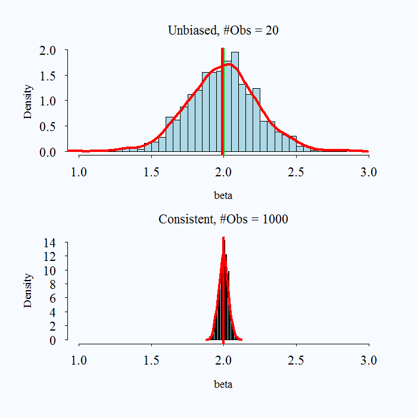
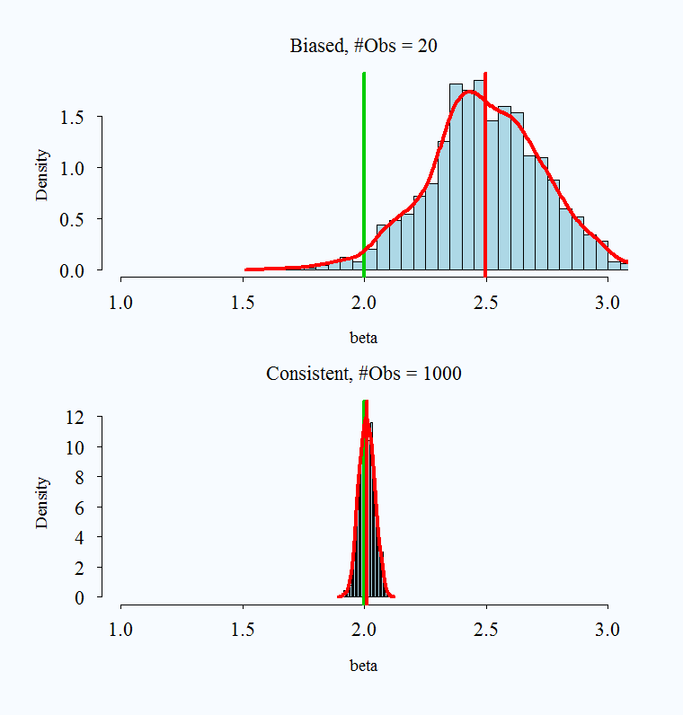

class: inverse, center, middle

```{r xaringan-themer, include=FALSE, warning=FALSE}
library(tidyverse)
library(xaringanthemer)

primary_color = "#778DA9"
secondary_color = "#AF1E2D"
background_color = "#f8f7f3"
header_font = google_font("Archivo")
text_font = google_font("Inconsolata")
link_color = "#F4E1A4"

style_duo_accent(primary_color = primary_color, secondary_color = secondary_color,
                 background_color = background_color,
                 header_font_google = google_font("Archivo"),
                 text_font_google   = google_font("Inconsolata"), 
                 link_color=link_color
)

```
#Modelo Lineal de Probabilidad
##Modelos de Regresión para variable dependiente categórica

---

.pull-left[

]

.pull-right[
.huge[.bold[Todo lo que siempre quisiste saber sobre regresión lineal (ˆ)
]]
(ˆ) .bold[_Pero nunca te atreviste a preguntar_ ]
]

---
##  Estructura de un modelo de regresión lineal


Un modelo de regresión lineal estándar tiene la siguiente estructura:

<br>

$$y_{i} = \overbrace{\beta_{0} + \beta_{1}x_{1i} + \dots \beta_{k}x_{ki}}^{\hat{y}} + e_{i}$$
donde:

--

- $y$ es la variable dependiente

- $x_{1} \dots x_{k}$ son predictores o variables independientes 

- $\beta_{1} \dots \beta_{k}$ son los respectivos "efectos" de los predictores sobre $y$

- $e$ es un término de error aleatorio ("white noise")

- $\hat{y} \perp e$


---
##  Estructura de un modelo de regresión lineal

Podemos repensar el LM de la siguiente forma:

<br>
--
.bold[Setup]


- Tenemos $n$ observaciones (individuos) independientes: $i = 1, \dots, n$


--

- Para cada individuo observamos un valor en la variable dependiente $y_{i}$, tal que  $y_{i} \in \mathbb{R}$


--

- Estos resultados son realizaciones de variables aleatorias $\text{Normal}(\mu_{i}, \sigma_{i})$ con media y varianza desconocida: misma distribución pero parámetros (potencialmente) distintos

  - Notar que es imposible identificar estos parámetros individualmente ( $n$ observaciones y $2n$ parámetros)

---
##  Estructura de un modelo de regresión lineal

El modelo de regresión lineal estándar "resuelve" este problema de la siguiente manera

$$y_{i} \sim \text{Normal}(\mu_{i}, \sigma_{i}) \quad \quad \text{ donde}$$
--

-  $\mu_{i} = \beta_{0} + \beta_{1}x_{1i} + \dots \beta_{k}x_{ki}$
--
$\quad =\mathbb{E}(y_{i} \mid x_{1}, \dots, x_{k})$


--

- $\sigma^{2}_{i} =  \sigma^{2}$
--
$\quad =\mathbb{Var}(y_{i} \mid x_{1}, \dots, x_{k})$

--

- $x_{1}, \dots, x_{k}$ son valores fijos, no variables aleatorias


--

- Todo lo anterior implica que, si $(e_{i} = y_{i} - \mu_{i})$, entonces
--
$\quad e_{i} = \text{Normal}(\mu_{i}, \sigma) - \mu_{i} \sim  \text{Normal}(0, \sigma)$


--
En resumen,

.content-box-primary[
$$\color{white}{ y_{i} \sim \text{Normal}(\mu_{i}, \sigma) \quad  \text{ o, equivalentemente: } \quad  y_{i} = \mu_{i} + \text{Normal}(0, \sigma)}$$
]

--

Notar que  LM describe los datos con $k + 2$ parámetros: $\beta_{0}, \beta_{1}, \dots, \beta_{k}, \sigma$

---
##  Estructura de un modelo de regresión lineal

Es común encontrar el modelo lineal escrito en forma matricial:

$$\newcommand{\vect}[1]{\boldsymbol{#1}}$$


.pull-left[
$$\vect{y} \sim \text{Normal}_{n}(\vect{X}\vect{\beta},\vect{\Sigma}) \quad \text{ donde ...}$$


]
.pull-right[
- $\vect{y}$ es un vector que contiene las diferentes $y_{i}, \dots, y_{n}$

- $\vect{\mu} = \vect{X}\vect{\beta} = \beta_{0} + \beta_{1}\vect{x}_{1} + \dots + \beta_{k}\vect{x}_{k}$

- $\vect{\Sigma}$ es la matriz de varianza-covarianza entre las observaciones
]

<br>
--
visualmente:

$$\begin{bmatrix}
y_{i} \\  \vdots \\ y_{n}
\end{bmatrix}_{(n,1)} \sim \text{Normal}_{n}\Bigg(  \vect{\mu} = \begin{bmatrix}
\beta_{0} + \beta_{1}x_{1i} + \dots \beta_{k}x_{ki} \\ 
 \vdots \\ \beta_{0} + \beta_{1}x_{1n} + \dots \beta_{k}x_{kn}
\end{bmatrix}_{(n,1)} , \vect{\Sigma} = \begin{bmatrix}
    \sigma^{2}    & 0      & \ldots         & 0      \\
    0      & \sigma^{2}     & \ldots         & 0      \\
    \vdots & \vdots & \sigma^{2}   & \vdots \\
    0      & 0      & \ldots         & \sigma^{2} 
\end{bmatrix}_{(n,n)}\Bigg)$$
 
---
##  Modelo de regresión lineal

"Ensamblemos" el modelo via Monte Carlo Simulation. "Data Generating Process" (.bold[DGP]):
--
```{r,  include=TRUE, echo=FALSE, warning=FALSE, message=FALSE}
library("tidyverse")
library("Ecdat")
library("cowplot")
library("ggridges")
library("modelr")

# Font setup
library(hrbrthemes)
library(showtext)
font_add_google("Archivo", "header_font")
font_add_google("Inconsolata", "text_font")


```

```{r}
set.seed(87742) # seed
n <- 5000 # observaciones
x <- sample(1:100,n,replace=TRUE) # 1 predictor o var independiente
```

```{r, echo=FALSE}
glimpse(x)
```

```{r}
# parámetros
sigma <- 7 # sd
b_0 <- 10 # intercepto
b_1 <- 1.1 # coeficiente de x
mu <- b_0 + b_1*x # valor predicho
```

```{r, echo=FALSE}
glimpse(mu)
```

```{r}
# variable dependiente
y <- rnorm(n,mu,sigma) # variable dependiente. Equivalente: y <- mu + rnorm(n,0,sigma)
```

```{r, echo=FALSE}
glimpse(y)
```

---
## Estimación modelo de regresión lineal:

.pull-left[
.content-box-primary[
.bold[OLS]
$$\color{white}{\hat{\boldsymbol{\beta}}_{OLS} = \underset{\beta}{\arg\min\ } \sum_{i=1}^{n} (y_{i} - \vect{X}_{i}'\vect{\beta})^{2} \quad \text{ donde}}$$
]
]

.pull-right[
- $\vect{y}$ es el vector $y_{i}, \dots, y_{n}$
- $\vect{X}_{i}'\vect{\beta} = \beta_{0} + \beta_{1}x_{1i} + \dots + \beta_{k}x_{ki}$
]

--

.pull-left[
.content-box-primary[
.bold[MLE]
$$\color{white}{\hat{\boldsymbol{\beta}}_{MLE} = \underset{\beta}{\arg\max\ } \prod_{i=1}^{n} \frac{1}{\sqrt{2\pi\sigma^{2}}} e^{- \frac{(y_{i} - \vect{X}_{i}'\vect{\beta})^{2}}{2\sigma^{2}}} \quad \text{ donde}}$$
]
]

.pull-right[
* $\frac{1}{\sqrt{2\pi\sigma^{2}}} e^{- \frac{(x - \mu)^{2}}{2\sigma^{2}}}$ es la densidad de probabilidad de una variable aleatoria $X \sim \mathcal{N}(\mu,\sigma^2)$]

```{css, echo=FALSE}
.pull-right ~ * { clear: unset; }
.pull-right + * { clear: both; }
```
--
Ambos métodos producen mismos resultados en el caso de LM.


---
## Modelo de regresión lineal

Ahora estimemos los parámetros de nuestro modelo via OLS 

```{r, message=FALSE}
our_data <- tibble(y=y, x=x)
our_lm_ols <- lm(y ~ x, data=our_data) # "fit" el modelo usando función lm()
print(summary(our_lm_ols)) # analicemos nuestros resultados
```

---
## Modelo de regresión lineal

Ahora estimemos los parámetros via MLE

```{r}
our_lm_mle <- glm(y ~ x, family="gaussian", data=our_data) # "fit" modelo usando función glm()
print(summary(our_lm_mle)) # analicemos nuestros resultados
```

---
## Modelo de regresión lineal

.pull-left[
```{r, echo=FALSE, message=FALSE,warning=FALSE}

library(ggplot2)
library(viridis)
library(dplyr)
library(tibble)

# Assuming you have data for our_lm_ols, x, and y

new_x = c(50,60)
new_y = predict(our_lm_ols, newdata = tibble(x=new_x))

positions_v <- data.frame(x1 = new_x, x2 = new_x, y1 = c(0,0), y2 = new_y)
positions_h <- data.frame(x1 = c(0,0), x2 = new_x, y1 = new_y, y2 = new_y)

# Generate the plot
plot <- tibble(x=x,y=y) %>%
  ggplot(aes(x=x, y=y)) +
  geom_point(color = primary_color, size=2.5, alpha=0.05) + 
  geom_smooth(method='lm', formula= y ~ x, size=1.5, color="#AF1E2D", se=FALSE) + # Added se=FALSE to remove shaded region
  geom_segment(aes(x = x1, y = y1, xend = x2, yend = y2), data = positions_v, color=primary_color, size=1.5) +
  geom_segment(aes(x = x1, y = y1, xend = x2, yend = y2), data = positions_h, color=primary_color, size=1.5) +
  annotate(geom="text", x=69, y=60, label='bold("(x=50,y=64.9)")', color="black", parse=TRUE, size=8) +
  annotate(geom="text", x=80, y=81, label='bold("(x=60,y=75.9)")', color="black", parse=TRUE, size=8) +
  theme_minimal() +
  theme(
    legend.position="none",
    axis.text.y = element_text(size = 22, color = "black"),
    axis.text.x = element_text(size = 22, color = "black"),
    axis.title.y = element_text(size = 24, color = "black"),
    axis.title.x = element_text(size = 24, color = "black"),
    panel.border = element_rect(color = "black", fill = NA, linewidth = 1)
  )

plot

```
]

--

.pull-right[
Observamos que:

-  $\mathbb{E}(y_{i} \mid x = 50) = 64.9$

-  $\mathbb{E}(y_{i} \mid x = 60) = 75.9$

- Estas "medias condicionales" no son determinísticas sino .bold[_probabilísticas_].


- Específicamente, sabemos que:

  - $y_{i} \mid x = 50  \sim \text{Normal}(\mu= 64.9, \sigma=7)$ 

  - $y_{i} \mid x = 60  \sim \text{Normal}(\mu= 75.9, \sigma=7)$
]

---
## Modelo de regresión lineal


.pull-left[

<br>
Así se ve:

-  $\mathbb{E}(y_{i} \mid x = 50) = 64.9$

-  $\mathbb{E}(y_{i} \mid x = 60) = 75.9$

<br>
donde:

  - $y_{i} \mid x = 50  \sim \text{Normal}(\mu= 64.9, \sigma=7)$ 

  - $y_{i} \mid x = 60  \sim \text{Normal}(\mu= 75.9, \sigma=7)$
]


.pull-right[

```{r pred, echo=FALSE}
b_0_hat <- our_lm_ols$coefficients[1]
b_1_hat <- our_lm_ols$coefficients[2]
y_hat <- b_0_hat + b_1_hat*c(50,60)
sigma_hat <- summary(our_lm_ols)$sigma

y_seq <- seq(min(y_hat) - 3*sigma_hat, max(y_hat) + 3*sigma_hat, length.out = 1000)
density_y_x50 <- dnorm(y_seq, mean = y_hat[1], sd = sigma_hat)
density_y_x60 <- dnorm(y_seq, mean = y_hat[2], sd = sigma_hat)

```


```{r, echo=FALSE, message=FALSE, warning=FALSE, fig.height=5}

bind_rows(
  tibble(y=y_seq, density=density_y_x50, x=rep(50, length(y_seq))),
  tibble(y=y_seq, density=density_y_x60, x=rep(60, length(y_seq)))
) %>%
ggplot(aes(x=y, y=density, fill=factor(x))) + 
  geom_area(alpha=0.2, position = "identity", color = "black", size = 0.1) +  # adding border
  scale_fill_manual(values=c("50"="#AF1E2D", "60"=primary_color)) +
  geom_vline(aes(xintercept = y_hat[1]), linetype="dashed", size=0.7) +  # vertical line for x=50
  geom_vline(aes(xintercept = y_hat[2]), linetype="dashed", size=0.7) +  # vertical line for x=60
  annotate("text", x = y_hat[1] + 1, y = 0.06, label = paste("E(y | x =", 50, ")"), hjust = 0) +  # annotation for x=50
  annotate("text", x = y_hat[2] + 1, y = 0.06, label = paste("E(y | x =", 60, ")"), hjust = 0) +  # annotation for x=60
  guides(fill=FALSE, color=FALSE) +
  labs(title="Distribución de y | x", y="density", x="y") +
   theme_minimal() +
   theme(
    axis.text.y = element_text(size = 22, color = "black"),
    axis.text.x = element_text(size = 22, color = "black"),
    axis.title.y = element_text(size = 24, color = "black"),
    axis.title.x = element_text(size = 24, color = "black"),
    panel.border = element_rect(color = "black", fill = NA, linewidth = 1),
    legend.text = element_text(size = 18),
    legend.position="none"
  ) 

```


]

---
## Interpretación coeficientes en LM

<br>

$$\text{Si } \quad \quad y_{i} = \overbrace{\beta_{0} + \beta_{1}x_{1i} + \dots \beta_{k}x_{ki}}^{\mathbb{E}(y_{i} \mid x_{1}, \dots, x_{k})} + \underbrace{e_i}_{\sim \text{Normal}(0,\sigma)}$$

---
## Interpretación coeficientes en LM

<br>

$$\text{Si } \quad \quad y_{i} = \overbrace{\beta_{0} + \beta_{1}x_{1i} + \dots \beta_{k}x_{ki}}^{\mathbb{E}(y_{i} \mid x_{1}, \dots, x_{k})} + \underbrace{e_{i}}_{\text{Normal}}(0,\sigma)$$

<br>


Entonces decimos que el efecto de $x_{k}$ sobre $y$ es $\beta_{k}$. ¿Qué significa?

.pull-left[
$$\frac{\partial \mathbb{E}(y_{i} \mid x_{1}, \dots, x_{k})}{\partial x_{k}} = \beta_{k}$$
]

.pull-right[
"Un cambio en $\Delta$ unidades de $x_{k}$ se traduce en un cambio en $\Delta$ $\beta_{k}$ unidades en el valor esperado de $y_{i}$"
]


---
## Interpretación coeficientes en LM

En nuestro ejemplo:

.pull-left[
```{r}
print(our_lm_ols)
```
]
.pull-right[
Si `x=50`, entonces `y`=
```{r}
10.2 + 1.1*50
```

Si `x=51`, entonces `y`=
```{r}
10.2 + 1.1*51
```

Por tanto, $\beta$=
```{r}
((10.2 + 1.1*51)-(10.2 + 1.1*50))/(51 - 50)
```
]

---

## Interpretación coeficientes en LM

Un ejemplo más complejo: podemos incluir interacciones y efectos no lineales

```{r}
set.seed("87742") # seed
n <- 10000 # observaciones
x <- sample(1:100,n,replace=TRUE) # variable independiente continua
d <- sample(0:1,n,replace = TRUE) # dicotómica
```

```{r}
# parámetros
sigma <- 50 # sd
b_0 <- 10  # intercepto
b_1 <- 0.1  # coeficiente de variable x^2
b_2 <- 2  # coeficiente de variable dummy d
b_3 <- 0.05 # coeficiente interacción x^2*d 

mu <- b_0 + b_1*I(x^2) + b_2*d + b_3*I(x^2)*d   # valor predicho
```

```{r}
# variable dependiente
y <- mu + rnorm(n,0,sigma)
```

```{r, echo=FALSE}
glimpse(y)
```

---
## Interpretación coeficientes en LM

Estimamos los parámetros  via OLS 


```{r}
our_data2 <- tibble(y=y, x=x, d=d) 
our_lm_ols2 <- lm(y ~ I(x^2)*factor(d), data=our_data2) # "fit" el modelo usando función lm()
print(summary(our_lm_ols2)) # analicemos nuestros resultados
```

---
## Interpretación coeficientes en LM

.pull-left[
```{r, echo=FALSE, warning=F}

# Compute expected values for x=60 and x=90
mu_x60_d0 = b_0 + b_1*(60^2)
mu_x60_d1 = b_0 + b_1*(60^2) + b_2 + b_3*(60^2)
mu_x90_d0 = b_0 + b_1*(90^2)
mu_x90_d1 = b_0 + b_1*(90^2) + b_2 + b_3*(90^2)

# Update data frames for segments
positions_v <- data.frame(x = c(60, 60, 90, 90), y = c(0, 0, 0, 0), yend = c(mu_x60_d0, mu_x60_d1, mu_x90_d0, mu_x90_d1), d = c(0, 1, 0, 1))
positions_h <- data.frame(x = c(0, 0, 0, 0), xend = c(60, 60, 90, 90), y = c(mu_x60_d0, mu_x60_d1, mu_x90_d0, mu_x90_d1), d = c(0, 1, 0, 1))

# Continue with the plotting as before
plot <- ggplot(our_data2, aes(x=x, y=y, group=factor(d), colour=factor(d))) + 
  geom_point(size=2.5, alpha=0.05) + 
  scale_color_manual(values=c("#AF1E2D", "#778DA9")) +
  geom_smooth(method='lm', formula= y ~ I(x^2), size=1.5, aes(group=factor(d)))

# For the segments, set the color based on the value of d
plot + 
  geom_segment(data=subset(positions_v, d == 0), aes(x=x, y=y, xend=x, yend=yend), color="#778DA9", size=1.5) +
  geom_segment(data=subset(positions_v, d == 1), aes(x=x, y=y, xend=x, yend=yend), color="#AF1E2D", size=1.5) +
  geom_segment(data=subset(positions_h, d == 0), aes(x=x, y=y, xend=xend, yend=y), color="#778DA9", size=1.5) +
  geom_segment(data=subset(positions_h, d == 1), aes(x=x, y=y, xend=xend, yend=y), color="#AF1E2D", size=1.5) +
annotate("text", x=50, y=mu_x60_d0 + 50, label=sprintf("(%d, %.0f)", 60, mu_x60_d0), size=6, fontface="bold") + 
annotate("text", x=50, y=mu_x60_d1 + 50, label=sprintf("(%d, %.0f)", 60, mu_x60_d1), size=6, fontface="bold") + 
annotate("text", x=80, y=mu_x90_d0 + 50, label=sprintf("(%d, %.0f)", 90, mu_x90_d0), size=6, fontface="bold") + 
annotate("text", x=80, y=mu_x90_d1 + 50, label=sprintf("(%d, %.0f)", 90, mu_x90_d1), size=6, fontface="bold") + 
  theme_minimal() +
  theme(
    axis.text.y = element_text(size = 22, color = "black"),
    axis.text.x = element_text(size = 22, color = "black"),
    axis.title.y = element_text(size = 24, color = "black"),
    axis.title.x = element_text(size = 24, color = "black"),
    panel.border = element_rect(color = "black", fill = NA, linewidth = 1),
    legend.text = element_text(size = 18),
    legend.position="none"
  )


```
]

--


.pull-right[

$$y_{i} = \beta_{0} + \beta_{1} x^{2}_{i} +  \beta_{2}d_{i} + \beta_{3} x^{2}_{i} \cdot d_{i} + e_{i}$$
<br>
Por tanto:

\begin{align}
\mathbb{E}(y_{i} \mid x, d) =
  \begin{cases} 
    \beta_{0} + \beta_{1} x^{2}_{i}   &\quad \text{ si } d_{i}=0 \\ \\
    (\beta_{0} + \beta_{2}) + (\beta_{1} + \beta_{3}) x^{2}_{i} &\quad  \text{ si } d_{i}=1
  \end{cases}
\end{align}

<br>
<br>
Específicamente:

\begin{align}
\frac{\partial \mathbb{E}(y_{i} \mid x, d) }{\partial x} = 
  \begin{cases} 
    2 \beta_{1}x & \quad \text{ si } d_{i}=0 \\ \\
    2(\beta_{1} + \beta_{3})x & \quad \text{ si } d_{i}=1
  \end{cases}
\end{align}
]

---
class: inverse, center, middle

## El Modelo Lineal de Probabilidad (LPM)

---

## El Modelo Lineal de Probabilidad (LPM)

.bold[LMP] es simplemente un modelo de regresión lineal aplicado a una variable dicotómica. Un LMP estándar tiene la siguiente forma:

--

$$y_{i} = \overbrace{\beta_{0} + \beta_{1}x_{1i} + \dots + \beta_{k}x_{ki}}^{\mathbb{E}(y_{i} \mid x_{1}, \dots, x_{k})} +  e_{i} \quad \quad \text{ donde } y_{i} \in \{0,1\}$$


Dado que  $y_{i} \in \{0,1\}$,


* $\mathbb{E}(y_{i} \mid x_{1}, \dots, x_{k}) \equiv \mathbb{P}(y_{i} =1 \mid x_{1}, \dots, x_{k})$

* Equivalentemente, $\mu_{i} \equiv p_{i}$

<br> <br>
--

Por tanto, en un LPM

.content-box-primary[
$$\color{white}{y_{i} \sim \text{Normal}(p_{i}, \sigma) \quad  \text{ o, equivalentemente: } \quad  y_{i} = p_{i} + \text{Normal}(0, \sigma)}$$
]

---
## LMP en la práctica 

Para ejemplificar el uso del LPM continuaremos trabajando con los datos de infidelidad. 

```{r,  include=TRUE, echo=FALSE, warning=FALSE, message=FALSE}
# load data on extra-marital affairs from package "Ecdat"
library("Ecdat")
library("viridis")

data(Fair)
affairsdata <- Fair %>% as_tibble()

# create a binary variable indicating wether persons has ever had an affair
affairsdata <- affairsdata %>% 
  mutate(everaffair = case_when(nbaffairs == 0 ~ "Never", nbaffairs > 0 ~ "At least once") ) %>%
  # map into 0/1 code
  mutate(everaffair_d = case_when(nbaffairs == 0 ~ 0, nbaffairs > 0 ~ 1))

# display the data as a tibble
affairsdata %>% arrange(age) %>% select(-occupation) %>% tail(15)
```

---
## LMP en la práctica 

Ajustaremos el siguiente modelo: $\text{everaffair}_{i} = \beta_{0} + \beta_{1}*\text{rate}_{i}$, que modela la probabilidad de tener un affair como función de la evaluación de los entrevistados de su matrimonio, desde 1 (muy infeliz) a 5 (muy feliz).

```{r}
lpm_affairs_rate <- lm(everaffair_d ~ rate, data=affairsdata); summary(lpm_affairs_rate)
```

---
## LMP en la práctica 

.pull-left[
```{r, echo=FALSE, warning=FALSE}

p_mu <- affairsdata %>% with(mean(everaffair_d,na.rm=TRUE))
b0 <- lpm_affairs_rate$coefficients[1]
b1 <- lpm_affairs_rate$coefficients[2]

# plot the result

grid <- affairsdata  %>%data_grid(rate,.model=lpm_affairs_rate)
predictions <- cbind(grid,p_hat = predict(lpm_affairs_rate, newdata = grid))


p <- affairsdata %>% ggplot(aes(x=rate, y=everaffair_d, group=1)) +  
  stat_function(fun = function(.x) b0 + b1*.x, aes(color="Prediction"), alpha = 0.5, size=1.5) +
  geom_hline(yintercept = b0 + b1*1, linetype="dotted", color = "#AF1E2D", alpha=0.5, size=1.5) +
  geom_hline(yintercept = b0 + b1*5, linetype="dotted", color = "#AF1E2D", alpha=0.5, size=1.5) +
  geom_jitter(alpha=0.05, width = 0.25, height = 0.05, size=2.5, aes(color="Data")) +
  geom_point(size=2.5, aes(color="Data")) + 
  geom_line(data=predictions, aes(x=rate, y=p_hat, color="Model"), size=2, alpha = 1) +
  xlim(0,7) + ylim(-0.1,1.1) + 
  scale_color_manual(values=c("Data"=primary_color, "Prediction"="#AF1E2D", "Model"="#F4E1A4")) +
  labs(x="Rate Marriage", y="P(Affair)") +
annotate('text', x = 4.5, y = 0.37, 
         label = paste0("beta[1] == ", round(b1, 5)), 
         parse = TRUE, color="#AF1E2D", size=5) +
  theme_minimal() +
  theme(
    axis.text.y = element_text(size = 22, color = "black"),
    axis.text.x = element_text(size = 22, color = "black"),
    axis.title.y = element_text(size = 24, color = "black"),
    axis.title.x = element_text(size = 24, color = "black"),
    panel.border = element_rect(color = "black", fill = NA, linewidth = 1),
    legend.text = element_text(size = 18),
    legend.position="none"
  )

print(p)

```
]

--

.pull-right[
.bold[Modelo]

$\text{everaffair}_{i} = \beta_{0} + \beta_{1}*\text{rate}_{i}$

Específicamente:

$\frac{\partial \mathbb{P}(\text{affair}_{i}=1 \mid \text{ rate}) }{\partial \text{ rate}} = \beta_{1} = -0.1$ 


.bold[Interpretación]:

"Un cambio en $\Delta$ unidades en la evaluación del matrimonio se traduce en un cambio en $\Delta$ $\beta_{1}$ unidades la probabilidad de haber tenido un affair"


.bold[Ejemplo]:

Diferencia en probabilidad de affair entre personas con matrimonio "muy infeliz" vs "muy feliz":

$(\beta_{0} + \beta_{1}) - (\beta_{0} + 5\beta_{1}) = -4\beta_{1} = 0.4$

]

---
## LMP en la práctica 

.content-box-primary[
$$\color{white}{\text{LPM asume que: } \quad y_{i} \sim \text{Normal}(p_{i}, \sigma) \quad  \text{ o, equivalentemente: } \quad  y_{i} = p_{i} + \text{Normal}(0, \sigma)}$$
]

<br>

En este caso:

$$\text{everaffair}_{i} \sim \text{Normal}(\hat{p}_{i}= 0.64 - 0.1*\text{rate}_{i}, \hat{\sigma}=0.42)$$


donde $\hat{p}_{i} \in (0.14,0.54)$

<br>
--

Hasta aquí todo bien, pero ...

---
## Limitaciones del LMP  

.content-box-primary[
$$\color{white}{\text{LPM asume que: } \quad  y_{i} \sim \text{Normal}(p_{i}, \sigma) \quad  \text{ o, equivalentemente: } \quad  y_{i} = p_{i} + \text{Normal}(0, \sigma)}$$
]

<br>

.bold[1) Distribución y rango]

- LPM asume que las observaciones $y_{i}, \dots, y_{n}$ siguen una distribución normal, pero sabemos que no es así. $y_{i} \in \{0,1\}$. 

--

Derivado de lo anterior,

- A pesar de que $y_{i} \in \{0,1\}$, las predicciones de un LPM no están restringidas a este rango. Teóricamente, $p_{i} \in \{-\infty,\infty+\}$. En la práctica  $\hat{p}_{i}$ puede salir de rango $\{0,1\}$, especialmente cuando la probabilidad marginal $\mathbb{P}(y=1)$ es cercana a $0$ o $1$.

---
## Limitaciones del LMP  

.bold[1) Distribución y rango]


  - El problema no es sólo que obtener probabilidades predichas menores que 0 o mayores que 1 no tiene sentido.
  
  - Cuando esto ocurre, los coeficientes estimados por el LMP son .bold[sesgados] e .bold[inconsistentes]
    
    - Más aún, en muestras grandes el problema es peor: converge hacia valores erróneos
    
    - Problema especialmente serio cuando el modelo produce una proporción alta de predicciones fuera de rango
    

<br>

.pull-left[

]

.pull-left[

]

---

.bold[Paréntesis: Sesgo (Bias) y Consistencia (Consistency) de un estimador]

--

.pull-left[


]

--

.pull-right[


]

---
.bold[Paréntesis: Sesgo (Bias) y Consistencia (Consistency) de un estimador]

--

.pull-left[


]

--

.pull-right[


]


---
## Limitaciones del LMP  

.content-box-primary[
$$\color{white}{\text{LPM asume que: } \quad  y_{i} \sim \text{Normal}(p_{i}, \sigma) \quad  \text{ o, equivalentemente: } \quad  y_{i} = p_{i} + \text{Normal}(0, \sigma)}$$
]

.bold[2) Observaciones con varianza heterogénea (o, errores heterocedásticos)]

\begin{align}
  \mathbb{Var}(y_{i}) &=  \sum_{\text{valores } y_{i}} (y_{i} - \mathbb{E}(y_{i}) )^{2} \cdot \mathbb{P}(y_{i}) \\ 
             &= \sum_{\text{valores } y_{i}} (y_{i} - p_{i})^{2} \cdot \mathbb{P}(y_{i}) 
\end{align}

---
## Limitaciones del LMP  

.content-box-primary[
$$\text{LPM asume que: } \quad  y_{i} \sim \text{Normal}(p_{i}, \sigma) \quad  \text{ o, equivalentemente: } \quad  y_{i} = p_{i} + \text{Normal}(0, \sigma)$$
]

<br>

.bold[2) Observaciones con varianza heterogenea (o, errores heterocedásticos)]

<br>

\begin{align}
  \mathbb{Var}(y_{i}) &=  \sum_{\text{valores } y_{i}} (y_{i} - \mathbb{E}(y_{i}) )^{2} \cdot \mathbb{P}(y_{i}) \\ 
             &= \sum_{\text{valores } y_{i}} (y_{i} - p_{i})^{2} \cdot \mathbb{P}(y_{i}) \\  \\
             &=   (1 - p_{i})^{2} \cdot \mathbb{P}(y_{i}=1) + (0 - p_{i})^{2} \cdot \mathbb{P}(y_{i}=0) \\ 
             &=   (1 - p_{i})^{2}p_{i} + (0 - p_{i})^{2} (1-p_{i}) \\ 
             &= p_{i}(1-p_{i}) 
\end{align}

---
## Limitaciones del LMP  


.bold[2) Observaciones con varianza heterogénea (o, errores heterocedásticos)]

\begin{align}
  \mathbb{Var}(y_{i}) &=  p_{i}(1-p_{i}) \\
                      &= (\beta_{0} + \beta_{1}x_{1i} + \dots + \beta_{k}x_{ki})(1 - \beta_{0} + \beta_{1}x_{1i} + \dots + \beta_{k}x_{ki})
\end{align}

--

Por tanto,
<br>
.content-box-primary[
$$\color{white}{\text{LPM asume que: } \quad  y_{i} \sim \text{Normal}(p_{i}, \sigma) \quad  \text{ o, equivalentemente: } \quad  y_{i} = p_{i} + \text{Normal}(0, \sigma)}$$
]

<br>
--

pero en realidad,
<br>
.content-box-secondary[
$$\color{white}{y_{i} \sim \text{Normal}(p_{i}, \sigma_{i} = p_{i}(1-p_{i})) \quad  \text{ o, equivalentemente: } \quad  y_{i} = p_{i} + \text{Normal}(0, \sigma_{i} = p_{i}(1-p_{i}))}$$
]

---
## Limitaciones del LMP en la práctica 

Para ejemplificar estas limitaciones del LPM estimemos un modelo ligeramente más complejo:

$\text{everaffair}_{i} = \beta_{0} + \beta_{1}*\text{rate}_{i} + \beta_{2}*\text{rate}^{2}_{i} + \sum_{j}\vect{1} \{\text{rel}=j\}\Big( \beta_{0j} + \beta_{1j} \cdot \text{rate}_{i} + \beta_{2j} \cdot \text{rate}^{2}_{i}\Big)$

```{r lmp2, eval=FALSE}
lpm_affairs_raterel <- 
  lm(everaffair_d ~ rate*factor(religious) + I(rate^2)*factor(religious), 
     data=affairsdata)
summary(lpm_affairs_raterel)$coefficients
```

---
## Limitaciones del LMP en la práctica 

$\text{everaffair}_{i} = \beta_{0} + \beta_{1}*\text{rate}_{i} + \beta_{2}*\text{rate}^{2}_{i} + \sum_{j}\vect{1} \{\text{rel}=j\}\Big( \beta_{0j} + \beta_{1j} \cdot \text{rate}_{i} + \beta_{2j} \cdot \text{rate}^{2}_{i}\Big)$

<br>

```{r lmp2-out, ref.label="lmp2", echo=FALSE}
```

---
## Limitaciones del LMP en la práctica 

.bold[Predicciones fuera de rango, sesgo e inconsistencia]

.pull-left[
```{r, echo=FALSE, fig.height=6, fig.width=7, message=FALSE, warning=FALSE}

affairsdata <- affairsdata %>% mutate(fitted = lpm_affairs_raterel$fitted.values, res=lpm_affairs_raterel$residuals)

p_histogram <- affairsdata %>% ggplot(aes(x=fitted, fill=primary_color)) + 
  geom_histogram(color=primary_color, fill="#778DA9", alpha=0.8) +
  geom_vline(xintercept = 0, linetype="dotted", color = "#AF1E2D", alpha=0.5, size=1.5) +
  geom_vline(xintercept = 1, linetype="dotted", color = "#AF1E2D", alpha=0.5, size=1.5) +
  guides(fill=FALSE, color=FALSE) +
  theme_minimal() +
  theme(
    axis.text.y = element_text(size = 22, color = "black"),
    axis.text.x = element_text(size = 22, color = "black"),
    axis.title.y = element_text(size = 24, color = "black"),
    axis.title.x = element_text(size = 24, color = "black"),
    panel.border = element_rect(color = "black", fill = NA, linewidth = 1),
    legend.text = element_text(size = 18),
    legend.position="none"
  ) +
  labs(x=expression(hat(p)), y="Frecuencia")

print(p_histogram)

```
]

--

.pull-right[
```{r, echo=FALSE, fig.height=6, fig.width=7, warning=FALSE}

paris_colors <- c("#5D5D5D", "#4A90E2", "#A9DFBF", "#F5D7B6", "#F7DC6F", "#F1948A")

grid <- affairsdata  %>% data_grid(rate=seq_range(1:5, by=0.1), religious, .model=lpm_affairs_raterel)
predictions <- cbind(grid, p_hat = predict(lpm_affairs_raterel, newdata = grid))

p_religious <- affairsdata %>% ggplot(aes(x=rate, y=everaffair_d, group=factor(religious), colour=factor(religious))) +  
  geom_jitter(alpha=0.2, width = 0.25, height = 0.05, size=2.5) +
  geom_line(data=predictions, aes(x=rate, y=p_hat, group=factor(religious)), size=2, alpha = 1) +
  geom_hline(yintercept = 0, linetype="dotted", color = paris_colors[1], alpha=0.5, size=1.5) +
  geom_hline(yintercept = 1, linetype="dotted", color = paris_colors[2], alpha=0.5, size=1.5) +
  xlim(0,7) + 
  scale_color_manual(values=paris_colors) +
  guides(fill=FALSE, color=FALSE) +
  theme_minimal() +
  theme(
    axis.text.y = element_text(size = 22, color = "black"),
    axis.text.x = element_text(size = 22, color = "black"),
    axis.title.y = element_text(size = 24, color = "black"),
    axis.title.x = element_text(size = 24, color = "black"),
    panel.border = element_rect(color = "black", fill = NA, linewidth = 1),
    legend.text = element_text(size = 18),
    legend.position="none"
  ) +
  labs(x="Rate Marriage", y="P(Affair)")

print(p_religious)

```
]

---
## Limitaciones del LMP en la práctica 

.bold[Errores heterocedásticos]

.pull-left[
```{r, echo=FALSE, fig.height=6, fig.width=7, warning=FALSE}

# Transform the data
affairsdata <- affairsdata %>% mutate(var = fitted*(1-fitted))

# Plot
p_var_vs_fitted <- affairsdata  %>% ggplot(aes(x=fitted, y=var, group=factor(religious), colour=factor(religious))) +  
  geom_jitter(alpha=0.2, width = 0.05,  height = 0.01, size=2) +
  geom_line(size=2, alpha = 1) +
  geom_hline(yintercept = 0.25, linetype="dotted", color = paris_colors[1], alpha=0.5, size=1.5) +
  geom_hline(yintercept = 0, linetype="dotted", color = paris_colors[2], alpha=0.5, size=1.5) +
  scale_color_manual(values=paris_colors) +
  guides(fill=FALSE, color=FALSE) +
  theme_minimal() +
  theme(
    axis.text.y = element_text(size = 22, color = "black"),
    axis.text.x = element_text(size = 22, color = "black"),
    axis.title.y = element_text(size = 24, color = "black"),
    axis.title.x = element_text(size = 24, color = "black"),
    panel.border = element_rect(color = "black", fill = NA, linewidth = 1),
    legend.text = element_text(size = 18),
    legend.position="none"
  ) +
  labs(x=expression(hat(p)), y=expression(hat(p) * (1-hat(p))))

print(p_var_vs_fitted)


```
]

--

.pull-right[

```{r, echo=FALSE, fig.height=6, fig.width=7, warning=FALSE}
# Plot
p_residuals_vs_fitted <- affairsdata %>% ggplot(aes(x=fitted, y=res, group=factor(religious), colour=factor(religious))) +  
  geom_jitter(alpha=0.2, width = 0.05, height = 0.05, size=2.5) +
  scale_color_manual(values=paris_colors) +
  guides(fill=FALSE, color=FALSE) +
  theme_minimal() +
  theme(
    axis.text.y = element_text(size = 22, color = "black"),
    axis.text.x = element_text(size = 22, color = "black"),
    axis.title.y = element_text(size = 24, color = "black"),
    axis.title.x = element_text(size = 24, color = "black"),
    panel.border = element_rect(color = "black", fill = NA, linewidth = 1),
    legend.text = element_text(size = 18),
    legend.position="none"
  ) +
  labs(x=expression(hat(p)), y=expression(p - hat(p)))

print(p_residuals_vs_fitted)

```

]


---
## Ventajas del LMP

--

- Fácil de estimar: OLS

--


- Fácil de interpretar: los coeficientes tienen una interpretación directa en términos de efectos parciales (marginales) sobre la _probabilidad_ de éxito en la variable dependiente. 

  - Especialmente importante cuando trabajamos con modelos complejos: interacciones, efectos no-lineales, etc.
  
--

  - Permite una serie de extensiones propias de cualquier LM (.bold[mediación], variables instrumentales, efectos fijos) que con otros modelos para datos categóricos (ej, logit) no son posibles o son muy complejas.
  
  
--

.pull-left[
Por lo mismo, hay .bold[mucho] interés en "rescatar" el LPM
]
.pull-right[

]

---
## Al rescate de LPM

.bold[Problema: Observaciones con varianza heterogénea (heterocedasticidad)] 

$\quad \quad \Box$ .bold[Solución: Errores Estándar "Robustos"]


```{r robse, eval=FALSE, warning=FALSE}
# Paquetes necesarios
library(lmtest)
library(sandwich)

# Estimación del modelo
lpm_affairs_raterel <- 
  lm(everaffair_d ~ rate*factor(religious) + I(rate^2)*factor(religious), 
     data=affairsdata)

# Inferencia usando matrix de varianza-covarianza robusta (White method)
coeftest(lpm_affairs_raterel, vcov = vcovHC(lpm_affairs_raterel, type="HC1")) 

## type="HC3" es default R pero type="HC1" produce mismo resultados de Stata
```


---
## Al rescate de LPM

.bold[Problema: Observaciones con varianza heterogenea (heterocedásticidad)] 

$\quad \quad \Box$ .bold[Solución: Errores Estándar "Robustos"]

```{r robse-out, ref.label="robse", echo=FALSE, message=FALSE, warning=FALSE}
# Paquetes necesarios
library(lmtest)
library(sandwich)

# Estimación del modelo
lpm_affairs_raterel <- 
  lm(everaffair_d ~ rate*factor(religious) + I(rate^2)*factor(religious), 
     data=affairsdata)

# Inferencia usando matrix de varianza-covarianza robusta (White method)
coeftest(lpm_affairs_raterel, vcov = vcovHC(lpm_affairs_raterel, type="HC1")) 

## type="HC3" es default R pero type="HC1" produce mismo resultados de Stata
```

---
## Al rescate de LPM

.bold[Problema: Predicciones fuera de rango, sesgo e inconsistencia] 

$\quad \quad \Box$ .bold[Solución: No hay]

--

$\quad \quad \Box$ .bold[Paleativo: "trimming"]


.pull-left[

]

.pull-left[

]

---
## Al rescate de LPM

.bold[Problema: Predicciones fuera de rango, sesgo e inconsistencia] 

$\quad \quad \Box$ .bold[Paleativo: "trimming"]


```{r trimming, eval=FALSE, warning=FALSE,}
# Estimación del modelo
lpm_affairs_raterel <- 
  lm(everaffair_d ~ rate*factor(religious) + I(rate^2)*factor(religious), 
     data=affairsdata)

# Muestra recortada
trimmed_sample <- affairsdata %>% mutate(fitted= lpm_affairs_raterel$fitted.values) %>%
                  filter(between(fitted,0,1))

# Re-estimación del modelo en muestra trimmed
lpm_affairs_raterel_trimmed  <- 
  lm(everaffair_d ~ rate*factor(religious) + I(rate^2)*factor(religious), 
     data=trimmed_sample)

summary(lpm_affairs_raterel_trimmed)
```
---
## Al rescate de LPM

.bold[Problema: Predicciones fuera de rango, sesgo e inconsistencia] 

$\quad \quad \Box$ .bold[Paleativo: "trimming"]


```{r trimming-out,  ref.label="trimming", echo=FALSE}
```


---
## Al rescate de LPM

.bold[Problema: Predicciones fuera de rango, sesgo e inconsistencia] 

$\quad \quad \Box$ .bold[Paleativo: "trimming"]


.pull-left[
```{r, echo=FALSE, fig.height=6, fig.width=7, warning=FALSE, message=FALSE}
# Define the Paris-inspired colors
paris_colors <- c("#5D5D5D", "#4A90E2", "#A9DFBF", "#F5D7B6", "#F7DC6F", "#F1948A")

# Plot
p_fitted_histogram <- affairsdata %>% ggplot(aes(x=fitted)) + 
  geom_histogram(aes(fill=""), color=paris_colors[1], fill=paris_colors[3]) +
  geom_vline(xintercept = 0, linetype="dotted", color = paris_colors[2], alpha=0.5, size=1.5) +
  geom_vline(xintercept = 1, linetype="dotted", color = paris_colors[2], alpha=0.5, size=1.5) +
  guides(fill=FALSE, color=FALSE) +
  theme_minimal() +
  theme(
    axis.text.y = element_text(size = 22, color = "black"),
    axis.text.x = element_text(size = 22, color = "black"),
    axis.title.y = element_text(size = 24, color = "black"),
    axis.title.x = element_text(size = 24, color = "black"),
    panel.border = element_rect(color = "black", fill = NA, linewidth = 1),
    legend.text = element_text(size = 18),
    legend.position="none"
  ) +
  labs(x=expression(hat(p)), y="Frecuencia")

print(p_fitted_histogram)

```
]


.pull-right[

```{r, echo=FALSE, fig.height=6, fig.width=7, warning=FALSE}
# Define the Paris-inspired colors
paris_colors <- c("#5D5D5D", "#4A90E2", "#A9DFBF", "#F5D7B6", "#F7DC6F", "#F1948A")

# Plotting
p_rate_affair <- trimmed_sample %>% ggplot(aes(x=rate, y=everaffair_d, group=factor(religious), colour=factor(religious))) +  
  geom_jitter(alpha=0.2, width = 0.25, height = 0.05, size=2.5) +
  geom_line(data=predictions, aes(x=rate, y=p_hat, group=factor(religious), colour=factor(religious)), size=2, alpha = 1) +
  geom_hline(yintercept = 0, linetype="dotted", color = "blue", alpha=0.5, size=1.5) +
  geom_hline(yintercept = 1, linetype="dotted", color = "blue", alpha=0.5, size=1.5) +
  xlim(0,7) + 
  scale_color_manual(values = paris_colors) +  
  scale_fill_manual(values = paris_colors) +
  guides(fill=FALSE, color=FALSE) +
  theme_minimal() +
  theme(
    axis.text.y = element_text(size = 22, color = "black"),
    axis.text.x = element_text(size = 22, color = "black"),
    axis.title.y = element_text(size = 24, color = "black"),
    axis.title.x = element_text(size = 24, color = "black"),
    panel.border = element_rect(color = "black", fill = NA, linewidth = 1),
    legend.text = element_text(size = 18),
    legend.position="none"
  ) +
  labs(x="rate marriage", y="P(Affair)")

print(p_rate_affair)

```
]


---
## Esto no para ...[Wooldridge et al: "iterative trimming"]

.pull-left[

]

.pull-right[


]

---
## En resumen

--

- LMP tiene muchas ventajas y muchos adeptos (economistas) debido a su parsimonia

- LMP tiene también muchos problemas


<br>
--

¿Son esas ventajas suficientes para contrapesar las desventajas?
--
 Depende del contexto, pero:
 

<br>


  
---
class: inverse, center, middle


##Hasta la próxima clase. Gracias!

<br>
Mauricio Bucca <br>
https://mebucca.github.io/ <br>
github.com/mebucca


