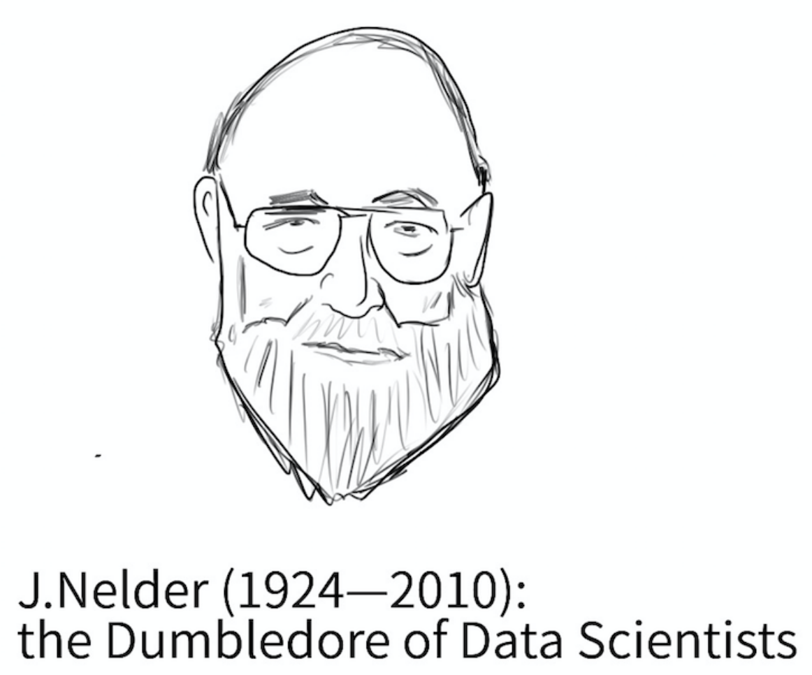

class: inverse, center, middle

```{r xaringan-themer, include=FALSE, warning=FALSE}
library(tidyverse)
library(xaringanthemer)

primary_color = "#B76E79"
secondary_color = "#336699"
background_color = "#f8f7f3"
header_font = google_font("Archivo")
text_font = google_font("Inconsolata")
link_color = "#A8C2A9"

style_duo_accent(primary_color = primary_color, secondary_color = secondary_color,
                 background_color = background_color,
                 header_font_google = google_font("Archivo"),
                 text_font_google   = google_font("Inconsolata"), 
                 link_color=link_color
)

```
#Modelos Lineales Generalizados (GLM)

---
## Más allá del modelo de regresión lineal (LM) 

LM es un marco muy útil y productivo, pero hay situaciones en las que no proporciona una descripción adecuada de los datos. En particular:

<br>

--

- Cuando $y_i$'s no distribuyen normal

--

- Cuando el rango de $y_i$'s está restringido (por ejemplo, binario, recuento)

--

- Cuando la varianza de los $y_i$'s no es independiente de su valor esperado.

<br>
--

.bold[GLM] ofrece un marco mucho más general y flexible que incorpora y amplía el LM para abordar estas cuestiones.

---
## Estructura de los modelos lineales generalizados

Un modelo lineal generalizado tiene cuatro componentes:

.pull-left[

- Un _componente aleatorio_

- Un _componente sistemático_ 

- Una _función de enlace_ (link).

- Una _función de varianza_
]

.pull-right[

]

---
class: inverse, center, middle

# Componente Aleatorio

---
## Componente Aleatorio

$$\newcommand{\vect}[1]{\boldsymbol{#1}}$$

El componente aleatorio de un GLM identifica la distribución de probabilidad de la variable dependiente

<br>

- Al igual que con LM, los datos que queremos modelar son una colección de observaciones $y_{1}, \dots, y_{n}$, donde cada observación es la manifestación de una variable aleatoria.

--

-  Estas variables aleatorias  $y_{1}, \dots, y_{n}$ son independientes  entre si y provienen de la misma _familia_ de distribución: .bold[iid]

  - La distribución de los datos nos da una pista sobre la distribución de probabilidad subyacente
  - Muestreo aleatorio garantiza que supuesto de independencia se cumpla


---
## Componente Aleatorio


Mientras que la LM asume que la variable dependiente sigue una distribución normal, GLM abarca un conjunto más amplio de distribuciones, .bold[tanto continuas como discretas], siempre y cuando pertenezcan a la clase más general de la [_familia exponencial de distribuciones_](https://en.wikipedia.org/wiki/Exponential_family).  

<br><br>
--

.center[

]

---
class: inverse, center, middle

# Componente Sistemático

---
## Componente Sistemático

El componente sistemático de un GLM especifica las variables explicativas, es decir, las $x$'s en el lado derecho de la ecuación

<br>

.content-box-primary[
$$\color{white}{\eta_{i} = \beta_{0} + \beta_{1} x_{i1} + \dots + \beta_{k} x_{ik}}$$
]

<br><br>
--

 - En terminología GLM $\eta$ se denomina .bold[predictor lineal].

--
 
 - $\eta$ es lineal "en parámetros": no vamos a encontrar términos del tipo $\beta_{0}*\beta_{1}$ o $\beta_{1}^{\beta_{0}}$.
 
--
   - pero puede ser no lineal "en variables" (por ejemplo, interacciones, términos cuadrados, etc.): $\beta_{1}x_{1} + \beta_{2}x_{1}^2$
   
--

 - Las $x$'s son tratadas como fijas, no como variables aleatorias.
 
---
class: inverse, center, middle

# Función de Enlace

---


## Función de enlace (link)

En el .bold[LM estándar], la media condicional del resultado $\mu_{i}$ está linealmente relacionada con los predictores del modelo.

$$\underbrace{\mathbb{E}(y_{i} \mid  x_{1}, \dots x_{k} )}_{\mu_{i}} = \underbrace{\beta_{0} + \beta_{1} x_{i1} + \dots + \beta_{k} x_{ik}}_{\eta_{i}}$$

<br>
--

- .bold[GLM] permiten una relación más general y flexible entre estos dos términos. 

--

- En un GLM el componente sistemático $\eta_{i}$ debe estar relacionado linealmente (en parámetros) con una función $g(\cdot)$ de $\mu_{i}$. Dicha función se denomina *función de enlace*. Formalmente,

.content-box-primary[
$$\color{white}{g\Big(\mathbb{E}(y_{i} \mid  x_{1}, \dots x_{k})\Big) =  g(\mu_{i}) = \eta_{i}}$$]

--

Ejemplo, si $g(\cdot) = \ln(\cdot)$, entonces


$$\ln \mathbb{E}(y_{i} \mid  x_{1}, \dots x_{k}) =  \ln \mu_{i} = \eta_{i}$$


---
##Función de Enlace (link)

- El inverso de esta expresión es la llamada .bold[función media], que expresa la media condicional de $y_{i}$ como una función potencialmente no lineal de los predictores:


.content-box-primary[
$$\color{white}{\mathbb{E}(y_{i} \mid  x_{1}, \dots x_{k}) = \mu_{i} = g^{-1}(\eta_{i})}$$]


<br>
--

Ejemplo, si $g(\cdot) = \ln(\cdot)$, entonces

$$\ln \mathbb{E}(y_{i} \mid  x_{1}, \dots x_{k}) =  \ln \mu_{i} = \eta_{i}$$


--
En consecuencia, $g^{-1}(\cdot) = e^{(\cdot)}$ y,

$$\mathbb{E}(y_{i} \mid  x_{1}, \dots x_{k}) = \mu_{i} = e^{\eta_{i}}$$

<br>
--

- La _función de enlace_ cumple un objetivo importante: mantener $\mu_{i}$ dentro de su rango natural. 

  - Ejemplo: si $y_{i}$ es estrictamente positivo (ingreso), $\eta_{i} \in (-\infty, \infty+)$ pero $\mu_{i} = e^{\eta_{i}} \in  (0, \infty+)$


---
## Función de Enlace (link)

<br>

Más allá de este ejemplo, hay una variedad de posibles funciones de enlace:

<br>

.center[]

- $g(\cdot)$ debe ser "smooth" y monotónica


---
class: inverse, center, middle

#Función de Varianza


---
## Función de varianza

La función de varianza describe cómo la varianza $\mathbb{Var}(y_{i})$ depende de la media $\mu_{i}$. Formalmente:

.content-box-primary[
$$\color{white}{\mathbb{Var}(y_{i}) = \phi V(\mu_{i})}$$
]

donde

- $\phi$ es una constante llamada "parámetro de dispersión"

- $V(\cdot)$ es la  función de varianza, definida como: $V(\mu) = \frac{d\mu}{d \eta}$

<br>
--

Por ejemplo, si $\mathbb{E}(y_{i} \mid  x_{1}, \dots x_{k}) =  \mu_{i} = e^{\eta_{i}}$, entonces,

$$V(\mu_i) = \frac{d\mu_i}{d \eta_i} = e^{\eta_{i}} \quad \to \quad \mathbb{Var}(y_{i}) = \phi e^{\eta_{i}}$$


---
class: inverse,  middle

# .......... Definiendo un GLM .....

.img-right[]

---
## Definiendo un GLM

La estructura básica de un GLM se especifica mediante la elección de dos componentes: (1) .bold[componente sistemático] (la distribución de la variable dependiente ) y (2) la .bold[función de enlace]. 

<br>
\begin{align}
  GLM:
	\begin{cases}
	&y_{i} \sim f(\mu_{i},\sigma_{i}) \\ \\
	& g(\mu_{i}) = \eta_{i}
	\end{cases}
\end{align}

<br>
--

Cualquier combinación de estos componentes definirá un GLM diferente. Algunas de estas combinaciones son especialmente relevantes:


| Distribution         | Canonical Link: $\eta = g(\mu)$ | Link name             | Model name           |
| -----------------    | ------------------              | --------------------- | -------------------- |
| Normal (Gaussian)    | $\eta = \mu$                    | identity              | Standard regression  |
| Poisson              | $\eta = \log(\mu)$              | logarithm             | Poisson regression   |
| Bernoulli / Binomial | $\eta = \log(\mu/(1-\mu))$      | logit                 | Logistic regression  |
| Gamma                | $\eta = (1/\mu)$                | reciprocal            | Gamma regression     |


---
## LM es un caso particular de GLM

El tipo más simple de GLM es el que tiene un componente aleatorio normal y una función de enlace de identidad, en cuyo caso obtenemos el modelo estándar de regresión lineal. Formalmente:


--

- Componente aleatorio: $y_{1}, \dots y_{n}$ son $n$ variables independientes con distribución $\text{Normal}(\mu_{i},\sigma_{i})$

--

- Función de enlace "identidad": $g(x) = x$

--

- Componente sistemático: $\mu_{i} = \eta_{i} = \beta_{0} + \beta_{1} x_{i1} + \dots + \beta_{k} x_{ik}$

--

- Función media: $\mu_{i} = g^{-1}(\eta_{i}) = \eta_{i}$

--

- Varianza $\mathbb{Var}(y_{i}) = \phi V(\mu_{i}) = \sigma^2$, 
--
 con $\phi=\sigma^2$ y $V(\mu_{i})= \frac{d\mu_{i}}{d\eta_{i}}=1$.


<br><br>
--

Por tanto,


$$y_{i} \sim \text{Normal}(\mu_{i} = \eta_{i}, \sigma_{i} = \sqrt{\phi})$$

- En nomenclatura GLM $\phi$ (parámetro de dispersión) es un modo más general de expesar el componente constante de la varianza ( $\sigma^2$ en LM)

---
class: inverse, center, middle

#Ejemplo empírico
##GLM log-lineal


---
## GLM log-lineal: ejemplo de modelo "híbrido" 


Ejemplo:

--

- $y_{1}, \dots y_{n}$ son $n$ variables independientes con distribución $\text{Normal}(\mu_{i},\sigma_{i})$

--

- La función de enlace es $g(\cdot) = \ln(\cdot)$

--

- $\ln(\mu_{i}) = \eta_{i} = \beta_{0} + \beta_{1} x_{i1} + \dots + \beta_{k} x_{ik}$

--

- $\mu_{i} = e^{\eta_{i}}$

<br>
--

Se sigue de lo anterior que:


- $\mathbb{Var}(y_{i}) = \phi V(\mu) = \phi \frac{d\mu_{i}}{d\eta_{i}} = \phi e^{\eta_{i}} = \phi \mu_{i}$

<br>
--

Obtenemos un .bold[modelo log-lineal], que es apropiado cuando las predicciones deben ser estrictamente positivas.


$$y_{i} \sim \text{Normal}(\mu_{i} = e^{\eta_{i}}, \sigma_{i} = \sqrt{\phi \mu_{i}})$$
---
## Enlace vs. transformaciones  

Usar una función de enlance .bold[es distinto] de transformar la variable dependiente!

--

.bold[Ejemplo:] es un práctica común trabajar con la variable dependiente transforma a logs (ej. ingresos).

- $y_{1}, \dots y_{n}$ son $n$ variables que no distribuyen normal  pero $\ln(y_{1}), \dots \ln(y_{n})$ si.

- Estimar LM con variable dependendiente transformada:

<br>

$$\ln y_{i} = \overbrace{\beta_{0} + \beta_{1}x_{1i} + \dots \beta_{k}x_{ki}}^{\mathbb{E}(\ln y_{i} \mid x_{1}, \dots, x_{k} )  } + \underbrace{e_{i}}_{\text{Normal}(0,\sigma)}$$

--

Notar diferencia:
.pull-left[
.bold[GLM con log-link]
$$\ln \mathbb{E} (y_{i} \mid x_{1}, \dots, x_{k}  ) = \beta_{0} + \beta_{1}x_{1i} + \dots \beta_{k}x_{ki}$$
]
.pull-right[
.bold[LM con variable dependiente log(y) ]
$$\mathbb{E}( \ln y_{i} \mid x_{1}, \dots, x_{k} ) = \beta_{0} + \beta_{1}x_{1i} + \dots \beta_{k}x_{ki}$$
]

---
## GLM con log-link: aplicación a gender wage gap 

```{r, echo=FALSE, message=FALSE, warning=FALSE}
library("tidyverse")
library("reshape2")
library(carData)
data(SLID)
ourdata <- SLID
```

<br>

.center[
```{r, echo=FALSE, message=FALSE, warning=FALSE, fig.height=5}

primary_color = "#B76E79"
secondary_color = "#336699"

ourdata %>% 
  ggplot(aes(x = wages)) + 
  geom_histogram(fill = primary_color, color = primary_color, alpha=0.7) + 
  guides(fill = FALSE, color = FALSE) + 
  labs(x = "wages") +
  theme_minimal() +
  theme(
    legend.position = "none",
    axis.text.y = element_text(size = 22, color = "black"),
    axis.text.x = element_text(size = 22, color = "black"),
    axis.title.y = element_text(size = 24, color = "black"),
    axis.title.x = element_text(size = 24, color = "black"),
    panel.border = element_rect(color = "black", fill = NA, linewidth = 1)
  )


```
]

Datos de la Canadian Survey of Labour and Income Dynamics 1994, para la provincia de Ontario. Hay datos perdidos, especialmente sobre salarios. 

---
## LM con log en variable dependiente

```{r}
our_lm <- lm(log(wages) ~ factor(sex), data=ourdata)
summary(our_lm)
```

---
## Gaussian GLM con log-link

```{r}
our_glm <- glm(wages ~ factor(sex), family = gaussian(link="log"), data=ourdata)
summary(our_glm)
```

---
## Gaussian GLM con log-link

$$\ln \mu_{i} = \ln \mathbb{E}\text{(wage}_{i} \mid \text{male}) = \beta_{0} + \beta_{1}\text{male}_{i}
= 2.631 + 0.215\text{male}_{i}$$

<br>
--

Por tanto,

- $\mathbb{E}(\text{wage}_{i} \mid \text{male}=1) = e^{\beta_{0} + \beta_{1}} = e^{\beta_{0}}e^{\beta_{1}} = e^{2.631}e^{0.215} = 17.22$ 

- $\mathbb{E}(\text{wage}_{i} \mid \text{male}=0) = e^{\beta_{0}} = e^{2.631} = 13.89$ 


<br>
--
Interpretación coeficientes

$\beta_{1} = \ln \mathbb{E}(\text{wage}_{i} \mid \text{male}=1) - \ln \mathbb{E}(\text{wage}_{i} \mid \text{male}=0) = \ln \frac{\mathbb{E}(\text{wage}_{i} \mid \text{male}=1)}{\mathbb{E}(\text{wage}_{i} \mid \text{male}=0)}$
--
 $\quad \implies  \quad e^{\beta_{1}} =  \frac{\mathbb{E}(\text{wage}_{i} \mid \text{male}=1)}{\mathbb{E}(\text{wage}_{i} \mid \text{male}=0)}$

<br>
--


.bold[Gender wage gap]: $\mathbb{E}(\text{wage}_{i} \mid \text{male}=1) - \mathbb{E}(\text{wage}_{i} \mid \text{male}=0) = e^{\beta_{0}} e^{\beta_{1}} - e^{\beta_{0}} = e^{\beta_{0}}(e^{\beta_{1}}-1)$

---
## Gaussian GLM con log-link

.pull-left[
Dispersión: $\phi=59.38$


$\mathbb{Var}(y_{i}) = \phi V(\mu) = \phi \frac{d\mu_{i}}{d\eta_{i}} = \phi e^{\eta_{i}} = \phi \mu_{i}$


$\mathbb{Var}(y_{i})  = \phi \mu_{i} = \phi e^{\beta_{0} +  \beta_{1}\text{male}_{i}}$


$\mathbb{Var}(y_{i})  = \phi\mu_{i} = 59.38 \cdot  e^{2.631 + 0.215\text{male}_{i}}$

<br><br>

Por tanto, 

$$y_{i} \sim \text{Normal}(\mu_{i},\sigma_{i}) \quad \text{ donde}$$

- $\mu_{i}=e^{\beta_{0} +  \beta_{1}\text{male}_{i}} = e^{2.631 + 0.215\text{male}_{i}}$

- $\sigma_{i} = \sqrt{\phi\mu_{i}} = \sqrt{59.38 \cdot  e^{2.631 + 0.215\text{male}_{i}}}$

]

--

.pull-right[
```{r, echo=FALSE, message=FALSE, warning=FALSE, fig.height=6, fig.width=8}
library("tidyverse")
library("ggfortify")
eta <- function(x) {exp(2.631 + 0.215*x)}
sdy  <- function(x) {sqrt(59.38 * eta(x))}

preds <- data_frame(x = c(0,1)) %>% mutate(mu = eta(x), sd=sdy(x)) %>% as.matrix()


primary_color = "#B76E79"
secondary_color = "#336699"

plot <- ggplot(data.frame(x = seq(-100,150,by=0.1)), aes(x = x)) +
  stat_function(fun = dnorm, args = list(preds[1,2], preds[1,3]),
                aes(colour = "female"), size = 1.5) +
  stat_function(fun = dnorm, args = list(preds[2,2], preds[2,3]),
                aes(colour = "male"), size = 1.5) +
  scale_x_continuous(name = "Wages") + 
  scale_color_manual(values = c(female = primary_color, male = secondary_color)) +
  labs(y="densidad")+
  theme_minimal() +
  theme(
    legend.position = "none",
    axis.text.y = element_text(size = 22, color = "black"),
    axis.text.x = element_text(size = 22, color = "black"),
    axis.title.y = element_text(size = 24, color = "black"),
    axis.title.x = element_text(size = 24, color = "black"),
    panel.border = element_rect(color = "black", fill = NA, linewidth = 1)
  )


print(plot)
```
]


---
class: inverse, center, middle

##Hasta la próxima clase. Gracias!

<br>
Mauricio Bucca <br>
https://mebucca.github.io/ <br>
github.com/mebucca


