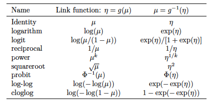

## Más allá del modelo de regresión lineal (LM) 

LM es un marco muy útil y productivo, pero hay situaciones en las que no proporciona una descripción adecuada de los datos. En particular:

<br>

--

- Cuando $y_i$'s no distribuyen normal

--

- Cuando el rango de $y_i$'s está restringido (por ejemplo, binario, recuento)

--

- Cuando la varianza de los $y_i$'s no es independiente de su valor esperado.

<br>
--

.bold[GLM] ofrece un marco mucho más general y flexible que incorpora y amplía el LM para abordar estas cuestiones.

---
## Estructura de los modelos lineales generalizados

Un modelo lineal generalizado tiene cuatro componentes:

.pull-left[

- Un _componente aleatorio_

- Un _componente sistemático_ 

- Una _función de enlace_ (link).

]

.pull-right[

]


---
## Componente Aleatorio

$$\newcommand{\vect}[1]{\boldsymbol{#1}}$$

El componente aleatorio de un GLM identifica la distribución de probabilidad de la variable dependiente

--

- Mientras que la LM asume que la variable dependiente sigue una distribución normal, GLM abarca un conjunto más amplio de distribuciones, .bold[tanto continuas como discretas], siempre y cuando pertenezcan a la clase más general de la [_familia exponencial de distribuciones_](https://en.wikipedia.org/wiki/Exponential_family).  

<br>
--

.center[

]


---
## Componente Sistemático

El componente sistemático de un GLM especifica las variables explicativas, es decir, las $x$'s en el lado derecho de la ecuación

<br>

.content-box-primary[
$$\color{white}{\eta_{i} = \beta_{0} + \beta_{1} x_{i1} + \dots + \beta_{k} x_{ik}}$$
]

<br><br>
--

 - En terminología GLM $\eta$ se denomina .bold[predictor lineal].

--
 
 - $\eta$ es lineal "en parámetros": no vamos a encontrar términos del tipo $\beta_{0}*\beta_{1}$ o $\beta_{1}^{\beta_{0}}$.
 
--
   - pero puede ser no lineal "en variables" (por ejemplo, interacciones, términos cuadrados, etc.): $\beta_{1}x_{1} + \beta_{2}x_{1}^2$
   

---


## Función de enlace (link)

En el .bold[LM estándar], la media condicional del resultado $\mu_{i}$ está linealmente relacionada con los predictores del modelo.

$$\underbrace{\mathbb{E}(y_{i} \mid  x_{1}, \dots x_{k} )}_{\mu_{i}} = \underbrace{\beta_{0} + \beta_{1} x_{i1} + \dots + \beta_{k} x_{ik}}_{\eta_{i}}$$

<br>
--

- .bold[GLM] permiten una relación más general y flexible: en un GLM el componente sistemático $\eta_{i}$ debe estar relacionado linealmente con una función $g(\cdot)$ de $\mu_{i}$. Dicha función se denomina *función de enlace*. Formalmente,

.content-box-primary[
$$\color{white}{g\Big(\mathbb{E}(y_{i} \mid  x_{1}, \dots x_{k})\Big) =  g(\mu_{i}) = \eta_{i}}$$]

--

- Ejemplo, si $g(\cdot) = \ln(\cdot)$, entonces $\ln \mu_{i} = \eta_{i}$

- La _función de enlace_ cumple un objetivo importante: mantener $\mu_{i}$ dentro de su rango natural. 

  - Ejemplo: si $y_{i}$ es estrictamente positivo (ingreso), $\eta_{i} \in (-\infty, \infty+)$ pero $\mu_{i} = e^{\eta_{i}} \in  (0, \infty+)$


---
## Función de Enlace (link)

<br>

Más allá de este ejemplo, hay una variedad de posibles funciones de enlace:

<br>

.center[]

---
class: inverse,  middle

# .......... Definiendo un GLM .....

.img-right[]

---
## Definiendo un GLM

La estructura básica de un GLM se especifica mediante la elección de dos componentes: (1) .bold[componente sistemático] (la distribución de la variable dependiente ) y (2) la .bold[función de enlace]. 

<br>
\begin{align}
  GLM:
	\begin{cases}
	&y_{i} \sim f(\mu_{i},\sigma_{i}) \\ \\
	& g(\mu_{i}) = \eta_{i}
	\end{cases}
\end{align}

<br>
--

Cualquier combinación de estos componentes definirá un GLM diferente. Algunas de estas combinaciones son especialmente relevantes:


| Distribution         | Canonical Link: $\eta = g(\mu)$ | Link name             | Model name           |
| -----------------    | ------------------              | --------------------- | -------------------- |
| Normal (Gaussian)    | $\eta = \mu$                    | identity              | Standard regression  |
| Poisson              | $\eta = \log(\mu)$              | logarithm             | Poisson regression   |
| Bernoulli / Binomial | $\eta = \log(\mu/(1-\mu))$      | logit                 | Logistic regression  |
| Gamma                | $\eta = (1/\mu)$                | reciprocal            | Gamma regression     |


---
class: inverse, center, middle

#Regresión Logística

---
## Estructura de un modelo de regresión logística

Podemos pensar en un modelo de regresión logística de la siguiente forma:

<br>
--

.bold[Configuración]

- Tenemos $n$ observaciones (individuos) independientes: $i = 1, \dots, n$

--

- Para cada observación observamos datos $y_{i}, \dots , y_{n}$ que actuan como variable dependiente, donde $y_{i} \in \{0,1\}$

--

- Asumimos que estos datos son realizaciones de $n$ variables aleatorias Bernoulli con probabilidades desconocidas: $Y_{i} \sim \text{Bernoulli}(p_{i})$

  - Alternativamente, recuento de éxitos puede tratarse como una variable Binomial. 

--

- Asumimos que dichas probabilidades pueden variar de individuo en individuo.

  - Un modelo con un $p_{i}$ para cada observación $i$ es un modelo "just-identified" (o saturado). Posible, pero no es un "modelo".

---
## Estructura de un modelo de regresión logística

Formalmente,

$$Y_{i} \sim \text{Bernoulli}(p_{i})$$
 

es decir

$$\quad \mathbb{P}(Y_{i}= y) = p_{i}^{y}(1-p_{i})^{1-y} \quad \text{ donde } \quad y \in \{0,1\}$$

<br>
<br>
--

La pregunta es: ¿como estimamos $p_{i}$ de tal manera que ... ?


<br>
--

- Describamos $p_{i}$ con un número de parámetros $k<n$

--

- $\hat{p}_{i} \in [0,1]$


---
## Estructura de un modelo de regresión logística

El modelo de regresión logística aborda este problema de la siguiente manera:

.content-box-blue[
$$p_{i} = \frac{e^{\eta_{i}}}{1 + e^{\eta_{i}}} \quad \quad  \text{donde} \quad \quad \eta_{i} = \beta_{0} + \beta_{1}x_{1i} + \dots + \beta_{k}x_{ki}$$
]


<br>
--

.bold[Importante] notar que:

--

- Esta función (llamada *sigmoide*) tiene la propiedad clave de estar restringida al intervalo $[0, 1]$.

  - $e^{\eta_{i}} > 0$, de tal manera que el numerador es siempre menor que el denominador. Por lo tanto,  $0 < p_{i} <1$.

--

- $x_{1} \dots x_{k}$ son predictores o variables independientes 

--

- $\beta_{1} \dots \beta_{k}$ son los respectivos "efectos" de los predictores sobre $\eta_{i}$

--

- $p_{i}$ .bold[no está relacionado linealmente] con sus predictores 

---
## Estructura de un modelo de regresión logística

Sin embargo, $\eta_{i} = \beta_{0} + \beta_{1}x_{1i} + \dots + \beta_{k}x_{ki}$ si es una función lineal de los predictores.

--

Por tanto, es conveniente expresar $\eta$ en función de $p$ ...
--
 Paso a paso:

.img-right[

]


--

$p_{i} = \frac{e^{\eta_{i}}}{1 + e^{\eta_{i}}} = \frac{1}{e^{- \eta_{i}} + 1}$

--

$e^{-\eta_{i}} + 1 = \frac{1}{p_{i}}$


--

$e^{- \eta_{i}} = \frac{1}{p_{i}} - 1 =  \frac{1 - p_{i}}{p_{i}}$

--

$e^{\eta_{i}} = \frac{p_{i}}{1 - p_{i}}$

--

$\eta_{i} = \ln \frac{p_{i}}{1 - p_{i}} \quad \quad$
--
es decir, el log de las odds o log-odds

--

.content-box-yellow[
$$\text{Por tanto} \quad \quad  \ln \frac{p_{i}}{1 - p_{i}} = \eta_{i} = \beta_{0} + \beta_{1}x_{1i} + \dots + \beta_{k}x_{ki}$$
] 

---
## Estructura de un modelo de regresión logística

```{r,  include=TRUE, echo=FALSE, warning=FALSE, message=FALSE, fig.height=8, fig.width=12}
library("tidyverse")
library("cowplot")

theme_set(theme_cowplot())

units <- tibble(p = seq(from=0, to=1, by=0.01)) %>% mutate(odd = p/(1-p)) %>%
          mutate(log_odd = log(odd))

# p to odds 

p = 0.75
o = p/(1-p)

q = 1-p
inv_o = q/(1-q)

log_o <- log(o)
log_inv_o <- log(inv_o)

# p to log odds

positions_v1 <- data.frame(x1 =log_o, x2 =log_o, y1 =0 , y2=p )    
positions_h1 <- data.frame(x1 =-Inf,  x2 =log_o, y1=p , y2=p )    
positions_v2 <- data.frame(x1 =log_inv_o , x2 =log_inv_o , y1 =0 , y2=q )    
positions_h2 <- data.frame(x1 =-Inf , x2 =log_inv_o , y1 =q , y2=q )    

logodd_p <- units %>% ggplot(aes(x=log_odd, y=p, colour="")) + geom_line(size=1.5) +
    scale_color_viridis_d() + 
    xlim(-8,8) +
    geom_segment(aes(x = x1, y = y1, xend = x2, yend = y2, colour="-"), data = positions_v1, size=1.5) +
    geom_segment(aes(x = x1, y = y1, xend = x2, yend = y2, colour="-"), data = positions_h1, size=1.5) + 
    geom_segment(aes(x = x1, y = y1, xend = x2, yend = y2, colour="-"), data = positions_v2, size=1.5) + 
    geom_segment(aes(x = x1, y = y1, xend = x2, yend = y2, colour="-"), data = positions_h2, size=1.5) +
    annotate(geom="text", x=-3.8, y=0.28, label='bold("(log-odd=-1.1,p=0.25)")', color="black", parse=TRUE, size=8) +
    annotate(geom="text", x=4, y=0.78, label='bold("(log-odd=1.1,p=0.75)")', color="black", parse=TRUE, size=8) +
    labs(title =  "Log-odd a probability", y="p", x="ln p/(1-p)") +
    guides(fill=FALSE, color=FALSE) +
    theme(axis.text.y = element_text(size = 22), axis.text.x = element_text(size = 22),
    axis.title.y = element_text(size = 24), axis.title.x = element_text(size = 24), 
    legend.text = element_text(size = 18), legend.position="none") 

print(logodd_p)

```

---
## Regresión Logística es un tipo de GLM


Regresión Logística es un GLM con componente aleatorio .bold[Bernoulli/Binomial] y función de enlace .bold[logit]. 


<br>
--

- Componente aleatorio: $y_{1}, \dots y_{n}$ son $n$ variables independientes con distribución $\text{Bernoulli}(p_{i})$

  - donde $p_{i} \equiv \mu_{i}$


--

- Función de enlace: $\text{logit}(x) = \ln \frac{x}{1 - x}$


--

- Componente sistemático: $\ln \frac{p_{i}}{1 - p_{i}} = \eta_{i} = \beta_{0} + \beta_{1} x_{i1} + \dots + \beta_{k} x_{ik}$

--

- Función media: $p_{i} = \text{logit}^{-1}(\eta_{i}) = \frac{e^{\eta_{i}}}{1 + e^{\eta_{i}}}$


---
## Regresión Logística es un tipo de GLM


- Varianza $\mathbb{Var}(y_{i}) = \phi V(p_{i}), \quad$ 
--
  $\text{donde} \quad V(p_{i})= \frac{dp_{i}}{d\eta_{i}}$.

--

- $\eta_{i} = \ln \frac{p_{i}}{1 - p_{i}}  =  \ln(p_{i}) - \ln(1 - p_{i})$

--

- $\frac{d \eta_{i}}{d p_{i}} = \frac{1}{p_{i}} + \frac{1}{1 - p_{i}} = \frac{1}{p_{i}(1 - p_{i})}$ 

--

- $\frac{d p_{i}}{d \eta_{i}} = p_{i}(1 - p_{i})$

--

Por tanto, $\mathbb{Var}(y_{i}) = \phi V(p_{i}) = \phi p_{i}(1 - p_{i})$, con $\phi=1$

<br>
En resumen, en un modelo de regresión logística

.content-box-blue[
$$y_{i} \sim \text{Bernoulli}\Bigg(p_{i} = \frac{e^{\eta_{i}}}{1 + e^{\eta_{i}}}\Bigg)$$

]

---
## Regresión Logística en la práctica 

Para ejemplificar el uso de regresión logística continuaremos trabajando con los datos de infidelidad. 

```{r,  include=TRUE, echo=FALSE, warning=FALSE, message=FALSE}
# load data on extra-marital affairs from package "Ecdat"
library("Ecdat")
library("viridis")
library("modelr")

data(Fair)
affairsdata <- Fair %>% as_tibble()

# create a binary variable indicating wether persons has ever had an affair
affairsdata <- affairsdata %>% 
  mutate(everaffair = case_when(nbaffairs == 0 ~ "Never", nbaffairs > 0 ~ "At least once") ) %>%
  # map into 0/1 code
  mutate(everaffair_d = case_when(nbaffairs == 0 ~ 0, nbaffairs > 0 ~ 1))

# display the data as a tibble
affairsdata %>% arrange(age) %>% select(-occupation) %>% tail(15)
```


---
## Regresión Logística en la práctica 

Ajustaremos el siguiente modelo: $\text{logit(everaffair}_{i}) = \beta_{0} + \beta_{1}*\text{rate}_{i}$, que modela el log de la odd de tener un affair como función de la auto-evaluación del matrimonio, desde 1 (muy infeliz) a 5 (muy feliz).

```{r}
logit_affairs_rate <- glm(everaffair_d ~ rate, family=binomial(link="logit"), data=affairsdata); summary(logit_affairs_rate)
```

---
## Regresión Logística en la práctica 

.pull-left[
```{r, echo=FALSE}
p_mu <- affairsdata %>% with(mean(everaffair_d,na.rm=TRUE))
b0 <- logit_affairs_rate$coefficients[1]
b1 <- logit_affairs_rate$coefficients[2]

# plot the result

grid <- affairsdata  %>%data_grid(rate,.model=logit_affairs_rate)
predictions <- cbind(grid,logit_hat = predict(logit_affairs_rate, newdata = grid)) %>%
  mutate(p_hat= 1/(1 + exp(-logit_hat)))

affairsdata %>% ggplot(aes(x=rate, y=everaffair_d, group=1, colour=1)) +  
  stat_function(fun = function(.x) b0 + b1*.x, alpha = 0.5, size=1.5) +
  geom_hline(yintercept = b0 + b1*1, linetype="dotted", color = "blue", alpha=0.5, size=1.5) +
  geom_hline(yintercept = b0 + b1*5, linetype="dotted", color = "blue", alpha=0.5, size=1.5) +
  geom_line(data=predictions, aes(x=rate, y=logit_hat, group=3, colour=3), size=2, alpha = 1) +
  xlim(-6,12) + 
  scale_color_viridis() +  scale_fill_viridis() +
  guides(fill=FALSE, color=FALSE) +
  theme(axis.text.y = element_text(size = 22), axis.text.x = element_text(size = 22),
  axis.title.y = element_text(size = 24), axis.title.x = element_text(size = 24), 
  legend.text = element_text(size = 18), legend.position="none") +
  labs(x="rate marriage", y="logit(Affair)") +
  annotate('text', x = 3.7, y = 0.8, label = "beta[1]==-0.51", parse = TRUE, size=8) 
```
]

--

.pull-right[
```{r, echo=FALSE}

affairsdata %>% ggplot(aes(x=rate, y=everaffair_d, group=1, colour=1)) +  
  stat_function(fun = function(.x) 1/(1 + exp(-(b0 + b1*.x))), alpha = 0.5, size=1.5) +
  geom_hline(yintercept = 1/(1 + exp(-(b0 + b1*1))), linetype="dotted", color = "blue", alpha=0.5, size=1.5) +
  geom_hline(yintercept = 1/(1 + exp(-(b0 + b1*5))), linetype="dotted", color = "blue", alpha=0.5, size=1.5) +
  geom_line(data=predictions, aes(x=rate, y=p_hat, group=3, colour=3), size=2, alpha = 1) +
  xlim(-6,12) + 
  scale_color_viridis() +  scale_fill_viridis() +
  guides(fill=FALSE, color=FALSE) +
  theme(axis.text.y = element_text(size = 22), axis.text.x = element_text(size = 22),
  axis.title.y = element_text(size = 24), axis.title.x = element_text(size = 24), 
  legend.text = element_text(size = 18), legend.position="none") +
  labs(x="rate marriage", y="P(Affair)")
```
]


---

class: inverse, center, middle

## Estimación (MLE)

---
## Estimación (MLE)

Retomando  nuestro ejemplo anterior,

.pull-left[
```{r, echo=FALSE}
logit_affairs_rate <- glm(everaffair_d ~ rate, family=binomial(link="logit"), data=affairsdata); summary(logit_affairs_rate)
```
]

--

.pull-right[
.bold[¿De donde vienen estos números?]
]

---
## Estimación (MLE)

Recordar que cada observación es una manifestación de una variable Bernoulli:

--

$Y_{i} \sim \text{Bernoulli}(p_{i}) \quad \text{ es decir } \quad \mathbb{P}(Y_{i}= y) = p_{i}^{y}(1-p_{i})^{1-y} \quad \text{ donde } \quad y \in \{0,1\}$

--

Por tanto, la probabilidad de observar estos datos es descrita por la siguiente función:

$$\mathbb{P}(y_{1}, \dots, y_{1}) = \Pi_{i=1}^{n} p_{i}^{y_{i}}(1-p_{i})^{1-y_{i}}$$
<br>
--

En consecuencia, la .bold[likelihood function] de $p_{i}$ es:

$$\mathcal{L}(p_{i} \mid y_{1}, \dots, y_{1}) = \Pi_{i=1}^{n} p_{i}^{y_{i}}(1-p_{i})^{1-y_{i}}$$

--

y la .bold[log likelihood function] de $p_{i}$ es:


$$\ell\ell(p_{i} \mid y_{1}, \dots, y_{1}) = \sum_{i=1}^{n} \bigg( y_{i} \ln p_{i} + (1-y_{i}) \ln(1-p_{i}) \bigg)$$
---
## Estimación (MLE)

La .bold[log likelihood function] de $p$ es:

$$\ell\ell(p_{i} \mid y_{1}, \dots, y_{1}) = \sum_{i=1}^{n} \bigg( y_{i} \ln p_{i} + (1-y_{i}) \ln(1-p_{i}) \bigg)$$
--

Pero no estamos estimando $p_{i}$ directamente, sino que lo modelamos como un función de otros predictores.

--

específicamente: $p_{i} =\frac{1}{1 + e^{-(\beta_{0} + \beta_{1}\text{rate}_{i}})}$

--

por tanto, 
$$\ell\ell(\beta_{0},\beta_{1} \mid y_{1}, \dots, y_{1}) = \sum_{i=1}^{n} \bigg( y_{i} \ln \frac{1}{1 + e^{-(\beta_{0} + \beta_{1}\text{rate}_{i})}} + (1-y_{i}) \ln(1-\frac{1}{1 + e^{-(\beta_{0} + \beta_{1}\text{rate}_{i})}}) \bigg)$$

En definitiva, nuestros MLE son:

$$\hat{\beta_{0}},\hat{\beta_{1}} = \underset{\beta_{0},\beta_{1}}{\arg\max\ } \sum_{i=1}^{n} \bigg( y_{i} \ln \frac{1}{1 + e^{-(\beta_{0} + \beta_{1}\text{rate}_{i})}} + (1-y_{i}) \ln(1-\frac{1}{1 + e^{-(\beta_{0} + \beta_{1}\text{rate}_{i})}}) \bigg)$$
---
## Estimación (MLE)

- No hay solución analítica (en general) para esta maximización. Típicamente se usa Fisher’s Scoring Method  (un algoritmo de búsqueda) para obtener los MLE. 

-  Para ejemplificar  podemos implementar una optimización numérica simple e ineficiente para buscar los MLE.
--
 Para acelerar la búsqueda usaremos valores en la proximidad de las estimaciones reportadas arriba (que normalmente no conoceríamos):
 

.bold[Implentación en] `R`:
 
```{r, include=TRUE, echo=TRUE, warning=FALSE, message=FALSE}

ll <- function(b0,b1) {
  y = affairsdata$everaffair_d
  eta = b0 + b1*affairsdata$rate
  ell = sum( y*log(1/(1 + exp(-eta))) +  (1-y)*log(1 - (1/(1 + exp(-eta)))))
  return(ll = ell)
}
```

--

```{r}
ll(b0=0,b1=0); ll(b0=-1,b1=2)
```

---
## Estimación (MLE)

.bold[Implentación en] `R`:

```{r, include=TRUE, echo=TRUE, warning=FALSE, message=FALSE}
# Evaluar la log-likelihood function  para muchas combinaciones de posibles valores de  b0 y b1
parameter_space <- expand.grid(beta0 = seq(-1,1,length.out=500), beta1 = seq(-1,1,length.out=500)) %>% 
  rowwise() %>% mutate(loglik = ll(beta0,beta1)) 

# Encuentra el par de valores b0,b1 que dan el mayor valor para la log-likelihood function

m <- parameter_space %>% as.matrix()
m[which.max(m[,3]),]
```

---
## Estimación (MLE)

.pull-left[
```{r,  include=TRUE, echo=FALSE, warning=FALSE, message=FALSE}
# Plot all LL values
parameter_space %>% as.data.frame() %>% ggplot(aes(x=beta0, y=beta1,  z = loglik)) + geom_contour(bins = 700) + geom_contour_filled(bins = 500, alpha=0.75) +
geom_point(aes(x=m[which.max(m[,3]),1], m[which.max(m[,3]),2]), size=1.5) +
guides(fill=FALSE, color=FALSE) + labs(x=quote(beta[0]), y=quote(beta[1])) +
annotate(geom="text", x=0.56, y=-0.63, label='bold("(0.83,-0.51)")', color="black", parse=TRUE, size=6)  +
theme(axis.text.y = element_text(size = 22), axis.text.x = element_text(size = 22),
axis.title.y = element_text(size = 24), axis.title.x = element_text(size = 24), 
legend.text = element_text(size = 18), legend.position="none")
```
]

--

.pull-right[
```{r,  include=TRUE, echo=FALSE, warning=FALSE, message=FALSE}
summary(logit_affairs_rate)
```
]


---
class: inverse, center, middle

.huge[
**Hasta la próxima clase. Gracias!**
]

<br>
Mauricio Bucca <br>
https://mebucca.github.io/ <br>
github.com/mebucca


